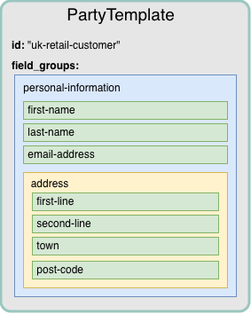
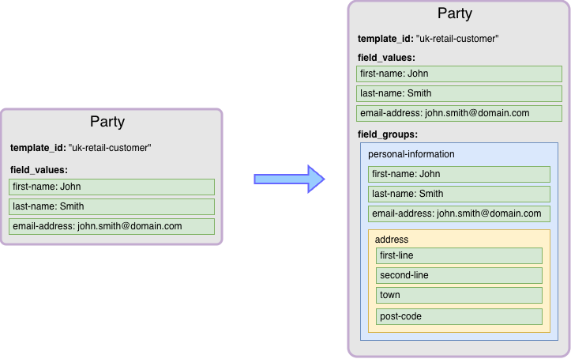

# Customer Data Mastery

Customer Data Mastery (CDM) is a powerful and flexible platform designed to provide a comprehensive solution for defining, storing, and managing crucial information about all relevant parties integral to business operations. Recognising the diverse data requirements across different sectors and business models, CDM adopts a highly configurable and unopinionated approach to data modeling. CDM is intentionally agnostic about the specific nature of the data it stores. This flexibility allows users to manage information pertinent to a wide array of parties, including:

-   Individuals: Traditional customers, prospects, employees, beneficiaries etc.
    
-   Organisations: Corporate clients, vendors, partners, regulators, and internal departments.
    
-   Other Relevant Entities: Groups, households etc.
    

The first class resources and how to use them are described below.

## Party Templates

The starting point for usage of CDM is the [PartyTemplate](/additional-product-offerings/latest/EN/vault-bridge/api/bridge_api#partytemplate) which defines any fields that a [Party](/additional-product-offerings/latest/EN/vault-bridge/api/bridge_api#party) can store and the structure of how these fields are laid out. A field on a template has a name, type and optionally some constraints. For example, a string field can be defined with a minimum and maximum length and with a specific regex that the string must adhere to. Another field could be an enum type with specific permitted values. The full list of constraint types that are supported are listed below:

 
| **Constraint Type** | **Optional Additional Constraints** |
| --- | --- |
| 
String

 | 

-   Minimum Length
    
-   Maximum Length
    
-   Regex
    

 |
| 

Decimal

 | 

-   Minimum Value
    
-   Maximum Value
    
-   Regex
    

 |
| 

Integer

 | 

-   Minimum Value
    
-   Maximum Value
    
-   Regex
    

 |
| 

Enumeration

 | 

-   Permitted Values
    

 |
| 

DateTime

 | 

-   Precision
    
    -   Second
        
    -   Day
        
    
-   Earliest
    
-   Latest
    

 |
| 

Boolean

 | 

None

 |
| 

UUID

 | 

None

 |

The types of fields that can be defined and their constraints can be found in the API documentation. These fields define the data that is available, and potentially required, to be set on the [Party](/additional-product-offerings/latest/EN/vault-bridge/api/bridge_api#party) when it is created or updated. The structure of the data comes in the form of `FieldGroups`. A `FieldGroup` is analogous to a folder in a directory structure where a `Field` is analogous to a file. A `FieldGroup` acts as a container for other `Fields` or `FieldGroups` much like a directory can contain files or other directories. The [PartyTemplate](/additional-product-offerings/latest/EN/vault-bridge/api/bridge_api#partytemplate) resource exposes an array of `FieldGroups` from which to define this hierarchical structure. There are two restrictions on the hierarchy:

-   Any `Field` or `FieldGroup` must have a unique name within the [PartyTemplate](/additional-product-offerings/latest/EN/vault-bridge/api/bridge_api#partytemplate).
    
-   The hierarchy has to have a maximum depth of 4 levels (i.e. at the fourth level a user can only put `Fields`).
    

Other than these restrictions, users can create any hierarchies they want with any fields that they will need to model the [Party](/additional-product-offerings/latest/EN/vault-bridge/api/bridge_api#party).

## Parties

A [Party](/additional-product-offerings/latest/EN/vault-bridge/api/bridge_api#party) represents an individual customer, business entity or any other relevant unit for which a user might want to store data. The fields available to store data against are defined in the [PartyTemplate](/additional-product-offerings/latest/EN/vault-bridge/api/bridge_api#partytemplate) from which the [Party](/additional-product-offerings/latest/EN/vault-bridge/api/bridge_api#party) is created. Not all `Fields` defined on the [PartyTemplate](/additional-product-offerings/latest/EN/vault-bridge/api/bridge_api#partytemplate) need be filled in, however, `Fields` that have been marked as "Required" do need to have data associated with them on creation or update. Any data must also adhere to the constraints that the `Field` has defined, so for example, an email address `Field` with a specified regex needs to be set with data that matches that regex.

To create a [Party](/additional-product-offerings/latest/EN/vault-bridge/api/bridge_api#party) from a [PartyTemplate](/additional-product-offerings/latest/EN/vault-bridge/api/bridge_api#partytemplate) the ID of the [PartyTemplate](/additional-product-offerings/latest/EN/vault-bridge/api/bridge_api#partytemplate) needs to be set, along with any data that the user wants to be associated with the [Party](/additional-product-offerings/latest/EN/vault-bridge/api/bridge_api#party). The way to set this data is using the `field_values` map on the [Party](/additional-product-offerings/latest/EN/vault-bridge/api/bridge_api#party) itself. This is a map of the `Field` name to the value.

For a simplified [PartyTemplate](/additional-product-offerings/latest/EN/vault-bridge/api/bridge_api#partytemplate) with simplified personal information:

The request/response for creating a [Party](/additional-product-offerings/latest/EN/vault-bridge/api/bridge_api#party) from this template will look like:

As shown above, when a [Party](/additional-product-offerings/latest/EN/vault-bridge/api/bridge_api#party) is created, any set `field_values` will additionally be represented in the `field_group` hierarchy. Any fields that are not set in the `field_values` will remain unset in the hierarchy.

Updates to the `FieldValues` set on a [Party](/additional-product-offerings/latest/EN/vault-bridge/api/bridge_api#party) can be made in one of two ways. Either the `field_values` map can be replaced entirely by setting the update\_mask on the request to `field_values`. Alternatively, updates to individual values of fields is also supported using the `.` character for traversal of the map. For example, if an update wanted to target just the “first-name” field, a user could do so using the syntax "field\_values.first-name" in the update\_mask.

## Relationship Types

Customer Data Mastery allows users to link `Parties` as related somehow by defining `Relationships`. The nature of the relationship between two `Parties` are modelled using the [RelationshipType](/additional-product-offerings/latest/EN/vault-bridge/api/bridge_api#relationshiptype) resource. A [RelationshipType](/additional-product-offerings/latest/EN/vault-bridge/api/bridge_api#relationshiptype) describes how two `Parties` can be related to one another. This can be asymmetric (e.g. Guarantor → Guarantee) where the role of each party is different, or symmetric (e.g. Joint Account Holder <→ Joint Account Holder).

## Relationships

Once a [RelationshipType](/additional-product-offerings/latest/EN/vault-bridge/api/bridge_api#relationshiptype) has been defined, creating a [Relationship](/additional-product-offerings/latest/EN/vault-bridge/api/bridge_api#relationship) between two parties is as simple as entering the [Party](/additional-product-offerings/latest/EN/vault-bridge/api/bridge_api#party) IDs for each side of the relationship and setting the [RelationshipType](/additional-product-offerings/latest/EN/vault-bridge/api/bridge_api#relationshiptype) to use.