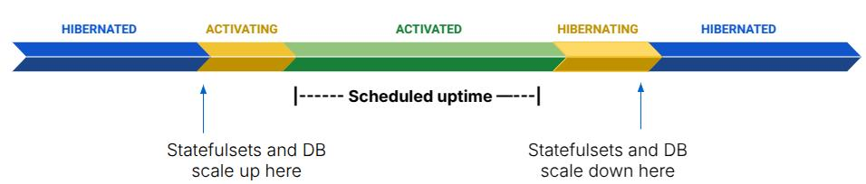

# Overview and how Hibernator works

Hibernator is a tool that automatically scales non-production Vault instances up and down based on a schedule. When an instance is not used, typically during evenings, weekends, holidays etc, it can be scaled down to save costs. Once Hibernator scales down an instance, the cluster’s autoscaler will remove any excess nodes. The autoscaler is therefore a crucial part of the process and must be configured properly to achieve optimal results.

Hibernator is a [Kubernetes operator](https://kubernetes.io/docs/concepts/extend-kubernetes/operator) that continuously reconciles *Hibernator Schedules*. These schedules are Kubernetes objects that define the desired configuration for scaling your Vault instance; uptime, databases to scale, any resources to exclude, etc. Each schedule is implicitly associated with a single Kubernetes namespace (and therefore Vault instance) by sharing the namespace’s name. Hibernator acts on this namespace based on the configuration in the schedule, and checks regularly whether this instance should be scaled up or down.

## How Hibernator works

This is a very high-level overview of how Hibernator works.

### What are the moving parts?

A Hibernator instance consists of two things:

1.  A (set of) `HibernatorSchedule` K8s custom resources.
    
    1.  One per namespace (i.e. Vault instance) that you wish to hibernate. These do not live in the namespace, they are cluster-scoped and can be seen with `kubectl –context=<context> get hibernatorschedules`.
        
    2.  These contain the details of what should be hibernated and on what schedule.
        
    
2.  A `hibernator` deployment in the `hibernator` namespace.
    
    1.  This has one pod.
        
    2.  It instantly detects any changes to a `HibernatorSchedule`, and every 30 seconds will update the environment to reflect these changes.
        
    

### What happens when an environment is scaled?

**Scaling down**

When the hibernator deployment detects that an environment should be scaled down, it does the following:

-   At the scale down time, K8s Deployments are scaled to 0 replicas.
    
-   30 minutes later (\*), all stateful workloads are scaled down: K8s StatefulSets are scaled to 0 replicas, and if the HibernatorSchedule specifies a database, this will be either switched off (for CloudSQL, RDS and Aurora) or scaled to 2 CPUs (for AlloyDB).
    
-   Alertmanager alerts will also be silenced if an alertmanager endpoint was provided in the Installation step.
    
-   All the scaled StatefulSets and Deployments will be given a `previous-replicas` annotation to say how many replicas it had before scaledown. HPAs will not act while the StatefulSets and Deployments are scaled to 0 replicas.
    

**Scaling up**

When the hibernator deployment detects that an environment should be scaled up, it does the following:

-   30 minutes before the scale up time (\*), stateful workloads are scaled up: K8s StatefulSets are scaled to their `previous-replicas` value (or ignored if they have no such annotation) and the database is either started or scaled up.
    
-   At the scale up time, K8s Deployments will be scaled to their `previous-replicas` value (or ignored if they have no such annotation).
    
-   Alertmanager alerts will no longer be silenced.
    

(\*) Note: the 30 minute stateful/stateless buffer will not apply if the uptime is switched straight to always or never.

### How does this save money?

In two ways:

1.  Switching off/scaling down databases can save a significant amount of money, since these are charged at high rates. The data remains untouched, so data storage costs will remain.
    
2.  Scaling down the Kubernetes workloads will cause your cluster autoscaler to scale down the nodes in your Kubernetes cluster, which you will no longer be charged for.