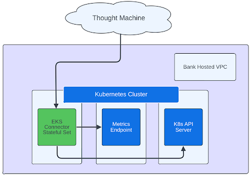
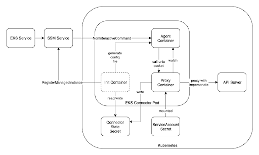
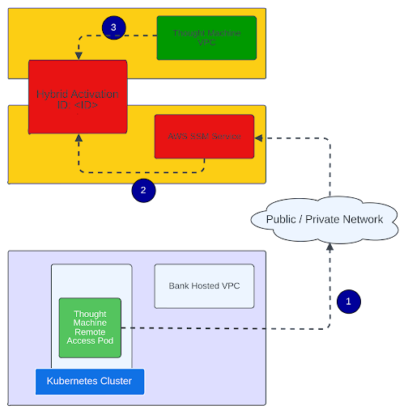
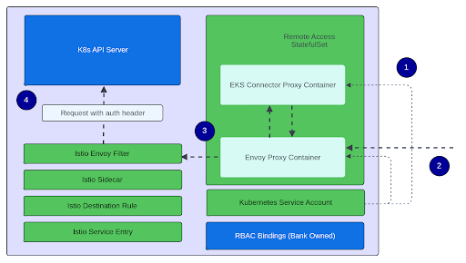
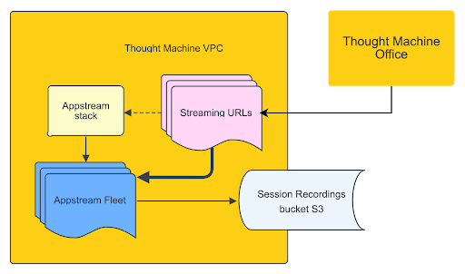

# Overview and architecture

This guide provides an overview of the architecture and software underlying Remote Access Tool. It is intended as supplementary reference material and does not provide active instruction or troubleshooting.

## About this guide

This guide, like Remote Access Tool, is split into two primary sections, one part deployed focused on bank-hosted infrastructure, and the other on the Thought Machine estate.

## Bank-hosted architecture

Here, you can learn about the bank-hosted side of Remote Access Tool, the architecture, and how it works.

### Interactions overview

Figure 1 gives a high level view of the interactions available to Thought Machine through the Remote Access Tool remote access tooling (green), with the Kubernetes API Server and the Metrics endpoint available on the bank-hosted environment.

### Connecting with Thought Machine

Thought Machine has built Remote Access Tool around AWS Systems Manager (SSM), which it uses to establish a connection between Thought Machine and the bank-hosted environment.

Thought Machine uses the [AWS EKS Connector](https://docs.aws.amazon.com/eks/latest/userguide/eks-connector.html) as the basis for Remote Access Tool and the only binary required to establish a connection with Thought Machine.

#### EKS Connector interaction

Figure 2 depicts the way that the EKS Connector interacts with both AWS SSM Service and Kubernetes. Image source and credit to AWS GitHub.

The main actions of the EKS Connector are to:

1.  Initiate a connection with AWS SSM and register the EKS Connector pod as a managed instance.
    
2.  Establish a persistent and secure connection with AWS SSM Service to propagate heartbeat information.
    
3.  Receive proxy commands from AWS SSM (over a Unix socket) to their end destination.
    

See the [Amazon EKS Connector documentation on AWS GitHub](https://github.com/aws/amazon-eks-connector) for more information.

#### Registering the managed instance

First, the EKS Connector registers the pod, using the correct credentials, as a managed instance with AWS SSM, in order to connect with Thought Machine.

As part of onboarding a bank, Thought Machine creates a [Hybrid Activation](https://docs.aws.amazon.com/systems-manager/latest/userguide/activations.html) that can be associated with a single, managed instance - the EKS Connector pod. To register with the correct Hybrid Activation, the InitContainer mounts the ActivationId and ActivationCode that was securely distributed by Thought Machine to the bank.

Figure 3 shows the `remote-access` pod registering itself as a managed instance, accessible from the Thought Machine estate.

Registering the managed service comprises these stages:

1.  The `remote-access` pod makes a 'RegisterManagedInstance' request over the network (private AWS, or public depending on the setup) to AWS SSM Service, attaching the Activation ID and Activation Code that were securely sent to the bank by Thought Machine.
    
2.  AWS SSM registers the managed instance with the Hybrid Activation created by Thought Machine within a Thought Machine-hosted VPC.
    
3.  The `remote-access` pod now appears as an active managed instance in the AWS Console, available to Thought Machine.
    

### Access control

Access control on the client side uses standard mechanisms seen elsewhere in Vault Core, based on Kubernetes native concepts combined with Istio.

To use Remote Access Tool, you must have Istio installed, with the namespace hosting Remote Access labelled for injection by Istio. You must also have an Istio Sidecar running alongside the application.

#### Resource inventory

Figure 4 depicts an inventory of all resources shipped with Remote Access Tool as part of the Kubernetes manifest. Resources in green are shipped by Thought Machine, and those in blue are owned by the bank.

#### Kubernetes authentication

Service accounts on Kubernetes are the basis for establishing machine identity; Remote Access Tool uses service accounts, alongside Envoy, to prove identity to the Kubernetes API server. The following lifecycle steps of a Kubernetes request are shown in Figure 4:

1.  The `remote-access` pod starts up, mounting the Kubernetes service account token using a projected volume; this makes it available to the Envoy proxy.
    
2.  The Pod receives an unauthenticated request (a request with no auth bearer token) which is intercepted by the Envoy proxy. The Envoy proxy passes it through to the EKS Connector Proxy container, which in turn acts as a passthrough and forwards the request to the Kubernetes API server.
    
3.  Istio intercepts the outbound request, which it passes through an Envoy Filter. The Envoy Filter mutates the request and attaches the `remote-access` pod’s Service Account token before forwarding the request.
    
4.  The Kubernetes API server receives a request with an authenticated service account token, and responds.
    

#### Kubernetes authorisation

Using Kubernetes Service Account tokens for machine identity in Kubernetes means that Remote Access Tool can use the standard Kubernetes Role/ClusterRole/Bindings mechanism for Authorisation to API resources.

You can customise the ClusterRole that Remote Access Tool is bound to, to allow the bank to define levels of access control to Kubernetes API resources. By default, Remote Access Tool will bind to a [default ClusterRole](https://kubernetes.io/docs/reference/access-authn-authz/rbac/#default-roles-and-role-bindings), named `view`. The `view` Cluster Role allows read-only access to most API resources in a namespace, in particular, it does not allow read access to Secrets, (Cluster)Roles and (Cluster)RoleBindings. See the [Installation Guide](/additional-product-offerings/latest/EN/remote-access-tool/installation_guide) for more details.

##### Kubernetes audit

Using Service Account tokens in line with Kubernetes best practice means that Kubernetes calls can be tracked in audit logs in a standard fashion, where the identity of the caller will always be the `remote-access-service-account`.

Thought Machine engineers are only able to establish one connection to the bank-hosted Remote Access Tool at any one time. With audit on the Thought Machine side (see [Session Audit](#session_audit)), it is possible to clearly audit and trace all API calls to a specific Thought Machine user.

#### Network access control

Istio resources impose network access control on the `remote-access` pod by using a Custom Sidecar that acts as a client-side ACL. This Sidecar exposes only two network endpoints to the Istio proxy running alongside the `remote-access` pod:

-   `./kubernetes.default.svc`
    
-   `{{ monitoring_namespace }}/thanos-query.{{ monitoring_namespace }}.svc.cluster.local`
    

Istio blocks any requests to network endpoints not listed on the Sidecar resource.

#### Revoking access

Because the `remote-access` pod is the sole entry point to the bank-hosted environment, there are several ways to revoke access on the bank-hosted side, with varying levels of impact:

1.  The bank can bind to a cluster role with a more restrictive permission set. This limits access to the Kubernetes API Server specifically. While it limits or restricts access, it does not terminate the connection from the Thought Machine site.
    
2.  The bank can alter the Istio Sidecar resource to remove hosts. This prevents the proxy from reaching destinations not included in the allow list.This limits or restricts access but does not terminate the connection from the Thought Machine site.
    
3.  Scale down the `remote-access` StatefulSet. This terminates the connection with the Thought Machine site and severs the link completely.
    

## Thought Machine-hosted architecture

Here, you can learn about the part of Remote Access Tool that is hosted by Thought Machine. It describes the broad architecture, security controls and audit.

### Overview of hosted architecture

Figure 5 provides a high-level overview of how Remote Access Tool is hosted on the Thought Machine estate.

The Thought Machine side makes use of AWS [AppStream](https://docs.aws.amazon.com/appstream2/latest/developerguide/what-is-appstream.html) within a secure private Virtual Private Cloud (VPC) to access the `remote-access` pod over AWS SSM Service.

AppStream provides Thought Machine engineers with a Remote Desktop interface with tightly controlled access to the network, and an audited set of applications. See also [AppStream Configuration](#appstream_configuration) for further benefits of AppStream.

### Security

Security controls are applied to the Thought Machine VPCs hosting Remote Access Tool instances in the following ways.

#### Estate structure

When onboarding clients to Remote Access Tool, Thought Machine creates a completely new account and set of infrastructure - one per client, per environment. This means that for a client onboarded with Development, Preproduction and Production environments, there are three, separate ring-fenced AWS accounts, each hosting one Remote Access Tool instance. This allows for granular, environment-level access control, and audit simplicity by ensuring complete separation.

#### Virtual Private Cloud security

The Virtual Private Cloud (VPC) hosting Remote Access Tool is private, hosting only private subnets with no access at all to the public internet. Each subnet has route information that allows communication to:

-   The VPC Endpoint that exposes the AWS S3 Service for persistent storage of session recordings (see [Session Audit](#session_audit))
    
-   The set of VPC Endpoints exposing AWS SSM Service endpoints
    

Access to Remote Access Tool AppStream instances is granted through one-time streaming URLs, which connect with the Remote Access Tool instance over the AWS AppStream Service.

#### Engineering access

Thought Machine uses a proprietary tool to grant engineers access to their cloud environments and Kubernetes clusters in a regulated manner, enforcing multi-factor authentication (MFA) and break glass controls. This is in line with regulatory requirements.

To access Remote Access Tool instances, an engineer has to acquire the highest level of privileges, going through multi-factor authentication including break glass approval. Further controls are then enforced on Remote Access Tool environments, which have access to AppStream and SSM limited to a per-username basis. This allows Thought Machine to onboard only a select subset of production engineers onto AppStream.

### Compliance

#### AppStream configuration

Each Remote Access Tool instance is configured to limit access and remove the possibility of data exfiltration.

Thought Machine controls access to a Remote Access Tool instance by Thought Machine engineers using sessions, each lasting a maximum of 60 minutes with an idle timeout of 15 minutes.

There is no access to persistent storage and any files created over the duration of a session are destroyed at the end.

To prevent exfiltration of data, clipboard access is controlled - engineers may copy in commands and text, but may not copy anything out.

#### Session audit

Similar to the bank-hosted audit ability described in [Kubernetes Audit](#kubernetes_audit), there is audit tooling on the Thought Machine estate.

For every session started against a Remote Access Tool instance, a session recording is taken, recording an engineers-eye-view of the session. Upon termination of a session, the session recording is pushed to an S3 bucket in the account for optional sharing with the client.

#### Identity Broker audit

Thought Machine is able to provide audit information about all engineers who accessed a Remote Access Tool environment, the time of access, and the reason for access.