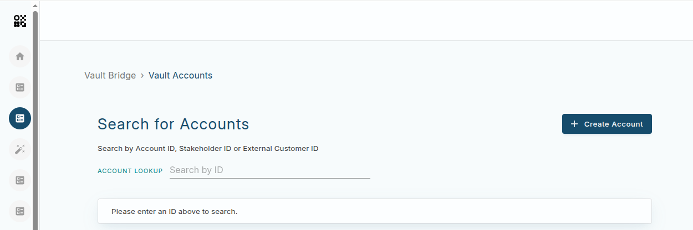
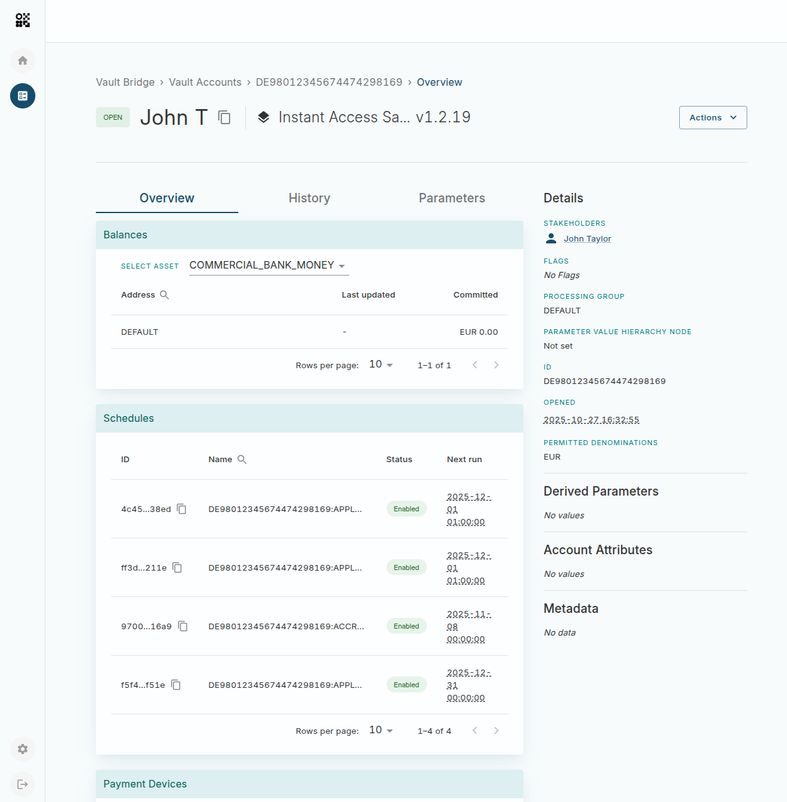
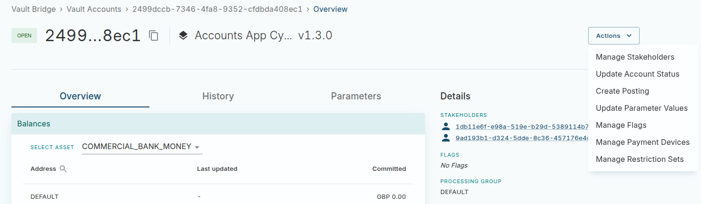
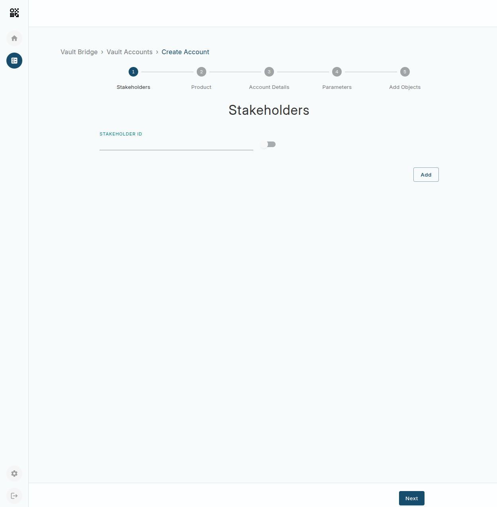
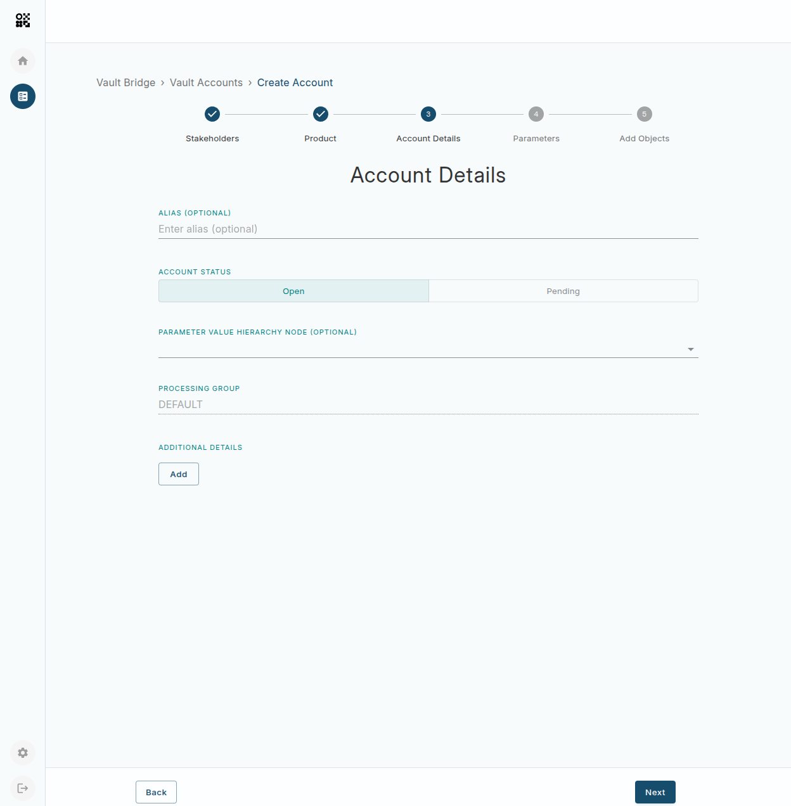
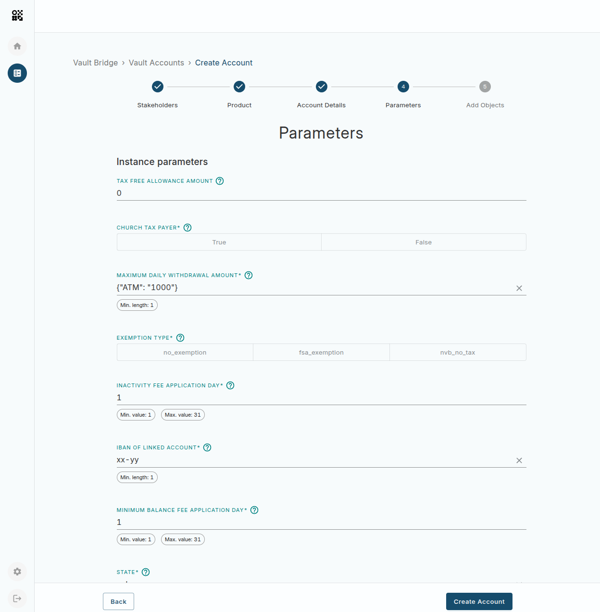

# Vault Accounts

Vault Accounts enables your organisation to manage [Accounts](/vault-core/latest/EN/reference/accounts) in your Vault Core environment. The list of features include:

-   Create an account
    
-   View and manage stakeholders
    
-   View and create Vault Core postings of the supported types:
    
    -   hard settlement
        
    -   transfer
        
    -   authorisation
        
    -   settlement
        
    -   release
        
    -   adjustment
        
    
-   Update the status of an account
    
-   Update account parameter values
    
-   Manage flags
    
-   Manage payment devices
    
-   Manage restriction sets
    

## Overview

Vault Accounts is not intended for account discoverability; we do not provide a mechanism to browse arbitrary accounts. Instead, the App home page displays a search box for searching by one of the account ID, stakeholder ID, or external customer ID.

## Managing an Account

### Viewing an Account

The Account Details page shows relevant data associated to the account such as balances and parameters and let you can view and manage associated resources like payment devices and flags.

chat\_bubble

It is possible that some resources are used in a Smart Contract but not associated with an account (such as global parameters). These will not be displayed.

### Managing resources

info

Vault Accounts is designed to work on single accounts, and as such, actions that may have a side effect on another account are not permitted. Examples include modifying parameters that would affect multiple accounts.

You can find all the actions to manage resources associated to an Account from the dropdown **Actions** menu. Upon action selection, you will be directed to a specific screen with a detailed view of the resource which provides options to modify account owned resources.

error

Updates applied to an account will apply immediately, without approval required.

## Creating a new Account

You can access the create account form via the **Create Account** button on the accounts home page.

This flow allows you to configure the required information to create an account, and then optionally apply additional resources to that account (flags, payment devices, and restriction sets)

### Stakeholders

At least one stakeholder must be added to the account. Stakeholders can be found by Vault Core stakeholder ID, or by external ID.

chat\_bubble

If you provide an external ID that does not exist in Vault Core, a Customer will be created automatically with this external ID applied when the account is created.

### Details

You can set the Account opening status, processing group ID or add any additional details. Presently, the additional details are limited to plain-text string values.

### Parameters

You can set Account-level Expected Parameters as well as Instance Parameters when creating an Account. The application shows the format for each field as well as any defined value constraint.

An asterisk signifies that a Parameter is required, and therefore you must provide a valid value for it. When you hover over the help icon next to an Instance Parameter, the App shows you the ID of the parameter in Vault Core.

