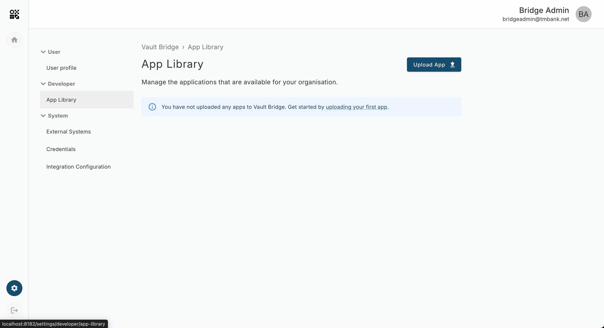
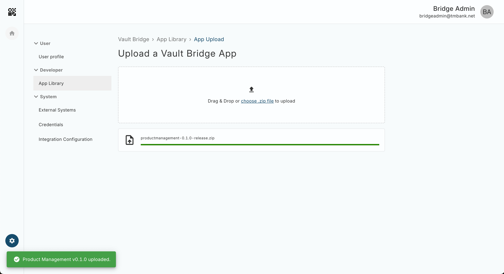
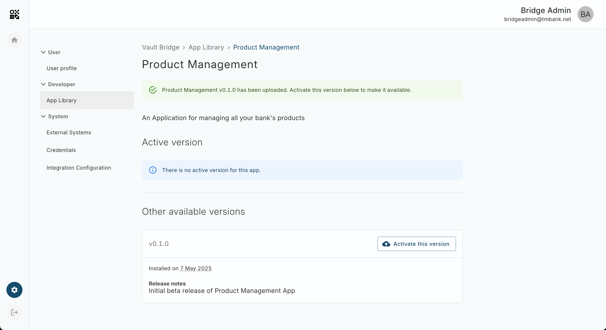
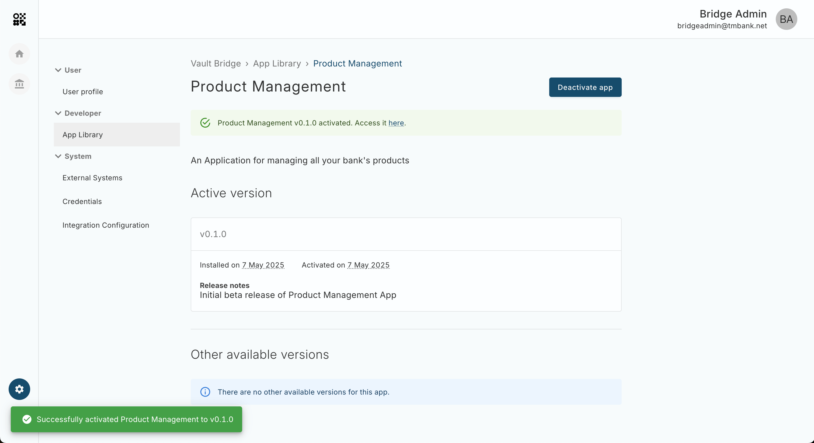

# App Installation

This guide assumes you have installed Vault Bridge and have access to the Vault Bridge Console. For more information on installing Vault Bridge see [Vault Bridge Environment and Installation](/additional-product-offerings/latest/EN/vault-bridge/environment_and_installation/overview).

The following steps must be completed to install and configure each Vault Bridge App:

1.  [Download the latest release](#bundle-download)
    
2.  [Uploading and Activating a Bridge App](#upload-and-activate-app)
    
3.  [Add an External System](#add-ext-sys)
    
4.  [Add Credentials](#add-credentials)
    
5.  [Add Integration Configurations](#add-int-config)
    

## Downloading the latest release

First you’ll need to download a Vault Bridge App from Vault Portal. Navigate to the [Apps page](/additional-product-offerings/latest/EN/vault-bridge/applications), select an App and click the link to Releases at the bottom of the details page. From this page you can download a .zip file containing the latest version of your selected Bridge App.

## Uploading and Activating a Bridge App

### Uploading

Bridge Apps are uploaded to a Vault Bridge Instance via the Vault Bridge Console. To do this visit the Bridge Console in the browser, navigate to Settings > Developer > App Library and click the "Upload App" button at the top of the page.

Then drag and drop the Bridge App .zip file or click the "choose .zip file" link on the App Upload page.

Once the App is uploaded to Bridge successfully you will be redirected to the App Library Details page where you can activate the App.

### Activating

To make a Bridge App available to users you will need to activate a version via the App Details page. In most cases you will wish to enable the most recently uploaded version, however you can also toggle between versions to enable and disable functionality as required.

Click the "Activate this version" button for the version of the Bridge App you wish to enable. Only one version of an App can be active at a given time.

## Adding External Systems

Before you can use Vault Bridge you must add an External System, which can be either Vault Core, Vault Payments or another internal or third-party system. You can do this either [via the Bridge Console UI](#via_bridge_ui) or [via the Bridge API](#via_bridge_api).

### Via the Bridge Console UI

Below are the common steps that are required before adding any External System.

1.  Navigate to the settings in the Bridge Console which can be found on the navigation pane on the left.
    
2.  Click External Systems in the Systems tab in the menu on the left.
    
3.  Select the button to add a new External System which will display a form with details to fill out.
    

All systems require the following details.

1.  A `display name` for the system to connect. This should be human-readable and descriptive.
    
2.  An `id` for the system. This will be auto-generated in kebab-case from the display name. You can edit this before saving, but it must remain unique.
    
3.  An optional `description` to provide additional context about the system’s role or environment
    

You will then need to select the type of system to connect to.

#### Adding Vault Core

The following details are required to connect and integrate with Vault Core.

1.  A `Core API URL` – This must be an http or https URL with a valid host and Top-Level Domain (TLD), or it must be publicly accessible.
    
2.  Additional Core APIs – If you’ll be using other Vault Core APIs select them from the dropdown and provide their corresponding URLs.
    
3.  A `Kafka Broker` – At least one broker address is required to enable message streaming between Bridge and Vault Core.
    
4.  A `Certificate Authority (CA) Chain` – Required if SSL is enabled. This should include the full chain to verify certificates.
    

#### Adding Vault Payments, Internal or Third-Party Systems

For Vault Payments, Internal or Third-Party Systems a single URL must be provided to specify the API endpoint.

### Via Bridge API

You are able to add External Systems through the Bridge API which can be found [here](/additional-product-offerings/latest/EN/vault-bridge/api/bridge_api#external_systems).

## Adding Credentials

Once you have added an External System, you can set up Credentials to use with your External System, or choose to omit adding Credentials in which case no authentication will be used with the External System. You can add Credentials either [via the Bridge Console UI](#via_bridge_ui) or [via the Bridge API](#via_bridge_api).

chat\_bubble

This section describes how to create a Credential, without explicitly linking it to an External System yet. This is because the same Credential may be used with multiple External Systems. The next section will describe how to link a Credential to an External System.

### Via the Bridge Console UI

Below are the common steps that are required before adding any Credential.

1.  Navigate to the settings in the Bridge Console which can be found on the navigation pane on the left.
    
2.  Click Credentials in the Systems tab in the menu on the left.
    
3.  Select the button to add Credentials which will display a form with details to fill out.
    

All credentials require the following details.

-   A `display name` for the credential. This should be human-readable and descriptive.
    
-   An `id` for the credential. This will be auto-generated in kebab-case from the display name. You can edit this before saving, but it must remain unique.
    

There is a toggle for enabling the HTTP Proxy. Enabling this will allow Bridge Apps to use the Credential when sending HTTP requests to External Systems through Bridge’s Integrations HTTP Proxy.

chat\_bubble

You cannot enable a Credential to be used via the Integrations HTTP Proxy if the Credential uses the [mTLS](/additional-product-offerings/latest/EN/vault-bridge/applications/application-installation#mtls) or [SASL/SCRAM](/additional-product-offerings/latest/EN/vault-bridge/applications/application-installation#saslscram) auth mechanisms.

#### Authentication Mechanisms

There are several different mechanisms of authentication that can be used with External Systems. Multiple authentication mechanisms may be used but at least one is required.

##### OAuth Client Credentials

Bridge uses OAuth 2.0 Client Credentials which is an authentication mechanism commonly used for machine-to-machine (M2M) communication. This credential type allows Bridge to securely obtain access tokens from an external authorization server and use those tokens to make authenticated API calls to an External System.

-   The `URL` of an OAuth 2.0 compliant token endpoint on the authorization server. This allows Bridge to know where to send the request to obtain an access token.
    
-   `Client ID` is the public identifier for Bridge, or a particular Bridge app, that is configured in the authorization server. OAuth clients must use this value to uniquely identify themselves when requesting a token from an authorization server.
    
-   `Client Secret` is a secret only known by the client and authorization server. The field is stored in encrypted form and redacted in Bridge API responses.
    
-   `Scopes` are OAuth scopes as defined by an External System, corresponding to the subset of permissions needed by Bridge or a Bridge app. For example, if a particular Credential contains OAuth Client Credentials for Vault Core, and is to be used by a Bridge app that calls ListAccounts in Vault Core, then the Credential would need to include the `core.accounts:read` scope.
    

There are various ways to send the Client ID and Secret shown below.

-   `Send in header` sends the Client ID and Client Secret using HTTP Basic Authorization when requesting a new token.
    
-   `Send in HTTP body` sends the Client ID and Client Secret in the POST body when requesting a new token.
    
-   `Auto detect` which style to use.
    

chat\_bubble

If this credential is used for Kafka consumers, it is recommended to set this explicitly rather than auto detecting. If auto detect is selected, it will result in the same behaviour as send in header.

The following authentication is used only for Bridge Kafka Consumers.

-   `SASL Extensions` is a key/value map (represented as a JSON string) of extensions sent to the service during the SASL/OAUTHBEARER authentication.
    

chat\_bubble

If the Credential is used by a client that’s not a Kafka consumer, the SASL Extension will be ignored.

##### Static Token Credentials

The Static Token credential is a simple authentication mechanism where the same predefined token is included in all outgoing HTTP requests to an External System.

-   The static token value to be sent in HTTP requests. It is redacted in Bridge API responses and stored in encrypted form.
    
-   The name of the HTTP header to send the token in. If omitted, the token is sent in the default `X-Auth-Token` header
    

##### Auth Header Pass through

The Auth Header Pass Through credential enables the Bridge Integration HTTP Proxy to forward an authorization header from the original client request directly to an External System.

chat\_bubble

This auth mechanism requires the Credential to be enabled for the HTTP Proxy, and can optionally be combined with a Static Token. If both auth mechanisms specify the same HTTP header, Auth Header Pass Through will take precedence, i.e. the token from the original user request will be used for downstream requests.

##### mTLS

The mTLS credential enables authentication via Mutual TLS (mTLS), where both the client and server authenticate each other using digital certificates.

-   The `Client Chain` must not contain private keys.
    
-   The `Client Key` is the private key used for client authentication.
    

chat\_bubble

mTLS is only used with Kafka and cannot be used through the Integrations proxy.

##### SASL/SCRAM

chat\_bubble

This authentication mechanism cannot be combined with any of the other mechanisms. This mechanism also cannot be used if the HTTP Proxy is enabled.

-   The `Username` as configured in the External System.
    
-   The corresponding `Password` for the above 'Username'. The field is stored securely and redacted in responses.
    
-   The hashing algorithm used to encode the password before authentication. Can be either `sha-256` or `sha-512`.
    

### Via Bridge API

You are able to add Credentials through the Bridge API which can be found [here](/additional-product-offerings/latest/EN/vault-bridge/api/bridge_api#credentials).

## Adding Integration Configurations

An Integration Configuration links the External System and Configuration resources to define how Bridge Applications or Bridge Services communicate and authenticate with Core, Payments or Third Party systems. You can create an Integration Configuration [via the Bridge Console UI](#via_bridge_ui) or [via the Bridge API](#via_bridge_api).

Reading the External System and Credentials sections is recommended before proceeding with this section.

lightbulb

If you are using Vault Core version 5.8 or above, you are advised to use the same OIDC authorisation server in your Identity Provider to authenticate user access to both Vault Bridge and Vault Core. It is also recommended to configure your Integration Config with an [Auth Header Pass through](/additional-product-offerings/latest/EN/vault-bridge/api/bridge_api#auth_header_pass_through) Credential to allow authorisation in Vault Bridge and Vault Core to use the same JSON Web Token end to end.

### Via the Bridge Console UI

Below are the common steps that are required before adding any Integration Configuration.

1.  Navigate to the settings in the Bridge Console which can be found on the navigation pane on the left.
    
2.  Click Integration Configuration in the Systems tab in the menu on the left.
    
3.  Select the button to add Integration Configuration which will display a form with details to fill out.
    

These are the fields required for creating an Integration Configuration.

-   A `display name` for the Integration Configuration. This should be human-readable and descriptive.
    
-   An `id` for the Integration Configuration.
    
-   Select an External System from the dropdown.
    
-   Select the Credential to use from the dropdown.
    

chat\_bubble

The Credential field may be left empty in which case no authentication will be used as part of any requests.

### Via Bridge API

You are able to add External Systems through the Bridge API which can be found [here](/additional-product-offerings/latest/EN/vault-bridge/api/bridge_api#integration_configs).