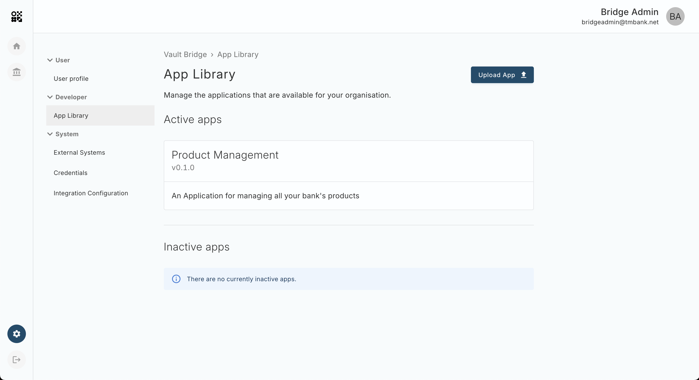
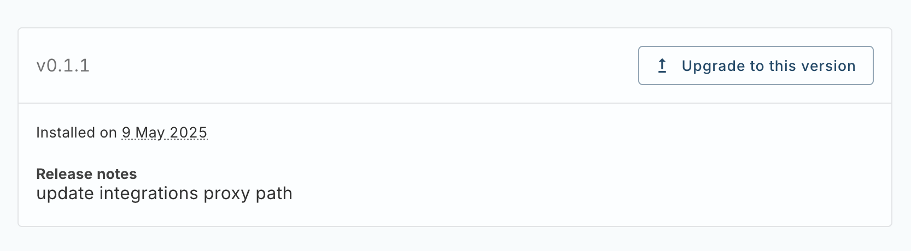
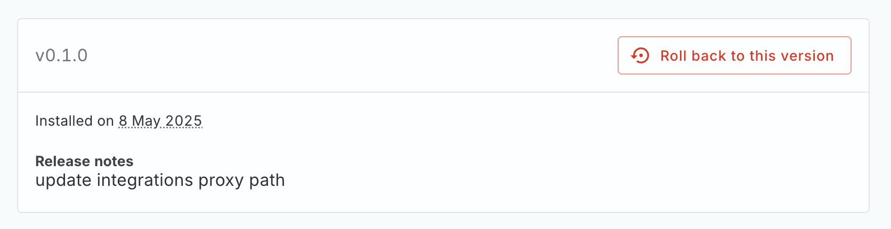

# App Updates and Rollbacks

When a new version of a Bridge App is released, you can download the latest version from the [Apps page](/additional-product-offerings/latest/EN/vault-bridge/applications) in Vault Portal, select the App you wish to download a new version of, click the link to Releases at the bottom of the details page and download the .zip file containing the version of the app you wish to update to.

Once downloaded visit the Bridge Console in your browser and navigate to Settings > Developer > App Library and click the "Upload App" button at the top of the page.

Drag and drop the Bridge App .zip file or click the "choose .zip file" link on the App Upload page. Once the App is uploaded to Bridge successfully you will be redirected to the App Library Details page. From here you can select "Upgrade to this version" to update a given App to the latest version.

## Rollbacks

Within the App Details page you can also roll back to previous versions of an App. This is useful for toggling functionality on and off between versions and makes updating Apps safer as you can roll back to a previous version should any issues arise in a later version.

To roll back to a previous version of a Bridge App simply visit the App Details page and click "Roll back to this version" on the App version you wish to roll back to.

