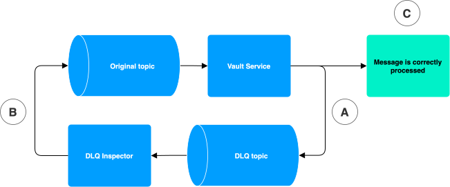

# DLQ Inspector

## What is DLQ inspector?

The DLQ Inspector is a web application to aid in the handling of DLQ (Dead Letter Queue) messages. You can use DLQ Inspector to debug errors originating from inside Vault Core and, in some cases, directly remediate them.

DLQ Inspector automatically consumes all DLQ messages published by Vault Core (which temporarily stores them in a database). Messages are then made available for listing, reading, and republishing.

To learn more about Dead Letter Queues, refer to [Dead Letter Queues](/vault-core/latest/EN/api/overview#dead_letter_queues_dlqs).

## How to use DLQ Inspector

The DLQ Inspector home page lists all DLQ messages published within its retention period. You can filter this list. See the bottom of the home page for a count of messages matching your query.

DLQ Inspector provides a view on each message to support debugging of the corresponding error. For each message you can view the following fields:

-   Error message
    
-   Message body
    
-   Message headers
    
-   The DLQ topic it was published to
    
-   The original topic it was published to
    

These fields can contain vital clues to understanding how an error occurred. Here are some examples:

-   "The message content indicates that a Vault Core resource was not in the expected state."
    
-   "An error message points to an infrastructural issue."
    

The error message and original topic are not propagated for all messages. You cannot always decode the message. In some cases, DLQ Inspector may only be able to partially decode the message. In such cases, it shows no message body, or a partial message body.

The DLQ Inspector does NOT implement idempotency on DLQ messages it consumes. Some messages will appear more than once. Duplicate messages can be safely republished as Vault Core will handle them idempotently.

chat\_bubble

DLQ topics are internal. Therefore the errors, message types and the topics themselves are not documented.

### Responding to DLQ messages

When you have identified a new DLQ message, use the Inspector to understand the business impact of the underlying error. Not all DLQ messages indicate a business error in Vault Core:

-   The DLQ message may only affect internal resources included to improve API performance.
    
-   A single underlying error in Vault Core may create many DLQ messages across one or several topics.
    
-   A component you do not use may produce a DLQ message.
    

To understand the business impact of the underlying error, check that a specific set of resources are in an incorrect state.

When you have confirmed that the resources are in an incorrect state, use Vault Core’s APIs or applications to remediate the issue.

For example:

You get a message indicating that an Account Update has failed. It looks like the error may have arisen from an issue with the state of the account. Firstly, verify the problem with the account using Vault Core’s APIs, then rectify the underlying issue. When you have rectified the issue, try to update the account again. You can do this manually, or you can republish from the DLQ Inspector.

If you are unsure about the impact of a DLQ message or are unable to recover from the error yourself, contact Thought Machine support.

### Republishing DLQ messages

In many cases, DLQ Inspector allows you to republish DLQ messages. In some cases republishing DLQ messages may be an appropriate way to correct the state of Vault Core.

In the following diagram a Vault Service has just published to a DLQ topic after failing to process a message (A). A DLQ Inspector user with edit permission on the DLQ Topic resource can then choose to republish the message (B). If the issue has been resolved, the message is likely to be processed successfully (C), returning Vault Core to a healthy state. If the error still exists, or another error is uncovered, the message is updated or replaced in the DLQ Inspector.

For our failed Account update example, if the update failed due to a transient error (for example, the database was unavailable for an extended period of time), then republishing the DLQ message is likely to correct the Account status. However, be aware that republishing can produce further issues if used incorrectly. If you are republishing in a novel scenario, contact Thought Machine Support.

Republished messages have the status "Republished". If the republished message returns to the DLQ topic the status reverts to "Unresolved". DLQ Inspector has no "Resolved" status. Instead users are expected to verify that an issue has been resolved independently. The actual republishing of a message is handled asynchronously. There is a short delay between messages entering the "Republished" state and the message appearing on the original topic. The message page shows the republish history of a message.

chat\_bubble

When Vault Core publishes a DLQ message, any ordering guarantees between that message and later messages may be lost. Successfully republishing a message does not guarantee that the associated resource is in the correct final state.

chat\_bubble

If you suffer a cluster/Kafka outage and need to run Vault Core’s Disaster Recovery process, be aware that republished messages could be lost. You can manually republish the messages again once the cluster is healthy.

## Retention of DLQ messages

DLQ messages in Vault Core are not stored indefinitely and are subject to two separate retention periods.

The messages on the DLQ Kafka topics are subject to Kafka’s retention policy. Messages that are retained on the Kafka topic but not in DLQ Inspector are NOT accessible (or actionable) from DLQ Inspector.

DLQ Inspector consumes all DLQ messages and stores them in the `support` database. The retention policy for this data is set in your `values.yaml`. You can set a retention period using `dlq_inspector.endpoint.cleanup.retention_period` and a schedule for the cleanup job to run using `dlq_inspector.cleanup.schedule`.

chat\_bubble

Data outside of the retention period may still be visible to application users but is incomplete.