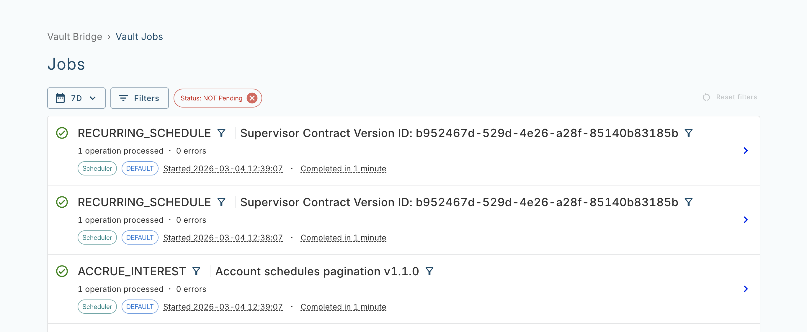
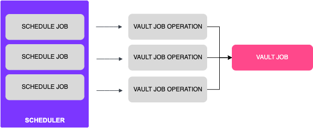
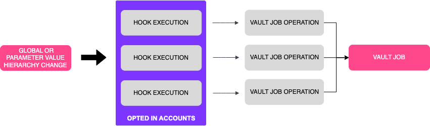

# Vault Jobs

## What is Vault Jobs?

### Definition

Vault Jobs is a web application that displays the progress and health of long-running account processes within Vault Core, such as End of Day. For example:

Vault Jobs displays two resources, Vault Jobs and Vault Job operations:

-   A Vault Job comprises multiple operations. Each Vault Job provides insight into how quickly its contained operations are being processed, along with a count of Complete and Errored operations. Each Job also displays integration-specific metadata about the Vault Job to aid a user’s investigation into the health of a Vault Job.
    
-   A Vault Job operation represents an individual process within a Vault Job. An operation, once processed, has one of the following states:
    
    -   Succeeded: The operation has been processed without error and the **Completed** total of the parent Vault Job is incremented by one.
        
    -   Errored: The operation has errored and the **Errored** total of the parent Vault Job is incremented by one.
        
    
-   An errored Vault Job operation contains metadata, such as IDs and links to the affected resource in the Operations Dashboard, along with any errors that occurred during processing. A user can retry errored Scheduler Job operations in bulk via an action button on an individual Vault Job details page. Once a user retries a Scheduled Job operation, the service resets the operation status to in progress and resets the Vault Job **Errored** number, status and **Ended** timestamp. The retried operations may now succeed or error again - you can identify the result as follows:
    
    -   Success: If a retried operation succeeds then Vault Jobs removes it from the list of operations in Vault Job details page and updates the total **Completed** number
        
    -   Error: If a retried operation errors, its status is reset back to errored and the Vault Job total **Errored** number is updated
        
        chat\_bubble
        
        -   Vault Jobs only displays errored operations and in progress operations (if they previously have errored), in the list of **Errored operations**
            
        -   You cannot retry Errored Parameter change operations
            
        
    

## What are the use cases?

Vault Jobs has integrations with the Core API Scheduler and the Core API Parameters resources.

chat\_bubble

Integrations with Core API Parameters are only supported in Contracts Language version 4.

### Core API Scheduler

The following diagram shows the Core API Scheduler integration, where each Schedule Job that the Scheduler creates has a corresponding Vault Job operation:

This integration supports the following use cases for using Vault Jobs:

-   Monitoring the progress of all Schedule Jobs
    
-   Identifying any Schedule Job operations that have errored, to investigate the likely cause of the failure
    
-   Logged-in users can view the progress of Schedule Jobs, grouped by various attributes of the specific Vault Job - see [How Vault Jobs are created](/vault-core/latest/EN/reference/core_apps_and_operations_dashboard/vault_jobs#how_vault_jobs_are_created)
    
-   Remediating errored Schedule Jobs (Vault Job operations) by retrying them in bulk once underlying issue with a Scheduled Job is fixed. For example, syntax error in the Smart Contract is fixed and impacted Accounts are converted to the new Smart Contract version. You can monitor remediation via the **Remediation Processor** panels on the [Vault Jobs Overview dashboard](/vault-core/latest/EN/environment_and_installation/infrastructure_docs/observability_and_monitoring/introduction_to_grafana_and_key_dashboards#vault_jobs_overview_dashboard)
    

chat\_bubble

If using a Contracts Language version 3 contract, the Vault Job executed immediately after a plan migration may not display accurate completion data.

### Core API Parameters

chat\_bubble

Parameter Jobs are only supported in Contracts Language version 4.

The following diagram shows the Core API Parameters integration, where a point in time change to a globally owned and/or [Parameter Value Hierarchy](/vault-core/latest/EN/reference/parameters/building_and_managing_the_parameter_value_hierarchy) node owned value triggers the post\_parameter\_change\_hook (for Accounts that are opted in to the hook), which in turn generates a Vault Job operation:

This integration supports the following use cases for using Vault Jobs:

-   Monitoring the progress of global or Parameter Value Hierarchy Node owned Parameter value changes
    
-   Identifying any Parameter change operations that have errored, to investigate the likely cause of the failure
    

## Related information

Refer to the following pages for more information about the Vault Core features that this section describes:

-   [Scheduler overview](/vault-core/latest/EN/reference/scheduler#glossary)
    
-   [Smart Contracts overview](/vault-core/latest/EN/smart_contracts/)
    
-   [Smart Contracts Event Types](/vault-core/latest/EN/smart_contracts/contracts_api_4xx/common_types_4xx/classes#smartcontracteventtype)
    
-   [Core API ParameterValue resource](/vault-core/latest/EN/api/core_api#parametervalue)
    
-   [Parameters](/vault-core/latest/EN/reference/parameters)