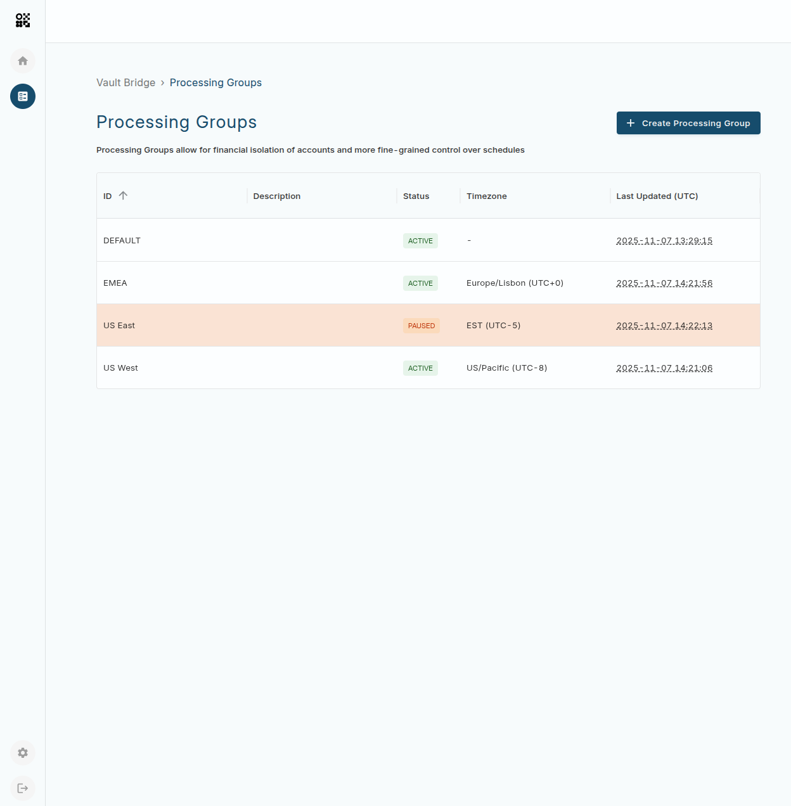
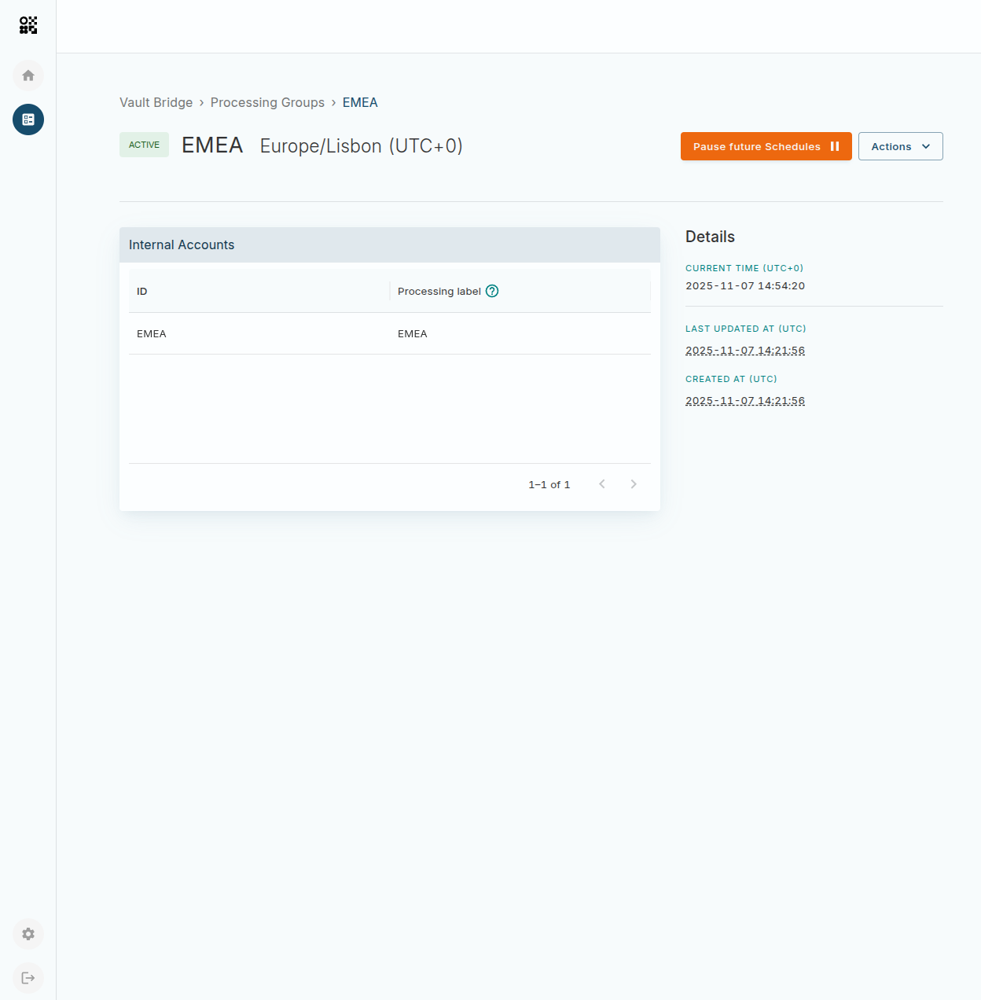
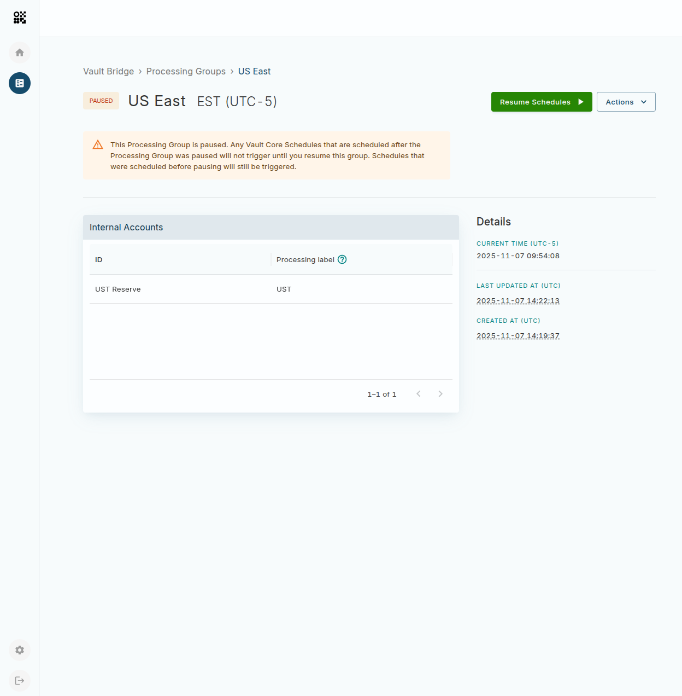
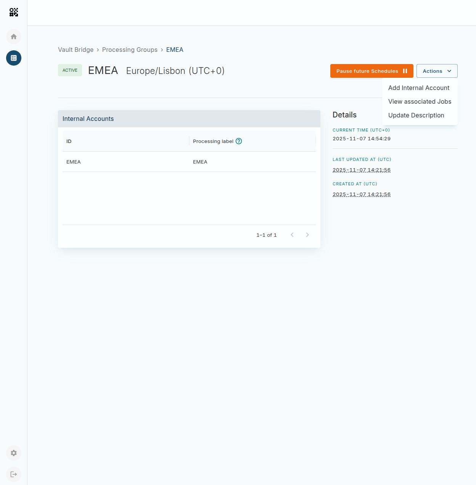
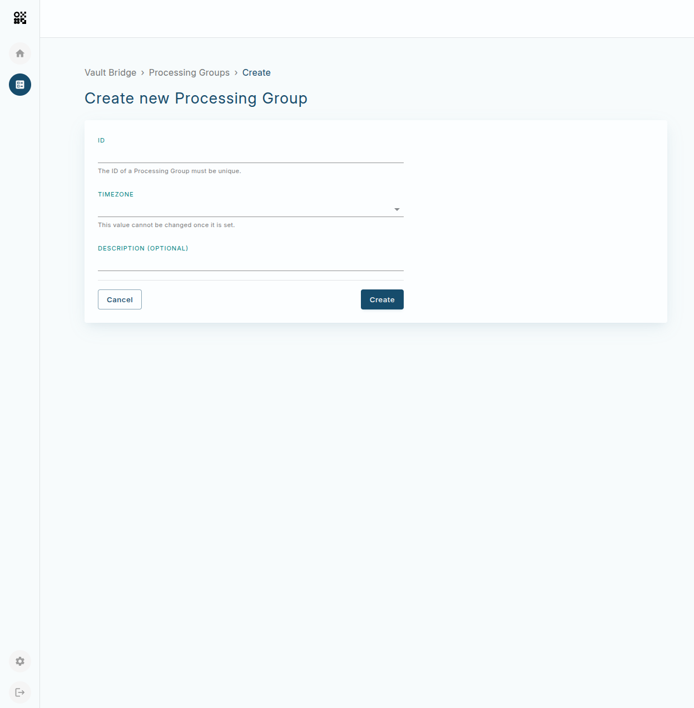

# Vault Processing Groups

Vault Processing Groups App enables your organisation to view, create, and manage Processing Groups.

To learn more about Processing Groups, see [Processing Groups](/vault-core/latest/EN/reference/processing_groups).

## Overview

The app home page shows all the Processing Groups in the environment and indicates if any of your groups are currently paused. For each Processing Group, you can see the most recent timestamp at which it had been updated, its description and timezone. Paused Processing Groups are highlighted.

## Managing an existing Processing Group

The Processing Group details page displays information associated with a Processing Group, such as metadata like timezone and current time, and lists the Internal Accounts. The list of Internal Accounts also includes the Processing label which may be referenced in a Smart Contract, Supervisor Contract or Posting, please refer back to [here](/vault-core/latest/EN/reference/processing_groups#internal_account_processing_labels) for a more detailed explanation.

You can pause the Processing Group, by pressing **Pause future schedules**, and resume a paused group by pressing **Resume schedules**.

warning

Pause and resume impacts schedules by following [Using a Processing Group for pausing/unpausing](/vault-core/latest/EN/reference/processing_groups#using_a_processing_group_for_pausingunpausing).

From the **Actions** menu you can also **Add Internal Account**, **View Associated Jobs** and **Update Description**.

## Creating a new Processing Group

You can access the create Processing Group form via the **Create Processing Group** button on the home page.

This flow allows you to configure the required information to create a Processing Group.

info

ID and Timezone cannot be changed after the Processing Group is created.

