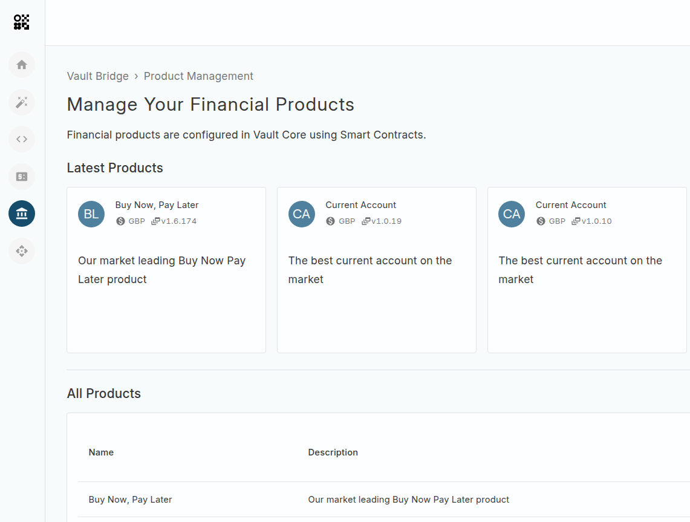
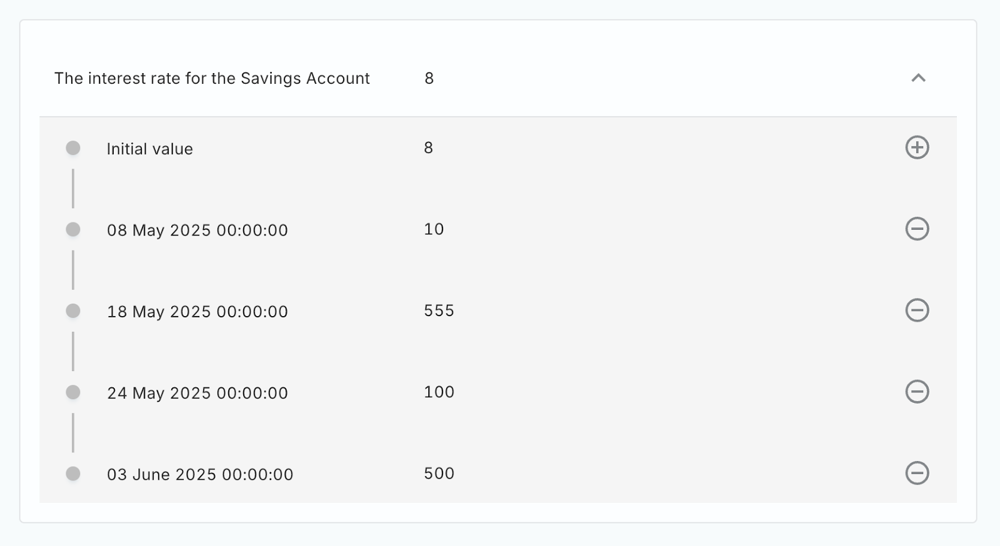
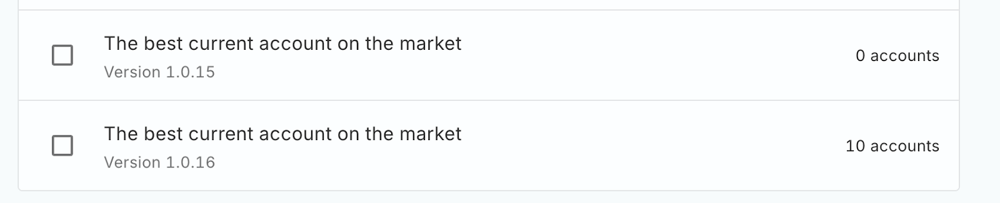
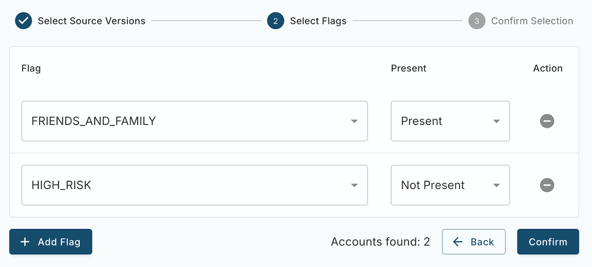

# Product Management

The Product Management App enables your organisation to manage the financial products ([Smart Contracts](/vault-core/latest/EN/smart_contracts)) that you have deployed in your Vault Core environment. The full list of features includes support to:

-   View all financial products deployed in your Vault Core environment
    
-   View all versions of each financial product that have been created
    
-   View the template parameters of each version of a product
    
-   View the total number of accounts that have been created for each version of a product
    
-   Update the value of a template parameter for a product version in real-time, or schedule a value change in the future
    
-   Create a new version of an existing product version
    
-   Convert accounts between versions of the same product
    

## Overview

The App homepage displays all of the financial products deployed in your Vault Core environment. You can quickly get access to the latest product versions, and navigate through all of your organisation’s products via the comprehensive table view.

When viewing each financial product, you can view all versions of each financial product that have been created. Clicking on an individual product version enables you to see the current (as well as historic, and future-dated) parameter values that have been assigned to that version.

Finally, it is possible to see the total number of accounts that have been created for each version of a product.

chat\_bubble

The total number of accounts will include only accounts that have the status `OPEN`.

## Viewing and updating a product version’s parameters

To update a product version’s template parameter, select the product, then the product version you wish to update, and navigate to Product Parameters. From this screen, click the Edit Product Parameters button. For each product parameter you can see a full timeline of the changes made to the value of that parameter over time.

It is possible to update a value, for it to take effect immediately, or to schedule a change to take place in the future. To future-date a change, select the “Specify when to apply this change” option and provide a date and time.

## Creating a new product version

It is quick and easy to create a new product version via the App. Navigate to the product you wish to create a new version for, and select the “Clone Latest Product Version” option from the product version list page, in the top right of the screen. This will automatically set up a draft of a new product version, using the latest version as a starting point.

Alternatively, you can navigate to a specific product version, select Product Parameters, and choose the “Clone This Product” option to set up a draft of that specific version as a starting point.

From the “Clone” screen, you can provide a description for the new version, and specify a new version number.

chat\_bubble

Version numbers must be unique, and follow the semantic versioning format (X.Y.Z, e.g. 1.0.1).

Please review your changes carefully, using the “Review Changes” screen; saving the new version will immediately create a new product version in your Vault Core environment.

## Converting accounts between product versions

The Product Management App enables you to convert accounts between versions of the same product.

info

Account conversions within the Product Management App are certified for up to 100,000 accounts per operation.

If your conversion exceeds this volume, we recommend splitting the operation into several separate conversions, either by using account flags to select a subset of accounts or by selecting a smaller set of product versions to convert from.

Using the Account Conversions screen, you can see all previous Account Conversions that were created (including a summary of their status, and any errors), and you can create a new conversion.

First, select the destination product version that you wish to convert accounts to. Navigate to Account Conversions and select “Convert Accounts to this Product”.

Select the source product version(s) that you wish to convert accounts from.

You can convert all accounts that are currently open from the selected source version(s), or alternatively, it is possible to filter which accounts are in-scope for the conversion using the presence or absence of flags on each account in the source product versions.

For instance, take the following example: we can add a filter that only considers accounts that have the “Friends and Family” flag, but do not have the “High Risk” flag. This ensures that only accounts matching this search are converted.

Once you have selected the source version(s), and (optionally) configured any flag-based filters, you can review the conversion’s details before confirming it to start.

## Links

[

new\_releases Releases

Get your hands on the latest release

](/additional-product-offerings/latest/EN/vault-bridge/applications/product-management/releases)

[

deployed\_code\_update Installation

Installation guide for Product Management

](/additional-product-offerings/latest/EN/vault-bridge/applications/product-management/installation)