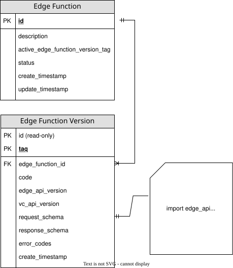

# How to write an Edge Function

The Edge Functions SDK (Software Development Kit) helps developers to author Edge Functions, orchestrating multiple API calls into a single synchronous API call. The SDK contains all the functionality necessary to structure Edge Functions so that they are understood by the systems that developers design to execute and manage them.

You will use the SDK to write the source code for an Edge Function and can optionally use the `vc_api` library within its Python code to call a subset of the public Vault Core APIs.

Here, you can learn about:

-   Edge Functions resources, modules, and objects
    
-   How to write and structure an Edge Function
    
-   Example API calls to create an Edge Function and its initial version using your source code
    
-   The next steps to upload and make your Edge Function available so that you can execute it
    
-   Key aspects of the Edge Functions API for creating, updating, and managing the active version and status of an Edge Function
    

Before you continue, check the [Quick start guide](/additional-product-offerings/latest/EN/vault-bridge/concepts/edge_functions/overview_and_getting_started/quick_start_guide) for an overview and prerequisites to make sure that you have everything you need to begin writing the Edge Function code.

## Overview of Edge Function resources and structure

To aid your understanding before you start authoring code, let’s take a deeper look at the relationship between the structure and resources of Edge Functions.

At a high level, an Edge Function comprises:

-   `EdgeFunction` – the top-level, parent resource
    
-   `EdgeFunctionVersion` – subresource of the given Edge Function; it provides a version of the Edge Function source code
    
-   `code` – `EdgeFunctionVersion` source code authored by a developer on behalf of a bank
    

When you create your first Edge Function, you also create its first Edge Function Version.

An `EdgeFunction` resource can have multiple `EdgeFunctionVersion` subresources, and you must assign one as the `active_edge_function_version_tag`. When you make a request to execute an Edge Function, it executes the specified active version unless you specify otherwise in the request.

chat\_bubble

You cannot associate an existing Edge Function Version with a different Edge Function because it is a subresource that exists as part of the Edge Function resource that you created it for, and not available globally.

## Overview of Edge Function source code

In order to define an Edge Function, you need to provide a Python module with a module-level function that has an `entry_point` decorator. This function acts as the `entry_point` for the execution of an Edge Function. Upon invocation, this module-level function is provided with an `ExecutionContext` and `Request` objects.

Thought Machine has used the [Pydantic library in the Edge Functions SDK to implement functionality](/additional-product-offerings/latest/EN/vault-bridge/concepts/edge_functions/edge_functions_tutorials/how_to_write_an_edge_function#pydantic_objects_in_edge_functions). This includes using Pydantic’s `BaseModel` class to perform validation and serialisation, and the ability to derive JSON schema from models as with the request and response types.

In the following snippet, under the `edge_api` API imports you can see:

-   `entry_point` – an annotation for you to mark your handler function
    
-   [ExecutionContext](/additional-product-offerings/latest/EN/vault-bridge/concepts/edge_functions/sdk_reference/edge_api_library_reference#executioncontext) – injected into the handler that provides `idempotency_key` and `execution_id`
    
-   [Model](/additional-product-offerings/latest/EN/vault-bridge/concepts/edge_functions/sdk_reference/edge_api_library_reference#model) – input/output classes render from this
    

The `edge_api_version` global variable is mandatory and denotes which version of the Edge Functions API to use; currently the only supported version is `1`.

The `vc_api_version` global variable is also mandatory if your Edge Function interacts with Vault Core. It denotes which version of the Vault Core API library to use.

lightbulb

Edge Functions only allow you to import a subset of Python objects due to security reasons. For more information, see [Allowed Python imports in Edge Functions](/additional-product-offerings/latest/EN/vault-bridge/concepts/edge_functions/allowed_imports).

## Creating the Edge Function code and resource

The key scenarios for authoring Edge Functions are:

-   Creating a new Edge Function – write the source code for the first Edge Function Version of a new function
    
-   Updating existing Edge Function code – prepare your updated source code for a new Edge Function Version, which you will create and associate with an existing Edge Function
    

For either scenario, you should follow the guidance here to learn how to author code. However, the way that you create the resources and upload the code differs when you are creating a new Edge Function Version for an existing Edge Function.

Let’s start by looking at a simple example of an Edge Function, the API call to create it, and the subsequent API call to check that the new Edge Function is available as a resource.

## Imported objects

### entry\_point decorator

The `@entry_point` decorator marks a single function as the entry point for an execution.

This entry point requires that:

-   exactly one module-level function must have the `@entry_point` decorator
    
-   it takes the `ExecutionContext` as the first argument
    
-   the second argument and the return type are of type `edge_api.Model` or, more commonly, a subclass of it
    

chat\_bubble

You can include other Python functions to structure your code, but executing an Edge Function always requires only one module-level function with the `entry_point` decorator.

You can see an example of this in the following snippet. The function calls multiple other functions, but there is only one function with the `@entry_point` decorator.

#### Example snippet: entry\_point function

### ExecutionContext

The `ExecutionContext` object is part of the Edge Functions SDK library. It surfaces the execution parameters that are common to all Edge Functions to the execution, independent of the request and the response.

These are:

-   the ID of the execution
    
-   the `idempotency_key`
    
-   the identifier for the Edge Function that was executed
    
-   the identifier for the Edge Function Version that was executed
    

  
| Name | Description | Example in response |
| --- | --- | --- |
| 
`execution_id`

 | 

Execution ID. Unique identifer for the `EdgeFunctionExecution` of a particular execution resource.

 | 

`id": "92f648b9-0500-48d5-bfc6-ae256a770972"`

 |
| 

`idempotency_key`

 | 

*Required*. Idempotency key, passed through to calls to Vault Core to ensure idempotency. Use it to deterministically create request IDs for requests made to Vault Core. This helps to support retries. However, some GET endpoints are not idempotent and there are considerations that you should account for. For more information, see [How to retry an Edge Function execution](/additional-product-offerings/latest/EN/vault-bridge/concepts/edge_functions/edge_functions_tutorials/how_to_retry_an_execution) and [How to execute an Edge Function](/additional-product-offerings/latest/EN/vault-bridge/concepts/edge_functions/edge_functions_tutorials/how_to_execute_an_edge_function)

 | 

`"idempotency_key": "38918020-8c72-496d-949a-81fe707f349e"`

 |
| 

`edge_function_id`

 | 

Edge Function ID. The identifier for the Edge Function to execute in the `EdgeFunctionExecution` request.

 | 

`"edge_function_id": "open-account"`

 |
| 

`function_version_tag`

 | 

Edge Function Version tag. The tag of the Edge Function Version to execute in the `EdgeFunctionExecution` request.

 | 

`"edge_function_version_tag": "v1.1.6"`

 |

### Base class for request and response types (edge\_api.Model)

The Edge Functions SDK contains the `edge_api.Model` base class that the user-defined request and response types use. The base class is a definition of a schema in the Python module, which is in the signature of the `entry_point` function reference.

The following example illustrates a sensible way to subclass the `edge_api.Model` in your request and response types. However, there is nothing inherently special about the naming of the two classes in the example, but `Request` and `Response` is a reasonable naming convention.

The `model_field` function has also been introduced here. It allows you to encode validation logic and metadata on the fields of the class you define, which may be helpful for rejecting malformed requests.

The editor for your IDE can autocomplete the fields of these user-defined types if you have pip installed `edge_api` and `vc_api`.

You can use the JSON schema to generate an API client for your Edge Function in whatever language that you wish to use to execute Edge Functions. These schemas are surfaced as fields on the `EdgeFunctionVersion` API resource.

### Useful imports from edge\_api library

In the following example snippet, these lines import the following objects from the Edge API library:

-   `entry_point` – marks the `entry_point` function. See: [entry\_point](/additional-product-offerings/latest/EN/vault-bridge/concepts/edge_functions/edge_functions_tutorials/how_to_write_an_edge_function#entry_point_decorator) decorator
    
-   `Error` - use this to raise error messages
    
-   `ErrorCodeEnum` - error code enumeration; it supports raising `Error` with common error codes, or defining custom error codes
    
-   `ExecutionContext` – surfaces common execution parameters to the execution. See: [ExecutionContext](/additional-product-offerings/latest/EN/vault-bridge/concepts/edge_functions/edge_functions_tutorials/how_to_write_an_edge_function#executioncontext)
    
-   `Logger` - logger creator for logging information. See: [Logging](/additional-product-offerings/latest/EN/vault-bridge/concepts/edge_functions/edge_functions_tutorials/how_to_write_an_edge_function#logging)
    
-   `HTTPClient` - protocol for making HTTP requests to external systems
    
-   `HTTPClientConfig` - configuration object for a `HTTPClient`
    
-   `IntegrationConfig` - describes an integration configuration created via the Bridge API
    
-   `ExternalSystemType` - enumeration of external system types (e.g. `CORE`, `PAYMENTS`, `THIRD_PARTY`)
    
-   `VaultAPI` - enumeration of Vault APIs (e.g. `CORE`)
    

It also imports the `Model` to subclass the request and response classes from, and the associated `model_field` function for defining constraints and other metadata on the fields of a `Model`. See [base class for request and response types](/additional-product-offerings/latest/EN/vault-bridge/concepts/edge_functions/edge_functions_tutorials/how_to_write_an_edge_function#base_class_for_request_and_response_types_edge_api_model) for further information about the use of `Model` and `model_field`.

### Useful imports from vc\_api library for calls to Vault Core

In the following example snippet, these lines import the following objects from the VC API library:

-   `vc_api`: `CoreAPIClient`
    
-   `vc_api.core_api.v1.customers` (Vault Core API v1): `CustomerCreateFields`, `Identifier`, `IdentifierType`
    
-   `vc_api.core_api.v2.accounts` (Vault Core API v2 Accounts): `Account`, `Identifier`, `IdentifierType`
    

## Handling errors and customising error messages

When using VC API to make calls to Vault Core, if a request receives a response other than HTTP 200, the library automatically converts it to an error response. See the [API Reference](/additional-product-offerings/latest/EN/vault-bridge/api/bridge_api#edge_functions) for a list of error codes and [How to troubleshoot Edge Functions](/additional-product-offerings/latest/EN/vault-bridge/concepts/edge_functions/edge_functions_tutorials/troubleshooting).

To capture errors, you can introduce logging into your Edge Function code. You can then use your chosen logging platform to check logs and identify logs with the custom error codes defined by the Edge Function itself by the following labels:

-   In metrics only: `CUSTOM` – these errors are folded into the single case `CUSTOM` to prevent unbounded Prometheus label cardinality
    
-   In logs/tracing only: the original error code
    

You can find more information about logging and checking logs for errors later in this guidance in the [Logging](/additional-product-offerings/latest/EN/vault-bridge/concepts/edge_functions/edge_functions_tutorials/how_to_write_an_edge_function#logging) section.

### Error object

The API uses an exception class respond with an error. The format of the exception is:

**Example:**

The fields within [`Error`](/additional-product-offerings/latest/EN/vault-bridge/concepts/edge_functions/sdk_reference/edge_api_library_reference#error) are:

 
| Field name | Description |
| --- | --- |
| 
`code`

 | 

Populates the error code, either one of the [preconfigured enum values](/additional-product-offerings/latest/EN/vault-bridge/concepts/edge_functions/edge_functions_tutorials/troubleshooting#debugging_execution_failures) or a custom value if you have subclassed [`ErrorCodeEnum`](/additional-product-offerings/latest/EN/vault-bridge/concepts/edge_functions/sdk_reference/edge_api_library_reference#errorcodeenum).

 |
| 

`message`

 | 

Provides a human-readable description of the error. The value is a string (`message: str`).

 |
| 

`details`

 | 

Provides extra information about the error, if present (optional).

 |

#### Unhandled exceptions

Exceptions raised by the function which are not [`Error`](/additional-product-offerings/latest/EN/vault-bridge/concepts/edge_functions/sdk_reference/edge_api_library_reference#error) are translated into an `Error` instance and then handled in the same way as described for the `Error` object. The code is set to `FUNCTION_RAISED_EXCEPTION` and details contain the type, message, and stack trace of the exception.

##### Example error using Pydantic serialisation

Errors serialise to JSON. For example, a custom error subclassed with [`ErrorCodeEnum`](/additional-product-offerings/latest/EN/vault-bridge/concepts/edge_functions/sdk_reference/edge_api_library_reference#errorcodeenum) could serialise to the following helpful output:

### Implementing custom errors

The Edge Functions SDK provides an [`Error`](/additional-product-offerings/latest/EN/vault-bridge/concepts/edge_functions/sdk_reference/edge_api_library_reference#error) type which you can raise to signal that an error has occurred. You can construct an enum class that bases [`edge_api.ErrorCodeEnum`](/additional-product-offerings/latest/EN/vault-bridge/concepts/edge_functions/sdk_reference/edge_api_library_reference#errorcodeenum) to define a set of custom error codes that could occur while using Edge Functions.

When defining error codes in your `ErrorCode` enum class (which subclasses `edge_api.ErrorCodeEnum`), you can specify if an error is transient. This is useful for errors that might be resolved by a retry, such as temporary network issues.

-   *To define a transient error:* Use the `edge_api.error_code()` function. Use a string equal to the error ID such as `"TEMPORARY_NETWORK_ISSUE"` as the first argument and set the transient parameter to `transient=True`.
    
-   *To define a permanent error (which is the default behavior if not otherwise specified):*
    
    -   Assign a string directly to your error code name (e.g., `PERMANENT_ERROR = "ErrorDescription"`).
        
    -   Alternatively, if using `edge_api.error_code()`, you can omit the transient parameter (it defaults to False) or explicitly set `transient=False`.
        
    

The effect of raising `Error` is that the request payload, raised Error, and the code passed to Error are persisted on the Execution resource in the request, response, and `error_code` fields.

You can define the enum values or use `auto()` to avoid repeating the values.

 
| Name | Description |
| --- | --- |
| 
`Error`

 | 

Raise to signal that an error has occurred.

 |
| 

`ErrorCodeEnum`

 | 

Use to populate the error code. For acceptable values, see the [preconfigured enum values](/additional-product-offerings/latest/EN/vault-bridge/concepts/edge_functions/edge_functions_tutorials/troubleshooting#debugging_execution_failures). You can also define your own error codes by subclassing `ErrorCodeEnum`.

 |

The `Error` class has the following attributes – for more information, see the [SDK reference](/additional-product-offerings/latest/EN/vault-bridge/concepts/edge_functions/sdk_reference/edge_api_library_reference#error).

 
| Field name | Description |
| --- | --- |
| 
`code`

 | 

Populates the error code; by default, this is one of the [preconfigured enum values](/additional-product-offerings/latest/EN/vault-bridge/concepts/edge_functions/edge_functions_tutorials/troubleshooting#debugging_execution_failures). You can also define your own error codes by subclassing `ErrorCodeEnum`, as shown [here](/additional-product-offerings/latest/EN/vault-bridge/concepts/edge_functions/edge_functions_tutorials/how_to_write_an_edge_function#example_with_error)

 |
| 

`message`

 | 

Provides a human-readable description of the error. The value is a string (`message: str`). It must not contain PII and you must not use it for programmatic interpretation (client-side).

 |
| 

`details`

 | 

Allows you to optionally attach extra information about the error. It must not contain PII. Optional.

 |

#### Example using custom enum values

#### Example using auto() for the enum values

#### Testing error customisation

Once you have customised your Edge Function error messages, you may wish to test them. For example, to check that they appear as you wish and for the error codes that you have associated them with for each Edge Function.

To do this, you could attempt to execute an Edge Function in such a way that you would expect to return a given error. t to return a given error.

### Example: Writing an Edge Function with an error

This is a simple example to show how to write custom errors with your own messages. The request includes a dummy detail for illustrative purposes only.

## Logging

### Add logging to Edge Functions

You can introduce logging to Edge Functions. Built-in logging is available via the Observability Stack and you can access logs via a logging platform, such as the Elastic Stack ELK (Elasticsearch/Logstash/Kibana).

There are two types of logs:

1.  Logs that the platform generates - these are like logs for any other service in Vault Core, and you can use your logging platform to access them
    
2.  Logs that a developer who writes Edge Functions may choose to introduce in their Edge Function code. These logs help the developer-writer debug the Edge Functions code in a real-world Vault Core environment. These ship with the platform logs and are also visible via your logging platform
    

info

Do not include Personally Identifiable Information (PII) or sensitive personal data in log messages. Any information passed to the logger is output directly to the system logs.

You can use the following filter within the Observability Stack to distinguish these logs:

-   in `logging.Fields` under the key `"metric"` - these are the log labels that correspond to a metric event, and relate to the execution and parsing of Edge Functions
    
-   inside `"execution"` with the key and value `"layer": "platform"` - this additional logging field helps you to distinguish between logging from your custom Edge Function code and from the Edge Functions service itself
    
-   `error_code: string` - specific cause of failure; the string is empty if the request is successful
    
-   Any of the built-in ErrorCode values - see the [Edge Functions SDK reference](/additional-product-offerings/latest/EN/vault-bridge/concepts/edge_functions/sdk_reference), [How to troubleshoot Edge Functions](/additional-product-offerings/latest/EN/vault-bridge/concepts/edge_functions/edge_functions_tutorials/troubleshooting), and [Monitoring](/additional-product-offerings/latest/EN/vault-bridge/concepts/edge_functions/overview_and_getting_started/observability) for Edge Functions
    
-   For custom error codes defined by the Edge Function itself:
    
-   In metrics only: `CUSTOM` - these errors are folded into the single case `CUSTOM` to prevent unbounded Prometheus label cardinality
    
-   In logs/tracing only: the original error code
    

#### Further information

For more information about observability, logging, and metric labels, see:

-   [How to troubleshoot Edge Functions](/additional-product-offerings/latest/EN/vault-bridge/concepts/edge_functions/edge_functions_tutorials/troubleshooting)
    
-   [Monitoring](/additional-product-offerings/latest/EN/vault-bridge/concepts/edge_functions/overview_and_getting_started/observability) for Edge Functions
    
-   [Using the Observability Stack](/vault-core/latest/EN/environment_and_installation/infrastructure_docs/observability_and_monitoring/using_the_observability_stack) for Vault Core (under **Metrics common labels**) s common labels\*)
    

#### Example: Writing an Edge Function with logging

The following simple example demonstrates how to:

1.  Create the logger
    
2.  Use the logger
    

## Pydantic objects in Edge Functions

Pydantic is a data validation library for Python. The Edge Functions SDK provides access to Pydantic objects, rather than the library itself so a bank does not have to manage this dependency.

Thought Machine has built the Edge Functions SDK on top of the Pydantic library to allow developers to take advantage of the following functionality:

-   the SDK uses Pydantic’s `BaseModel` class as a base for `edge_api.Model` which is used to create schemas and perform validation and serialisation, such as to a Python `dict` made up of associated Python objects or JSON types, and to a JSON string
    
-   the ability to derive JSON schema from models, which Edge Functions implement in the request and response types
    
-   a simple way to implement request validation for developers who are writing Edge Functions, as Edge Functions use defined field constraints
    
-   support for Python type hints with schema validation, which integrates with common IDEs and static typing tools
    
-   the ability to generate an API client for an Edge Function in whichever language a bank wishes to use to execute Edge Functions
    

The `edge_api.Model` behaves very similarly to the `pydantic.BaseModel`, so you can use the [Pydantic developer documentation](https://docs.pydantic.dev/2.6/) as a reference for most behaviours. However, there are some differences between the two model types in how they each behave.

These differences include:

-   `pydantic.BaseModel` accepts numbers and strings for `decimal.Decimal` fields when deserialising from JSON, `edge_api.Model` only accepts strings to prevent errors due to loss of precision when using JSON numbers
    
-   `edge_api.Model` disallows providing values for `int` that cannot be accurately represented in double-precision floating point format
    
-   `model_*` `pydantic.BaseModel` attributes and their equivalent Pydantic v1 versions cannot be accessed from `edge_api.Model`. The functionality relevant to writing Edge Functions is exposed via the `from_json`, `to_json`, `from_dict`, `to_dict`, and `json_schema` methods
    
-   `pydantic.Field` is the function to add metadata to `pydantic.BaseModel` fields in Pydantic; the equivalent to use in Edge Functions is the `edge_api.model_field` function for adding metadata to `edge_api.Model` fields
    
-   For errors during model validation, Pydantic raises `pydantic.ValidationError` exceptions for `pydantic.BaseModel` validation; in Edge Functions, the equivalent is raising `edge_api.ModelValidationError` exceptions for `edge_api.Model`
    

To learn more about the underlying Pydantic models used by Edge Functions, see the [Edge Functions SDK reference](/additional-product-offerings/latest/EN/vault-bridge/concepts/edge_functions/sdk_reference) and the [Pydantic developer documentation](https://docs.pydantic.dev/2.6/).

## Step one: Write an Edge Function to create a Customer and Account

Here is a simple example of an Edge Function that, on execution, orchestrates the necessary calls to the Vault Core APIs. It takes the first name of the customer and the product to assign to the Account in the request, and then passes them in to calls to the Vault Core API.

It covers the following stages:

1.  Defining the `Request` and `Response` classes to:
    
    -   `Request` – enable creating a new Customer record using the Customer `first_name` parameter and its Customer Account using the `product_version_id` parameter.
        
    -   `Response` – define what should be returned from the execution.
        
    
2.  Creating a new Customer record using the `/v1/customers` endpoint of the Vault Core API. The record includes a Customer ID, which you can use in further requests.
    
3.  Creating a new Account and ID using the Customer ID generated in step 2 for the `stakeholder_id` and the `product_version_id` from the `request` variable, via the `/v2/accounts` endpoint of the Vault Core API.
    
4.  Returning the `Response` object if successful.
    

The following snippet builds on the [previous example](/additional-product-offerings/latest/EN/vault-bridge/concepts/edge_functions/edge_functions_tutorials/how_to_write_an_edge_function#overview_of_edge_function_source_code) to include the following types under the `edge_api` imports:

-   `[Session](/additional-product-offerings/latest/EN/vault-bridge/concepts/edge_functions/sdk_reference/edge_api_library_reference#session)`
    
-   `[VaultAPI](/additional-product-offerings/latest/EN/vault-bridge/concepts/edge_functions/sdk_reference/edge_api_library_reference#vaultapi)`
    

These instantiate `[CoreAPIClient](/additional-product-offerings/latest/EN/vault-bridge/concepts/edge_functions/sdk_reference/vc_api_library_reference)` from the `vc_api`, which calls the [Vault Core API](/vault-core/latest/EN/api/core_api).

The `handle` function signature below is updated to include an `Annotated` parameter for the `HTTPClient`, which is used to communicate with the Vault Core API. This parameter is annotated with a `HTTPClientConfig` that specifies the `IntegrationConfig` to use.

## Step two: Create the Edge Function and Edge Function Version resources

Once you have written your source code, you can create a new Edge Function resource and its initial Edge Function Version containing the source code when you are ready to do so.

You can use either of the following approaches:

-   upload via the Configuration Layer Utility (CLU)
    
-   via the API by making a POST request to the `/v1/edge-functions` endpoint – you can find an example below
    

lightbulb

You can find detailed guidance about using the CLU or the API to create an Edge Function in [How to upload an Edge Function](/additional-product-offerings/latest/EN/vault-bridge/concepts/edge_functions/edge_functions_tutorials/how_to_upload_an_edge_function).

To create a new Edge Function resource, you need to make a `POST` request to the `/v1/edge-functions` endpoint and include your source code with a version tag in the request body.

This creates both an Edge Function resource and its initial Edge Function Version.

However, the steps are different if you wish to update an existing Edge Function – see the next section.

This example request uses the code from the previous example to create a new Edge Function.

To update the source code of an existing Edge Function resource, you must create a new Edge Function Version and then update the parent Edge Function to set the new version as the active version.

For detailed instructions on how to achieve this, see [How to update an Edge Function](/additional-product-offerings/latest/EN/vault-bridge/concepts/edge_functions/edge_functions_tutorials/how_to_update_an_edge_function).

## Step three: Check that the new Edge Function is available

After creating the Edge Function, you can check whether your new Edge Function is available as a resource to execute and update, if necessary.

There are two ways that you can check this:

### List the Edge Functions

You can return a list of the Edge Functions by making a `GET` request to `/v1/edge-functions`.

For more information, see [List Edge Functions](/additional-product-offerings/latest/EN/vault-bridge/api/bridge_api#_bridge_v1_edge_functions_ListEdgeFunctionsResponse_ListEdgeFunctions).

Permission scopes: `edge_functions:read`, `edge_functions.edge_functions:read`

### Get a specific Edge Function

Alternatively, you can return an individual Edge Function by making a `GET` request to `/v1/edge-functions/{id}`. For more information, see [Get an Edge Function](/additional-product-offerings/latest/EN/vault-bridge/api/bridge_api#_bridge_v1_edge_functions_EdgeFunction_GetEdgeFunction).

Here is a sample curl request to get you started in this tutorial:

### Testing an Edge Function and next steps

Once you have composed your Edge Function source code and created or updated an Edge Function, you are ready to prepare for testing it and write a unit test.

See the following guides for further information:

-   [How to upload an Edge Function](/additional-product-offerings/latest/EN/vault-bridge/concepts/edge_functions/edge_functions_tutorials/how_to_upload_an_edge_function)
    
-   [How to write a unit test for an Edge Function](/additional-product-offerings/latest/EN/vault-bridge/concepts/edge_functions/edge_functions_tutorials/how_to_write_a_unit_test_for_an_edge_function)
    
-   [How to test an Edge Function](/additional-product-offerings/latest/EN/vault-bridge/concepts/edge_functions/edge_functions_tutorials/how_to_test_an_edge_function)