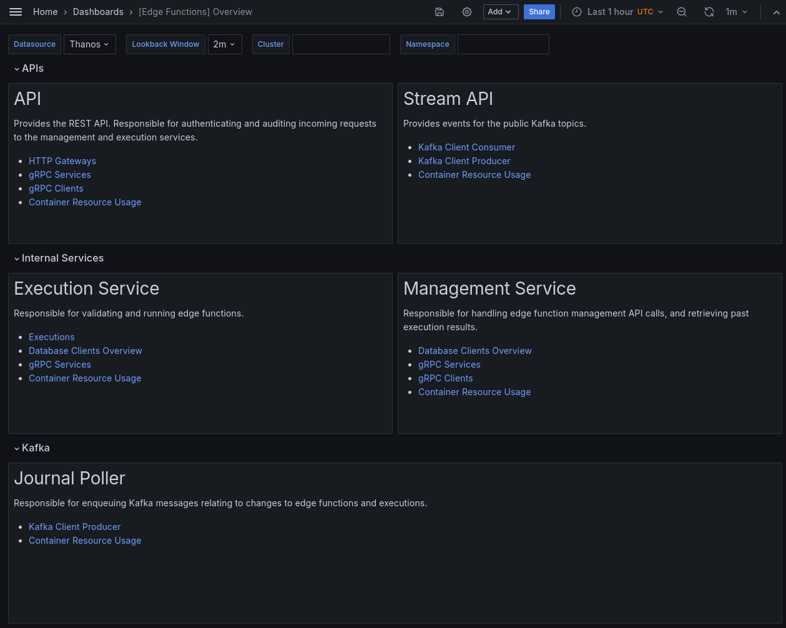
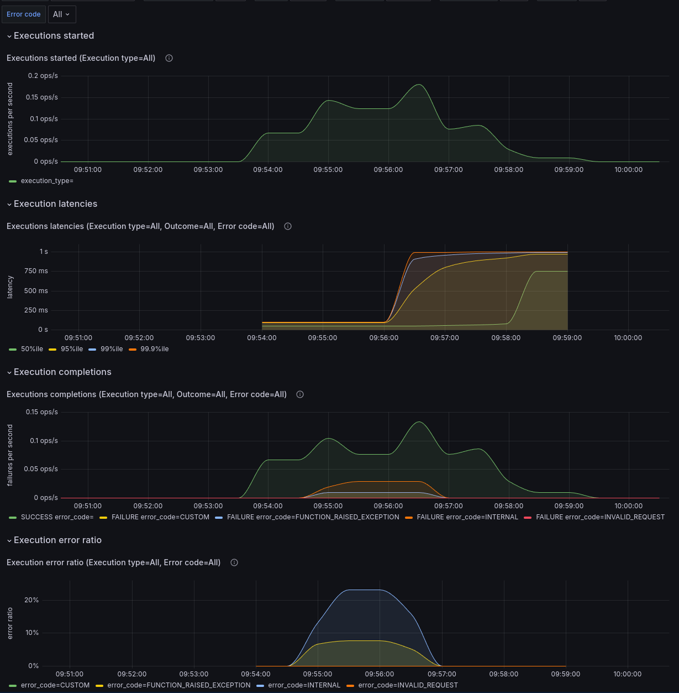

# Monitoring

Here, you can learn about the observability offerings that Thought Machine provides to support Edge Functions.

## Monitoring

Observability is an aggregation of tools, technologies, metrics, alerts, and dashboards that are designed to provide further insight into the inner workings of an application. Metrics are quantifiable measurements that reflect the health and performance of applications or infrastructure.

Thought Machine offers banks visibility of Edge Functions and executions through the following options:

-   Execution observability through an idempotency key, the Execution API resource (such as the execution ID of the Edge Function call), logging via the Observability Stack, and event streaming
    
-   Monitoring of API endpoints for health and availability using tooling of your choice
    
-   [Using the Observability Stack](/vault-core/latest/EN/environment_and_installation/infrastructure_docs/observability_and_monitoring/using_the_observability_stack) - Thought Machine provides an observability stack as an essential component that includes the following functionality:
    
    -   Collects and stores metrics
        
    -   Populates Grafana dashboards, which allow you to monitor the performance and health of its services.
        
    -   Thought Machine provides dashboards \`out-of-the-box', which it recommends for use with Grafana
        
    -   Option for banks to configure alerts for predefined issues that might affect Thought Machine components
        
    -   Tracing requests from Edge Functions to Vault Core include spans, which Thought Machine automatically creates, which you can use to trace execution and HTTP requests
        
    

chat\_bubble

The functionality to optionally configure Vault Core to send traces to an endpoint in the OpenTelemetry format is not currently available for Edge Functions.

### Execution observability and tracing

Edge Functions provide execution observability through API calls. The Execution resource contains the `idempotency_key`, which you can use as the base key if you want to form a `request_id` to call Vault Core.

This resource provides a guaranteed record if an execution runs. It allows you to observe executions and the requests triggered from inside the execution, providing traceability of actions.

You can use the `idempotency_key` to link an execution run and a call to Vault Core in various observability tools. For example, to check logs and resources, including:

-   Application logs
    
-   Audit logs
    
-   Action logs
    
-   API resources
    

#### Tracing support

The calls that you make to Vault Core via Edge Functions have an associated span. You can optionally enable tracing in your observability values so that the platform can send traces to an OpenTelemetry endpoint residing within the cluster. The endpoint that you configure does not have to be an OpenTelemetry Collector, but any service that can accept traces in the OpenTelemetry format.

You can view associated traces, examining the attributes attached to the Edge Function execution span, identifying the Edge Function ID and version tag.

Spans:

-   `ExecuteEdgeFunction` - existing gRPC server span
    
-   `Engine.Execute` - when handling a request to execute an Edge Function
    
-   `Engine.Parse` - when processing a newly-created Edge Function Version but not executing the entry point
    

For more information, see [Using Tracing](/vault-core/latest/EN/environment_and_installation/infrastructure_docs/observability_and_monitoring/using_the_observability_stack#using_tracing) in the Observability Stack guide.

### Built-in logging

Structured application logs are another method of checking observability events and are accessible via a logging platform, such as the Elastic Stack ELK (Elasticsearch/Logstash/Kibana).

You must provision a logging platform for the collection and storage of application logs. These logs help Thought Machine during any incidents that may occur.

There are two types of logs:

1.  Logs that the platform generates - these are like logs for any other service, and you can use Kibana to access them. The logs are useful for monitoring service health and to debug specific Edge Function executions.
    
2.  Logs that a developer who writes Edge Functions may choose to introduce in their Edge Function code. These logs help the developer-writer debug the Edge Functions code in a real-world Vault Bridge environment. These ship with the platform logs and are also visible in Kibana.
    

You can use the following filter to distinguish these logs:

-   in `logging.Fields` under the key `"metric"` - these are the log labels that correspond to a metric event, and relate to the execution and parsing of Edge Functions. For more information, see: [Metric common labels](/additional-product-offerings/latest/EN/vault-bridge/concepts/edge_functions/overview_and_getting_started/observability#metric_common_labels)
    
-   inside `"execution"` with the key and value `"layer": "platform"` - this additional logging field helps you to distinguish between logging from your custom Edge Function code and from the Edge Functions service itself
    

When a log entry is created in the same code path as a metric event that is being recorded, the log entry includes the same label keys and values as the metric. This helps you to compare aggregate values and logged events (as examples of the aggregate). However, it is not a requirement that all metric events have a corresponding log event.

chat\_bubble

Logging, such as with the following examples, is typically rare. It is most likely to happen in response to a database error or an internal error (bug) in the Edge Function execution

#### Example log:

The following snippet is an example of what a log from an execution could look like from the Pod Logs.

chat\_bubble

Not all of the fields in this example might be present in every log. This is the case if, for example, the value is unknown at the time of logging or not applicable. The `"python_exception"` field should only be present on an internal error, or in some cases if debug-level logging is turned on.

### Metrics

Some metric events have a corresponding event entry, such as a log entry event or trace span event (see Execution observability and tracing). However, an event entry is not required for every metric event. The entry includes, but is not limited to, the same label keys and values as the metric.

For logging, the labels that correspond to the metric event are recorded under the key `"metric"`. This helps you to recognise when a log entry corresponds with a metric event, and which labels might relate, to help quantify aggregated events over time.

#### Metric common labels

The following labels can appear in the logs:

`metric: map[string]any`

-   `execution_type: string` - what type of trigger for Python execution.
    
    -   `REQUEST_EXECUTION` (client requested execution)
        
    -   `PARSE` (new Edge Function version validation)
        
    
-   `outcome: string` - overall success vs failure
    
    -   `SUCCESS` - the execution succeeded
        
    -   `FAILURE` - the execution failed, see `error_code` for a more specific cause
        
    
-   `error_code: string` - specific cause of failure; empty string if succeeded
    
    -   Any of the built-in `ErrorCode` values - see the **Error codes** reference and [How to troubleshoot Edge Functions](/additional-product-offerings/latest/EN/vault-bridge/concepts/edge_functions/edge_functions_tutorials/troubleshooting)
        
    -   For custom error codes defined by the Edge Function itself:
        
        -   In metrics only: `CUSTOM`. These errors are folded into the single case `CUSTOM` to prevent unbounded Prometheus label cardinality
            
        -   logs/tracing only: the original error code
            
        
    

`execution: map[string] string`

-   `id: string` - ID of the Edge Function execution
    
-   `idempotency_key: string` - idempotency key
    
-   `function_id: string` - ID of the Edge Function that is being executed
    
-   `function_version_tag: string` - version tag of the Edge Function that is being executed
    

### Event streaming

The Edge Functions platform produces Kafka events for its associated API resources, which are backed by a journal poller to achieve at-least-one delivery.

You can capture and analyse resource events that are produced and streamed when certain resources are created and mutated such as:

-   Edge Function Trigger Operation resources
    

### Observing Edge Functions metrics in Grafana dashboards

Grafana is visualisation/analytics software that allows users to create dashboards using Prometheus metrics in real-time. It allows you to query, visualise, explore, and alert on your metrics regardless of where they are stored, and turn your time-series database (TSDB) data into graphs and visualisations.

Using a supported version of Grafana Enterprise, you can view the visualisations that are driven by these time-series metrics in the Edge Functions Execution dashboard. This can aid you in debugging the health of the system and root-cause analysis.

You need to obtain [Grafana Enterprise](https://grafana.com/products/enterprise/) yourself and check whether you need to configure any settings, depending on your use case. The [Using the Observability Stack](/vault-core/latest/EN/environment_and_installation/infrastructure_docs/observability_and_monitoring/using_the_observability_stack/) guide outlines the different use cases - those clients that choose to manage their Grafana instance must import the dashboards into it themselves.

chat\_bubble

If you choose to manage your instance of Grafana Enterprise yourself, you must import the Edge Functions dashboards into it. The dashboards are located in the following folders:

For information about Grafana, including installing and using it, see the [Grafana website](https://grafana.com/products/enterprise/). For information about [using Grafana dashboards](/vault-core/latest/EN/environment_and_installation/infrastructure_docs/observability_and_monitoring/using_the_observability_stack#using_grafana_dashboards), see the Observability Stack user guide.

#### Edge Functions Overview dashboard

The Edge Functions Overview dashboard provides a starting point for you to monitor Edge Functions. It brings together links to existing Grafana dashboards that relate to Vault Core, with the views tuned to monitoring Edge Functions. It also provides a link to the dedicated Edge Functions Execution dashboard, which you can learn more about in this guide.

#### Execution dashboard

The Execution dashboard allows you to view visualisations about the status of Edge Functions executions, based on metrics that concern the `ExecutionContext`.

The dashboard is divided into individual rows that contain panels that display this information, as a sum of the concurrent executions. You can view all executions and have the option to filter the information by execution type, with further filters for some metrics for outcome (state) and error code.

-   **Executions started** - the sum of the rates of executions started, with the option to filter by type
    
-   **Execution latencies** - percentiles of the overall execution latencies, with the option to filter by type, outcome, and error code
    
-   **Executions completed** - the sum of the rates of executions completed, with the option to filter by type, outcome, and error code
    
-   **Execution error ratio** - the ratio of errored executions, with the option to filter by type and error code
    

##### Execution dashboard with all filters set to 'All' to show all executions:

