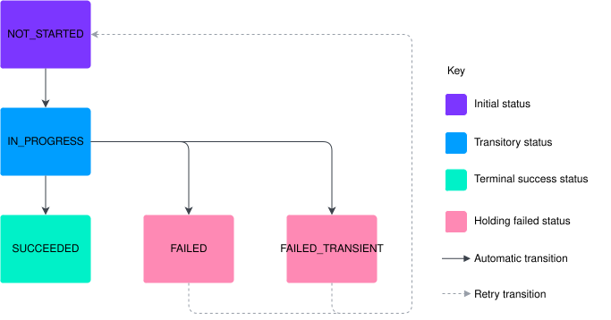

# Triggers overview

## Example Use Cases

-   Automatically setting a flag on an account that has exceeded its overdraft limit.
    
-   Automatically closing an account when its balances have reached zero. This is [used as an example in the tutorial](/additional-product-offerings/latest/EN/vault-bridge/concepts/edge_functions/edge_functions_tutorials/how_to_create_a_trigger#example_auto_close).
    

## Triggers

You can configure Edge Functions to execute upon an event in Vault Core. To do so, create an Edge Functions Trigger that will route Vault Core events from a public streaming API Kafka topic to an Edge Function as execution requests.

An Edge Functions Trigger is primarily defined as a combination of both:

-   the identity of the Edge Function that should process the events; and
    
-   the name of the source Kafka topic to process events from.
    
    chat\_bubble
    
    Triggers can currently only process events from [Contract notification events](/vault-core/latest/EN/api/core_api#contract_notification_events).
    

### Trigger Status

A Trigger’s status controls the creation of new [Trigger Operations](/additional-product-offerings/latest/EN/vault-bridge/concepts/edge_functions/overview_and_getting_started/triggers_overview#trigger_operations).

-   Status `ACTIVE` will listen for new source events, creating new Trigger Operations for execution.
    
-   Status `INACTIVE` does not listen for new source events, preventing further Trigger Operations being created until it is set `ACTIVE` again, but does not prevent existing Trigger Operations from being executed.
    

Note that there is a delay between a Trigger being created or updated with a status, and the beginning of operations being created for events, meaning that some events can be missed. This is expanded upon in the [Triggers management reference](/additional-product-offerings/latest/EN/vault-bridge/concepts/edge_functions/managing_triggers#lag).

## Trigger Operations

When an event is received by an [Edge Functions Trigger](/additional-product-offerings/latest/EN/vault-bridge/concepts/edge_functions/overview_and_getting_started/triggers_overview#triggers) from its source Kafka topic, it creates a Trigger Operation resource. A Trigger Operation’s purpose is to track the processing of the event that it relates to.

A Trigger Operation allows you to check how the processing of an event has progressed, and to retry the processing if it has failed.

### Trigger Operation Lifecycle

Each Trigger Operation has a lifecycle starting from when it was created for an event by a Trigger, its processing by an Edge Function, and any subsequent retries that are required.

Figure 1. Trigger Operation lifecycle

-   The Trigger Operation is initially created in a `NOT_STARTED` state when initially created.
    
-   The Trigger Operation status automatically progresses to `IN_PROGRESS` when the designated Edge Function is about to perform an execution on behalf of the operation.
    
-   Depending upon the outcome of the execution, the Trigger Operation status then automatically progresses to either `SUCCEEDED`, `FAILED`, or `FAILED_TRANSIENT`.
    
-   A Trigger Operation with status `FAILED` or `FAILED_TRANSIENT` can be scheduled for a retried execution by calling the [`BulkRetryEdgeFunctionTriggerOperations` endpoint](/additional-product-offerings/latest/EN/vault-bridge/api/bridge_api#_bridge_v1_edge_functions_BulkRetryEdgeFunctionTriggerOperationsResponse_BulkRetryEdgeFunctionTriggerOperations). See [How to manually bulk retry Edge Functions Trigger Operations](/additional-product-offerings/latest/EN/vault-bridge/concepts/edge_functions/edge_functions_tutorials/how_to_manually_retry_triggered_operations) for more information about retrying failed operations.
    

Under normal circumstances any transition to `SUCCEEDED`, `FAILED`, or `FAILED_TRANSIENT` will result in the creation of an Edge Function Execution resource. The Edge Function Execution resource is related to the ID of the Trigger Operation that it acted on behalf of via its `edge_function_trigger_operation_id` field. A system failure when attempting an execution will be recorded on the Trigger Operation’s `processing_error` field.

chat\_bubble

`FAILED_TRANSIENT` results from an exception raised from an Edge Function that indicates a temporary failure. See [Implementing custom errors](/additional-product-offerings/latest/EN/vault-bridge/concepts/edge_functions/edge_functions_tutorials/how_to_write_an_edge_function#implementing_custom_errors).

Each Edge Function Execution resource that relates to a Trigger Operation provides historical context of previous failed attempts, and information to diagnose the failures.

### Trigger Operation Pinning

When a Trigger Operation is created, it is "pinned" to use the configuration of its Trigger at the time of the Trigger Operation’s creation. This ensures that the Trigger’s specified Edge Function Version in effect remains in effect across retries to help ensure consistent idempotent behaviour as it was defined in that Edge Function Version.

### Trigger Performance Considerations

To ensure optimal pipeline performance, Thought Machine recommends minimising the number of `ACTIVE` Edge Functions Triggers. The total processing cost increases with the volume of events and the number of `ACTIVE` Triggers.

`ACTIVE` Triggers increase CPU usage, even if no events are on their Kafka topic. A Trigger Operation is created per `ACTIVE` Trigger and event on its topic. Each Trigger Operation consumes storage resources, and CPU time while it is being processed, including the resources required to execute an Edge Function on its behalf.

Therefore, Thought Machine recommends adding them incrementally and monitoring the performance impact. If you observe a negative impact, please disable `ACTIVE` Triggers when they are not in use.

Thought Machine is working to bring performance improvements in later versions.