# Coexistence Design

## Purpose

A core modernisation programme is typically a large, multiple year undertaking that will deliver across many transition states. During this time the new core will need to co-exist with the legacy core. This likely means accounts are spread across both cores depending upon the phasing approach adopted.

The Coexistence Design activity identifies the components and design patterns required to manage this state, including how channel applications will be routed to the correct core based on where the account resides, how payments should be similarly routed, how to aggregate downstream reporting etc. It will feed into the transition state architecture.

## Predecessor Activities

1.  Business: [As-Is Process Discovery](/delivery-framework/latest/EN/delivery_workstream/architecture/as_is_architecture_discovery)
    
2.  Business: [As-Is Product Discovery](/delivery-framework/latest/EN/delivery_workstream/business/as_is_product_discovery)
    

## Guidance

### Coexistence Approaches

In all modernisation scenarios, the client could decide to take any of the following coexistence paths to achieve its business objectives.

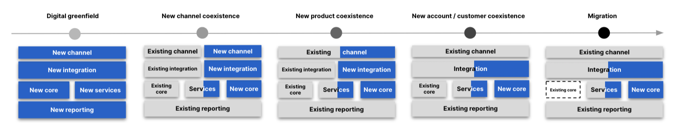

     
| Coexistence Option | Digital Greenfield | New channel coexistence | New product coexistence | New account / customer coexistence | Migration |
| --- | --- | --- | --- | --- | --- |
| 
Summary

 | 

\- A new banking entity on an entirely new greenfield stack with new finance and regulatory reporting elements with no integration to the existing stack.

 | 

\- A new channel (mobile app and/or website) is a good choice when you want to make a conscious brand decision;for instance by launching a new app for a particular customer segment. - From a customer perspective, this can essentially look like you are engaging with a new bank. - From the client’s perspective they are different in that the coexistence will reuse far more of the existing stack, especially the finance and regulatory reporting layers.

 | 

\- A new product launch on the new stack while existing products continue to run on the existing stack. A common example today is BNPL, which can run on the Vault Core stack while other lending products run on the existing core.- This is a good option to prove out the end to end banking stack but on its own is not a good precursor to migration.

 | 

\- All new products are run on the new stack - per the previous option. - Any new accounts for existing products are also run on the new stack. - This approach leads to traffic organically moving across to the new stack over time depending upon the churn rate of the product. - This is a good precursor to migration.

 | 

\- This the ultimate end goal of any true coexistence approach, and involves migrating all accounts from the current stack to the new. It is described in the [Migration](/delivery-framework/latest/EN/delivery_workstream/migration) workstream section.

 |
| 

When to Use

 | 

\- When experimenting with technical feasibility and potential benefits of an entirely new IT stack.- When wanting to avoid \`\`polluting'' new / future customers with legacy tech.- To exploit market opportunities.

 | 

\- When looking to refresh middle and front office tech stack while still re-using key support services and corporate core systems. - When looking to quickly launch a new digital banking brand with a simplified product set and operating model.

 | 

\- When exploiting new market opportunities. - When seeking to prove out new core (with minimal legacy baggage) while still maximising use of existing assets.- Generally the first step in a series of transition states.

 | 

\- As a pre-cursor to migration, in order to de-risk.- To prove the target product build and op model can support the legacy product requirements.

 | 

\- When the legacy stack is to be replaced.

 |
| 

Potential Pitfalls

 | 

\- Can become a strategic cul-de-sac as \`first principles' may struggle to accommodate the legacy banking products and operating model. - Determination to use only new tech can result in missed opportunities to explicit existing investments. - Launching new clients / brands with only technology drivers can result in white elephants.

 | 

\- As with previous option, it can become a strategic cul-de-sac and needs a brand proposition to go to market with.- Easy to underestimate the complexity of edge cases and a hybrid operating model can create challenges.

 | 

\- A brand new product will require a brand new operating model.- Still needs a business driven \`\`reason to exist.''- Re-use of existing assets will require substantial integration.

 | 

\- The need to make target mirror source makes it hard to deliver business benefits. - Where propositional innovation is delivered at the same time this can make it harder to act as a migration target.- Cross product propositions can complicate the overall picture.- Account look up and routing required at all interaction points.

 | 

A major and risky undertaking - see [Migration](/delivery-framework/latest/EN/delivery_workstream/migration) workstream section for more information.

 |

### Coexistence Design Patterns And Use Cases

chat\_bubble

These coexistence design patterns are not mutually exclusive. For a given client scenario some may be used to support an earlier transitional architecture state while others may be utilised in a later state.

#### Design Pattern: Mediator

The mediator pattern focuses on providing or inserting a layer between objects. In our context, the mediator ensures there is no tight coupling or integration between the two cores with an upstream router determining who (the application) should service the request. In this pattern, routing of requests is determined by a dedicated lightweight routing service or services. Payments are routed via the Payment Engine. The two cores are decoupled to allow for an easier transition out. There is no direct communication between the legacy core and Vault Core.

##### Use Cases

1.  Multiple cores each supporting unique product offerings.
    
2.  When completing a phased migration of products from a single legacy instance to a single Vault Core instance over an extended period of time (months rather than weeks).
    
3.  When expecting to add more product cores in future; for example as a result of inorganic growth / M&A.
    
4.  When adopting broader microservice architecture aims, with light integrations built into the design.
    

 
| Pros | Cons |
| --- | --- |
| 
Tried and tested - large clients have been operating this way for a long period of time.

 | 

For single core clients, it may introduce more temporary architectural complexity.

 |
| 

Simplicity - each core independently handling end-to-end product behaviour - there are no core interdependencies. Also, it can minimise tranche specific coexistence complexity, with each migration tranche re-using existing capabilities to suppress legacy and route new requests to Vault Core.

 | 

The extraction of Customer as a separate System of Record and its place in the migration journey may add complexity to the architecture (for example, for handling customer level restrictions).

 |
| 

Technical migration is invisible to customer.

 | 

Performance impact of additional routing service that will increase round trip time.

 |

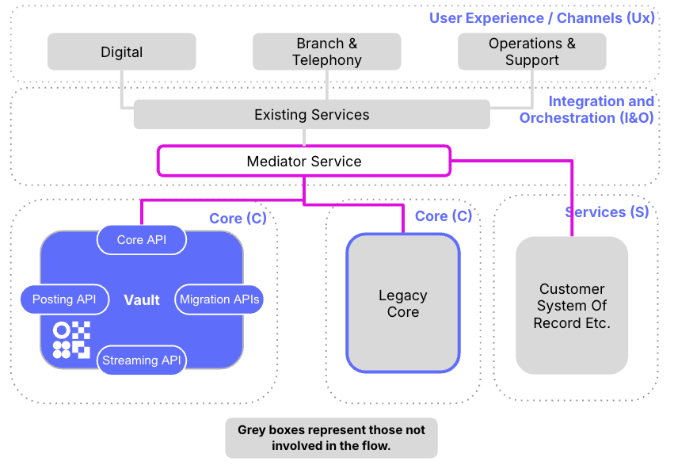

#### Design Pattern: Consolidated Reporting

During an extended period of coexistence, a client will need to \`glue together' data feeds from legacy and Vault Core to arrive at overall total client positions - for example for month end financial reporting. The implementation of this, via an Offline Data Hub, can \`protect' downstream systems and the programme more generally, from the addition or removal of cores / systems.

##### Use Cases

1.  Funnel data streams from Systems of Record into a single view of reporting for business and technical users.
    
2.  Load and transform data into a common format for downstream users.
    
3.  Automate joining of data to drive reporting and visualisation of an end-to-end sub-ledger / ledger view.
    
4.  May be particularly useful during a phased parallel run when needing to compare and \`glue' core to core outputs / behaviour as well as wider BAU reporting.
    

 
| Pros | Cons |
| --- | --- |
| 
Tried and tested - large clients have been operating, at least to a certain extent, this way for a long period of time.

 | 

Potential need to transform the enterprise data architecture to support the transition period of coexistence and the wider transformation

 |
| 

Simplicity - compared to other coexistence patterns this represents a simpler challenge to overcome.

 | 

Consolidating reporting during an extended period of coexistence demands automation is built into the process to enable the two core positions to be \`glued' together.

 |
| 

Future Proof - developing a consolidating reporting in many cases will represent a future state that the client more broadly wants to aim for (for example consolidating customer and product data).

 | 

Consolidated reporting may require a full breadth of capabilities; from consuming message bus (for example Kafka) events through to system or outputs files. This may mean staggering your data ingestion into consolidated reporting to ensure data is curated into the state needed.

 |

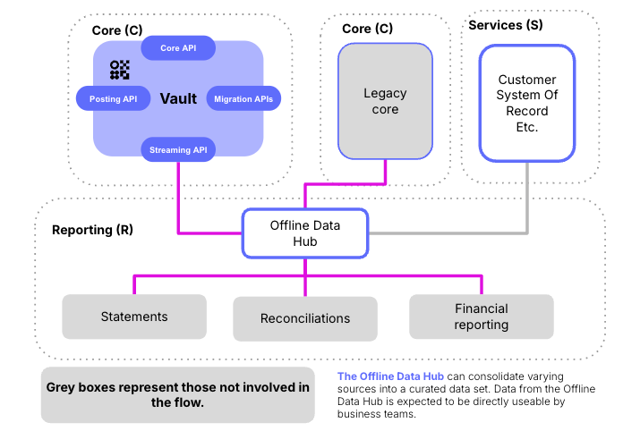

#### Design Pattern: Mirror Vault Core Through Legacy Core

Vault Core product behaviour is set-up and defined with all changes (creation and update) streamed via Vault’s Core Streaming API to the legacy core. Vault Core operates as the system of record for the products it is servicing, with the legacy core representing a source of truth for downstream reporting.

##### Use Cases

1.  Quicker adoption of Vault Core into the IT estate to enable innovative product launch.
    
2.  Tight coupling of legacy core to downstream makes a full migration an extended complex piece of work that will not quickly yield benefit.
    
3.  Continue to leverage legacy core for an extended period of time as part of a longer transition to cloud core. For example, where customer data remains on legacy until the end of the migration.
    
4.  Likely deployed where programme budgets do not allow \`fuller' implementation of coexistence and the associated patterns (e.g. consolidation of reporting).
    

 
| Pros | Cons |
| --- | --- |
| 
Simplicity - conceptually this represents a more straightforward approach compared to other patterns. Most of this simplicity is delivered via the lighter integration work required due to downstream not needing to be materially changed.

 | 

Legacy core enhancement - changes to legacy core to support full mirroring of Vault core (for example insertion of accounts just before the EoD).

 |
| 

Speed - depending on the implementation approach, likely this can deliver business benefits more quickly.

 | 

Tactical investment - adopting this pattern represents a tactical step that involves a degree of throwaway work.

 |
| 

Proving - provides an extended period of proving of Vault Core ahead of starting the migration.

 | 

Run Cost- there is a \`doubling up' of accounts as the structure on Vault will completely or in part be replicated on the legacy core. This will increase overall client run costs and embeds legacy core into the operation.

 |

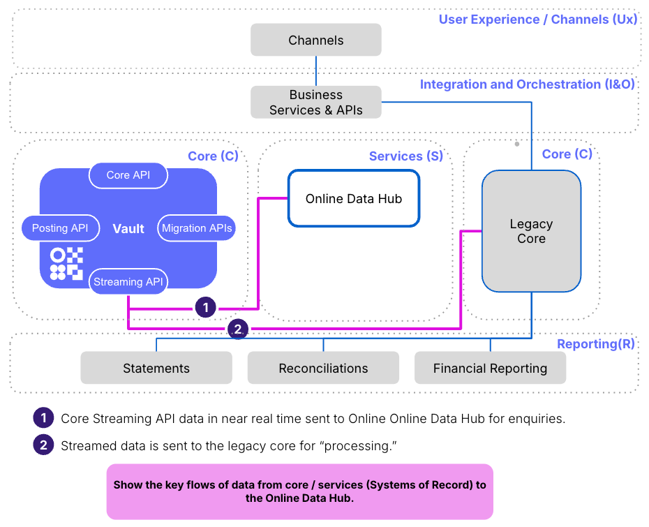

#### Design Pattern: Moving Funds Across Cores

A large-scale phased product led migration dictates that an automated solution will need to support cross core product behaviour. Historically clients have tried to avoid this coexistence pattern, instead opting for a manual workaround or interim process. Increasingly though, as core migration coexistence extends over longer periods of time, clients are needing to \`lean into' this coexistence pattern.

##### Use Cases

1.  Deployed where a product-led migration approach is being used, and customers have products split across cores for the period of coexistence.
    
2.  Where migration cutover is being phased, whether that via a parallel run or as part of a coupled load and cutover.
    
3.  Likely only deployed where the product coexistence runs over a number of months or years rather than days or weeks.
    

 
| Pros | Cons |
| --- | --- |
| 
Tried and tested - large clients have been operating, at least to a certain extent, this way for a long period of time.

 | 

Failure Scenarios - careful consideration and planning needed to handle failure scenarios to ensure rollback. If sending from one core to another and there is a failure then the whole e2e transaction needs to be removed, ensuring both cores are left in the correct state.

 |
| 

Product coexistence - enables a client to take a product led migration approach. For larger clients this is normally easier because they are moving from many product systems to one (Vault Core).

 | 

Workflow - sophisticated and performant orchestration is needed to support journeys across cores. This may be more difficult depending on the capabilities of the legacy core.

 |
| 

Coexistence Longevity - enabling automated transfer between cores means the period of coexistence can expand more easily in line with client needs. There is less pressure to complete the migration because of manual interim processes.

 |  |

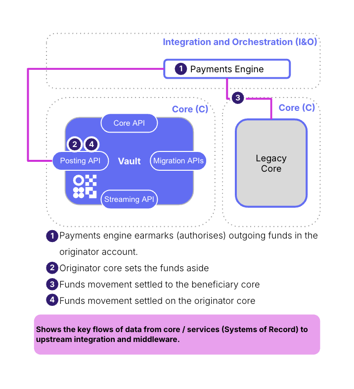

#### Design Pattern: End-To-End Product Process Execution Across Cores

Vault Core enables a wider spectrum of product behaviour than is often associated with legacy cores. This has given rise to Vault Core supporting discrete portions of product process behaviour with the legacy core supporting the basic features of the account. Vault’s real time streaming means that it is easier to perform discrete activities in isolation and then pass across key updates to the legacy core for further processing to complete the end-to-end process.

##### Use Cases

Most likely where Vault Core provides unique behaviour that cannot be provided on legacy. Clients desire to keep the legacy core as the System of Record for an extended period of time, perhaps due to extended licence terms.

 
| Pros | Cons |
| --- | --- |
| 
Speed - enables the business to most quickly deliver the innovative features they want to offer. Outside of coupling to legacy core, likely that the integration into the wider client estate would be light.

 | 

Core Coupling - longer term the tighter coupling of the two cores could make achieving the target state (for example single core) more difficult.

 |
| 

*N/A*

 | 

Product Complexity - thorough functional and non-functional testing likely to be needed. This is to ensure edge case scenarios of passing product data from ledger to ledger are accounted for. For example, if Vault Core as the sub-ledger needs to pass information to the legacy core just before the legacy EoD.

 |
| 

*N/A*

 | 

Orchestration - additional Saga pattern consideration / complication for unwinding or compensating transactions when there is a failure (for example network) part way through the execution of the process.

 |
| 

*N/A*

 | 

Run Cost - there is a \`doubling up' of accounts as the accounts will, at least to a certain extent, need to be replicated across legacy and Vault Core. This will increase overall client run costs.

 |

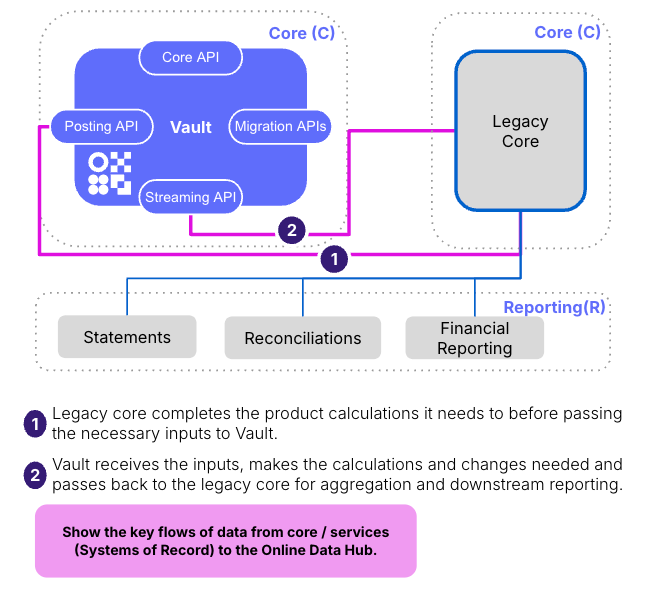

#### Design Pattern: Proxy For Legacy Channels

A \`\`reverse proxy'' pattern can be employed where legacy channels may struggle to integrate over modern protocols or where changes to these applications are prohibitively expensive. This would generally work in conjunction with the mediator pattern. Here an adapter layer sits above the domain APIs to convert the APIs to the legacy formats.

##### Use Cases

1.  Avoidance of changes to legacy channel applications.
    
2.  Transparent integration upstream.
    

 
| Pros | Cons |
| --- | --- |
| 
Avoids potentially difficult and expensive changes to legacy channels

 | 

Constrains the target product design and operating model to exactly replicate source

 |
| 

Avoids investment in potentially fated tech

 | 

Potentially large amount of investment in fated adapter layer instead

 |
| 

*N/A*

 | 

Potentially unfeasible depending on the nature of the existing integrations, protocols involved, security model etc.

 |

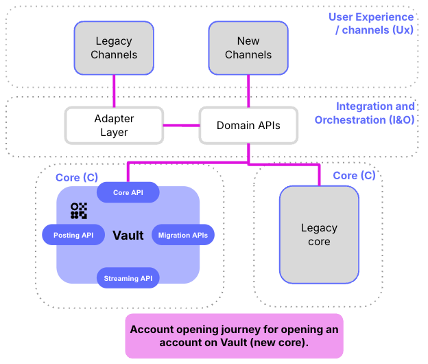

#### Design Pattern: Channel Routing

In this pattern the routing between applications is determined and executed in the channel application so the channel has to be aware of both cores

##### Use Cases

1.  Where multiple channels are served by a single multi-channel platform so that changes can be made in a single place.
    
2.  Where new products are being added with distinct journeys.
    

 
| Pros | Cons |
| --- | --- |
| 
Simple approach that avoids having to build complicated scaffolding to manage the coexistence state.

 | 

Where multiple applications are used for channel servicing across the different channels or potentially within channels, this pattern could become unfeasible to maintain.

 |
| 

*N/A*

 | 

Depending upon the internals of channel application architecture, this could entail making many changes to the different business processes that invoke the same domain operation

 |

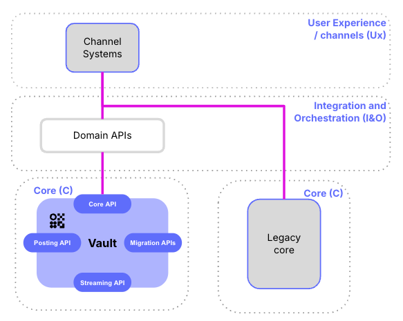

#### Design Pattern: Dual Operating model

In this pattern, the new E2E strategic stack co-exists with legacy with minimal cross integration. New strategic channel applications communicate with Vault Core only and it is not possible to service unmigrated accounts on new channels, and vice versa. Data is only combined within the reporting tier, for example within the general ledger.

##### Use Cases

1.  Where the front and mid office estate is undergoing an E2E transformation as part of a single integrated programme.
    
2.  Where the servicing requirements are minimal and the product range offered through the servicing channels is small, for example a single product lender as opposed to a client with a wide range of products.
    
3.  Where digital servicing is minimal or non-existent and operations are able to accommodate swivel chair servicing processes.
    

 
| Pros | Cons |
| --- | --- |
| 
A simple option to implement with minimal integration requirements between legacy and target stacks.

 | 

Poor user experience - colleagues need to manage two different systems for servicing processes.

 |
| 

Minimises throwaway investment in integrating new and old stacks.

 | 

Direct channels can be hard to manage with customer experience being severely compromised, for example presence of multiple apps in the app store and different servicing sites.

 |
| 

Keeps the new stack \`\`clean'' - any complexities of the legacy estate can be completely avoided.

 | 

Where multiple products are offered, customers may lose the ability to service different accounts through the same channel experience.

 |

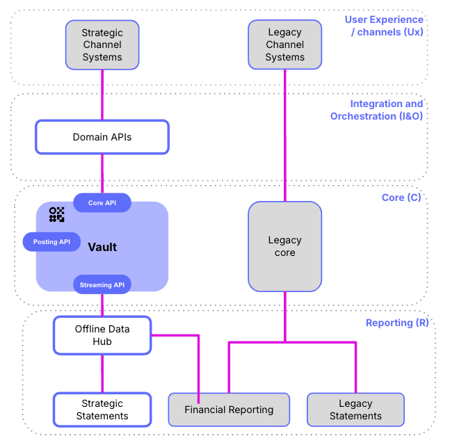

### How Can Bank System Components Help In Resolving Client Coexistence Scenarios?

To achieve a coexistence state, there are multiple components involved and no two clients look the same. To manage coexistence, clients need to firstly assess the capabilities available with the client today. Where these capabilities do not exist or require enhancements to adequately support coexistence, Thought Machine can support you to define your architectural transformation.

#### Components of Coexistence

*Business Process Orchestration* - Business Process Orchestration (BPO) is the link between customer channel applications and the deeper middleware layers and / or backend services. BPO is a stateless system overseeing the completion of end-to-end customer processes (for example onboarding a customer), by calling, ordering and timing the calls to different services in the process chain.

*Domain APIs* - Domain APIs expose a coherent set of business functions or capabilities to the upstream layer. They are typically stateless and are implemented in a synchronous (single thread request and response) model meaning the Domain API makes a request to the Online Data Hub, the Vault Core or legacy core and waits for a response.

*Payments Engine* - The Payments Engine is the payments orchestration platform. It has the ability to connect to multiple payment schemes (via the payments gateway) to process inbound payments on a customer’s behalf. The engine will manage the e2e payments journey, ensuring that checks with client internal systems (for example sanctions) are completed as part of the process.

*Online Data Hub* - Online Data Hub here means a \`front face' of Vault Core and legacy core data. It is a readily available source of truth for retrieving information to support a unified, cross core, customer experience (for example retrieving a total view of all cross core account balances) in a state of coexistence.

*Offline Data Hub* - In a coexistence context, represents a curated (organised) source of truth that is fed from a variety of upstream core systems of record. The focus is to transform and aggregate a domain’s (for example core banking) data, providing direct feeds to downstream. There may be multiple data hubs across a large client.

*Migration* - the Migration service here represents the Extract, Transform and Load (ETL) routine that would be followed for each phase of migration that will take place during the period of coexistence.

*Customer System Of Record (CSOR)* -the CSOR provides the master view of customer data (e.g. name, date of birth and portfolio of product holdings) across the group / estate. In larger clients this provides what is referred to as a Single Customer View (SCV) and can take various feeds from upstream/ downstream to arrive at this single or master view that is external to the core.

The picture below puts the aforementioned components of coexistence together in a banking landscape

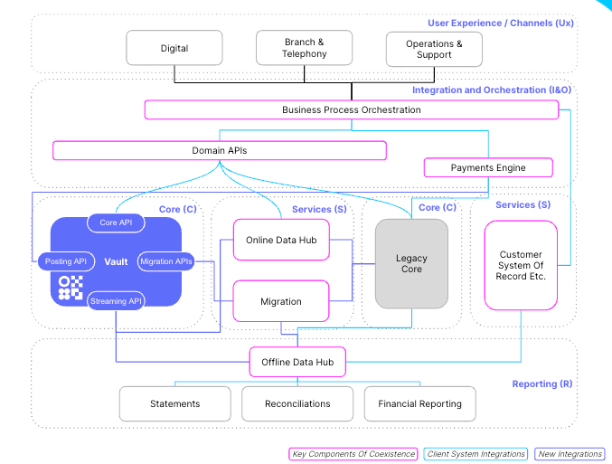

### What are some of the coexistence scenarios that clients face?

#### Problem Statement 1 - Customer Record Stored In Mainframe / Monolith

Some clients have a monolith or mainframe core banking setup in which the customer record is stored along with the banking ledger. This setup makes it easier to manage customer data and related account data.

These systems may have interconnected routines or programs which ensure that idempotency, transactions and roll-backs are managed efficiently for each scenario. The channels layer directly integrates with the monolith via messaging (MQ) or SOAP. Downstream data requirements are generally met using batch file extracts which are generally in the desired reporting format.

If clients decide to move the customer data away from the monolith, they will have to manage the orchestration of customer journeys from multiple channels across the Customer System of Record (CSoR) and the core banking platform. Transaction management across both the systems will have to be managed. Similar changes will be required if the core banking platform is moved to a different product or if a new core banking platform is added to the existing setup, which will require customer data orchestration.

##### Coexistence Core Components

1.  Business Process Orchestration (BPO)
    
2.  Domain APIs
    
3.  Integration & Orchestration Layer
    

##### Description

Business Process Orchestration (BPO) is the link between customer channel applications and the deeper middleware layers and / or backend services. For this scenario, enhancements will be required to the BPO service handling the cross core servicing journeys. For example, creation of accounts in Vault Core and linking them to the CSoRs, transfers between an account on legacy and Vault Core. If legacy cores are hosting products which are channel specific, BPO services will require an update to orchestrate calls from channels to the appropriate core for the right product request.

BPO will integrate with legacy core, Vault Core and other clients' components using Domain APIs and Integration & Orchestration layer (I&O). The I&O layer is sometimes also referred to as Enterprise Service Bus (ESB) in some clients and hosts domain APIs.

If present on the client estate, integration of Domain APIs with Vault Core will also be required in addition to enhancements to the BPO layer. These enhancements will ensure that the existing flows & integrations between BPO, Domain APIs and legacy cores also work with Vault Core. Vault Core provides sync core APIs which can be easily integrated with Domain APIs. For async streamed responses, Domain APIs may need some additional components to respond to sync requests.

Integration middleware forms the integration backbone in many clients, moving data between various systems. Some vendors offer ESB products supporting API integration capability along with pub/sub and streaming capability. In such scenarios, the I&O layer needs enhancements along with the BPO layer to integrate with Vault Core for various customer journeys. Existing integration with CSoR can be leveraged to link Vault with Customer accounts in legacy core.

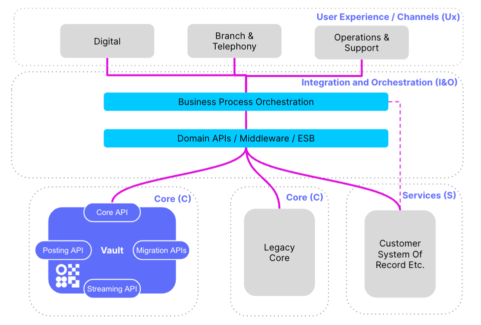

#### Problem Statement 2 - Routing Of Payments To Cores

Payment Engines handle all inbound and outbound payments to the core banking platform and integration with the payment network. One part of the orchestration it performs is account lookup to orchestrate the payments. In a monolithic system, where all the data is stored in one system, it is an easier task as there is only one core involved in the lookup and in the payment processing. When there are multiple cores involved, the Payment Engine performs the account lookup and routes the payments to the appropriate core. If the client scenario is moving funds from one core to another core, then the Payment Engine has to move funds and ensure transactional behaviour across both the cores. The Payment Engine also has to ensure the orchestration (account lookup, updating the appropriate account on the core, response / error handling) is done within the network response SLAs.

##### Coexistence Core Components - Payments Engine (PE)

###### Description

In most cases, the Payment Engine (PE) will have the ability to connect to multiple payment schemes (via the payments gateway) to process inbound payments on a customer’s behalf. The PE will manage the e2e payments journey, ensuring that checks with client internal systems (for example sanctions) are completed as part of the process.

The PE will need to be configurable to:

-   Accept a variety of incoming type of payments messages (e.g ISO20022)
    
-   Handle different journeys depending on the type of payment and communicate with a variety of core systems to support payment processing of a payment.
    

In a coexistence core context, to support the routing of payments to the appropriate core, an account look-up table will need to be integrated with or maintained within the Payments Engine. Larger clients have for many years operated with Payment Engine(s) that are integrated with multiple cores. The Payments Engine(s), potentially via multiple steps, needs to be able to communicate with new and legacy product cores. Adding Vault Core into this existing set-up is an established part of the transformation programme. In some client scenarios, the PE may integrate with Domain APIs.

Payments Engines perform orchestration ensuring transactions are completed across the cores and financial consistency of the customer accounts is maintained.

For the current use-case, let us assume Vault Core hosts Term Deposit and Loan Account product, and the legacy core still hosts the CASA product. On maturity of customer Term deposit, Vault Core sends notifications to the Payment Engine with all required details, which the Payment Engine orchestrates to the respective customer CASA account. Similarly, for any payments from legacy core customer CASA to the Loan account hosted on Vault Core, the Payment Engine orchestrates the debit in the CASA and corresponding credit in the respective Vault Core customer loan account.

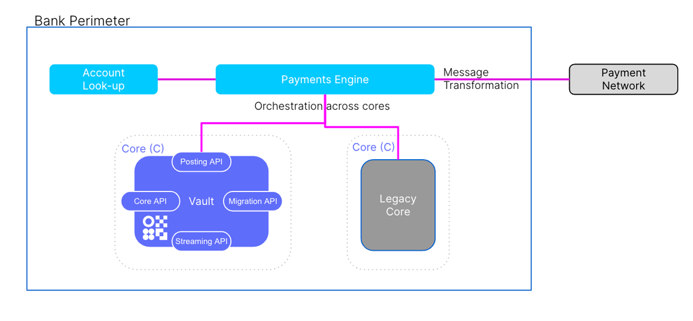

#### Problem Statement 3 - Combining Multi-Core Data For Channel Purposes

Most clients have an internet banking portal and Mobile Apps for their customers to view transactions. Along with these customer facing channels, they also have customer service agents which require a restricted view to the customer accounts to handle queries. The data (product, account, transactions, balances) displayed across all these channels must be in-sync and consistent. When the clients have a single core which stores all the customer and product data, the channels can get data from a single source. In case of multiple cores and separate customer data stores, getting this data becomes a complicated task, especially keeping data in sync across multiple channels.

##### Coexistence Core Components - Online Data Hub

###### Description

The Online Data hub will be fed with updated data from all cores and will serve as the single source of truth for all customer accounts in a coexistence scenario. It is optimised for read queries from the channel, returning data for the requested customer.

If no Online Data Hub is in place today this will be an early coexistence enabler. An Online Data Hub will minimise customer migration impacts by providing channels with an ability to service customers (to an extent) during the migration event. Additionally, and more broadly, if no Online Data Hub exists currently then legacy core data transformation will be needed into the enterprise / target format. If an Online Data Hub does exist then a decision point during the coexistence will be reached when the Online Data Hub data format changes and Vault Core no longer performs a transformation as part of move to the architectural target state.

In some client landscapes, the middleware layer integrates the BPO layer with the Online Data Hub. In such scenarios, the middleware layer exposes domain endpoints for integration between upstream & downstream integration.

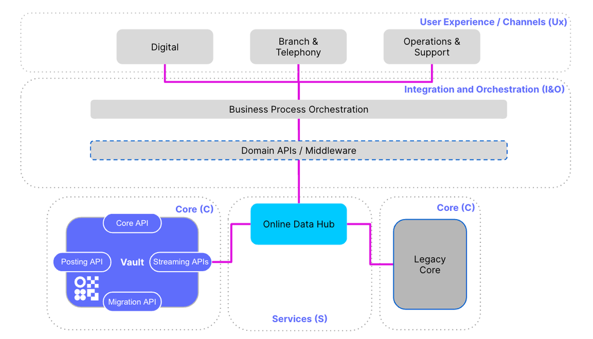

#### Problem Statement 4 - Common Reporting Across Cores

Most clients have reporting platforms using data from data warehouses (DWH). The DWH uses ETL processes to move data from core banking platforms. The DWH downstream systems are tightly coupled to the existing data schema of the legacy core banking system. With Vault Core coming to the landscape and a requirement of common reporting what would be the transition architectures?

##### Coexistence Core Component - Offline Data Hub or a staging data hub mapping Vault Core data to the existing data schema.

###### Description

In this coexistence context, the Offline Data Hub represents a curated (organised) source of truth that is fed from a variety of services and upstream core systems of record. The focus is to transform and aggregate a domain’s (for example core banking) data, providing direct feeds to downstream.

In the current case it would be mapping Vault streamed data to the existing legacy core data schema. There may be multiple data hubs across a large client. Direct querying and reconciliations of the domain’s data may be possible and is normally used to support batch processing for example - statements, internal and external reporting.

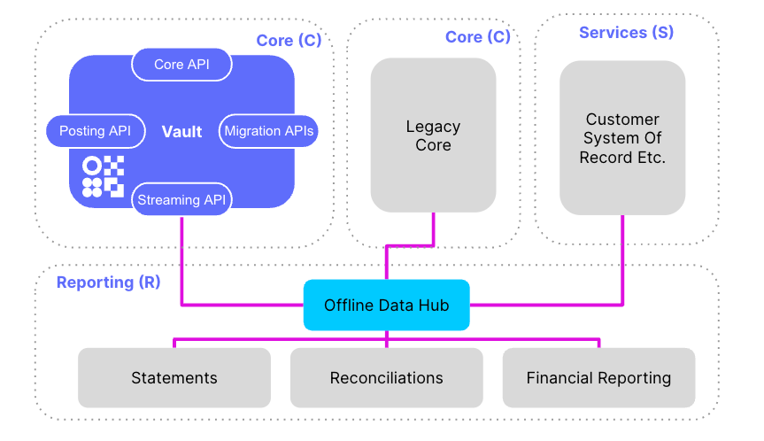

chat\_bubble

All coexistence scenarios or problem statements have varying complexities across multiple components which are impacted due to the addition of the new core. These complexities have to be appropriately managed in the transition states. Data migration considerations have to be made for each of the scenarios, thus ensuring the seamless continuity of services with right data.

### Coexistence Client Examples

This section provides examples of coexistence set-ups that clients have achieved as part of their journey to Vault Core. If you require further information about these please reach out to your Thought Machine point of contact.

#### Client Example 1

    
| Client Type | Tier | Region | Product | Coexistence Pattern(s) |
| --- | --- | --- | --- | --- |
| 
Retail

 | 

1

 | 

APAC

 | 

Wallet

 | 

Mediator, Consolidated Reporting & Moving Funds Across Cores

 |

##### Coexistence Context

-   2.3m wallet migration that represented the first time the client had moved a \`\`Category 1'' service on to the cloud.
    
-   To de-risk the programme the client opted to enter a parallel run, embrace coexistence and complete a gradual cutover.
    

##### Coexistence Description

1.  In-house built **business process orchestration(BPO)** layer was materially enhanced to support coexistence requests for Customer System of Record **(1A)**, Domain APIs **(1B)** and directly to the core API **(1C)** to complete the journey.
    
2.  **Payment Engine** did not interact directly with Vault Core or Vision+. Payment messaging was completed via the Domain APIs to Vault or Legacy Core.
    
3.  The bank had separate APIs (**Vision+ Domain API and Vault Domain API**) that sit on top of respective cores. The Vault Domain API handled asynchronous (postings, account creation and activation and account (pending) closure) journeys and transformed them into a common synchronous format that could be interpreted via the orchestration layer.
    
4.  The bank **migration** pipeline enabled automated customer migration from legacy to Vault Core. This was a \`\`one way'' pipeline to enable a parallel run with no data moving directly from Vault to Vision+ during the parallel run cutover.
    
5.  Leveraging wider strategic investments in the bank, 68 \`new' reports (e.g. dormancy) leveraging Vault Core data were created in the bank’s **data platform**. These reports were populated (visualised in Tableau) and compared with Vision+ (legacy) from the start of the parallel run. It was the responsibility of downstream teams (Finance etc.) to compare the reports during the period of parallel run and ensure outputs were consistent for their purposes.
    

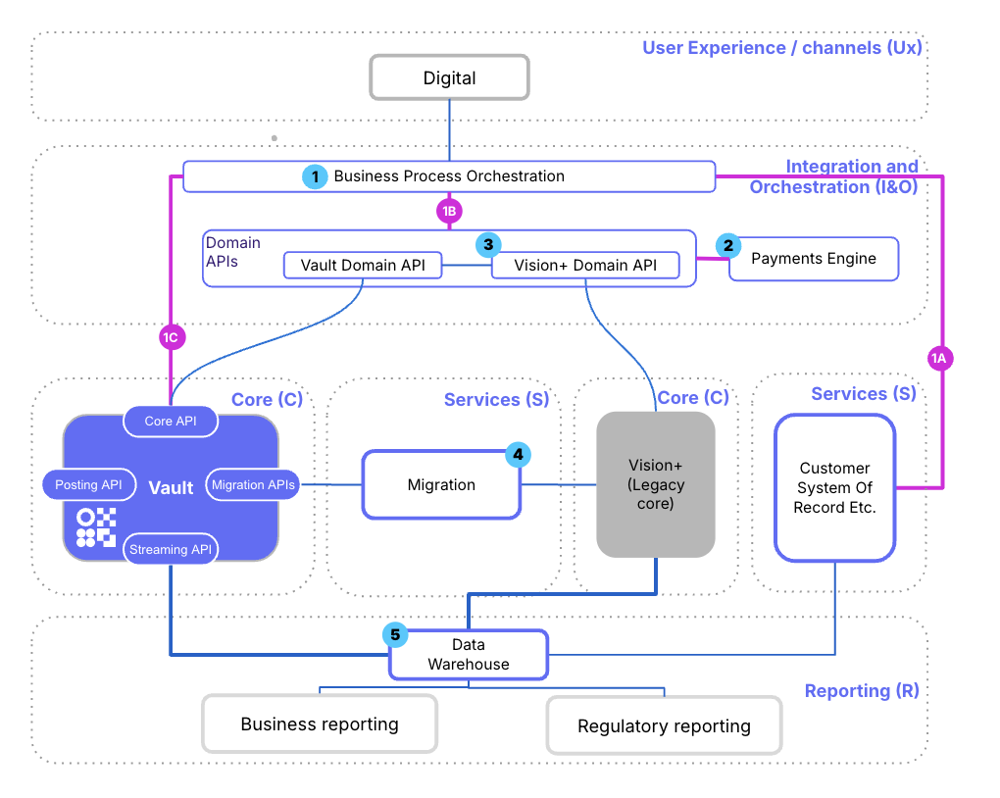

#### Client Example 2

    
| Client Type | Tier | Region | Product | Coexistence Pattern(s) |
| --- | --- | --- | --- | --- |
| 
Retail

 | 

1

 | 

EMEA

 | 

Fixed Term Savings

 | 

Channel Routing & Moving Funds Across Cores

 |

##### Coexistence Context

-   Tier 1 client with many years' experience of running multiple core platforms.
    
-   The first use case deployed on Vault Core was a front book fixed term savings product; sold through an existing, digital only brand. Vault became another product platform in an estate already supporting multiple product platforms.
    

##### Coexistence Description

1.  The client launched a new fixed term savings product running on **Vault** on an existing digital brand (i.e. no branch servicing was available)
    
2.  Account opening was through a strategic **digital origination journey** integrating with Vault.
    
3.  **Telephony servicing** took place through a tactical colleague portal to be replaced later when servicing could be integrated into the strategic servicing platform.
    
4.  The initial proposition had no digital servicing capability but this was later added within the existing **mobile app**, with the channel routing to the correct core based on the product in context.
    
5.  To avoid direct scheme integration as part of the initial launch, payments were processed through a collection account residing on the legacy core with the funds subsequently distributed to the correct account on Vault Core through a bespoke **integration component**.
    
6.  The two cores were reconciled overnight through feeds to an external **reconciliation component**.
    

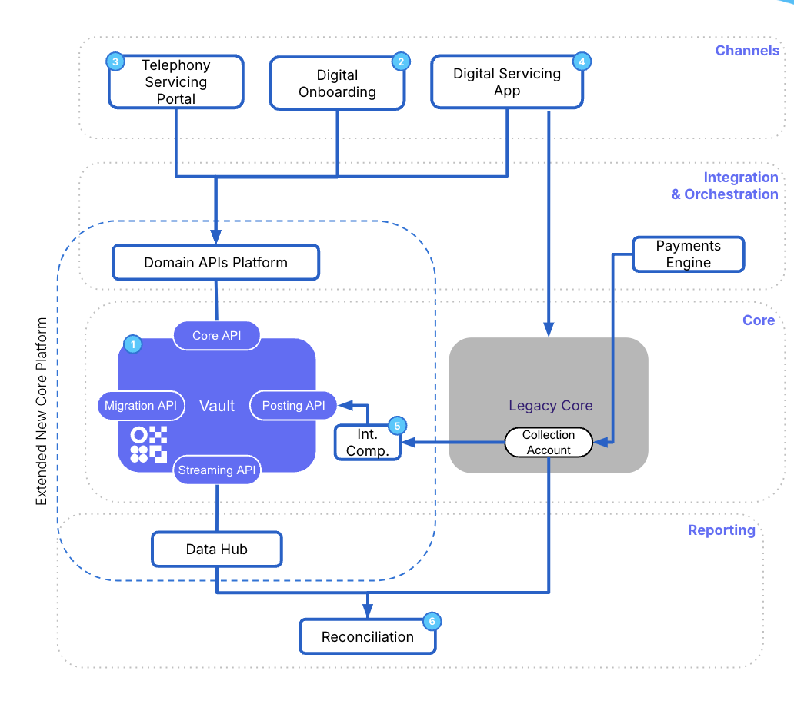

#### Client Example 3

    
| Client Type | Tier | Region | Product | Coexistence Pattern(s) |
| --- | --- | --- | --- | --- |
| 
Retail

 | 

1

 | 

EMEA

 | 

Mortgage

 | 

Dual Operating Model, Consolidated Reporting

 |

##### Coexistence Context

-   Tier 3 Mortgage specialist offering bespoke mortgages to customers. They also offer Development Finance to their customers.
    
-   They are primarily broker driven and provide a variety of payment options to their customers.
    

##### Coexistence Description

-   The lender had a simple book of short term mortgages with very little digital servicing capability and substantial broker driven origination.
    
-   They were happy to support a split operating model within operations.
    
-   Product by product, the front book was migrated first for direct channels, then the broker channel.
    
-   The back book product was then migrated.
    
-   Telephony teams operated a split operating model during this having to be aware of the stack the account was running on.
    
-   Account remortgaged onto the new stack.
    
-   Downstream integration went via a new strategic reporting layer being delivered by a separate programme.
    

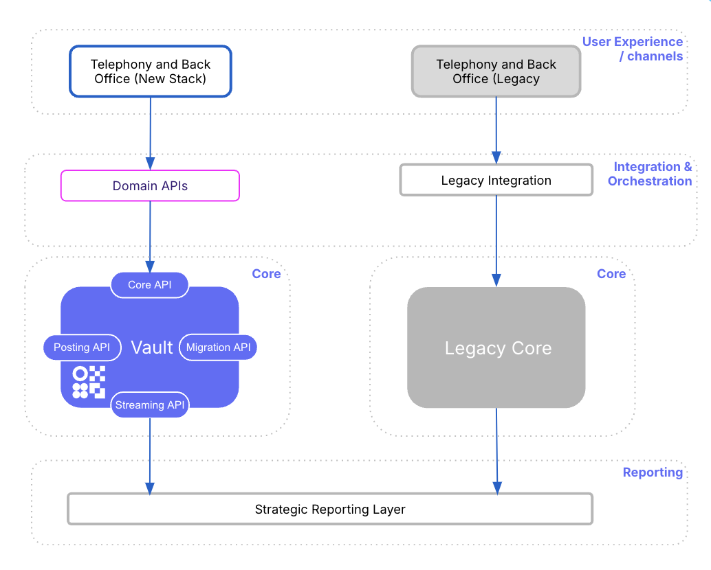

#### Client Example 4

    
| Client Type | Tier | Region | Product | Coexistence Pattern(s) |
| --- | --- | --- | --- | --- |
| 
Retail

 | 

1

 | 

EMEA

 | 

Current Account

 | 

Dual Operating Model, Consolidated Reporting

 |

##### Coexistence Context

-   Tier 1 retail client migrating from legacy core to modern digital channels.
    

##### Coexistence Description

-   The client launched a new digital sub-brand running on Vault Core.
    
-   Digital customers with simple banking needs were selected from the main client and migrated to the new client with different Ts&Cs.
    
-   The new banking proposition had no branch channel and no lending offering.
    
-   Existing capabilities of the client were used for key functionality such as customer and payments.
    
-   Force migration of customers received significant regulatory headwinds.
    

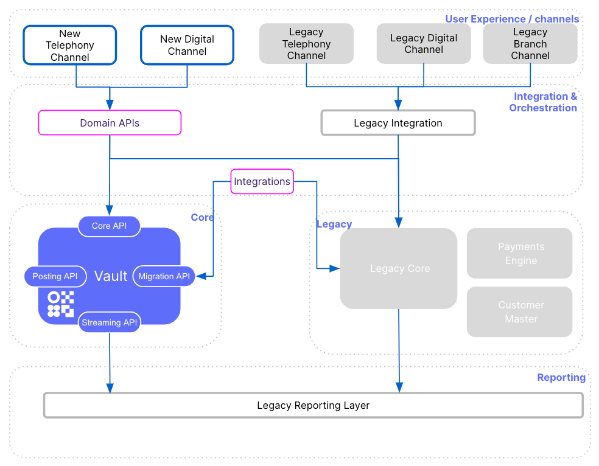

#### Client Example 5

    
| Client Type | Tier | Region | Product | Coexistence Pattern(s) |
| --- | --- | --- | --- | --- |
| 
Retail

 | 

1

 | 

EMEA

 | 

Term Deposit

 | 

Mediator & Consolidated Reporting

 |

##### Coexistence Context

-   Tier 1 retail client in the EMEA offering CASA, Deposits and Loan Products.
    
-   They want to modernise their legacy estate and start using Vault Core to create more flexible products catering to customer needs
    

##### Coexistence Description

This Tier 1 client offers deposits, CASA and loan products to its clients. It is running on legacy core. Due to constantly changing customer demographics, they were creating 00s' of product versions with minor variations on their existing core which became a maintenance nightmare. With Vault Core, they were able to create configurable products using smart contracts per product and managing product variations using parameters.

1.  The new product offerings will be using Vault Core as the core banking platform. Customers will use the new channel offering to select the features of the products they want to subscribe to.
    
2.  The Abstraction Channel Services will be modified to add the new channel and route the requests to appropriate core
    
3.  The Business Process Orchestration layer will provide orchestration between the Vault Core, Legacy Customer Master and Legacy Core.
    
4.  All the data streamed out from Vault Core will be stored in the Data Storage layer. This layer will receive a feed from the legacy customer master. In this storage, data transformation will be performed to map data to the existing data format for common reporting purposes.
    

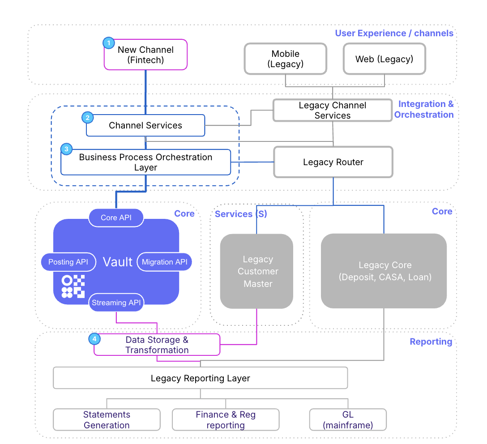

## Templates

Thought Machine does not have any templates to support the delivery of this activity.

* * *

### Disclaimer

See the Disclaimer relating to this and all other Vault Core Delivery Framework pages [here](/delivery-framework/latest/EN/getting_started/disclaimer/).

Thought Machine Confidential Information.

© 2025 Thought Machine Group Limited. All rights reserved.