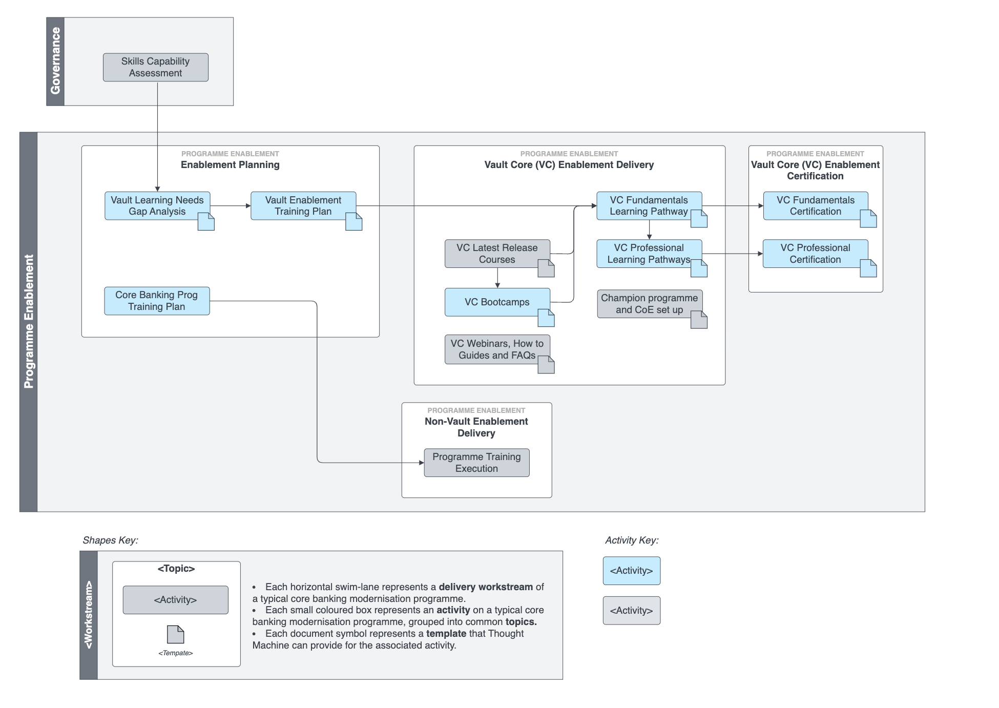

# Programme Enablement Workstream

## Overview

We accelerate deliveries and ensure Vault engagements are built optimally, by sharing best practices using all of Vault’s features. We educate and train the programme team and key stakeholders on the Vault Core platform, associated technologies and tooling, as well as implementation best practices.

Key activities include:

-   **Analysis** - Performing a Learning needs analysis for the programme team, and an assessment of the current capabilities. These feed into the training plan.
    
-   **Planning** - Preparing a programme training plan.
    
-   **Administration** - Enrolling and supporting the programme team as they complete their relevant Learning Pathway and training courses (Vault and non-Vault related).
    
-   **Instruction** - Delivering training bootcamps to the team.
    
-   **Exam preparation** - Preparing learners for certification exams.
    
-   **Consulting** - Guiding and supporting the design and set-up of the client’s Vault Core Centre of Excellence, including a programme to identify and train the client’s Vault Core Champions.
    
-   **Updates** - Providing on-going technical knowledge services, in the form of Vault Core release impact assessments, webinars, FAQs, guides and bite-size videos.
    

## Activity Map

 
| Activity | Description |
| --- | --- |
| 
[Vault Learning Needs Gap Analysis](/delivery-framework/latest/EN/delivery_workstream/enablement/vault_learning_gap_analysis)

 | 

This activity focuses on the existing capabilities of the programme team, and then derives the missing skills identified by the Governance workstream’s \`\`skills capability assessment''.

 |
| 

[Core Banking Programme Training Plan](/delivery-framework/latest/EN/delivery_workstream/enablement/core_banking_programme_training_plan)

 | 

This step synthesises the skills and training required for the programme team, established through the skills capability assessment, into a training plan.

 |
| 

[Vault Enablement Training Plan](/delivery-framework/latest/EN/delivery_workstream/enablement/vault_enablement_training_plan)

 | 

This activity closes the skill gaps identified in previous steps, by creating and delivering a Vault Core specific training and certification plan for the programme team. This role-based plan is built utilising Thought Machine courses, learning pathways and bootcamps, augmented by tailor-made courses for any gaps.

 |
| 

[Vault Core Fundamentals Learning Pathway & Certification](/delivery-framework/latest/EN/delivery_workstream/enablement/fundamentals_learning_pathway)

 | 

The Vault Core Fundamentals learning pathway is designed to allow teams to start using Vault Core quickly, and to become conversant in the concepts and features of the world’s best Cloud-Native Core Banking Platform.

 |
| 

[Vault Core Professional Learning Pathway & Certification](/delivery-framework/latest/EN/delivery_workstream/enablement/professional_learning_pathway)

 | 

The purpose of the professional-level courses is to provide more in-depth and advanced training on Thought Machine’s products and services, aimed at professionals who need a deeper understanding of the technical and functional aspects. These courses are designed to go beyond the fundamentals, offering more detailed content that is relevant to users who are already familiar with the basics of the platform.

 |
| 

[Vault Core Bootcamps](/delivery-framework/latest/EN/delivery_workstream/enablement/vault_core_bootcamps)

 | 

The aim of the Bootcamps is to provide a blended learning approach where the users are guided through the content that includes content review sessions and labs supported by our enablement engineers.

 |