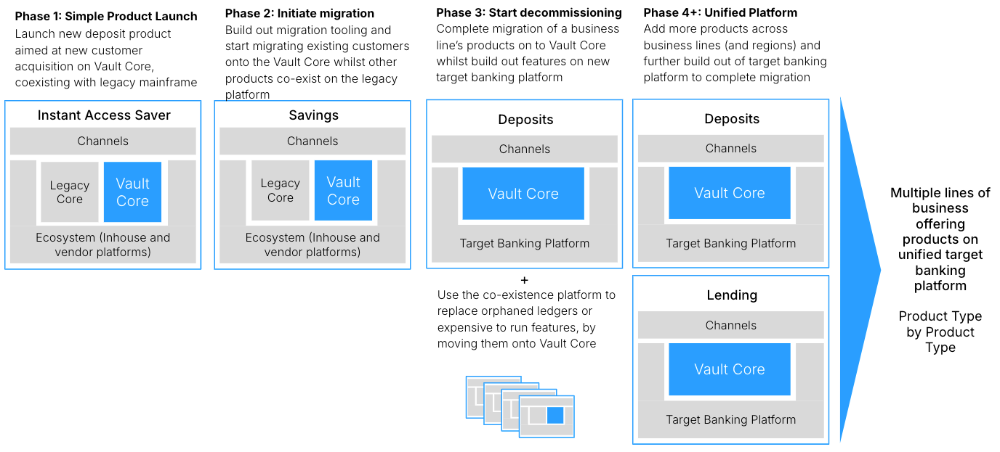
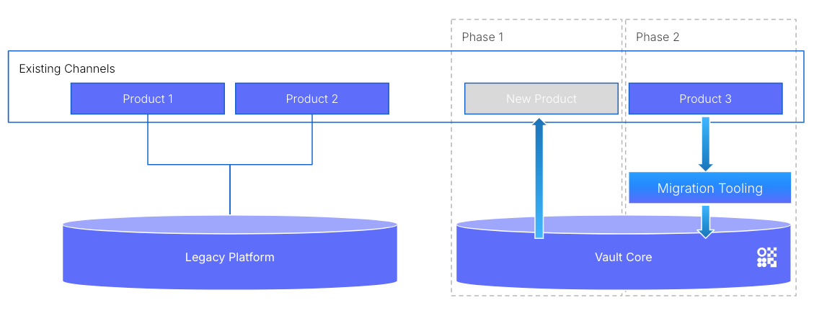
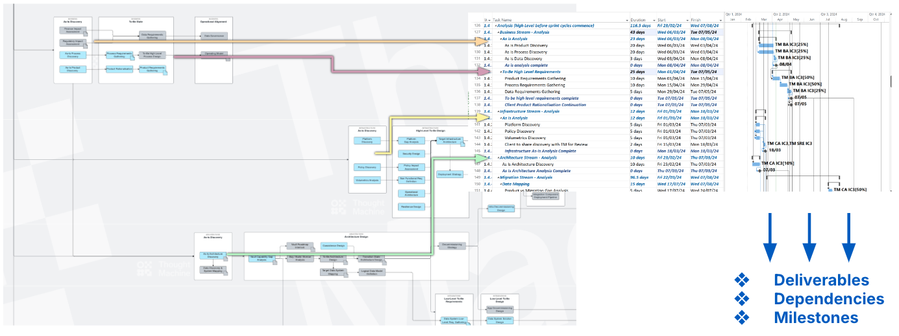

# Delivery and Phasing Plan

## Purpose

The delivery and phasing plan defines how various initiatives or projects within a programme will be executed, in what sequence (phases), and what resources and timelines are required.

This is essential in ensuring that the program’s objectives are met efficiently and within the planned budget, timeframe, and scope, while also managing risks and dependencies between the various components of the program.

Phasing refers to breaking down the program into smaller, manageable stages or phases. Each phase builds on the previous one, delivering incremental value. A phased approach helps in controlling risk, ensuring quality, and making adjustments based on delivery of each stage.

## Predecessor Activities

-   Governance: [Programme Definition](/delivery-framework/latest/EN/delivery_workstream/governance/programme_definition)
    
-   Business: [Product & Transition Roadmap](/delivery-framework/latest/EN/delivery_workstream/business/product_and_transition)
    
-   Architecture: [High Level Architecture Assessment](/delivery-framework/latest/EN/delivery_workstream/architecture/high_level_architecture_assessment)
    

## Guidance

-   The delivery and phasing plan will be unique to each organisation and should be regularly reviewed during execution to ensure it remains efficient and effective.
    
-   The sequencing of phases ensures that the individual projects within a program are executed in a logical order, considering their dependencies. Some phases might be dependent on the completion of others, or initiatives outside the specific scope of the specific programme.
    

### 'Think big, start small'

-   The key to a successful re-platforming is to avoid a big-bang approach. Regardless of the programme size Thought Machine recommends a phased delivery approach to both building out of the new stack and the migration of accounts.
    
-   Using an incremental, phased approach delivers proof points and value early - in Vault Core, in other capabilities, in the cloud-native strategy, and in successful client, partner and Thought Machine delivery overall. Common strategies are by product line, division or customer cohort. This approach also supports a 'low appetite for risk' - avoiding a big bang approach, which potentially may result in years before any benefits are delivered and has a high risk of failure.
    
-   Thought Machine’s technology and delivery approach is designed to satisfy two objectives:
    
    -   Vault Core can be used to run a specific use case, such as a new product, brand, or country.
        
    -   Vault Core can also be planned as the core banking part of a target state architecture for the full organisation or a large part of the organisation.
        
    

### Phased Delivery Approach

-   The delivery plan should be viewed as a journey with a clear strategy and target architecture defined at the outset. It can be easy to get stuck in the pitfall of trying to replace everything all at once, costing time and money, creating programme dependencies and increasing risk to delivery.  
    
-   Given a good target architecture, the journey should be sequenced into phases so that it does not get stuck in a massive project and can get something live quickly and in doing so, prove:
    
    -   Business benefit: one or more of cost reduction, product innovation, and simplification.
        
    -   Thought Machine’s and other vendor(s) technology works.
        
    -   The team can handle the new technology and development approaches.
        
    
-   Any phased delivery approach requires co-existence and a coexistence approach will need to be defined for running legacy and new stack in parallel (see [Activity: Coexistence Design](/delivery-framework/latest/EN/delivery_workstream/architecture/coexistence_design) for further details)
    
-   Both the coexistence or migration approaches, enable clients to build a new stack, which is designed to be their long-term solution for the whole organisation. This new stack will be designed to be fit-for-purpose for the organisation’s long term vision and will likely include many new capabilities and existing capabilities within the organisation.
    
-   Following initial success, delivery of the intermediate points can get underway; this could be with various mixes of old, patched, new internal and new vendor solutions. This ensures programmes are delivered at a rapid rate with incremental value delivery.
    
-   The principles of a phases approach applied to all types of organisation, however the success factors of the initial phase may be different. For example:
    
    -   For a tier 1 bank with the long term objective of migrating all accounts onto Vault Core, a priority may be establishing pipelines and repeatable processes within the programme to enable efficient delivery of future phases.
        
    -   For a new greenfield bank, success of the first phase may be launching a new product into production and opening a test account that enables regulated money to be moved.
        
    

### Example Phased Approach

The example below illustrates a phased delivery approach for a multi-regional bank migrating multiple product lines onto Vault Core.

**Phase 1** focuses on launching a new product, in this case an Instant Access Saver. This initial phase involves building out the spine of the target platform architecture; this is not everything in the architecture blueprint, just the components needed to build and launch the initial product. This stage provides the foundation and confidence to onboard further products, and to start the migration of backbook products onto Vault Core.

chat\_bubble

Thought Machine recommends starting with a simple product to quickly deliver initial business value.

**Phase 2** initiates the migration of Savings Accounts from legacy on to Vault Core. This phase initiates the activities to incrementally build out additional products and the migration tooling to eventually be able to migrate all customers to mirrored versions of existing products or onboarding to new products to enable the legacy platform(s) to be turned off in the future.

chat\_bubble

Thought Machine recommends continuing to choose a simple straightforward product(s) to start migration activities as this proves the migration tooling and verifies the approach (see [Migration Strategy](/delivery-framework/latest/EN/delivery_workstream/migration/migration_strategy) for further details).

**Phase 3** extends migrations to handle edge cases and large volumes to complete migration of a single business line of products, in this case deposits, onto Vault Core.

chat\_bubble

Thought Machine recommends expensive to run products/product features are prioritised onto the target platform to deliver further business benefit and start decommissioning of legacy platforms to drive out cost savings.

**Phase 4** and beyond migrates the wider product catalogue on to the Vault Core with further build out of the target banking platform to support additional features. This results in a single unified platform supporting all business lines and full decommissioning of legacy platforms

### Planning

Having a high level delivery strategy and plan underpinned by detailed phase plans with specific deliverables, dependencies and milestones reduces the risk of making poor decisions in the early phases that impact later stages.

Examples of this include launching a new mobile app as part of the initial phase without having a view on how customers will coexist. For this reason, developing the [Product & Transition Roadmap](/delivery-framework/latest/EN/delivery_workstream/business/product_and_transition) is key.

The [Activity Map](/delivery-framework/latest/EN/getting_started/how_to) should be used to validate that everything is covered in the plan. This supports driving out the deliverables, dependencies and milestones.

## Disclaimer

See the Disclaimer relating to this and all other Vault Core Delivery Framework pages [here](/delivery-framework/latest/EN/getting_started/disclaimer/)

Thought Machine Confidential Information.

© 2026 Thought Machine Group Limited. All rights reserved.