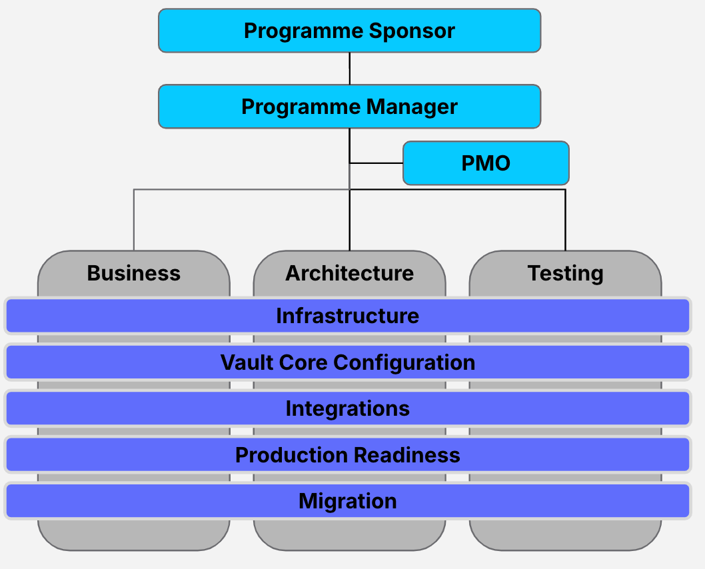
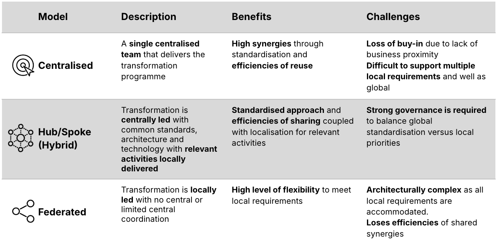

# Programme Team Structure

## Purpose

The programme organisation clarifies how the entire team is structured, and how individuals and sub teams operate within it. It establishes clear roles, responsibilities, and reporting lines that enable effective governance, decision-making, and execution. As the programme is a temporary structure and delivery is across many phases, the structure is expected to flex based on phase stage, scope, and objectives as well as the type of organisation.

The structure chosen can significantly impact the programme’s effectiveness, efficiency, and success. A well-defined structure provides clarity on how sub-teams (workstreams/ squads) are organised, how teams collaborate, and ensures that resources are allocated efficiently to meet the programme’s objectives.

## Predecessor Activities

1.  Governance: [Programme Definition](/delivery-framework/latest/EN/delivery_workstream/governance/programme_definition)
    
2.  Governance: [Delivery & Phasing Plan](/delivery-framework/latest/EN/delivery_workstream/governance/delivery_and_phasing_plan)
    
3.  Governance: [Business Case & Budget](/delivery-framework/latest/EN/delivery_workstream/governance/business_case_budget)
    
4.  Governance: [Resourcing Strategy](/delivery-framework/latest/EN/delivery_workstream/governance/resourcing_strategy)
    

## Guidance

-   Choosing the right programme team structure depends on factors such as the size and complexity of the programme, resource availability and locations, and the need for flexibility versus control.
    
-   Each structure has its strengths and weaknesses, and the best approach often involves assessing the specific needs of the programme and tailoring the structure accordingly.  
    
-   Any structure should be based on the specific demands of the programme, the client organisation’s capabilities, and the desired outcomes.
    
-   Key aspects to consider:
    
    -   **Alignment to business drivers**: Design your programme structure to ensure resources, processes, and efforts are directed towards delivering outcomes that directly support the business case and strategic goals. For example, if your focus is on launching a Greenfield Bank or running a fast-paced technology PoC, you may want to consider a more agile and dynamic team structure, compared to a large bank multi-year legacy migration programme that has a more formal structure with a larger set of stakeholder involvement.
        
    -   **Integration with existing strategy**: Look for opportunities to align with your current strategies. For instance, leveraging existing cloud vendor partnerships can prevent disruption to ongoing efforts and help maximise prior investments to support the programme’s success.
        
    -   **Executive layer sponsorship**: It’s crucial to have empowered decision-makers actively engaged in the programme. Sponsors who can make timely, strategic decisions and challenge outdated policies will play a key role in driving success, especially when navigating policy decisions tied to legacy technology.
        
    -   **Inclusion of shared service teams**: Ensure that the programme includes the relevant \`mothership' functions, such as Security, Risk, and Compliance, from the outset. This avoids last-minute blockers and ensures alignment between the programme’s objectives and the broader risk management priorities.
        
    -   **Delivery methodology influence**: The chosen delivery methodology will shape how the programme is structured. For example, an Agile approach favours cross-functional, non-hierarchical teams with open communication, removing unnecessary management layers and enabling collaboration across the board.
        
    -   **Specialist resource management**: With specialised resources, consider grouping them to manage work more effectively. Scarce skills should be carefully managed, so team structure should reflect this to maximise efficiency.
        
    -   **Encouraging collaboration**: Foster cross-functional collaboration by minimising functional silos, which can limit knowledge sharing and prevent informed decision-making.
        
    -   **Team location**: Co-locating teams can build closer working relationships, especially where time zones may limit collaboration opportunities.
        
    -   **Dedicated resources**: Where possible, assign resources to a single team rather than across multiple teams to increase focus and reduce conflicts over priorities.
        
    -   **Simplifying reporting lines**: Simplify reporting structures to avoid confusion and conflicting priorities, enabling smoother decision-making.
        
    -   **Minimising dependencies**: Aim to create autonomous teams to reduce dependencies that could cause bottlenecks or slow down delivery.
        
    -   **Sourcing model**: If using third-party suppliers, ensure your structure accommodates effective governance to manage client-supplier relationships.
        
    -   **Operational support model**: Consider from day one how the programme will transition into operations. Whether the delivery team will manage production support or there will be a formal handover to another team; this must be factored into programme structure.
        
    

### Example Programme Organisation Structure

The example below shows a typical matrix structure based on the Vault Core Delivery Framework workstreams.

This matrix model provides both deep functional expertise, strong programme cohesion and focus on delivery. In the model shown, the vertical Business, Architecture and Testing teams ensure alignment through requirements, design and quality assurance across the horizontal delivery teams covering Infrastructure, Vault Core Configuration, Integrations, Production Readiness and Migration.

This model provides flexibility and adaptability to varying delivery needs of the programme, whilst ensuring the solution is business driven, architecture aligned and adheres to quality standards.

### Multi-Phase Delivery Models

-   For multi-phased implementations, the programme organisation structure must be able to effectively manage and support each phase of delivery that may be running across different regions and products.  
    
-   The choice of delivery model will determine the level of central involvement required versus the degree of autonomy of business units sponsoring each phase.
    
-   The benefits and challenges of the 3 different delivery models are described in the table below:
    

-   Whatever organisation and delivery model is chosen, it is vital that there is a clear structure that is communicated across the team to avoid confusion about roles and responsibilities. For example, there must only be one Programme Manager who is the single person responsible for successful delivery of the overall programme.
    

## Disclaimer

See the Disclaimer relating to this and all other Vault Core Delivery Framework pages [here](/delivery-framework/latest/EN/getting_started/disclaimer/).

Thought Machine Confidential Information.

© 2026 Thought Machine Group Limited. All rights reserved.