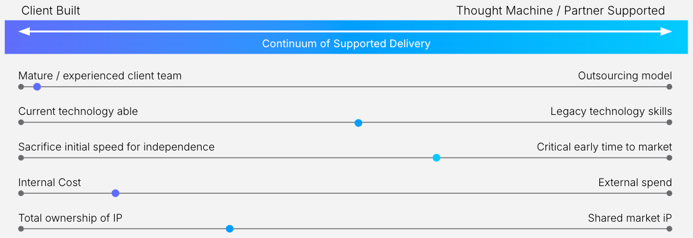

# Resourcing Strategy

## Purpose

The resourcing strategy defines the planning, sourcing, selection and utilisation of human resources (internal, third-party vendors, or Subject Matter Experts (SMEs) )- getting the right people, with the right skills, into the right roles, at the right time. A well-defined resourcing strategy:

-   Aligns resources with the programme and specific phase scope, timelines, and budget.
    
-   Ensures that the right skills are available at the right time to meet key milestones.
    
-   Mitigates risks related to skill shortages or misallocation of resources.
    
-   Optimises the use of internal and external resources, reducing costs and inefficiencies.
    
-   Supports overall programme success by ensuring that resources can adapt to evolving needs across phases.
    

Without a clear resourcing plan, the programme may be underfunded or lack the necessary capabilities to deliver on its objectives, leading to delays or increased costs.

## Predecessor Activities

1.  Governance: [Delivery & Phasing Plan](/delivery-framework/latest/EN/delivery_workstream/governance/delivery_and_phasing_plan)
    
2.  Governance: [Skills Capability Assessment](/delivery-framework/latest/EN/delivery_workstream/governance/skills_capability_assessment)
    

## Guidance

-   The resourcing strategy is informed by the Skills Capability Assessment, it determines how gaps are addresses; either through training, recruitment or outsourcing.
    
-   The resourcing strategy is closely tied to the [Delivery & Phasing Plan](/delivery-framework/latest/EN/delivery_workstream/governance/delivery_and_phasing_plan) and [Business Case & Budget](/delivery-framework/latest/EN/delivery_workstream/governance/business_case_budget) as it determines the types and number of resources required to achieve the programme’s objectives.
    
-   In some cases, the strategy may not be to fill the gap and the solution is aligned to architectural decisions such as SaaS versus Client Hosted Vault Core platform or Buy - Build - Borrow Analysis.
    
-   Resourcing decisions need to be made based on both the short term (i.e. quick implementation of specific phase) and the longer term (i.e. in-house retained knowledge to support delivery through multiple phases and production operations) goals of its overall programme.
    
-   There is also no 'one size fits all' answer; it requires an assessment of skills available and an assessment of skills to build versus skills to buy-in, whilst retaining the right degree of in-house control.
    

### Resourcing factors

-   **Team maturity and experience**: Consider both skills and experience of the team when delivering a complex core banking transformation programme. Delivering a successful transformation requires a diverse set of skills and experience that span people processes and systems. For many clients, this is not something that they have embarked on before.  
    
-   **Technology skills**: Moving to a well-architected modern stack comes with a requirement for acquiring new skills including working with cloud technologies, microservices, APIs and knowledge of non-functional aspects such as performance, high availability, resilience, security and disaster recovery. These can be learned over time or acquired; investment in these skills should be taken into account when defining the resourcing strategy.
    
    -   Thought Machine’s experience is that many client’s typically lack cloud technology skills and it slows down their initial deployment into production.
        
    
-   **Legacy knowledge**: Migration activities require knowledge of legacy systems; it is key to develop strategies to retain resources with this knowledge until migration is complete.
    
-   **Time to market**: Training up resources can take time. If speed of delivery is critical to the programme’s success, using skilled Thought Machine and trusted Partner resources who have experience of doing this before provides immediate access to specialist knowledge and tooling to optimise delivery. These resources can hit the ground running and be scaled up and down to meet the needs of the programme.
    
-   **Cost**: Whilst the cost per head of using internal resources may be less, in-house delivery requires significant investment in time and money to implement. Using experienced resources reduces risk of failure.
    
-   **Independence**: For some clients, having full control of their IT systems is a key driver for change and this informs their technology choices and resourcing strategy. Vault Core’s Configuration Layer offers complete control over delivery of products using Smart Contracts; either the client or partner writes the Smart Contract, the client uses some of the contracts taken from Thought Machine’s extensive Smart Contract library, or Thought Machine is commissioned to write a Smart Contract for the client.
    
-   **Onboarding Timelines**: Use the plan to drive resource mobilisation decisions. Allow sufficient time to onboard resources and undertake training, especially relevant for external resources. Ensuring that appropriate resources are available at the right time without overwhelming the team early on. Underutilised resources can become frustrated and disengaged whilst lack of specific skill sets causes delays.
    

### Typical Roles

The table below depicts the roles typically required in a core banking programme team.

Beyond the core programme team, access to SMEs is critical to the programme success.

 
| Role | Description |
| --- | --- |
| 
Product Owner

 | 

-   Product expert accountable for the design and implementation per product.
    
-   Detailed understanding of financial products and their implementation on Vault.
    
-   Detailed understanding of financial products and their implementation on Vault.
    

 |
| 

Programme Manager

 | 

-   Accountable for the success of the implementation.
    
-   Responsible for planning, resourcing, governance & coordination across multiple workstreams.
    
-   Site Reliability Engineer.
    
-   Infrastructure specialists with experience of client’s infrastructure and environments.
    
-   SME knowledge of Vault mandatory components.
    

 |
| 

Technical Architect

 | 

-   Authority on Vault’s positioning within the overall architecture, identifying necessary architectural and integration needs, patterns, and decisions.
    
-   Integration SMEs.
    
-   Knowledge and understanding of existing core(s) and account and transaction data.
    
-   Support the design and test of identified integrations.
    

 |
| 

Integration Engineers

 | 

-   Complete design, build and test of identified integrations.
    

 |
| 

Business Analysts

 | 

-   Gathers and refines business processes, data and product requirements and analyses how the solution can support them.
    
-   Supports testing activities.
    

 |
| 

Vault Core Configuration Engineers

 | 

-   Transforms requirements into smart contract and feature block designs.
    
-   Builds and tests smart contract features and assembly of smart contracts.
    
-   Testing smart contracts and creation of release packages.
    

 |
| 

Migration Team

 | 

-   Migration specialists, executing the planning, testing and completion of migration activities.
    

 |
| 

Test Owner

 | 

-   Defines the test strategy and oversees the planning, design, execution, and reporting of tests.
    
-   Ensures alignment across the various test teams of the programme with the specific set-up of each relevant environment. Responsible for ensuring the quality of a product/process/system (functional and nonfunctional).
    

 |

### Thought Machine Delivery Services

-   Thought Machine’s delivery approach balances time to market, team maturity, cost and client independence based on client delivery objectives - being there, as much as needed!  
    
-   Engagement in a programme can be as wide or as narrow as clients and partners require. From the full programme implementation to light touch expert services designed to provide assurance and reduce risk. The goal is to enable clients and delivery partners to successfully implement Vault Core with minimal support from Thought Machine.  
    
-   Thought Machine’s extensive experience of core-banking programmes across multiple clients provides valuable insights and understanding that go beyond what can be learned through training alone.  
    
-   For more information about Thought Machine’s Delivery Services please see [here](/delivery-framework/latest/EN/getting_started/delivery_services) or contact your Thought Machine representative for further details on how Thought Machine can support your programme.
    
-   Partners can also be fundamental to helping clients revolutionise banking. Partner resources assigned to Vault Core related activities are required to hold relevant Vault Core certifications.
    

## Disclaimer

See the Disclaimer relating to this and all other Vault Core Delivery Framework pages [here](/delivery-framework/latest/EN/getting_started/disclaimer/).

Thought Machine Confidential Information.

© 2026 Thought Machine Group Limited. All rights reserved.