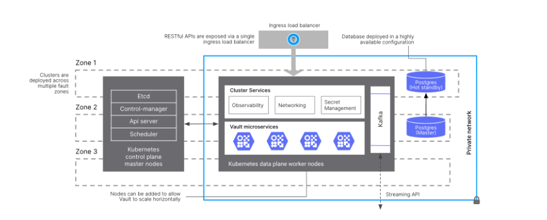

# Target Infrastructure Architecture

## Purpose

The objective of this activity is to establish a clear vision for the target state infrastructure required to support the core banking applications and services that are in-scope.

Deliverables include comprehensive documentation outlining system architecture, hardware specifications, network topology, security protocols, and scalability plans. Additionally, it should provide a roadmap for implementation, guiding the deployment and configuration process.

Failure to undertake this activity can lead to significant consequences such as inefficient resource allocation, security vulnerabilities, compatibility issues, and project delays. Without a defined target infrastructure, projects will lack direction and coherence, and ultimately fail to meet business objectives.

## Predecessor Activities

1.  [Platform Gap Analysis](/delivery-framework/latest/EN/delivery_workstream/infrastructure/platform_gap_analysis)
    
2.  [Policy Impact Assessment](/delivery-framework/latest/EN/delivery_workstream/infrastructure/policy_impact_assesment)
    
3.  [Non-Functional Requirements Definition](/delivery-framework/latest/EN/delivery_workstream/infrastructure/non_functional_requirements_definition)
    
4.  [Operational Architecture](/delivery-framework/latest/EN/delivery_workstream/infrastructure/operational_architecture)
    
5.  [Security Design](/delivery-framework/latest/EN/delivery_workstream/infrastructure/security_design)
    
6.  [Resilience Design](/delivery-framework/latest/EN/delivery_workstream/infrastructure/resilience_design)
    

## Guidance

Defining a target architecture is an iterative process, teams should expect to revisit the Platform Gap Analysis and Policy Impact Assessment activities when solution components are selected.

This activity is not just concerned with the selection of new infrastructure, decisions should also be taken about what existing components lend themselves to reuse or further investment based on cost and other NFRs. The options available to the team should consider all possibilities to make sure the optimal solution is chosen:

-   Build: Deliver the feature in-house if there are the skills and capacity, or the requirements are very specific to the organisation
    
-   Buy: License and run 3rd party components or services if the requirements are straightforward and there is a good coverage provided by Independent Software Vendors (ISVs)
    
-   Rent: Subscribe to a SaaS offering if there are limited skills and capacity to run services in-house, if the requirements are straightforward, and there is good coverage from ISVs
    

Meeting the constraints defined by the NFRs is key to avoiding project delays and increased costs caused by programme stakeholders failing to sign off on designs. Some examples of this include: An information security team identifying a problem with the choice of messaging infrastructure and the types of authentication that it supports; Or a compliance team pushing back on the use of certain types of encryption for your platform storage.

**Examples**

Information about Vault Infrastructure architectural patterns and platform requirements can be found in the Documentation Hub: Vault Core Infrastructure.

This activity contributes towards the following deliverables:

-   *Architecture Diagrams -* Visual representations of the solution components, interactions, and dependencies. These diagrams and associated narrative provide a high-level overview of the infrastructure, helping teams understand the system topology and how agreed design principles have been met.
    
-   *Infrastructure as Code (IaC) Templates -* Script and configuration files used to provision and manage cloud resources programmatically. IaC templates ensure consistency, repeatability, and scalability by automating infrastructure deployment and configuration.
    
-   *Service Level Agreements (SLAs) -* Contract defining the expected performance, availability, and support levels of the cloud service provider.
    
-   *Security Architecture Document -* Outline the security measures and protocols implemented to protect cloud infrastructure and data. The security design should cover details on access controls, encryption, compliance requirements, and incident response procedures to safeguard against cyber threats.
    
-   *Disaster Recovery and Business Continuity Plan -* Describe strategies and procedures for recovering from system failures, data loss, or disruptions. Consider backup strategies, failover mechanisms, and recovery time objectives (RTO) to minimise downtime and ensure business continuity.
    
-   *Cost Estimation and Optimisation Plan -* Evaluate the projected costs of the cloud infrastructure and identify opportunities for optimisation. It includes budget allocation, cost monitoring tools, and strategies for optimising resource utilisation to minimise expenses.
    
-   *Change Management and Governance Framework -* Define processes and policies for managing changes to the cloud infrastructure and enforcing compliance with organisational standards. Include procedures for version control, testing, and approval of modifications to ensure stability and security.
    

## Templates

Thought Machine does not have any templates to support the delivery of this activity.

* * *

### Disclaimer

See the Disclaimer relating to this and all other Vault Core Delivery Framework pages [here](/delivery-framework/latest/EN/getting_started/disclaimer/).

Thought Machine Confidential Information.

© 2025 Thought Machine Group Limited. All rights reserved.