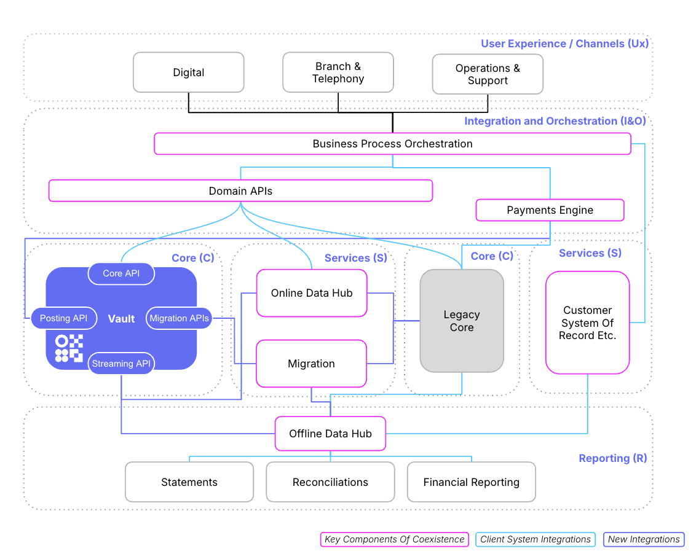
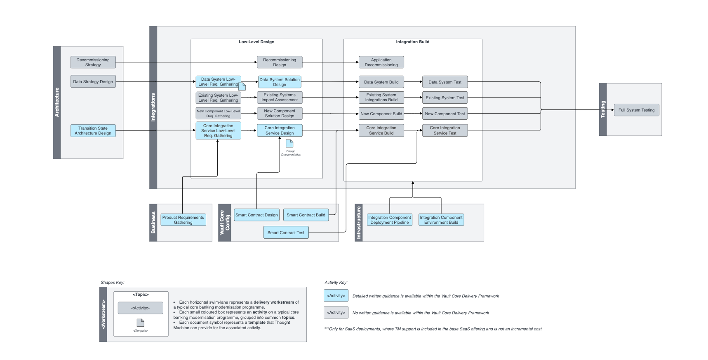

# Integrations Workstream

## Overview

The purpose of the integrations workstream is to design, build and test all systems outside of Vault Core needed to implement the end state architecture defined in the architecture workstream.

This is separated into four activity groups:

-   Existing system integration: Integration of the new system with, changes to and decommissioning of any existing bank systems.
    
-   Data system integration: Integration with or creation of an enterprise data warehouse and data lake capabilities to take advantage of Vault Core event based architecture.
    
-   New system integration: Creation of and integration with any new systems that have to be built or bought to achieve the end state architecture.
    
-   Core system integration\_: Creation of direct integration and orchestrations with Thought Machine Vault Core via the REST and Kafka APIs.
    

## Activity Map

## Activities

You can find detailed guidance on activities highlighted in blue via the links below:

 
| Activity | Description |
| --- | --- |
| 
[Data System Low Level Requirements Gathering](/delivery-framework/latest/EN/delivery_workstream/integrations/data_system_low_level)

 | 

Low level requirements gathering for the streaming and accessing of core data outside of Vault Core within online and offline data hubs.

 |
| 

Existing System Low Level Requirements Gathering

 | 

Low level requirements gathering for existing systems behaviour and processes depending on existing systems and how that affects Vault Core implementation.

 |
| 

New Component Low Level Requirements Gathering

 | 

Low level requirements gathering for new components and systems based on the behaviour and processes that need to integrate with Vault core banking implementation.

 |
| 

[Core Integration Service Low Level Requirements Gathering](/delivery-framework/latest/EN/delivery_workstream/integrations/core_services_low_level)

 | 

Low level requirements gathering for accessing and integrating with Vault core APIs and streaming APIs and orchestrating the different journeys from upstream to downstream with the Vault Core embedded in the overall architecture.

 |
| 

Application Decommissioning Design

 | 

Overall design for decommissioning of applications after the analysis and strategy to complete the steps involved in decommissioning.

 |
| 

[Data System Solution Design](/delivery-framework/latest/EN/delivery_workstream/integrations/data_system_solution_design)

 | 

Overall design for the data system of the bank, incorporating existing and new data requirements from business and technology stakeholders.

 |
| 

Existing System Impact Assessment

 | 

Impact Assessment of existing systems behaviour and processes and dependencies between the different systems involved and how that affects Vault core banking implementation and the business processes involved.

 |
| 

New Component Solution Design

 | 

Solution Design for the new components and systems based on the processes that need to be orchestrated with Vault core banking implementation and outside of Vault.

 |
| 

[Core Integration Service Design](/delivery-framework/latest/EN/delivery_workstream/integrations/core_service_design)

 | 

Solution design for accessing and integrating with Vault Core APIs and streaming APIs and orchestrating the different journeys from upstream to downstream with the Vault Core embedded in the overall architecture.

 |
| 

Data System Build

 | 

Development of the Data Systems designed to store and process core data outside of Vault within online and offline data hubs and serve business processes for different requirements.

 |
| 

Existing System Integration Build

 | 

Modification of the existing systems to cater to the new requirements identified and built as per the design blueprint from the impact assessment on the different systems involved and the new business processes that will be enabled from these systems.

 |
| 

New Component Build

 | 

Implementation of the new components and systems based on the processes that need to be orchestrated with Vault core banking implementation and outside of Vault.

 |
| 

Core Integration Service Build

 | 

Implementation of integrating with Vault core APIs and streaming APIs and orchestrating the different journeys from upstream to downstream with the Vault Core in the middle layer.

 |
| 

Data System Test

 | 

Testing phase of the Data Systems implemented to store and process core data outside of Vault within online and offline data hubs and serve business processes for different requirements.

 |
| 

Existing System Test

 | 

Integrations Testing of the existing systems that were modified as per the requirements and design from the impact assessment on the different systems involved and ensuring that they cater to the new business processes as well.

 |
| 

New Component Test

 | 

Testing phase of the new components and systems implemented based on the processes that need to be orchestrated with Vault core banking implementation and outside of Vault.

 |
| 

Core Integration Service Test

 | 

Testing the integrations with Vault core APIs and streaming APIs and orchestrating the different journeys from upstream to downstream with the Vault Core in the middle layer.

 |
| 

Application Decommissioning

 | 

Completing the decommissioning of the applications identified as not required as part of the modernisation of the core and implementing as per the design once go-live is complete.

 |

## Disclaimer

See the Disclaimer relating to this and all other Vault Core Delivery Framework content [here](/delivery-framework/latest/EN/getting_started/disclaimer/).

Thought Machine Confidential Information.

© 2025 Thought Machine Group Limited. All rights reserved.

* * *