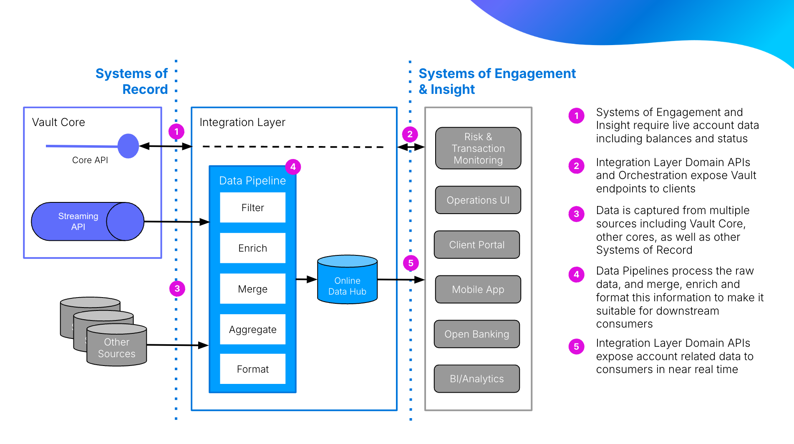
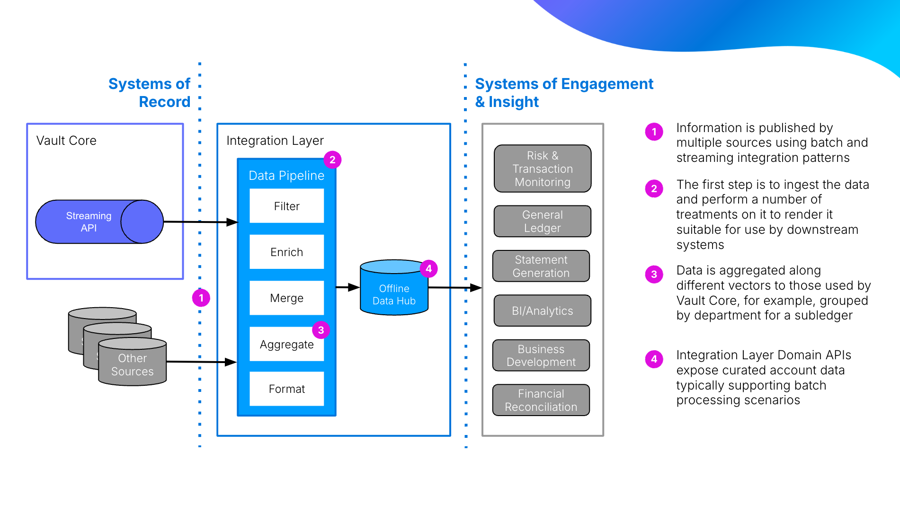

# Data System Solution Design

## Purpose

The purpose of this activity is to design an optimised and scalable data solution that accurately represents business information and facilitates efficient system integration and operations.

The defined logical data model and data requirements, for the core domain, are translated into a physical database structure that meets business needs. The data structure also ensures data integrity, security, performance, and supports upstream and downstream integrations.

This process considers the integrations required for data to be sent to Vault Core and the way the business can access and store data produced from Vault Core for reporting and other downstream capabilities.

## Predecessor Activities

1.  Architecture: [Transition State Architecture Design](/delivery-framework/latest/EN/delivery_workstream/architecture/transition_state_architecture)
    
2.  Architecture: Target Data System Mapping
    
3.  Architecture: Define Logical Data Model  
    
4.  Business: Data Requirements Gathering
    

## Guidance

Online and offline data hubs serve as a source of truth for external systems that consume and query core banking and related data.. The system can use different data stores for upstream systems for real-time online interactions (e.g. mobile app, payments) and downstream systems for offline consumption (e.g. regulatory reporting, finance).

**For Upstream systems (Online datahub):** The integration layer acts as a mediator for real-time interactions between upstream systems and Vault Core. Interaction with Vault Core can be either through REST APIs or Kafka. The primary functions for upstream integrations are:

1.  Data enrichment: Upon receiving a request from upstream systems, the data is enhanced with additional information or context as needed.
    
2.  Request transformation: Incoming requests are transformed into the specific format required by Vault Core.
    
3.  Response handling: When Vault Core sends a response, the data is stored for tracking and analysis.
    
4.  Response transformation: Responses are formatted to meet the requirements of the calling upstream system before transmitting back.
    

To support these use cases, the online datahub needs to store:

1.  Contextual data: Additional information used for request enrichment (e.g., internal accounts, payment device).
    
2.  Request data from upstream: Original incoming requests.
    
3.  Response data from Vault Core: Responses received from Vault Core.
    
4.  Data captured from other systems and data sources.
    

**For downstream systems (offline datahub):** The integration layer consumes data from Vault Core and stores it for use by downstream systems, supporting both near real-time and batch processing needs:

1.  Data consumption: The integration layer consumes data published by Vault Core in Kafka streams.
    
2.  Data storage: The consumed data is then stored in the offline datahub.
    
3.  Data availability: The stored data is made available to downstream systems, potentially with further transformations or aggregations to meet specific reporting or analytical requirements.
    

The details of all the events published by Vault Core can be found in the Documentation Hub. The offline data hub can also store below data events published by Vault Core, for operational and audit requirements.

-   Audit log events.
    
-   Action log events.
    
-   Scheduler events.
    
-   Calendar events.
    

### Technology considerations

Choosing the right technology for data systems is critical in a banking integration layer. The technology stack directly impacts system performance, scalability, data integrity, and compliance with banking regulations. While detailed evaluations are covered in predecessor activities, this section provides an overview of key considerations for both online and offline datahubs. It’s important to note that final technology choices should align with organisational expertise, existing infrastructure, and specific regulatory requirements applicable to banking operations in question.

### Online datahub

The data store for the online datahub can either be a relational database management system(RDBMS) or a NoSQL system. The choice between the technologies should be based on specific organisational and technical requirements, especially considering the critical nature of banking operations. Below is a comparison of the technologies and key considerations to guide the decision-making process.

Comparison of RDBMS and NoSQL:

-   Data structure:
    
    -   RDBMS: Structured, fixed schema.
        
    -   NoSQL: Flexible schema, semi-structured data.
        
    
-   Scalability:
    
    -   RDBMS: Primarily vertical (scale-up).
        
    -   NoSQL: Primarily horizontal (scale-out).
        
    
-   Consistency:
    
    -   RDBMS: Strong consistency.
        
    -   NoSQL: Often eventual consistency, some offer strong consistency.
        
    
-   ACID Compliance:
    
    -   RDBMS: Full ACID.
        
    -   NoSQL: Varies (some offer ACID).
        
    
-   Query complexity:
    
    -   RDBMS: Complex queries, joins.
        
    -   NoSQL: Simple queries, limited joins.
        
    
-   Performance at scale:
    
    -   RDBMS: May be slow with very large datasets.
        
    -   NoSQL: Better for high-volume simple operations.
        
    
-   Data relationships:
    
    -   RDBMS: Well-suited for complex relationships.
        
    -   NoSQL: Requires careful design for relationships.
        
    
-   Development agility:
    
    -   RDBMS: Slower schema changes.
        
    -   NoSQL: Faster schema evolution.
        
    

**Key considerations :**

-   Transaction integrity requirements.
    
-   Expected data volume and growth.
    
-   Query complexity needs.
    
-   Scalability projections.
    
-   Data structure flexibility needs.
    
-   Regulatory compliance and audit requirements.
    
-   Real-time processing capabilities.
    
-   Disaster recovery and high availability requirements.
    

### Offline datahub

The offline datahub in a banking integration layer typically requires a combination of technologies to handle diverse data processing needs, from batch analytics to near real-time reporting. Below is an overview of recommended technologies, their benefits, and key considerations for implementation in a banking environment.

1.  Data warehouse/columnar database:
    
    -   Examples: Amazon Redshift, Google BigQuery, Snowflake.
        
    -   Benefits:
        
        -   Optimised for analytical queries on large datasets.
            
        -   Supports SQL for complex reporting needs.
            
        -   Scales well for growing data volumes.
            
        
    -   Banking Use Cases: Regulatory reporting, risk management.
        
    
2.  Data lake:
    
    -   Technologies: Hadoop ecosystem, Amazon S3 with Athena, Azure Data Lake
        
    -   Benefits:
        
        -   Stores raw, unprocessed data cost-effectively.
            
        -   Supports diverse data types.
            
        -   Allows for schema-on-read flexibility.
            
        
    -   Banking use cases: Long-term archiving, advanced analytics.
        
    
3.  Stream processing:
    
    -   Technologies: Apache Kafka, Apache Flink, Apache Spark Streaming
        
    -   Benefits:
        
        -   Handles real-time data ingestion.
            
        -   Supports data transformations before storage.
            
        
    -   Banking use cases: Real-time fraud detection, live operational monitoring.
        
    

**Key considerations:**

1.  Data governance and security:
    
    -   Implement robust encryption, access controls, and auditing.
        
    -   Ensure data lineage and traceability.
        
    
2.  Regulatory compliance:
    
    -   Adhere to relevant banking regulations.
        
    -   Implement data retention and deletion policies.
        
    
3.  Data integration:
    
    -   Establish robust ETL/ELT processes.
        
    -   Ensure data quality checks and reconciliation.
        
    
4.  Performance and scalability:
    
    -   Design for expected data volumes with growth capacity.
        
    -   Implement proper partitioning and indexing strategies.
        
    
5.  Disaster recovery:
    
    -   Comprehensive backup and recovery strategy.
        
    -   Consider multi-region deployments for critical systems.
        
    
6.  Cost management:
    
    -   Optimise data storage and processing.
        
    -   Consider data tiering strategies.
        
    

The logical data model activity defines the logical structure of the data to be stored. This activity provides guidelines for modelling physical databases based on: - The logical data model. - Data requirements.

The following steps must be repeated for each logical model.

Detailed data structures for the data streamed out from Vault Core are documented in the Documentation Hub. This can be used in data modelling.

1.  **Input from requirement gathering:**
    
    -   The process begins with a thorough analysis of the data requirements collected from stakeholders.
        
    -   These requirements include current data usage, future data needs, reporting requirements, compliance needs, and any specific data transformations required.
        
    
2.  **When creating the physical data model:**
    
    -   Use the logical model as the primary blueprint for tables and relationships.
        
    -   Refine this structure based on the data requirements from stakeholders.
        
    -   Make adjustments to optimise for the expected data volumes and access patterns.
        
    -   Ensure the physical model can support any specific performance, security, or compliance needs identified in the requirements.
        
    
3.  **Map logical entities to physical data model**:
    
    -   Determine table names (following your organisation’s naming conventions).
        
    -   Based on the data strategy, target system mapping and logical data model, the actual database may be RDBMS, NoSQL or column based.
        
    -   For RDBMS:
        
        -   Entities: These become tables in the physical model.
            
        -   Attributes: These become columns in the tables.
            
        -   Relationships: These guide the creation of foreign keys.
            
        -   Primary keys: These are usually carried over to the physical model.
            
        -   Data types: These provide a starting point for choosing physical data types.
            
        -   Cardinality of relationships: This informs how relationships are implemented.
            
        
    -   For NoSQL:
        
        -   Entities may become collections or tables, but with more flexibility.
            
        -   Relationships are often denormalised or handled differently.
            
        -   Attributes become fields in documents or key-value pairs.
            
        
    -   For column-based database:
        
        -   Entities typically become tables or column families.
            
        -   Attributes are grouped into column families based on access patterns.
            
        -   Relationships may be flattened or denormalised.
            
        
    -   With NoSQL and column-based databases: the physical model is much more tightly coupled with application needs and query patterns compared to traditional relational databases. The design process is typically more iterative and may require adjustments during implementation and testing using real data and queries.
        
    
4.  **Optimise the database design**: This step focuses on refining the initial physical model to enhance performance, efficiency, and scalability, security and compliance. This involves:
    
    -   Performance optimisation:
        
        -   Normalise/denormalise strategically.
            
        -   Implement efficient indexing.
            
        -   Consider partitioning large tables.
            
        -   Use materialised views and stored procedures.
            
        -   Optimise data distribution and storage.
            
        -   Choose appropriate data types.
            
        
    -   Security and privacy:
        
        -   Implement role-based access control (RBAC).
            
        -   Encrypt data at rest and in transit.
            
        -   Enforce strong authentication (MFA).
            
        -   Set up comprehensive auditing.
            
        -   Apply data masking and redaction.
            
        
    -   Compliance and regulatory considerations:
        
        -   Ensure alignment with relevant regulations (GDPR, CCPA, etc.).
            
        -   Implement data retention policies.
            
        -   Address geographical constraints and data residency.
            
        -   Align with bank-specific policies.
            
        
    -   Additional considerations:
        
        -   Design robust backup and recovery procedures.
            
        -   Implement performance monitoring.
            
        -   Plan for scalability.
            
        -   Establish data quality processes.
            
        
    
5.  **Documentation**:
    
    -   Create a comprehensive data dictionary which includes all the data elements.
        
    -   Document metadata, including descriptions, data types, and business rules.
        
    -   This documentation will be crucial for the actual data migration process and for future reference.
        
    

### Common pitfalls

Here are some common pitfalls:

1.  Insufficient requirements gathering:
    
    -   Not fully understanding or documenting business needs and use cases.
        
    -   Failing to involve all relevant stakeholders in the design process.
        
    
2.  Overlooking scalability:
    
    -   Designing only for current data volumes without considering future growth.
        
    -   Not planning for increases in user load or data complexity.
        
    
3.  Poor performance planning:
    
    -   Not considering query patterns and data access frequencies.
        
    -   Overlooking the need for caching or other performance optimisation techniques.
        
    
4.  Inflexible design:
    
    -   Creating rigid structures that are difficult to modify as business needs evolve.
        
    -   Not allowing for easy integration of new data sources or types.
        
    
5.  Overcomplicating the design:
    
    -   Adding unnecessary complexity that makes the system hard to maintain.
        
    -   Implementing advanced features without clear business justification.
        
    
6.  Siloed approach to design:
    
    -   Failing to consider integration with other systems and data flows.
        
    -   Not aligning the data model with enterprise-wide standards.
        
    
7.  Overlooking data archiving and retention:
    
    -   Not planning for long-term data storage and retrieval needs.
        
    -   Failing to consider regulatory requirements for data retention.
        
    
8.  Inconsistent naming conventions:
    
    -   Lack of standardisation in naming entities, attributes, and relationships.
        
    -   Inconsistent use of terminology across the system.
        
    

## Templates

Thought Machine has a range of templates designed to support clients in delivery of Data System Solution Design. Please contact your assigned Thought Machine representative for further information.

* * *

### Disclaimer

See the Disclaimer relating to this and all other Vault Core Delivery Framework pages [here](/delivery-framework/latest/EN/getting_started/disclaimer/).

Thought Machine Confidential Information.

© 2025 Thought Machine Group Limited. All rights reserved.