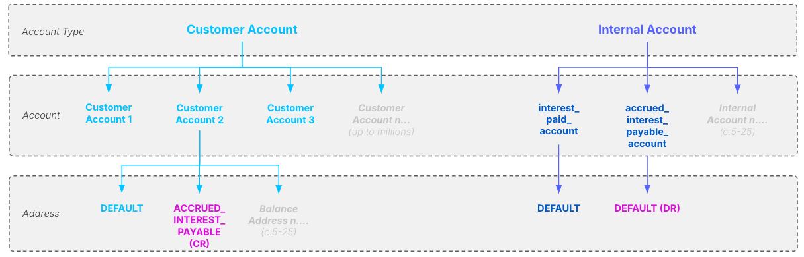

# Data mapping

## Purpose

Data mapping is a cornerstone activity within the migration delivery lifecycle that takes the data fields / values in scope for migration within each source or target system and provides the low-level mapping and transformation rules necessary to move data between them.

In this guidance we have divided the data mapping process into three tasks:

1.  [Data mapping preparation](/delivery-framework/latest/EN/delivery_workstream/migration/data_mapping#guidance_data_mapping_preparation) - Gathering the necessary inputs from upstream delivery activities and undertaking the prep-work necessary to get full value out of data mapping execution.
    
2.  [Data mapping execution](/delivery-framework/latest/EN/delivery_workstream/migration/data_mapping#guidance_data_mapping_execution) - Undertaking data mapping itself and capturing the outputs in a structured manner.
    
    -   Plus additional guidance unique to [mapping Postings](/delivery-framework/latest/EN/delivery_workstream/migration/data_mapping#mapping_postings)
        
    
3.  [Data mapping next steps](/delivery-framework/latest/EN/delivery_workstream/migration/data_mapping#guidance_data_mapping_next_steps) - Updating data mapping outputs as the programme progresses and using the outputs in downstream delivery activities.
    

If executed well this activity provides your programme with the following outcomes:

-   A clear path for moving data between source and target at a product level.
    
-   Provides the instructions for transformation rules and mappings to be codified within your [ETL Tool](/delivery-framework/latest/EN/delivery_workstream/migration/extract_transform_and_load_etl_tooling_build)
    
-   Unlocks [Migration ETL Testing](/delivery-framework/latest/EN/delivery_workstream/migration/migration_testing).
    

## Predecessor Activities

1.  Migration: [Product vs Migration Gap Analysis](/delivery-framework/latest/EN/delivery_workstream/migration/smart_contract_migration_build_and_test)
    

## Guidance - Data mapping preparation

To prepare for data mapping we recommend the following:

-   Ensure you have a general understanding of the [Vault Core migration APIs](/vault-core/latest/EN/environment_and_installation/migrating_to_vault) by reading the documentation end-to-end, including API messages formats and API behaviour, as this can be helpful context during mapping.
    
-   Complete the precursor dependent delivery activities as shown within the Migration Workstream Activity Map and gather related inputs required for data mapping, which in our view includes:
    
    1.  System Mapping output, as this documents how the legacy systems that are *sources* of data map to systems in the new tech stack that are *targets* for that data. This focuses data mapping efforts to the appropriate fields / tables in the correct systems. System Mapping is undertaken early on in the core banking modernisation programme lifecycle within the [Architecture Workstream](/delivery-framework/latest/EN/delivery_workstream/architecture) Data Discovery & System Mapping and Target Data System Mapping activities.
        
    2.  Source and target data dictionaries (including the Vault Core Migrations - Data Dictionary [downloadable here](/vault-core/latest/EN/environment_and_installation/migrating_to_vault#downloadable_information)), as these detail the first-class fields present in each system. If data dictionaries are not already available for any source or target system then as a minimum you can scrape the relevant database tables for field names and then annotate with basic business information, relying more heavily on SME input during the mapping process to make up for any shortfall in information to hand.
        
    3.  [Product vs Migration Gap Analysis](/delivery-framework/latest/EN/delivery_workstream/migration/smart_contract_migration_build_and_test) outputs, as mapping in Vault Core is heavily dependent on definition of the Product and associated user-defined fields.
        
    4.  If completed, [Data Profiling](/delivery-framework/latest/EN/delivery_workstream/migration/data_quality_and_cleanse#guidance_data_profiling) analysis, which provides additional insight into the types and extent of data held in the source system.
        
    
-   Agree the process / logistics for executing data mapping. Broadly speaking we see two methods used across programmes we have supported:
    
    1.  *\`Workshop'* mapping, where the migration team organise workshops to undertake mapping in person, with source and target representatives to explain each field and value. Challenging to orchestrate and resource intensive, but tends to produce high quality outputs on the first pass.
        
    2.  *\`Offline'* mapping, where the migration team uses the data dictionaries to complete the mapping in isolation, and then sends the output to relevant technical SMEs (including Thought Machine) for review and comment. This may be followed by shorter, more targeted workshops to discuss open questions or issues. Quicker fail fast approach works better on most programmes, but expect iteration and rework.
        
    
-   Mapping is a Business activity first and foremost, but one that normally requires input from technical SMEs to complete successfully. Regardless of which mapping method that you choose you will need to engage and have the support of technical SMEs that understand both source and target systems (for Vault Core specifically this means also understanding the underlying Smart Contract being migrated onto).
    
-   Agree the deliverable for capturing the data mapping output. Thought Machine has an example template to assist, though with the expectation that this is built upon to meet the specific needs of the programme.
    
-   Pre-populate your data mapping output deliverable with in-scope tables and fields from target system(s), including both first-class and user-defined fields.
    
    -   It is best practice to map *to target* rather than *from source*, so you start with the target data structure and attempt to find and map all of the associated data within the existing source systems, so pre-populating this information can save time when mapping begins.
        
    -   Add additional rows as required for user defined fields (for example account-level Parameters), or resources that are repeated (for example 3 different Flag definitions being migrated per account).
        
    

## Guidance - Data mapping execution

### Mapping general

To execute data mapping we recommend the following:

-   Take a systematic approach, progressing through mapping table by table (Resource by Resource in Vault Core’s case), in an order that is consistent with the system’s logical data model. For example in Vault Core, commence with Data Loader mapping of Customer, then Accounts, then Flags, etc. and finally Postings.
    
-   Recognise that in practice not every target field / value will be directly \`mapped' from source, and broadly speaking the three options for each target field are:
    
    -   **Mapped from source** (e.g. associating the `opening_date` field on source with the `source_open_timestamp` field in Vault Core)
        
    -   **Set in transform** (e.g. setting a random UUID as the `request_id` field for a Data Loader request message)
        
    -   **N/A mapping not required** (e.g. not mapping the optional `source_close_timestamp` field in Vault Core because CLOSED accounts are not in scope for migration)
        
    
-   Capture transformation rules thoroughly, consistently, and as clearly as possible. These rules are effectively the business requirements that will be passed to the migration build teams to codify within the ETL pipeline, so investing time documenting at this stage will reduce the potential for rework later on.
    
    -   An example transformation could be the source `opening_date` of DD/MM/YY-MM:SS requiring transformation to meet Vault Core’s `source_open_timestamp` field format of YYYY-MM-DDTHH:MM:SS.SSSSZ.
        
    -   It also can be useful to create an example json string as part of the mapping output to show how the field will look in practice as part of the migration request message.
        
    
-   Track the progress of mapping at a field level through status reporting, ideally built into the data mapping output excel itself.
    

##### Field vs value mapping

You can undertake data mapping at the field level and/or the value level.

1.  **Field mapping** establishes the data source for each field on the target system.
    
2.  **Value mapping** is the mapping of enumerated values within any field that has a predefined set of responses; for example, mapping the eight account status fields used on source to the `status` field on the Vault Core’s `account_resource`. Only relevant for fields with a predefined set of options to choose from.
    

##### Vault vs downstream systems

Whether your mapping includes only target systems or also the downstream data cascade depends entirely on what you intend to use the mapping output for.

-   Where it is solely to support ETL pipeline build then a strict source to target mapping of the core banking system (Vault Core) will be sufficient.
    
-   Where it is to provide a view of how data is treated and cascaded within target then adding additional columns to the mapping output to capture downstream systems is perfectly valid, though obviously adds to the workload of the mapping team.
    

##### Orphaned data

Mapping \`*to target*' means that some data is normally \`*orphaned*' on source (i.e. not proposed for migration to target).

This is to be expected, though in response many programmes choose to additionally:

-   Take a snapshot of the all source data and store it an archive in case it is ever required in the future.
    
-   Undertake a small piece of analysis on the orphaned source data to validate that nothing was missed when defining the target product. This could result in, for example, some additional metadata added for migrated accounts only.
    

##### Commencing data mapping before product Ddsign

Notwithstanding the general [dependencies between Product and Migration](/delivery-framework/latest/EN/delivery_workstream/migration/smart_contract_migration_build_and_test#dependencies_between_migration_and_product_design), in the case of mapping specifically there is something to be said for taking a \`fail fast' approach and attempting data mapping early before the Product design has completed.

You must accept that this means rework as the Product matures and is finalised, but it can provide material benefits in giving the migration team familiarity with source and target data early on in the programme.

### Mapping postings

chat\_bubble

Before you proceed further into this section, review the [Migrating using the Posting Migration API](/vault-core/latest/EN/environment_and_installation/migrating_to_vault/migrating_using_the_postings_migration_api) section for a baseline understanding of migrating Postings into Vault Core, and [Execution - General Migration](/delivery-framework/latest/EN/delivery_workstream/migration/data_mapping#mapping_general) above as this general mapping guidance also applies here.

The most complex element of Vault Core data mapping is likely to be the mapping of migrated Postings.

This is due to a key variance in the Posting Processor validation steps when loading Postings via a migration vs in BAU, which is that *migrated Postings do not execute the Post-Posting Hook*:

-   **BAU Posting API**: When loading Postings to the Vault Core database, the Smart Contract Post-Posting Hook is executed as part of the Posting validation steps. This hook can perform a number of functions, but a common function is \`post-posting rebalancing' (see grey note box below for a definition).
    
-   **Posting Migration API**: No Smart Contract hooks are executed when migrating, including the post-posting hook, meaning \`post-posting rebalancing' does not occur. Each balance address and internal account that needs manipulation must therefore be included in the content of the migrated PIB itself. Remember that the driver here is the key migration principle *to avoid recalculating product logic as part of the migration*, and instead migrate a fixed and known position from the source system - hence, we want to directly instruct the outcome we know we want in the migrated PIB rather than rely on the Smart Contract to derive this for us.
    

chat\_bubble

**What is \`Post-posting rebalancing'?**

It is the act of sending a single Posting Instruction Batch (PIB) that contains Posting Instructions that only affect an account’s DEFAULT address and, when accepted, using Smart Contract code in the post-posting hook to create further additional Postings to additional customer account balance addresses and/or internal accounts.

The exact behaviour depends on the configuration of the particular Smart Contract, in which you have effectively internalised in the Smart Contract some of the accounting model complexity, and simplified the integration that needs to construct and send PIBs to Vault Core.

Therefore, in all but the simplest migrations, there will be multiple Vault Core account balance addresses (which you can think of as \`internal balances pots') as well as bank internal accounts that need to be considered in the scope of Posting mapping.

#### Additional data mapping preparation guidance for Postings

Mapping participants must be familiar with the accounting model that underpins the Product being mapped, which you can achieve through the [Product vs Migration Gap Analysis](/delivery-framework/latest/EN/delivery_workstream/migration/smart_contract_migration_build_and_test#guidance_gap_analysis) activity:

1.  This means understanding the balance addresses and internal accounts that are used by the Product when making financial movements, which will likely vary per migrated Product. There may be some crossover of the internal accounts that are shared between different Smart Contracts, but balance addresses are more likely to differ depending on the business logic implemented at the individual Product level.
    
2.  Consideration may be needed if you are making use of [multiple processing groups](/vault-core/latest/EN/reference/processing_groups#using_multiple_processing_groups) and the `internal_account_processing_label` field in BAU, as this will be used in place of the Internal Account and requires additional understanding of how the `internal_account_processing_label` has been configured.
    
3.  Additionally, refresh your understanding of the Vault Core approach to double entry bookkeeping, which is illustrated in the example below. The Customer Account addresses (final row, left) and the Internal Accounts (middle , right) are the levels you are going to be engaging with primarily in this exercise. Here a Credit is made to the `ACCRUED_INTEREST_PAYABLE` customer account balance address and balanced against the `DEFAULT` address of the `accured_interest_payable_account`.
    

The accounting model should have been captured for the Product as a whole in the accounting model which is completed during [Low Level Requirements Gathering](/delivery-framework/latest/EN/delivery_workstream/vault_core_config/low_level_req). This accounting model is a summary of all balance addresses/internal accounts and how they map to client transaction types based on Smart Contract logic.

chat\_bubble

General Vault Core guidance is to minimise the number of Vault Core internal accounts/balance addresses used where possible:

1.  Vault should be operating as the product ledger and not the bank’s general ledger.
    
2.  Avoid any internal account to internal account movements. Instead use posting metadata or `batch_details` to store any information required for downstream services.
    
3.  Limit the number of balance addresses to those only strictly necessary for the product ledger, as every additional movement adds time and complexity to your migration process.
    

#### Additional data mapping execution guidance for Postings

1.  **Understand finance expectations regarding migration and internal accounts**: When you begin mapping Postings you must engage your programme’s finance and product teams to understand their expectations for use (or otherwise) of BAU internal accounts for migrated Postings. The answer is not a forgone conclusion - think critically with these teams about the behaviour you want to occur for migrated accounts.
    
    -   They may specifically want the BAU internal accounts to be used (for example to seed the GL) or they specifically do not want them to be used (for example as this will result in double counting in the GL).
        
    -   Where the latter you can define and use a migration-specific internal account instead.
        
    

-   Involve finance stakeholders as early as possible in this portion of the mapping activity.
    
    1.  **Use Custom Instruction Posting types where necessary**: The BAU Postings API and the Migration Postings API support the use of the Custom Instruction posting type, and it is only via Custom Instructions that you will be able to *directly* migrate to non-default addresses. Where balance addresses are anything other than DEFAULT then use Custom Instructions.
        
    2.  **Simplify balance address mapping where possible within transform**: Beyond the need to balance debit and credit movements in Vault’s accounting model, there may be occasions where an internally-generated posting within Vault drives an equal valued financial movement in another balance address or internal account.
        
    
-   For example, for a Drawdown transaction type of value £2000 is mapped from source to the customer’s DEFAULT address and this results in an equal valued financial movement across the Adjust Limit, Adjust Loan Balance, and Adjust Principle Spent Postings addresses.
    
-   The resulting Custom Instruction may look scary, but in practice the source to target mapping is very simple and the various \`legs' are set in transformation itself, and once codified once will apply to every migrated Drawdown Posting.
    
    1.  **Consider whether there is a requirement for granular internal account/balance address history or not**: In some instances, there may be no need for a granular history of all internal account/balance address movements generated by every individual Posting by either the Smart Contract or the downstream bank. Where this is the case, you could consider migrating a single balancing posting per account representing the total balance positions at the point of migration.
        
    
-   For example, if an account is migrated 20 days into a 30 day interest application cycle and accrues interest daily, do we need to migrate 20 individual interest accrual Postings or simply 1 Posting representing the sum of all 20 days?
    

chat\_bubble

**Each migrated PIB must contain only one internal account** - In a single PIB there must only be one internal account or `internal_account_processing_label` used. No migrated PIB can move money between more than one internal account (regardless of use of separate Posting Instructions or within a single Custom Instruction).

Either; (i) migrate in separate PIBs with only a single IA per PIB, or (ii) use a single migration-specific IA with addresses underneath to segregate funds. The latter will depend (and may be necessary) depending on your financial / GL reconciliation expectations within the programme.

## Guidance - Data mapping next steps

After completing data mapping we recommend the following next steps:

-   Achieve any sign-offs deemed necessary by your programme. Remember that data mapping forms the foundation for much of the technical migration build to follow, so it is important to scrutinise it now before expending wasted engineering effort.
    
-   You may also want to arrange sessions to explain, agree and approve some of the granular-level mapping and transformation logic within the programme. This is because sometimes mapping / transformation decisions are effectively new programme design decisions (such as deciding not to map and therefore migrate certain account statuses) and a level of governance around these decisions is prudent.
    
-   The output of mapping passes to the migration build teams for codifying within your [ETL Tool](/delivery-framework/latest/EN/delivery_workstream/migration/extract_transform_and_load_etl_tooling_build).
    
-   Data mapping outputs are live documents that you should expect update throughout the programme lifecycle when:
    
    -   ETL tool build / test identifies issues in the transformation logic or mapping.
        
    -   New products require data mapping.
        
    -   Programme design decisions or migration strategy changes
        
    
-   Accordingly, best practice is to embed a repeatable process for making, signing-off and cascading changes to the data mapping output template throughout the life of the programme.
    

## Templates

Thought Machine can provide templates to support clients in delivery of data mapping. Please contact your assigned Thought Machine representative for further information.

### Disclaimer

See the Disclaimer relating to this and all other Vault Core Delivery Framework pages [here](/delivery-framework/latest/EN/getting_started/disclaimer/).