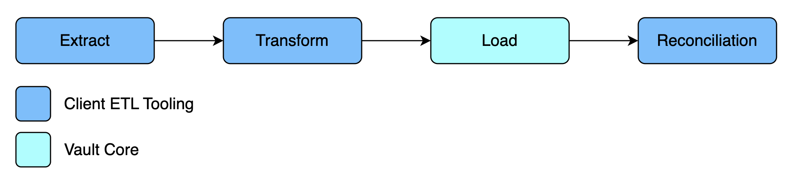
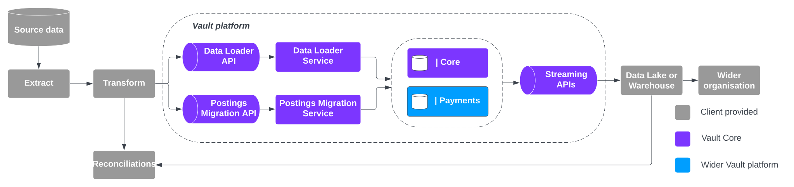
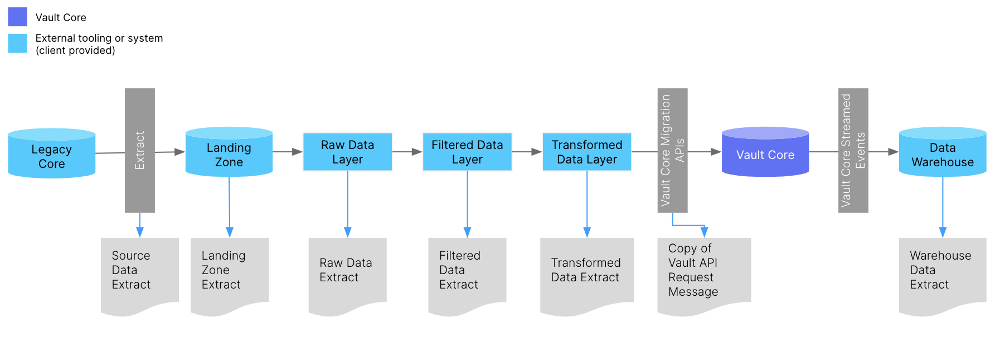
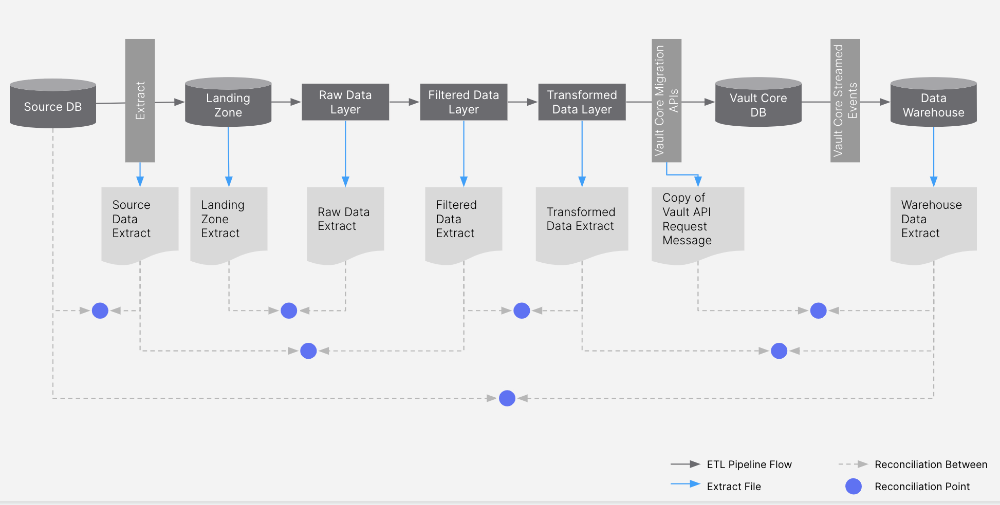

# Extract, transform, load (ETL) & reconciliation tooling design

## Purpose

*ETL tooling* is a general term used in this guidance to describe the tooling that executes the Extract, Transform, and Load process during a data migration event.

ETL tooling is sometimes referred to as the \`migration engine' or the \`migration / ETL pipeline'. Consider them interchangeable in the context of this guidance.

For a Vault Core migration the division of responsibilities between the ETL tooling and Vault Core itself is as follows:

-   **Extract**: Tooling to extract data from the legacy core. In practice data extraction should be a capability of your existing Core, or available from a downstream data lake or warehouse.
    
-   **Transform**: Tooling to transform legacy data into a format that can be loaded to Vault Core. This includes transforming data to meet the field formats and validation rules of Vault Core, creation of valid API request messages and the ability to execute these, and optionally data profiling and/or data quality analysis.
    
-   **Load**: Tooling to load data to the target database. Vault Core will manage the load process from the calling of our migration APIs through to the streaming of Kafka events notifying the outcome of the load.
    
-   **Reconciliations**: Tooling to execute data reconciliations throughout the ETL pipeline, including reconciling the Vault Core request messages with the associated streamed events. Vault Core provides the building blocks with which to execute data reconciliations, but not the reconciliation engine itself.
    

When zoomed out slightly, this relationship between Vault Core and the externalised ETL tooling will look like this:

If executed well this activity provides your programme with the following outcomes:

-   Fast, repeatable, flexible, and feature rich ETL tool that can be used with confidence in production migration events.
    
-   The ability to quickly identify and triage data load / reconciliation failures.
    

## Predecessor Activities

1.  Migration: [Migration Strategy](/delivery-framework/latest/EN/delivery_workstream/migration/migration_strategy)
    

## Guidance - Build or buy ETL tooling

An early and fundamental question to ask yourself on any core banking migration programme is *where will ETL tooling be sourced from?*.

As outlined in the [Migration Kickoff](/delivery-framework/latest/EN/delivery_workstream/migration/introduction_to_the_migration_programme_lifecycle#migration_programme_kickoff) (Resourcing question 5) there are a number of ways to approach ETL tooling when migrating into Vault Core, including:

-   **Reuse existing ETL Tool** - Reduced need for programme engineering resource but may put a dependency on securing specific bank SMEs to understand the existing solution.
    
-   **Build new ETL Tool** - Increased requirement for programme engineering resource to build the ETL tool but upsides in terms of development control and knowledge retention in the bank.
    
-   **Partner provides ETL Tool** - Reduced need for programme engineering resource but almost always a requirement to pay for additional partner delivery support to run the tool.
    

The functionality and source of ETL tooling for any given migration will therefore vary from project to project based on the answers to these, and other, questions. *There is no \`one size fits all' model*.

However, generally for Vault Core migrations we have experienced two patterns of behaviour across our clients with respect to provision of ETL tooling:

-   *Larger Banks* often have existing ETL tools or a desire to use the Vault Core migration as a vehicle to build them. Programmes can be multi-year and cover migrations to and from multiple systems (Core, Payments, Risk, etc.) so building something in-house that can be flexibly deployed across this long-term vision is a must.
    
    chat\_bubble
    
    Example tooling (does not constitute Thought Machine recommendations) - Datastage, Hadoop, GoogleBigQuery, AWS Lambda, AWS Elastic Container Service (ECS), Clover DX, .NET, Apache Airflow, Delivery Partner Proprietary Tooling. Database selection could include: AWS DynamoDB, AWS S3. Google Cloud Spanner.
    
-   *Smaller Banks* often require both delivery and tooling support to execute the migration, so using delivery partners that can provide that ETL tooling is an attractive solution that addresses both gaps. As these programmes tend to be relatively short and infrequent the cost-benefit of building a tool in house does not stack up. Where an outside partner is being considered to provide ETL tooling there are further considerations as described in the following section.
    

### Sourcing an ETL tool via a delivery partner

Most delivery partners that have experience of large core banking migration or modernisation programmes also have their own proprietary ETL tooling that can execute the Transformation and Reconciliation steps of the ETL pipeline.

Thought Machine has worked with several large global delivery partners to prove that their ETL tooling can integrate with Vault Core - accelerating any projects that then utilise this tooling. Specifically:

-   ETL Tooling that can support the key areas not catered for within the Vault Platform (Data Transform and Reconciliations).
    
-   ETL Tooling that has proven an integration into Vault Core using the Migration APIs (e.g. transform creates Vault Core request messages, reconciliations consumes streamed events, etc.).
    

For more information on delivery partners that have built and tested migration ETL accelerators or integrations with Vault Core, please contact your assigned Thought Machine representative.

If you are considering using a delivery partner on a Vault Core deliver then consider the below when making the decision:

  
| Area | Consideration(s) | More information |
| --- | --- | --- |
| 
Partner relationships

 | 

What relationships already exist with partners?Is there experience working on past core banking / migration programmes with a partner?

 | 

Understandably many banks will choose partners based on their past experiences and the strength and trust of existing relationships. This ideally should be the primary factor in choosing a delivery partner and not the detailed technical design of their ETL tooling.

 |
| 

Partner experience

 | 

Does the partner have relevant experience with other banks?Does this include working with 4th generation cores like Vault Core, or ideally Vault Core itself? Are the people that would be working on this project the same as those who worked on previous projects?

 | 

Large delivery partners may well have such experience in general terms, but it is important to understand how directly transferable this experience is to a Vault Core migration, and how likely it is that these individuals will be directly supporting this programme once it commences.

 |
| 

Partner tooling capabilities

 | 

How well does the partner’s ETL tool address the requirements of this migration programme?

 | 

The tooling should be interrogated to understand whether it meets the requirements established based on the answers to the ETL design considerations below.

 |
| 

Partner delivery requirements

 | 

Is delivery support also required from the partner?Which areas of delivery is partner support required in?

 | 

Many large professional services firms have their own in house ETL tooling that can be used to support migration activities. These often only come bundled with associated delivery support, so will need to be purchased as part of a wider services agreement to support migration delivery. If delivery support is not desired then this will make purchasing partner ETL tooling more challenging.

 |

## Guidance - ETL tooling design

When designing your ETL tooling the following general considerations can guide your decision making:

  
| Area | Consideration(s) | More information |
| --- | --- | --- |
| 
Migration experience

 | 

Is there a tried and tested pattern for executing migrations within the bank?Is there a preferred ETL pipeline, tooling, or ways of working?

 | 

If a bank has executed migration programmes in the past there will also likely be a proven or preferred set of tools and an understanding of the bank’s capability to execute a migration with or without partner support, which should inform the ultimate decision on ETL tooling for the current project. This experience may not sit within the division responsible for the project at hand so it is important to look across the business.

 |
| 

Existing ETL tooling

 | 

Is there existing tooling within the bank that can be used for the ETL?

 | 

Following on from the previous question, where there has been experience of running migration programmes there may be existing ETL tooling that can be leveraged for this programme. A gap analysis should be conducted to understand the capability of any such tools vs the requirements for this programme.

 |
| 

Tooling \`legacy'

 | 

Is the ETL tooling only being scoped for this programme or instead as a strategic solution for future programmes to also utilise?

 | 

The answer to this question will naturally inform the requirements gathering process, as strategic solutions will need to be built with reusability in mind. It will also inform whether it makes sense to \`borrow' tooling from a delivery partner (which means no reusability without paying for further delivery partner support on future programmes) or not.

 |
| 

Source Core extract

 | 

Is a method of extracting data from the source system available and well understood?Is there a source data dictionary to support data mapping?

 | 

It is important to understand how legacy data extracts will be taken. Some cores have simple and in-built mechanisms for extracting data, however others (particularly ageing mainframes) may present significant challenges in pulling legacy data in a usable format. In the worst instance this means additional coding effort using the language of the legacy core, which may now have a limited knowledge base within the organisation. There may be simpler alternatives to consider, such as pulling data extracts from downstream data warehouses or archives.

 |
| 

Data profiling requirements

 | 

Is data profiling in scope of this programme?

 | 

Data profiling is an entirely optional but very useful step in the migration process of running data through a set of queries to understand more about the data set (number of unique values, min/max values, etc.). It can be useful as an input to data mapping, but requires a tool that can configure these flexible profiling rules and then run them over a data set to produce meaningful results.

 |
| 

Data quality and cleanse requirements

 | 

Is data quality and cleanse in scope of this programme?

 | 

These are also generally considered optional steps in the migration process; however, where they are deemed to be in scope, this will need to be catered for by the ETL tooling.

Similar to profiling in the configuring and running of a set of business rules over a data set.

 |
| 

Data transfer requirements

 | 

How will data be transferred from place to place during the ETL process? Is the process secure?

 | 

You will need to decide what method (e.g. data room) will be used to move data through the ETL pipeline.

 |
| 

Data filtering requirements

 | 

Is a data filtering step required as part of transformation?

 | 

A common alternative to complex extract rules is to instead extract a superset of data and then filter this file within transform to cut down to only the data required for migration (e.g. removing closed accounts or removing out of scope brand).

 |
| 

Data enrichment requirements

 | 

Is a data enrichment step required as part of transformation?

 | 

If it is known or anticipated that data needed by the target system is stored in multiple systems on legacy, then the ETL tool needs to be able to handle multiple extract files from varying source systems, which will likely mean the enrichment of a core extract with extraneous data from other sources.

 |
| 

Data transform requirements

 | 

What database structure is used for holding the current data?What level of transform is likely to be required?

 | 

Generally an older hierarchical data structure may generate more complexity in the transformation process if a relational data set is needed, putting additional demand on the ETL tooling solution compared to a more modern core.

 |
| 

Data reconciliation requirements

 | 

What is the scope of proposed data reconciliations? Completeness and/or accuracy reconciliation? Will the reconciliation engine need to re-run transformation rules?

 | 

The scope and extent of reconciliations will influence the ETL tooling requirements to support this. The tool will need to be able to accept data formats generated at each stage of reconciliations (e.g. flat file from transform, streamed events from Vault load, and so on).

 |
| 

Event observability requirements

 | 

How will Vault’s streamed Kafka events be monitored during a migration event? What migration reporting/analytics does the programme require, and what tooling does it need for this? Will tracing be used to monitor end to end journeys (e.g. for parallel run)?

 | 

While clients may use the Vault Core Observability offering to support the migration, there should also be observability tooling deployed when running high volume migration activities so that load progress can be monitored end to end.

Under Vault SaaS there will be less Observability or insight due to the nature of the service. Example tooling (which does not constitute Thought Machine recommendations) - Data Dog, Grafana, Microsoft Power BI, Kibana and Tableau.

 |
| 

Other business requirements

 | 

What are the business requirements for the migration pipeline?For example, is it already known that the migration process needs to complete end-to-end in less than X hours?What business metrics are expected during the migration?

 | 

Such business requirements should also inform the tool selection process.

 |

### Transformation design

The Transform steps will vary between migrations, depending on the programme scope, cores, chosen tool, and so on.

The image below displays a possible end-to-end transformation journey for a data migration:

### Reconciliation design

The reconciliation engine design will depend on the scope of the reconciliations (number of reconciliation points, volume of data, required outputs, and so on). However, there are two tooling designs for accuracy reconciliations that are worthy of mention:

 
| Reconciliation approach | Description |
| --- | --- |
| 
**Comparison of data**

 | 

The reconciliation compares two data values, flagging either a match or mismatch.

This is the common implementation of reconciliations.

Depending on the data values compared you may have to account for intentional data change (e.g. resulting from data transform) to avoid \`false positives'.

 |
| 

**Re-run of rules**

 | 

The reconciliations engine not only compares data sets, but is also able to re-run transformation rules itself to create its own data set for comparison.

Here the reconciliations engine can effectively compare up to three files - the transformed data from the ETL process, the streamed Vault Core events, and the reconciliations engine’s own transformed data file which it generated using a copy of the source data file.

This means duplication of effort as transformation rules are coded twice, but if done correctly this can provide a trusted baseline against which the transform process itself can be tested, not just the load.

 |

With reconciliation tooling you should:

-   **Use a reconciliation database** as part of the overall reconciliation solution; this will store copies of the inputs (e.g. API requests) and outputs (e.g. streamed events) from the migration process.
    
-   **Identify the exhaustive set of terminal statuses** that a migrated resource can end up in on target, and ensure that the notification of this is being fed into the reconciliations process. In particular, when using API-based cores, include DLQs and other transient failure topics.
    
-   **Consider the low-level data required from source to meaningfully compare target outputs**, and feed these in where necessary. For example, to compare summary EoD balance positions across source and target you need the granular transaction/posting breakdown from source, and should feed this into the reconciliations engine. It is not useful to compare a summary number produced by two ledgers without the ability to drill down and identify failure points where these exist.
    

chat\_bubble

The [Usage Monitor](/vault-core/latest/EN/using_vault/core_apps_and_operations_dashboard/core_apps_and_operations_dashboard_guides/usage_monitor#logging_in_and_permissions) is unlikely to be a fit for purpose tool or app to support migration reconciliations. The number of migrated accounts or customers shown in the UI will only be updated once a month (this defaults to first of the month).

## Guidance - Data reconciliations

### Introduction to reconciliations

Data Reconciliation is the act of comparing two data sets, generated at different stages of a migration event, to check the completeness and accuracy of the associated data.

Reconciliations are a safety net, providing confidence that the data migration is proceeding as expected, moving the data, without loss or unexpected change, from source to target. To that end, precise (or almost precise) reconciliations are often a key component or measure in the migration cutover go/no-go decision.

chat\_bubble

For guidance on the data points to use from Vault Core to support your reconciliation please see the [Using Vault Core’s migration APIs](/vault-core/latest/EN/environment_and_installation/migrating_to_vault) guidance. This includes key guidance about whether to build your reconciliations on REST or Kafka API outputs. The remainder of this section focuses on the process and design of the reconciliation tooling from a programme rather than from a Vault Core perspective.

#### Types of reconciliation

We consider two categories of reconciliation:

 
| Reconciliation category | Description |
| --- | --- |
| 
**Operational reconciliations (Ops recs)**

 | 

Focus on reconciling operational bank data, for example counts of customer resources or comparisons of Account Status (Open, Closed, etc.) data values.

 |
| 

**Financial reconciliations (Fin recs)**

 | 

Focuses on reconciling £/$ values, for example balances. The approach, advice and thinking for financial reconciliations is often very similar to that used for operational reconciliations.

 |

Broadly speaking, two types of reconciliation can then be undertaken for each of these categories:

 
| Reconciliation Type | Description |
| --- | --- |
| 
**Completeness**

 | 

*Have I migrated all of the data that I expected to?* Checks to ensure that the volume or amount of data is consistent between the two data sets, e.g. I started with 100 customer records in my source extract, do I still have 100 customer records on my target system?

 |
| 

**Accuracy**

 | 

*Have I migrated the data values that I expected to?* Checks to ensure that the individual data values are consistent between the two data sets. For example, a user had a DoB of 12/11/1950 in my source extract, does this accurately reflect the DoB in my target system?

 |

The compared data does not have to be identical to pass the reconciliation check, because it may be changed for good reason as part of the ETL pipeline, such as in data transform. In order to pass the reconciliation, the data actually needs to meet *expectations* as per the migration design.

There are no rules for where in the migration pipeline reconciliations must take place, but good practice would be to undertake a reconciliation whenever data moves either position or state:

 
| Reconciliation Trigger | Description |
| --- | --- |
| 
**Data changes place**

 | 

Whenever data is moved from one area, system, environment, or platform to another (e.g.landing zone to raw data layer).

 |
| 

**Data changes state**

 | 

Whenever data values are altered (e.g. when undertaking transform or data quality cleansing).

 |

It is common for a migration programme to have a number of reconciliation points across the migration process, the exact number of which will increase or decrease depending on the architectural and data complexity of the programme.

### Identifying data to reconcile

*Critical data attributes* are data items deemed important enough to include in the scope of a data reconciliation.

Most data reconciliations do not cover every field in scope for migration, instead they rely on the identification of a subset of critical fields.

chat\_bubble

There are no uniform rules for what constitutes critical data attributes in the context of a Vault Core migration event. The specific fields chosen by you will depend entirely on business processes, risk appetite, and approach to reconciliations.

Critical data attributes should be agreed with the programme’s business stakeholders early in the design process. These critical fields are essentially the reconciliation requirements and therefore the foundations of the reconciliation scope.

It is also important to agree during the design phase whether there will be a distinction between primary and secondary reconciliations during the event:

-   *Primary reconciliations* represent those that must be 100% accurate and the migration will not proceed if this is not achieved.
    
-   *Secondary reconciliations* are those that *should* match but the event can proceed if there is a mismatch. Tolerances (such as <1% failures needed to progress) can also be used.
    

These primary and secondary reconciliations and tolerances should be agreed with the business so that all stakeholders know how to proceed prior to starting the migration event.

The scope of reconciliations will therefore vary depending on the agreed approach and critical data attributes. However, a Core banking migration would expect to at the very least reconcile:

1.  Resource-level (i.e. Customer, Account, etc.) counts.
    
2.  Resource-level migration status checks.
    
3.  Accuracy reconciliations for key business fields such as Account Status, Account Opening Date, Customer Name, Customer Address, etc.
    
4.  Accuracy reconciliations for customer Balance positions (including individual balance addresses)
    
5.  Accuracy reconciliations for Internal Account Balance positions
    

Not all reconciliations need to be both completeness and accuracy checked. Completeness checks are more basic and common, and will usually take place at all defined reconciliation points. Accuracy is more complex because it requires a thorough comparison of individual data items which may be impacted by transform rules, and will take place on a limited number of important reconciliation points. This importance could be a result of:

-   Particularly complex data movements or transforms
    
-   Final points ahead of operational live loads (final point to catch an issue before loading to live)
    

### Identifying reconciliation points

When the ETL pipeline is defined, you can overlay a reconciliation plan on top of this. Annotate any time data moves state or position, and then decide which are important enough to execute a reconciliation.

This results in a simple reconciliation plan similar to the image below. This plan will drive data extract and reconciliation engine requirements in subsequent steps.

Below is an example of where reconciliations could take place across a generic migration lifecycle based on past Vault project experience. The migration steps, ops reconciliations points, etc. will vary depending on the migration architecture:

### Creating reconciliation reports

Results of reconciliation checks are normally gathered into reports, including details of any identified anomalies, and presented at checkpoints throughout a migration event.

These reports are a key input to go/no-go decisions.

chat\_bubble

There is no single format for reconciliation reports. The raw reports may be in an Excel (or similar tabular) format, and you could translate these into slide packs for presentation at [Migration Event Command & Control](/delivery-framework/latest/EN/delivery_workstream/migration/event_preparation) meetings.

#### Considerations for high-quality reconciliations outputs

It is important to work alongside key programme business and technology stakeholders throughout the development of financial and operational reconciliations.

When building reconciliations outputs:

-   **Make them easy to understand** by business stakeholders to achieve their intended aim (normally clarity and confidence that the programme is in control of the migration outcomes). Provide different outputs according to the audience; it is likely that the presentation of the reconciliation results will get simpler the higher you go in the bank programme hierarchy. Results should also be presented in a format that all stakeholders are already familiar with so there are no surprises or confusion about the output during critical go-lives.
    
-   **Click-through reconciliations** are key; these are reconciliations where getting from the summary issue (total customer balances across all accounts do not match) to the specific root cause (particular postings for a given number of accounts that do not match), is quick, simple, and does not require offline activity (Excel copy-pasting, joins with other tables, manual analysis, etc.). This means getting access to granular reconciliations inputs from both source and target, and feeding these into the process from the beginning.
    
-   **Consider using simple graphs and tables** to visually show the reconciliation success and failure numbers with failure reasons, focusing only on those that require input or a decision from the business. Where an issue has no customer impact (perhaps a false positive in the rec itself), consider the best way to present this, balancing honesty with over-sharing.
    
-   **Know what to do with reconciliation failures**. Depending on the nature and volumes of the reconciliation issue you may accept a proportion of data not reconciling and continue with the migration process, rather than having a no-go or fixing via a delta load. Take each reconciliation issue on a case by case basis.
    

## Templates

Thought Machine does not have any templates to support the delivery of this activity.

### Disclaimer

See the Disclaimer relating to this and all other Vault Core Delivery Framework pages [here](/delivery-framework/latest/EN/getting_started/disclaimer/).