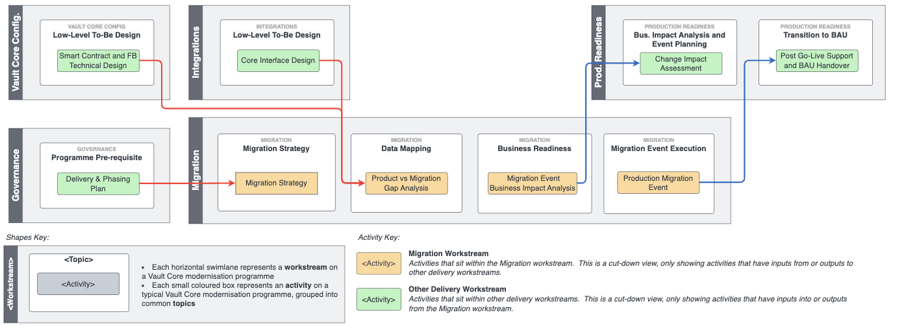

# Migration kick-off

## Purpose

Migration \`kick-off' is the formal commencement of the migration workstream and the \`groundwork' activities that you should undertake before getting stuck into [Migration Strategy](/delivery-framework/latest/EN/delivery_workstream/migration/migration_strategy) and the end-to-end migration lifecycle that follows.

As migration activities are mostly dependent on the completion of precursor activities in other [Delivery Workstreams](/delivery-framework/latest/EN/getting_started/how_to#delivery_workstreams) its kick-off normally occurs a little way into programme delivery after the other workstreams have already commenced.

If executed well this activity provides your programme with the following outcomes:

-   A workstream that is sufficiently:
    
    1.  scoped,
        
    2.  resourced,
        
    3.  structured, and
        
    4.  upskilled to execute the rest of the migration lifecycle.
        
    
-   Appreciation of the dependencies between migration and other delivery activities / workstreams.
    

## Predecessor Activities

1.  Governance: [Delivery & Phasing Plan](/delivery-framework/latest/EN/delivery_workstream/governance/delivery_and_phasing_plan)
    

## Guidance - Kick-off activities

At the kick-off stage you should not attempt to find and solve migration design issues or answer migration strategy questions (these activities follow in subsequent activities).

Instead focus on commencing a workstream that addresses the points below:

### 1\. Scoping

Starting with the (very) obvious, it is important to have a common and clear understanding of the 'macro' migration scope at the point of workstream kick-off.

Macro migration scope in this context does not mean the migration strategy or lower-level design decisions (tranching approach, in-flight handling, posting history requirements, etc.) but rather for this programme / transition state:

-   Which products are in scope for migration?
    
-   What are the rough account volumes?
    
-   What is the overall programme delivery plan / sequencing? (e.g. deposits first, then savings, etc.)
    

Too many programmes do not answer these questions coherently before they commence the migration workstream, which makes executing the [Migration Strategy](/delivery-framework/latest/EN/delivery_workstream/migration/migration_strategy) activity challenging and risks rework if the answers to these questions are materially different to assumptions made in their absence.

chat\_bubble

The answers to these questions should be an output of the [Product and Transition Roadmap](/delivery-framework/latest/EN/delivery_workstream/business/product_and_transition) or [Delivery & Phasing Plan](/delivery-framework/latest/EN/delivery_workstream/governance/delivery_and_phasing_plan) activities earlier on in the modernisation programme lifecycle.

### 2\. Resourcing

Core banking modernisation programmes can, depending on their scope and strategy, involve hundreds of resources at their peak.

Consider the following when resourcing your migration workstream:

1.  **Which skills are required to deliver the migration workstream?**
    
    -   Broadly speaking, the activities that form the [Migration Workstream Activity Map](/delivery-framework/latest/EN/delivery_workstream/migration#activity_map) are split between those that are business analysis focused (Data Mapping, Product vs Migration Gap Analysis, Data Quality, Migration Event Command & Control, etc.) and those with a technical engineering focus (ETL & Recs Tooling, Migration Environment Setup, Migration ETL Testing, Migration Event Execution, etc.).
        
    -   A well resourced migration workstream recognises this and balances its resources across both skill sets.
        
    
2.  **How are bank resources being allocated to the migration workstream?**
    
    -   Where resources are being called upon from your bank’s IT/Business functions to support the migration workstream you should ideally formally second them into the programme itself rather than borrowing FTE on an informal basis or agreeing a temporary job share.
        
    -   Larger migrations can be multi-year endeavours where delivery timelines and priorities can be fluid, so it is unrealistic to expect to be able to execute them with fractions of resources that have a day-job elsewhere in the bank.
        
    -   Where calling upon bank SMEs to support specific point in time activities (e.g. to support data mapping as a legacy system SME) ensure that a commitment for these resources time is agreed well in advance of it being required with the appropriate leadership in the bank.
        
    
3.  **Does your organisation have the resource capacity and / or skills to execute the entire migration workstream end-to-end?**
    
    -   Bearing in mind the [Migration Workstream Activity Map](/delivery-framework/latest/EN/delivery_workstream/migration#activity_map) and the potential [role of Thought Machine within Vault Core migration programmes](/delivery-framework/latest/EN/delivery_workstream/migration/introduction_to_the_migration_programme_lifecycle#guidance_thought_machine_delivery_support) it is important to quickly understand whether or not you are going to be able to resource the migration programme using existing/newly hired bank staff or whether a delivery partner is required.
        
    -   Questions to ask yourself:
        
        -   What experience exists internally about executing production migrations of this scope / scale?
            
        -   Is it realistic for internal resources be seconded into this programme for the time required?
            
        -   How many internal resources can be seconded or hired and do the timelines for resourcing align with the programme delivery dates as known today?
            
        
    
4.  **Where can delivery partners support the migration workstream?**
    
    -   Partner as defined here means a third-party providing support to the programme with resource augmentation to aid in migration delivery. A.k.a. consultant, systems integrator, etc.
        
    -   The role of delivery partners is clearly flexible, though in our experience we see two archetypes of delivery partners supporting the migration workstream:
        
        1.  *Delivery partners for strategic planning*: Larger clients tend to use delivery partners primarily for strategic programme planning. These are often large complex transformation programmes of which the Vault migration is only one element. Strategic support can help shape and sell the overall programme value proposition and support key decisions around technologies and overall architecture, including informing the migration strategy.
            
        2.  *Delivery partners as resource augmentation for executing the migration delivery lifecycle*: Smaller clients tend to use delivery partners as resource augmentation for programme delivery itself (executing data mapping, codifying transform, running tests, etc.). These clients tend to have less direct experience of executing migration programmes and the expertise. Many delivery partners will also have [ETL Tooling](/delivery-framework/latest/EN/delivery_workstream/migration/extract_transform_and_load_etl_tooling_build#build_or_buy) that they can provide, though this is normally dependent on a commitment about ongoing resource augmentation to deliver the ETL build.
            
        
    -   Ensure that you fully understand the value that you are getting from your chosen delivery Partner, with clarity about delivery accountability or scope. Ground this in something real, such as the [Migration Workstream Activity Map](/delivery-framework/latest/EN/delivery_workstream/migration#activity_map) to cut through ambiguity and be clear on delivery outcomes you will receive when signing statements of work.
        
    -   Ensure that the dependencies on any Partner activities are well understood from the outset, particularly if you are expected to fulfil these (e.g. partner will provide ETL tooling but you are responsible for providing the underlying environments and infrastructure to deploy this tooling on).
        
    -   You will need to do your own cost / benefit analysis regarding whether delivery partners are worthwhile bringing onto your programme considering the factors above.
        
    -   Thought Machine has relationships with many delivery partners, including a handful of delivery partners that have proven their ETL tooling integrations with Vault Core, which can execute the elements of the ETL pipeline not catered for by Vault Core. Reach out to your assigned Thought Machine representative for more information.
        
    
5.  **Where will ETL tooling be sourced from?**
    
    -   ETL tooling is the means through which the migration pipeline will be executed, and though there are a variety of potential options here (explored further in the [ETL & Recs Tooling Design](/delivery-framework/latest/EN/delivery_workstream/migration/extract_transform_and_load_etl_tooling_build#build_or_buy)), it is important to recognise at this early kick-off stage that these can have significant resourcing implications:
        
        -   **Target System includes an ETL Tool** (not applicable for Vault Core) - reduced need for programme engineering resource but may put a dependency on securing target SME consultancy to understand the tooling provided.
            
        -   **Reuse existing ETL Tool** - reduced need for programme engineering resource but may put a dependency on securing specific bank SMEs to understand the existing solution.
            
        -   **Build new ETL Tool** - increased requirement for programme engineering resource to build the ETL tool but upsides in terms of development control and knowledge retention in the bank.
            
        -   **Partner provides ETL Tool** - reduced need for programme engineering resource but there is almost always a requirement to pay for additional partner delivery support to run the tool.
            
        
    -   For Vault Core migrations specifically, Vault Core only executes the migration Load (which rules out the first sub-bullet above as an option), so you will need to factor in finding, building, or purchasing an ETL tool into your programme planning and resourcing. In summary, the Vault Core migration capability covers the following elements of the ETL lifecycle:
        
    

chat\_bubble

We have detailed credentials for past Vault Core migrations that include a rough breakdown of the total FTE effort expended by the migration workstream split by:

1.  Bank
    
2.  Partner
    
3.  Thought Machine resources
    

These can be used as a (caveated) indication of effort for different bank sizes and programme contexts. Reach out to your assigned Thought Machine representative for more information.

### 3\. Org structure

Organisational structure is an important factor in determining core banking modernisation programme success.

Strictly speaking these recommendations apply to the core modernisation programme as a whole and not just the migration workstream, but given their importance to migration we have called them out here once again:

 
| Recommendation | Details |
| --- | --- |
| 
Have difficult conversations about internal programme ownership early.

 | 

Identify and quickly resolve any difficult conversations about, for example, which business unit is \`leading' the programme, whose change budget/function the programme sits within, which bank reporting line is ultimately accountable for delivery, etc.

 |
| 

Analyse the optimum delivery model for your programme.

 | 

Programme scope and size should heavily inform the chosen org structure. The programme could follow one of the below approaches; each of which has pros and cons, trading off speed with control and consistency:

\* A federated model, passing accountability down to a number of federated migration workstreams with limited central oversight

\* A centralised model where responsibility sits within a core migration function

\* A \`hub and spoke' model with a strong central migration programme team setting the programme direction with delivery work undertaken by federated workstreams that regularly interact with the core team

 |
| 

Decide whether to structure migration programme workstreams around Business or IT functions.

 | 

Where a programme spans multiple systems (i.e. Core migration, Customer migration, Payment migrations, etc., perhaps a result of an acquisition), you may need separate workstreams to deliver the migration programme lifecycle for each system. These workstreams can then be structured to align with either the bank’s Business (e.g. Customer, Risk, Credit Cards, etc.) or IT (enterprise data, digital, functions), the choice of which will change the driving party and accountability underpinning each workstream.

 |

### 4\. Learning

Any resources supporting the migration workstream, including both the bank and any delivery partners, should undertake the standard Vault Core migration learning pathway.

This includes the following:

-   Completing the Migration [Enablement Training](https://academy.thoughtmachine.net/).
    
-   Reading the Vault Core Migrations - Tech Deck (reach out to your assigned Thought Machine representative for access).
    
-   Reading the Vault Core migration API specs and guidance as detailed in the callout box at the top of the page [here](/delivery-framework/latest/EN/delivery_workstream/migration).
    

## Guidance - Kick-off timing

Within the Thought Machine Delivery Framework we consider migration as one of a number of delivery workstreams that make up a core banking modernisation programme as a whole.

Accordingly, it is important to recognise from the outset that:

1.  You should not assume that [Data Mapping](/delivery-framework/latest/EN/delivery_workstream/migration/data_mapping) will ask and answer questions about how the target product should behave in its BAU state, as this should have already been established during the earlier Product design phase.
    
2.  Migration is dependent on some outputs from other delivery workstreams. This can limit how far through the migration delivery lifecycle you can progress until certain dependencies have been met, and factor this into early programme planning.
    
3.  However, you should not simply fall back on a waterfall planning whereby migration is entirely offset from Product build, and instead look for opportunities to parallelise activity as much as possible to ensure optimum route to live.
    
    1.  For example, undertake [Migration Strategy](/delivery-framework/latest/EN/delivery_workstream/migration/migration_strategy), [Migration Environment Setup](/delivery-framework/latest/EN/delivery_workstream/migration/tooling_and_environment_setup), [ETL & Recs Tooling Design / Build](/delivery-framework/latest/EN/delivery_workstream/migration/extract_transform_and_load_etl_tooling_build), or [Data Profiling](/delivery-framework/latest/EN/delivery_workstream/migration/data_quality_and_cleanse), whilst Product design is ongoing as these are not dependent on the Product design outputs.
        
    

In the Vault Core Delivery Framework we highlight what we consider to be the minimum dependencies to initiate each migration activity, which includes some dependencies from other delivery workstreams:

 
| Activity | Dependency & Rationale |
| --- | --- |
| 
[Migration Strategy](/delivery-framework/latest/EN/delivery_workstream/migration/migration_strategy)

 | 

Dependency on *Delivery Phasing & Strategy*

The Delivery Phasing & Strategy activity will confirm amongst other things; the macro programme scope and transition states, the order that products will deploy in, and whether there is a new-to-bank deployment in advance of any migrations.

Migration strategy needs to inherit these key programme level decisions before it can then go one level deeper to agree how the migration will execute within these already agreed confines.

 |
| 

[Product vs Migration Gap Analysis](/delivery-framework/latest/EN/delivery_workstream/migration/smart_contract_migration_build_and_test)

 | 

Dependency on *Smart Contract and Feature Block Technical Design & Core Interface Design*

The \`meat' of the migration delivery workstream should not commence until the Product has been well defined.

For example, the Migration workstream should not be the first team to answer the question \`do I need to migrate Flags?'. The question should instead be directed back into the programme - \`does the Product that the programme’s [Vault Core Config Workstream](/delivery-framework/latest/EN/delivery_workstream/vault_core_config) has built utilise Flags in its BAU state on Vault Core?'. If yes, then we almost certainly have to migrate some Flags, if not, the opposite.

 |

## Guidance - Thought Machine delivery support

We offer both consulting and delivery support for the Migration Workstream:

-   *Consulting*: Provided by experienced migration SMEs that can act as trusted advisors to the programme, that are called upon as and when required, offering support that is primarily consultative in nature but who are not afraid to \`get hands dirty'. Broadly speaking support covers both:
    
    -   Understanding Vault Core’s functional migration capability
        
    -   How to execute successful migration programmes, expanding on the content contained in this guidance, and covering the full breadth of activities that we provide guidance for within the [Migration Workstream Activity Map](/delivery-framework/latest/EN/delivery_workstream/migration#activity_map)
        
    
-   *Delivery*: Ownership and accountability of day-to-day migration delivery with a larger team supporting. Delivery support is limited to only migration strategy and data mapping activities, and only in certain programme contexts.
    

For more information about the Thought Machine service offering, relating to either migration or any other delivery workstream, please contact your assigned Thought Machine representative.

chat\_bubble

Where you require migration delivery support in executing your end-end migration programme, including technical ETL build, you should consider onboarding a consulting partner. We can provide references for partners that have supported Thought Machine migration programmes in the past or have accelerators that have proven integrations with our migration APIs. For more information please contact your assigned Thought Machine representative.

## Templates

Thought Machine does not have any templates to support the delivery of this activity.

### Disclaimer

See the Disclaimer relating to this and all other Vault Core Delivery Framework pages [here](/delivery-framework/latest/EN/getting_started/disclaimer/).