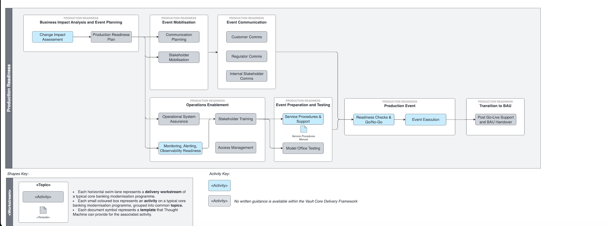

# Production Readiness Workstream

## Overview

Production Readiness refers to the set of activities necessary to undertake in preparation for launch of any new product, platform or process. It forms the foundation for a successful launch, mitigates risks, and contributes to the long-term success and sustainability of the offering in the market. It is an investment in customer satisfaction, brand reputation, and overall business success.

It encompasses business/operational readiness and technical readiness within the organisation and externally where necessary with the key objectives being to reduce delivery risk, ensure coordination and transparency across the entire value chain and enable the organisation to transfer smoothly into Business As Usual (BAU) mode.

The focus and time dedicated to individual activities will vary to a greater or lesser extent depending on the production event the organisation is undertaking. Large scale transformation events will require broader and deeper engagement with most activities compared with regular \`minor' systems upgrades, however the workstream provides a framework that enables an organisations teams to make conscious decisions about the preparation activities they need to take ahead of a production event.

-   Business/Operational Readiness:
    
    -   Preparedness of end-to-end stakeholders in the value chain from Customer Service Agents to backend operations teams including finance and risk management to accept and adopt new products, platforms or processes.
        
    -   Customer impact management.
        
    -   Regulatory and legal compliance.
        
    
-   Technical Readiness:
    
    -   Implementation and adoption of tooling for observability and monitoring of the platform and the adoption into BAU.
        
    -   Implementation and adoption of tooling to support the management and servicing of customers, accounts and transactions within branch, customer service operatives and Level 2 technology support functions.
        
    

## Activity Map

## Activities

You can find detailed guidance on activities highlighted in blue via the links below:

 
| Activity | Description |
| --- | --- |
| 
[Change Impact Analysis](/delivery-framework/latest/EN/delivery_workstream/production_readiness/change_impact_analysis)

 | 

The activity to understand the impact any given change to the production environment will have and to whom in the value chain.

 |
| 

[Production Readiness Plan](/delivery-framework/latest/EN/delivery_workstream/production_readiness/production_readiness_plan)

 | 

This activity results in the creation of a plan that describes the end-to-end steps necessary to successfully coordinate and deliver the change into production.

 |
| 

[Communication Planning](/delivery-framework/latest/EN/delivery_workstream/production_readiness/communication_planning)

 | 

The communication planning activity for a given go-live event addresses to whom, when and through what medium stakeholders in the end-to-end value chain will be communicated to pre, during and after the event. The activity is enacted to provide transparency to all affected stakeholders and is the means of ensuring effective coordination of the Production Readiness Plan. The activity should take an input the programmes overall Change and Communication Strategy.

 |
| 

[Stakeholder Mobilisation](/delivery-framework/latest/EN/delivery_workstream/production_readiness/stakeholder_mobilisation)

 | 

Stakeholder mobilisation is the act of coordinating all of the individual parties to be available at the necessary time and the necessary place in accordance with the activities in the Production Readiness Plan such that they can perform those steps for which they are assigned.

 |
| 

[Customer Comms](/delivery-framework/latest/EN/delivery_workstream/production_readiness/customer_comms)

 | 

Where it is required, this is the activity of communicating to the organisations customers in relation to the specific go-live event. This may be necessitated by regulation e.g. as T&Cs will be materially affected, to provide notice of disruption to service, or simply to market new products or features. The Comms will be executed as per the Communication Plan.

 |
| 

[Regulator Comms](/delivery-framework/latest/EN/delivery_workstream/production_readiness/regulator_comms)

 | 

Where it is required, this is the activity of communicating to the organisations regulators in relation to the specific go-live event. This may be legally obliged in certain scenarios or may be to ensure transparency in others. It may be that prior to a go-live event (as well as during and post-execution) a regulator is required to provide certain sign-offs and this activity, as executed per the Communication Plan will ensure that necessary information is shared in a timely fashion.

 |
| 

[Internal Stakeholder Comms](/delivery-framework/latest/EN/delivery_workstream/production_readiness/internal_stakeholder_comms)

 | 

The primary purpose of internal communications is to coordinate the set of activities that will be defined in the go live event runbook as part of the Production Readiness Planning activity; prior to, during and post execution. Additionally, communication may also be informative to a broader spectrum of internal stakeholders either for general awareness or because post go-live event the recipient will need to change some aspect of their operation. The Comms will be executed as per the Communication Plan.

 |
| 

[Operational Systems Assurance](/delivery-framework/latest/EN/delivery_workstream/production_readiness/operational_systems_assurance)

 | 

Depending on the scope of the production event, operations staff on the front line (customer facing) or back office may be required to perform new or updated operations as a result. This activity, where applicable to the specific go-live event, is intended to assure that the necessary interfaces are in place that will allow these operational staff members to perform their duties as they relate to the new service, product or process that is being deployed.

 |
| 

[Logging](/delivery-framework/latest/EN/delivery_workstream/production_readiness/logging_monitoring)

 | 

The activity assesses that for a given change event, appropriate logging, monitoring, alerting and observability has been configured that will then be built into operational BAU procedures post the go live event.

 |
| 

[Stakeholder Training](/delivery-framework/latest/EN/delivery_workstream/production_readiness/stakeholder_training)

 | 

Where the Operational Systems Assurance and Logging, Monitoring, Alerting, Observability Assurance activities ensure that tooling is in place to service the change resulting from the go-live event, the Stakeholder Training activity is the act of enabling the people who need to interact with these tools and interfaces to use and understand them.

 |
| 

[Access Management](/delivery-framework/latest/EN/delivery_workstream/production_readiness/access_management)

 | 

Closely related to Stakeholder Training, this activity is specifically defined to ensure that any stakeholders in the value chain, particularly those monitoring the health of what has been released or engaging with it, have the necessary access and permissions to tools, interfaces, data and documentation required to perform their expected operational duties in the Production environment. Equally this activity could relate to end customers and ensuring they too will have the required access permissions post go-live as necessitated by the specific change.

 |
| 

[Service Procedures & Support](/delivery-framework/latest/EN/delivery_workstream/production_readiness/service_procedures)

 | 

This activity results in the creation or updating of a Service Procedures document which combines the processes and procedures agreed to run the maintenance of the system for the end-users by the application owners. As well as the high level contract between parties to define the service levels and procedures to be followed, the activity will also ensure that documentation is updated in relation to the change to describe healthy and unhealthy state, what to monitor and actions to take to mitigate/remediate in the event of an error.

 |
| 

[Model Office Testing](/delivery-framework/latest/EN/delivery_workstream/production_readiness/model_office_testing)

 | 

The purpose of the Model Office Testing activity is to ensure that once the go live event has been executed, teams in the end-to-end value stream, and in particular those within the Level 1-N support organisation, are able to respond appropriately to expected and exceptional incidents that might realistically occur. The activity must evaluate whether the operational processes are in place, understood and can be followed such that in the event of an incident all appropriate action will be taken.

 |
| 

[Readiness Checks and Go/No Go](/delivery-framework/latest/EN/delivery_workstream/production_readiness/readiness_check_go_no_go)

 | 

The Readiness Check and Go/No Go activity is the governance forum held to review the pre-requisites required for approval to be given to execute the go-live event. The pre-requisite activities will include those within the Production Readiness workstream and some external, such as the End-to-End Test Execution activities. All key stakeholder groups will be represented in the forum however the ultimate sign-off(s) will be defined based upon the scope of the change, the perceived impact/risk and the responsibilities defined by the Change Control Board.

 |
| 

[Event Execution](/delivery-framework/latest/EN/delivery_workstream/production_readiness/event_execution)

 | 

This activity represents the execution of the steps required to promote the subject of the change event into Production, after which it will be handed over and subject to monitoring and maintenance by those responsible for Business As Usual (BAU) / Run The Bank (RTB) operations.

 |
| 

[Post Go-Live Support and BAU Handover](/delivery-framework/latest/EN/delivery_workstream/production_readiness/post_go_live_support)

 | 

This activity is the formal handover of the deliverable, be it a new application, feature or process, following on from the go-live event. BAU handover may be immediate or may follow a period of warranty offered by those responsible for the delivery. Those who were participants in the Stakeholder Training and Model Office Testing activities will be amongst those whom handover is provided and may entail further validation of necessary Access Management following the go-live event.

 |

## Disclaimer

See the Disclaimer relating to this and all other Vault Core Delivery Framework content [here](/delivery-framework/latest/EN/getting_started/disclaimer/).

Thought Machine Confidential Information.

© 2025 Thought Machine Group Limited. All rights reserved.

* * *