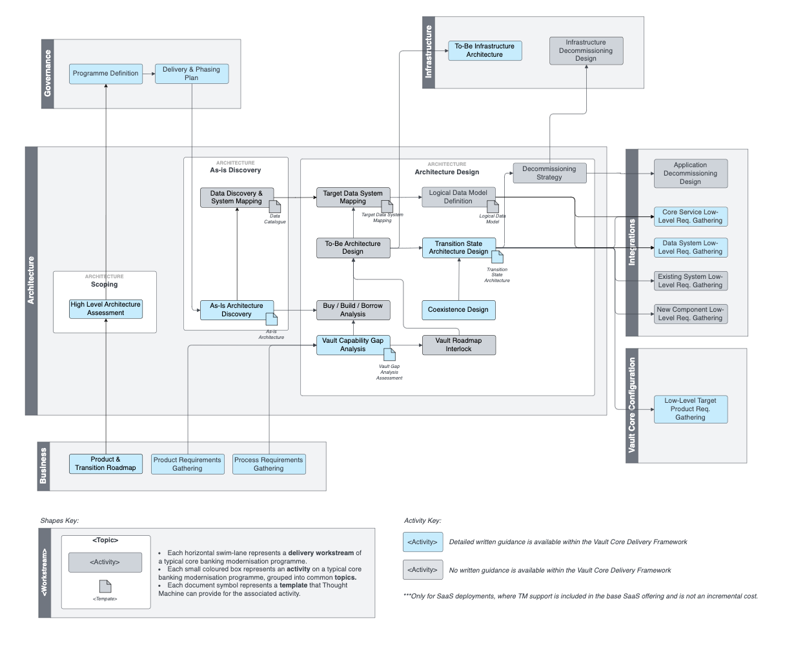

# Architecture Workstream

## Overview

The purpose of the Architecture workstream is to define the target functional architecture of the overall solution and also the architectures for the key transition states towards that target. Key activities are:

-   Discovery exercise to understand as-is state of the architecture including existing cores and systems integrating with them that underpin the overall banking stack
    
-   Identification of systems in scope for replacement and those that will remain but will be impacted by the replacement
    
-   Identification of new components required and definition of what technology will be used to implement those components
    
-   Functional mapping of target capabilities to components within the architecture in order to bound the scope of delivery workstreams implementing the respective components
    

Outputs of this workstream will inform the target infrastructure design and input into component delivery workstreams across Vault Core Config and other integrations. Key inputs are overall product requirements, target process definitions and programme phases and milestones.

## Activity Map

## Activities

You can find detailed guidance on activities highlighted in blue via the links below:

 
| Activity | Description |
| --- | --- |
| 
[High Level Architecture Assessment](/delivery-framework/latest/EN/delivery_workstream/architecture/high_level_architecture_assessment)

 | 

A high level assessment of the bank’s existing core estate, often including an articulation of high level target state and transition states approach. This corresponds to each of the phases set out in the Product & Transition Roadmap.

 |
| 

[As-Is Architecture Discovery](/delivery-framework/latest/EN/delivery_workstream/architecture/as_is_architecture_discovery)

 | 

The exercise to analyse the existing systems integrating with the current core and how they are used to execute in-scope business processes.

 |
| 

Data Discovery & System Mapping

 | 

Definition of the strategy for streaming and accessing core data outside of Vault Core within online and offline data hubs.

 |
| 

[Vault Core Capability Gap Analysis](/delivery-framework/latest/EN/delivery_workstream/architecture/gap_analysis)

 | 

Vault Core Capability Gap Analysis is an exercise to take the in-scope capabilities and processes that need to be supported by the target solution and analyse whether they can be fully or partially met within Vault Core or whether they need to be implemented elsewhere.

 |
| 

Vault Roadmap Interlock

 | 

Vault Roadmap Interlock is an exercise to compare required capabilities not currently met by Vault Core with planned features on the Vault Core roadmap or backlog to identify whether capability gaps will be filled within the programme delivery timeframe and make recommendations regarding whether to interlock with the Vault Core delivery, accelerate it, or build the strategic capability outside of Vault Core.

 |
| 

Buy - Build - Borrow Analysis

 | 

For any capabilities being met outside of Vault Core, an analysis as to whether to buy a service from another vendor, build the capability in house or integrate within an existing system within the client.

 |
| 

[Coexistence Design](/delivery-framework/latest/EN/delivery_workstream/architecture/coexistence_design)

 | 

Document setting out the approach to co-existence during the period of migration to the target stack, identifying how payments routing, data aggregation to downstream systems and channel system routing will function during the period where a book of accounts is split between legacy and new cores.

 |
| 

To-Be Architecture Design

 | 

Definition of the target state for the core banking estate within the time horizon of the programme, identifying the product set that will be running on Vault Core, the target systems providing key strategic capabilities outside of Vault Core and the target deployment topology.

 |
| 

Target Data System Mapping

 | 

Mapping of the systems from the current to target landscape. Can be considered an input into [Migration](/delivery-framework/latest/EN/delivery_workstream/migration)

 |
| 

[Transition State Architecture Design](/delivery-framework/latest/EN/delivery_workstream/architecture/transition_state_architecture)

 | 

Articulation of key transition states during interim delivery phases of the programme before target state is achieved, factoring coexistence strategy identified within the Coexistence Design.

 |
| 

Define Logical Data Model

 | 

Definition of the data entities and where they will exist in the coexistence and target architecture. Ultimately supports the coexistence design and migration activities.

 |
| 

Decommissioning Strategy

 | 

Overall strategy for decommissioning of applications as workload is migrated to the new stack including what applications can be decommissioned when and what additional steps need to be undertaken in order to enable that (for example data archival).

 |

## Disclaimer

See the Disclaimer relating to this and all other Vault Core Delivery Framework content [here](/delivery-framework/latest/EN/getting_started/disclaimer/).

Thought Machine Confidential Information.

© 2025 Thought Machine Group Limited. All rights reserved.

* * *