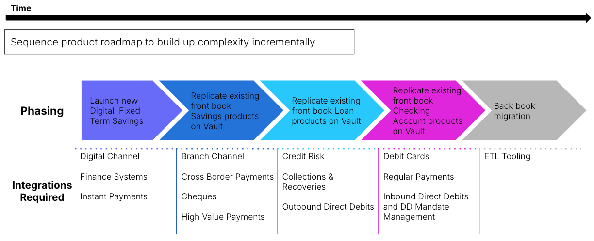

# Transition State Architecture Design

## Purpose

The objective of the Transition State Architecture is to provide a roadmap for the phased implementation of changes required to modernise the as-is architecture to the desired target state architecture.

This transition planning phase is crucial as it involves managing the complexities, risks, and challenges associated with adding new or updating existing capabilities to support the future state of the client.

## Predecessor Activities

1.  Business:[Product Strategy](/delivery-framework/latest/EN/delivery_workstream/business/product_strategy)
    
2.  Architecture:[Coexistence Design](/delivery-framework/latest/EN/delivery_workstream/architecture/coexistence_design)
    
3.  Business: [Product Requirements Gathering](/delivery-framework/latest/EN/delivery_workstream/business/product_requirements)
    
4.  Business: [Process Requirements Gathering](/delivery-framework/latest/EN/delivery_workstream/business/process_requirements)
    
5.  Business: [As-Is Architecture Discovery](/delivery-framework/latest/EN/delivery_workstream/architecture/as_is_architecture_discovery)
    

Outputs:

For each Transition State:

1.  Transition state state architectural diagrams depicting the systems in scope for that transition state along with the relationships between them
    
2.  A catalogue of applications introduced, impacted or retired within the transition state, articulating the nature of the impact
    
3.  A catalogue of the integrations introduced, impacted or removed within this transition state
    
4.  Identification of teams either within the programme or within the wider bank who will need deliver any of the identified changes within this transition state
    
5.  A set of Architecture Design Decisions clearly listing any:
    
    -   Strategic drivers and trade-offs
        
    -   Technical debts either incurred within this transition state or carried forward from the previous
        
    
6.  Identification of any architectural risks introduced within this transition state and details of mitigations and remediation plans in subsequent phases
    

## Guidance

**Overall Approach**

When creating a Transitional State Architecture (TSA); consider how each step can achieve a balance between various metrics, such as:

-   Delivering incremental/additional business value (or new functionality)
    
-   Allowing cutover to a new UI, or onboarding journey, customer master or product launch
    
-   Reduces legacy components / reliance on them
    
-   Enabling new functionality
    
-   Preparing for future transition states
    
-   for instance consolidation onto a single system to enable future states
    
-   delivery speed / time
    
-   Reduce risk
    

The "iron triangle" of speed v/s quality v/s cost remains.

In an ideal world there is a path that increases each metric monotonically toward the to-be; frequently however this is not the case. Steps involving regrettable work should be called out specifically as they should not be obvious in the to-be architecture.

Know and be able to explain to sponsors and business stakeholders which metric(s) are being improved in each step; consider the likely transition time and therefore duration in each state and explore how system users (customers, colleagues, upstream and downstream dependents) are impacted at each state.

If necessary, explore parallel transition options to allow a comparison of paths/metrics; highlighting the different experiences (Path A - 6 months, customer Ux is degraded, Path B - 1 yr, customer Ux is flawless).

**Key Considerations**

Driving forces: do not try to create a TSA in a "vacuum" or without understanding the wider expectations and requirements of stakeholders. From a technical perspective it may be advantageous to pay off technical debt early; though typically this will not deliver business benefits as early as required.

Integration complexity - the more numerous and complex the integrations required by any state, the later that state should ideally appear. Aim to prioritise products and features that minimise integration complexity delivering value early while building-up and re-using integrations in later phases.

Product priority & sequence - what is the priority and sequence of the products to be transitioned to Vault Core. Some of these products may be completely new business offerings residing in Vault Core which legacy cannot offer like BNPL or multi-currency Wallet; others will be an existing product running on the new core.

Go-To-Market strategy - which groups of users get what functionality, when? A strategy with a new bank brand, or launching only to new customers will be fundamentally different to a strategy where a product is migrated to the new core. Will front and back book move separately? How are customers serviced during this transition?

Co-existence - The capabilities view captured in previous phases outlines what capabilities are required and their priority. This will also outline which products will be hosted on which core and therefore what coexistence patterns will be required for to meet the desired outcomes.

**Common Pitfalls**

-   Each transition state ideally needs to be delivering some business value and not just acting as a technology proving exercise. However transition states need to also be achievable and not require too great an uplift to the platform and integrations surrounding Vault. Balancing these two competing priorities can be challenging.
    
-   Focus should be given to earlier transition states. It can be tempting to create a perfect transition state plan covering all phases until target state has been achieved but later phases will be inherently uncertain and detailed analysis of the requirements of these later phases is not an effective use of time. Initial MVP state and phases following on from that can be described in a good degree of detail while later phases can be articulated at a higher level with more assumptions, to be refined and ratified as the programme progresses.
    
-   It is not always possible for each transition state to move linearly towards the target state without any deviations, tactical compromises or temporary accrual of technical debt. In early stages it is important to demonstrate progress and get something live as early as possible to prove out the new platforms and associated operating model. Tactical integrations to facilitate this, especially in these early phases, should be accepted, as long as there is a clear plan to pay down the technical debt. And where other strategic programmes are transforming other areas of the bank that the core transformation programme needs to integrate with, this can introduce key delivery dependencies that can put delivery dates at risk, so where possible these dependencies should be broken and legacy systems integrated with, even if they are due to be replaced, to be remediated at a later date. This may increase overall delivery effort to deliver target state and potentially increase timescales but by de-risking the delivery of interim transition states it can help ensure overall programme success.
    
-   Careful planning for co-coexistence is a key factor for success. All touchpoints to the core systems being replaced need to be identified and appropriate strategies for handling routing or data aggregation should be defined. Consideration should be given to any non-functional implications of introducing new routing components into the architecture, particularly for high volume journeys. Attention also needs to be given to cutover mechanisms and how upstream systems or routing components will be aware of which core a given account is resident upon, and how that can be switched across all touchpoints upon a migration, potentially without an outage. And clearly an understanding of which touchpoints apply to which transition states is key in defining the architecture for each transition state.
    

## Templates

Thought Machine has a range of templates designed to support clients in delivery of Transition State Architecture Design. Please contact your assigned Thought Machine representative for further information.

* * *

### Disclaimer

See the Disclaimer relating to this and all other Vault Core Delivery Framework pages [here](/delivery-framework/latest/EN/getting_started/disclaimer/).

Thought Machine Confidential Information.

© 2025 Thought Machine Group Limited. All rights reserved.