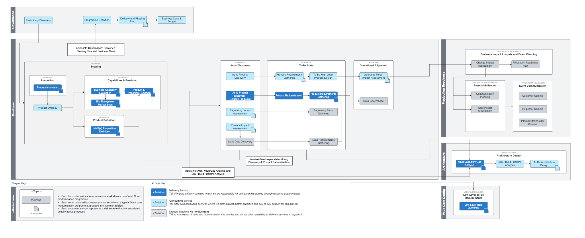

# Business Workstream

## Overview

The purpose of the Business Workstream is to highlight the importance of aligning the business needs of a modernisation programme to the overall scope and objectives.

The focus of the workstream is on the strategy and requirements for the financial products and their effects upon the processes that the client needs to run.

The workstream is divided into the following topics:

-   Initial Scoping - understand the scope of the financial products, define an early MVP, business capabilities' needs, and an early product roadmap to be fed into the programme business case.
    
-   Discovery - understanding both the relevant portions of the existing landscape from a product, process and data needs perspective and the key candidates for innovation.
    
-   To-Be High-Level Requirements - identifying the target state needs from a product, process and data requirements perspective with the aim of feeding this information into the Architecture workstream so that the output can be an informed decision of the various components to be built.
    
-   To-Be Design - focusing on the process portion of the requirements to ensure additional processes are considered as part of the target operating model.
    
-   Operational Alignment - a pre go-live section ensuring product launch, process change alignment and data governance across the programme.
    

## Activity Map

## Activities

You can find detailed guidance on activities highlighted in blue via the links below:

 
| Activity | Description |
| --- | --- |
| 
Operating Model Impact Assessment

 | 

Highlights the scope of the systems and teams that are impacted by the programme to ensure the overall target operating model’s needs are met

 |
| 

To-Be Process Design

 | 

Ensuring new and updated processes/capabilities are mapped back to the business objectives and designed to interact harmoniously together.

 |
| 

Data Governance

 | 

Ensuring data quality, ownership and maintenance needs are met.

 |
| 

[Product Innovation](/delivery-framework/latest/EN/delivery_workstream/business/product_innovation)

 | 

Provides focus on novel product offerings with the aim to identify new potential revenue streams.

 |
| 

[Product Strategy](/delivery-framework/latest/EN/delivery_workstream/business/product_strategy)

 | 

A key, foundational activity acting as the conduit between the business case and the needs of the customer.

 |
| 

[Business Capability Evaluation](/delivery-framework/latest/EN/delivery_workstream/business/business_capability)

 | 

Provides a high level view of the business capabilities to identify any functional differences between the legacy core and the modern core, with a view to understanding how any outstanding needs can be met.

 |
| 

[ISV Ecosystem Market Scan](/delivery-framework/latest/EN/delivery_workstream/business/isv_ecosystem)

 | 

Provides a perspective on ISVs that complement Vault.

 |
| 

[MVP Proposition Definition](/delivery-framework/latest/EN/delivery_workstream/business/mvp_proposition)

 | 

Defines which products should be launched first to show early proof points and quick returns on investment.

 |
| 

[Product & Transition Roadmap](/delivery-framework/latest/EN/delivery_workstream/business/product_and_transition)

 | 

Sequences product launches onto a timeline, highlighting the key transition states.

 |
| 

[As-Is Process Discovery](/delivery-framework/latest/EN/delivery_workstream/business/as_is_process_discovery)

 | 

Provides a detailed understanding of the various processes required to run the bank and how they can be optimised.

 |
| 

[As-Is Product Discovery](/delivery-framework/latest/EN/delivery_workstream/business/as_is_product_discovery)

 | 

Provides a detailed view of the current product landscape to understand which products are no longer viable, which can be modernised and which can simply be rationalised.

 |
| 

Regulatory Impact Assessment

 | 

A tool for identifying, with the aim to mitigate, regulatory risks which can have a great negative impact on the profitability and reputation of the bank.

 |
| 

Finance Impact Assessment

 | 

Highlights the scope of the systems and teams that are required to ensure the bank’s financial data needs are met.

 |
| 

[Process Requirements Gathering](/delivery-framework/latest/EN/delivery_workstream/business/process_requirements)

 | 

Ensures the processes required for the modernisation programme are clearly documented to help guarantee a smooth and gap-free transformation.

 |
| 

[Product Rationalisation](/delivery-framework/latest/EN/delivery_workstream/business/product_rationalisation)

 | 

Streamlines the product portfolio to simplify the product estate with a view to reducing complexity and increase operational efficiency.

 |
| 

[Product Requirements Gathering](/delivery-framework/latest/EN/delivery_workstream/business/product_requirements)

 | 

Provides detailed definition and documentation for the features, functionalities and characteristics of the product.

 |

## Disclaimer

See the Disclaimer relating to this and all other Vault Core Delivery Framework content [here](/delivery-framework/latest/EN/getting_started/disclaimer/).

Thought Machine Confidential Information.

© 2025 Thought Machine Group Limited. All rights reserved.

* * *