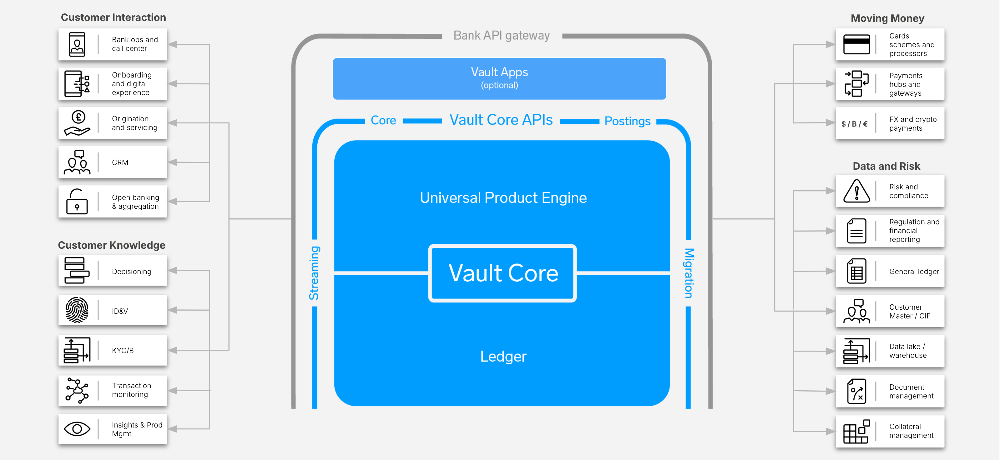

# ISV Ecosystem Market Scan

## Purpose

The ISV Ecosystem Market Scan activity provides a perspective on Independent Software Vendors (ISVs) that complement Vault Core.

This is needed by financial institutions to deliver full end-to-end bank employee or customer experience journeys.

## Predecessor Activities

1.  Business: [Product Strategy](/delivery-framework/latest/EN/delivery_workstream/business/product_strategy)
    
2.  Business: [Business Capability Evaluation](/delivery-framework/latest/EN/delivery_workstream/business/business_capability)
    
3.  Business: [MVP Proposition Definition](/delivery-framework/latest/EN/delivery_workstream/business/mvp_proposition)
    

## Guidance

Vault Core is a cloud-native, headless core banking platform. Thus, in order for financial institutions to deliver end-to-end product journeys, other ISVs may be necessary. These ISVs could be a combination of existing or new, and will depend upon what products the financial institution offers, and what regions it operates in.

Thought Machine categorises the capabilities around Vault Core into four main areas:

-   Customer Interaction.
    
-   Customer Knowledge.
    
-   Moving Money.
    
-   Data and Risk.
    

These are illustrated in the diagram below with sub-capabilities identified for each area.

Based upon the capabilities needed from the [Business Capability Evaluation](/delivery-framework/latest/EN/delivery_workstream/business/business_capability), the [Product Strategy](/delivery-framework/latest/EN/delivery_workstream/business/product_strategy), and the [MVP Proposition](/delivery-framework/latest/EN/delivery_workstream/business/mvp_proposition), Thought Machine can scan the ISV ecosystem to advise financial institutions on complementary ISVs to Vault Core. This information is necessary for the Buy - Build - Borrow Analysis.

## Templates

Thought Machine has a range of templates designed to support our clients in delivery of these activities. Please contact your assigned Thought Machine representative for further information.

* * *

### Disclaimer

See the Disclaimer relating to this and all other Vault Core Delivery Framework pages [here](/delivery-framework/latest/EN/getting_started/disclaimer/).

Thought Machine Confidential Information.

© 2025 Thought Machine Group Limited. All rights reserved.