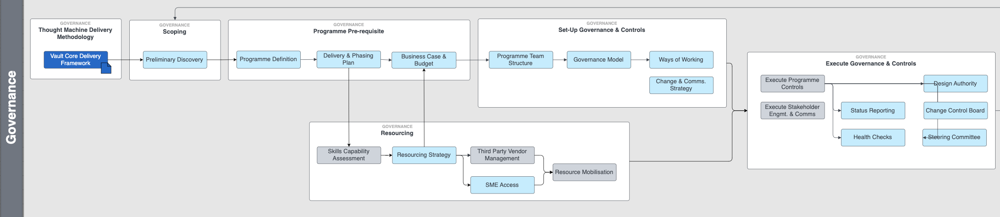

# Governance Workstream

## Overview

The purpose of the Governance Workstream is to define, plan, monitor and control successful execution of the programme.

The focus of the workstream is to provide strategic alignment, structure, and oversight to ensure that the programme is delivered successfully.

The workstream is divided into the following topics:

-   *Scoping* - Conduct preliminary Discovery activities to define the problem statement and confirm the programme’s feasibility. This helps establish a clear understanding of the issues to be addressed and confirms viability to initiate a programme to solve it.
    
-   *Programme Prerequisites* - Collaboration with the programme sponsor and key stakeholders to define the programme’s goals and future state vision. This includes outlining how it will be delivered and preparing a compelling business case to secure the necessary budget for its execution.
    
-   *Resourcing* - Identify the required skills to deliver the programme and determine the approach to sourcing these resources. This may involve working with Third Party Vendors and leveraging the expertise of Subject Matter Experts to ensure capability alignment.
    
-   *Governance & Controls Setup* - Establish governance forums, organisational structures, and define roles and responsibilities to ensure the programme is guided effectively. A well-defined governance model ensures alignment with strategic goals, provides a decision-making framework, and enhances accountability and transparency. This is supported by clear ways of working and a robust stakeholder engagement and communication strategy.
    
-   *Governance & Controls Execution* - Implement programme controls to provide oversight, manage risks, and ensure the programme stays aligned with strategic objectives. Key governance bodies, such as the Design Authority, Change Control Board, and Steering Committee, play a crucial role in monitoring progress and driving the programme towards achieving its goals and objectives. Ensuring active communication and status reporting with all involved parties, including downstream functions, regulatory bodies, and customers, helps maintain alignment with stakeholder expectations.
    
-   *Closure* - At the conclusion of a specific phase, finalise all activities, evaluate the phase’s success, capture lessons learnt and ensure a smooth transition of responsibilities. The programme will use the lessons learned to inform and improve the delivery of subsequent phases. Once all phases are completed, the programme will formally close, marking the end of the delivery.
    

## Activity Map

## Activities

You can find detailed guidance on activities highlighted in blue via the links below:

 
| Activity | Description |
| --- | --- |
| 
[Preliminary Discovery](/delivery-framework/latest/EN/delivery_workstream/governance/preliminary_discovery):

 | 

Preliminary discovery is the first stage of the programme The activity objective is to initially define the problem statement and confirm viability to initiate a programme to solve it.

 |
| 

[Programme Definition](/delivery-framework/latest/EN/delivery_workstream/governance/programme_definition)

 | 

A pre-requisite for any programme is to define, at a high level, the vision for the programme, the goals, scope boundaries and sponsorship. This provides stakeholders with alignment on the programme mission and a reference point against which to measure progress.

 |
| 

[Delivery & Phasing Plan](/delivery-framework/latest/EN/delivery_workstream/governance/delivery_and_phasing_plan)

 | 

The Delivery & Phasing Plan defines the approach and timelines for delivery of the core banking programme. It involves breaking down the programme into manageable phases.

 |
| 

[Business Case & Budget](/delivery-framework/latest/EN/delivery_workstream/governance/business_case_budget)

 | 

The business case provides justification for initiation of the programme and securing sponsorship. It assesses the benefits the programme will bring to the organisation and provides a baseline for assessing the ongoing viability of the programme throughout its lifecycle. Once the business case is approved, the budget for the programme is secured and this enables the formal start of the programme.

 |
| 

[Skills capability assessment](/delivery-framework/latest/EN/delivery_workstream/governance/skills_capability_assessment)

 | 

The Skills capability assessment evaluates the capabilities and capacity in your organisation against what is required to be delivered.

 |
| 

[Resourcing Strategy](/delivery-framework/latest/EN/delivery_workstream/governance/resourcing_strategy)

 | 

The resourcing strategy addresses the skills and capabilities that are required to deliver the objectives of the programme

 |
| 

[Third Party Vendor Management](/delivery-framework/latest/EN/delivery_workstream/governance/third_party_vendor_management)

 | 

The processes used by an organisation to assess, select, onboard, and manage external product and service providers.

 |
| 

[SME Access](/delivery-framework/latest/EN/delivery_workstream/governance/sme_access)

 | 

Inclusion of Subject Matter Expertise to provide specialist knowledge to successfully plan and execute on the programme’s objectives.

 |
| 

[Resource Mobilisation](/delivery-framework/latest/EN/delivery_workstream/governance/resource_mobilisation)

 | 

Resource mobilisation is the activity of selecting and onboarding resources into the programme organisation

 |
| 

[Programme Team Structure](/delivery-framework/latest/EN/delivery_workstream/governance/programme_team_structure)

 | 

The programme structure defines the roles and responsibilities of teams and individuals within the programme and how they work together to collaboratively deliver the programme.

 |
| 

[Governance Model](/delivery-framework/latest/EN/delivery_workstream/governance/governance_model)

 | 

The governance model lays down the framework which underpins the structured execution of the program ensuring roles, responsibility, and decision-making process are well defined and executed.

 |
| 

[Ways of working](/delivery-framework/latest/EN/delivery_workstream/governance/ways_of_working)

 | 

A pre-requisite for any programme is to define how the various teams (internal and external), work together to achieve the goals and objectives set in the Programme Definition.

 |
| 

[Change & Communication Strategy](/delivery-framework/latest/EN/delivery_workstream/governance/change_communication_strategy)

 | 

The Change & Communication Strategy defines how changes will be managed and communicated to ensure understanding, engagement and adoption.

 |
| 

[Execute Programme Controls](/delivery-framework/latest/EN/delivery_workstream/governance/execute_programme_controls)

 | 

Execute Programme Controls is the day to day management and monitoring of the programme through implementation of tools, techniques and processes.

 |
| 

[Execute Stakeholder Engagement & Communication](/delivery-framework/latest/EN/delivery_workstream/governance/stakeholder_engagement)

 | 

Delivering and evolving the stakeholder engagement and communications throughout the programme lifecycle.

 |
| 

[Status Reporting](/delivery-framework/latest/EN/delivery_workstream/governance/status_reporting)

 | 

Status reporting provides transparent information about programme progress, risks, challenges, actions, and decisions to relevant stakeholders.

 |
| 

[Health Checks](/delivery-framework/latest/EN/delivery_workstream/governance/health_checks)

 | 

Health check provide assurance to stakeholder that the programme is on track to deliver on its objectives or highlight where attention is needed. Checks may be performed at a programme delivery level or on specific components such as architecture, infrastructure or Smart Contracts.

 |
| 

[Design Authority](/delivery-framework/latest/EN/delivery_workstream/governance/design_authority)

 | 

The design authority is the framework and associated governing body within the programme that is responsible for ensuring the alignment of design decisions with the overarching business strategy, architectural principles, and technical standards.

 |
| 

[Change Control Board](/delivery-framework/latest/EN/delivery_workstream/governance/change_control_board)

 | 

The change control board is the governance forum that evaluates proposed changes, makes informed approval decisions by assessing impact and ensures controlled implementation of approved changes.

 |
| 

[Steering Committee](/delivery-framework/latest/EN/delivery_workstream/governance/steering)

 | 

A steering committee provides oversight of the programme, providing strategic direction and decision making to ensure that the programme delivers on its objectives and remains aligned with the organisation’s goals.

 |
| 

[Phase / Programme Closure](/delivery-framework/latest/EN/delivery_workstream/governance/closure)

 | 

Phase and Programme Closure marks the final stage in a delivery. It confirms that all objectives have been achieved, deliverables accepted and that a smooth hand over into operations has been completed. It also enables the off-boarding of resources as no further activities are required.

 |

## Disclaimer

See the Disclaimer relating to this and all other Vault Core Delivery Framework content [here](/delivery-framework/latest/EN/getting_started/disclaimer/).

Thought Machine Confidential Information.

© 2025 Thought Machine Group Limited. All rights reserved.

* * *