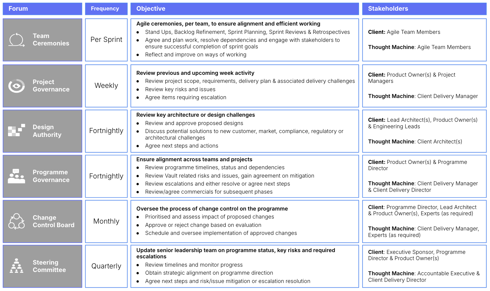

# Governance Model

## Purpose

The governance model provides the framework for decision-making, accountability, and oversight within the programme. It establishes the rules, structures, and processes that guide how a programme is managed, ensuring alignment with strategic objectives and successful delivery of outcomes.

A good governance structure:

-   Ensures the programme is aligned with the organisation’s strategic goals and priorities, helping to deliver value that supports the broader business strategy.
    
-   Defines roles, responsibilities, and authority levels within the programme, clarifying who makes decisions and who is accountable for outcomes. This reduces ambiguity and ensures decisions are made at the appropriate level.
    
-   Provides a structured approach to identifying, assessing, and managing risks, issues, and dependencies within the programme. This helps in proactively mitigating risks and resolving issues before they impact delivery.
    
-   Guides the allocation of resources (people, budget, technology) to ensure they are effectively used to achieve programme objectives; this includes prioritising work based on strategic value and resource availability.
    
-   Establishes metrics and reporting mechanisms to track the progress of the programme against its plan, ensuring that any deviations are identified and corrected in a timely manner.
    
-   Facilitates transparent and effective communication with stakeholders, ensuring their needs and expectations are understood and managed throughout the programme lifecycle.
    
-   Sets standards and processes to ensure that the programme deliverables meet the required quality and ensures the programme delivers fit-for-purpose solutions.
    

## Predecessor Activities

1.  Governance: [Delivery & Phasing Plan](/delivery-framework/latest/EN/delivery_workstream/governance/delivery_and_phasing_plan)
    
2.  Governance: [Resourcing Strategy](/delivery-framework/latest/EN/delivery_workstream/governance/resourcing_strategy)
    
3.  Governance: [Programme Team Structure](/delivery-framework/latest/EN/delivery_workstream/governance/programme_team_structure)
    

## Guidance

-   The governance model needs to be tailored to the size and complexity of the programme and organisation that is delivering it. Transparency and traceability should underpin any governance model and this is achieved in different ways. For example:
    
    -   Greenfield banks are inherently small and agile, with relatively flat organisational structures. Communication tends to be direct, fast, and informal, allowing for quicker access to decision-makers and rapid implementation of decisions and information cascade. This streamlined approach supports swift action and adaptability.
        
    -   Similarly, small specialist banks operate with leaner structures, focusing on niche products or serving specific regions. With fewer hierarchical layers, their communication and governance processes are simpler and more flexible. This allows them to adapt more quickly to changes in the business environment or regulatory landscape. In some cases, these banks may be family- or founder-led, which can result in governance driven by the cultural or leadership style of key individuals.
        
    -   In contrast, Tier 1 banks have deep, complex organisational structures, characterised by formal approval processes and multiple third-party relationships to manage. Their governance structures are more rigid, often aligning with broader organisational governance frameworks that may span both local and global levels.
        
    

### How to set-up an effective governance model

1.  **Define the governance structure:** establish the key governance forums such as the Programme Board, Steering Committee, Working Groups and Ceremonies to support the programme ways of working. Define the roles and responsibilities of each, including decision-making authority, reporting lines and integration into programme structure as well as the wider organisation’s governance boards.
    
2.  **Set clear roles and responsibilities:** define the roles of the Programme Sponsor, Programme Manager and the other team members, stipulating who is accountable for what, and ensure that this is communicated and understood by all.
    
3.  **Develop a decision-making framework:** establish the process for making decisions within the programme, including criteria for escalating decisions to the appropriate governance forum(s); this framework should ensure that decisions are made efficiently and transparently.
    
4.  **Implement risk, issue and change management processes:** develop a risk and issue management strategy that includes regular assessments, prioritisation, response planning, and ongoing monitoring. This needs to be aligned with the change control process that outlines how changes to scope, schedule, or budget are handled and should include criteria for approving changes and assessing their impact on the overall programme.
    
5.  **Resource allocation and prioritisation guidelines:** define how resources are allocated across the programme, including criteria for prioritising work, ensuring there are processes for re-prioritising resources as a result of change.
    
6.  **Establish monitoring and reporting mechanisms:** develop a set of KPIs and metrics to measure progress against objectives. Set up regular reporting cycles to monitor performance, with clear processes for taking corrective action when necessary.
    
7.  **Stakeholder engagement and communication:** create a Activity: Change & Communication Strategy that details how and when stakeholders will be engaged; this should include regular updates, feedback loops, and channels for addressing stakeholder concerns.
    
8.  **Quality management framework:** define quality standards for deliverables and implement quality assurance and control processes to ensure that these standards are consistently met. These controls and standards may already be defined by the wider organisation, however given the introduction of new technology as part of the programme, they may require the development of new or changes to controls and standards.
    
9.  **Broadcast information:** communicate the governance model to team members and stakeholders, ensuring understanding and buy-in. Ensure decisions are documented and information is readily available to the people that need it.
    
10.  **Continuous Improvement:** incorporate feedback loops and lessons learned processes to continually improve and refine governance practices. Regularly review governance effectiveness and make adjustments as needed.
     

### Example Governance Forums

The following tables illustrates typical programme governance forums:

### Common pitfalls

-   Lack of senior leadership support or sponsorship may undermine the effectiveness of the governance model.
    
-   Informal approach without formal structures and processes, can result in inconsistent, unclear, or slow decision-making, as it relies heavily on individual discretion rather than established frameworks. This lack of formality can also result in poor documentation, making it difficult to track decisions or hold people accountable.
    
-   Inadequate representation or participation of key stakeholders in governance forums may lead to decisions that misinformed or do not reflect stakeholder interests.
    
-   Overly complex governance structures or processes that create confusion or bureaucracy, hindering agility and responsiveness. Be cautious in applying too much formal rigour and allow for pragmatism and a level of flexibility.
    
-   Finding the right balance between centralisation, decentralisation, and collaboration can help organisations achieve efficiency, innovation, and success:
    
    -   A centralised hierarchical structure leads to bottlenecks and slower response times due to the number of people involved, especially at a senior level.
        
    -   Too much autonomy through decentralisation results in a lack of alignment with wider programme and organisational goals and standards
        
    -   Emphasis on collaboration takes time to get consensus and can lead to potential conflicts
        
    
-   Lack of clarity and alignment on roles and responsibilities leads to confusion, duplication of efforts, or gaps in accountability.
    
-   Insufficient communication or limited transparency may result in stakeholders feeling excluded or uninformed, leading to resistance, disengagement and erosion of stakeholder trust and confidence in the programme.
    
-   Inadequate oversight and control mechanisms result in project delays, cost overruns, or quality issues.
    
-   Failure to adapt the governance model to changing programme dynamics or stakeholder needs may lead to inefficiencies or ineffectiveness over time.
    

## Disclaimer

See the Disclaimer relating to this and all other Vault Core Delivery Framework pages [here](/delivery-framework/latest/EN/getting_started/disclaimer/).

Thought Machine Confidential Information.

© 2026 Thought Machine Group Limited. All rights reserved.