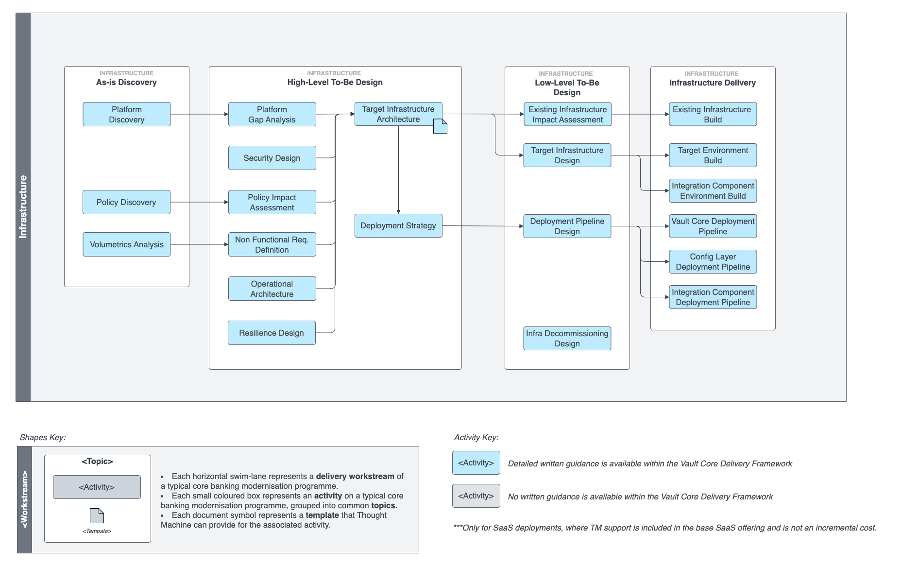

# Infrastructure Workstream

## Overview

This stream is responsible for tasks related to infrastructure analysis, design, implementation, and decommissioning. The scope of the work includes current, interim, and target states for the platform.

Consideration is given to both functional and non-functional requirements. The former includes regulatory and company policy constraints; for instance, defining geographical compliance boundaries, or ensuring permission is granted to process certain types of information on public cloud. The latter resilience, availability, security, scalability, and performance

The goal of the following activities is to ensure that the target infrastructure supports the objectives of both the programme and the organisation.

## Activities

 
| Activity | Description |
| --- | --- |
| 
[Platform Discovery](/delivery-framework/latest/EN/delivery_workstream/infrastructure/platform_discovery)

 | 

Platform discovery is the process of systematically identifying, evaluating, and understanding existing technology infrastructures, frameworks, or ecosystems within an organisation.

 |
| 

[Policy Discovery](/delivery-framework/latest/EN/delivery_workstream/infrastructure/policy_discovery)

 | 

Policy discovery refers to the systematic examination and understanding of organisational policies and regulatory requirements.

 |
| 

[Volumetrics Analysis](/delivery-framework/latest/EN/delivery_workstream/infrastructure/volumetric_analysis)

 | 

The process of gathering statistics (both actual and expected) relating to request volumes and rates, as well as current and future data storage requirements.

 |
| 

[Platform Gap Analysis](/delivery-framework/latest/EN/delivery_workstream/infrastructure/platform_gap_analysis)

 | 

Platform gap analysis is used to identify disparities between existing technology platforms and the desired (target) state.

 |
| 

[Security Design](/delivery-framework/latest/EN/delivery_workstream/infrastructure/security_design)

 | 

Security design considers the planning and implementation of protective measures within the target private or public cloud infrastructure.

 |
| 

[Policy Impact Assessment](/delivery-framework/latest/EN/delivery_workstream/infrastructure/policy_impact_assesment)

 | 

Policy impact assessment in a public cloud implementation involves an evaluation of how organisational policies and regulations intersect with cloud services.

 |
| 

[Non-Functional Requirements Definition](/delivery-framework/latest/EN/delivery_workstream/infrastructure/non_functional_requirements_definition)

 | 

Defining non-functional requirements (NFRs) helps to align the proposed core banking solution with organisational policies and business objectives.

 |
| 

[Operational Architecture](/delivery-framework/latest/EN/delivery_workstream/infrastructure/operational_architecture)

 | 

IT operations architecture is concerned with the management and execution of activities that support the organisation’s IT services and infrastructure.

 |
| 

[Resilience Design](/delivery-framework/latest/EN/delivery_workstream/infrastructure/resilience_design)

 | 

Resilient design is all about architecting robust and fault-tolerant infrastructure.

 |
| 

[Target Infrastructure Architecture](/delivery-framework/latest/EN/delivery_workstream/infrastructure/target_infrastructure_architecture)

 | 

The objective of this activity is to establish a clear vision for the technology framework.

 |
| 

[Deployment Strategy](/delivery-framework/latest/EN/delivery_workstream/infrastructure/deployment_strategy)

 | 

Defining a deployment strategy ensures a structured approach to deploying infrastructure and the applications that run on it.

 |
| 

[Existing Infrastructure Impact Assessment](/delivery-framework/latest/EN/delivery_workstream/infrastructure/existing_infra_impact_assesment)

 | 

This activity assesses the potential consequences of any changes that will need to be made to an existing infrastructure.

 |
| 

[Target Infrastructure Design](/delivery-framework/latest/EN/delivery_workstream/infrastructure/target_infrastructure_design)

 | 

The outcome of this activity should be a well thought out infrastructure design that meets the cost, performance, security, and scalability needs catalogued during the discovery phase.

 |
| 

[Deployment Pipeline Design](/delivery-framework/latest/EN/delivery_workstream/infrastructure/deployment_pipeline_design)

 | 

Automated tools are vital for streamlined infrastructure and application releases by reducing the possibility for human error. They lead to improved consistency across environments and this increases confidence in testing as the possibility of errors being introduced through misconfiguration are reduced.

 |
| 

[Infrastructure Decommissioning Design](/delivery-framework/latest/EN/delivery_workstream/infrastructure/infra_decommissioning_design)

 | 

Decommissioning redundant IT infrastructure requires thorough planning to make sure there is no unanticipated impact on existing workloads.

 |
| 

[Existing Infrastructure Build](/delivery-framework/latest/EN/delivery_workstream/infrastructure/existing_infra_build)

 | 

This activity is concerned with changes to the existing organisation infrastructure.

 |
| 

[Integration Component Environment Build](/delivery-framework/latest/EN/delivery_workstream/infrastructure/integration_component_build)

 | 

This activity considers how components are deployed and configured.

 |
| 

[Target Environment Build](/delivery-framework/latest/EN/delivery_workstream/infrastructure/target_environment_build)

 | 

This activity considers how components are deployed and configured.

 |
| 

[Deployment Pipeline Build](/delivery-framework/latest/EN/delivery_workstream/infrastructure/target_environment_build)

 | 

This activity focuses on the approach to building automation components including CI/CD pipelines for environment, infrastructure, and application deployment and configuration, as well as associated testing infrastructure.

 |
| 

[Infrastructure Decommissioning](/delivery-framework/latest/EN/delivery_workstream/infrastructure/infra_decommissioning)

 | 

This activity is the final step in the infrastructure work stream and can be started once the new platform has been successfully deployed and all workloads are running and stable.

 |

## Disclaimer

See the Disclaimer relating to this and all other Vault Core Delivery Framework pages [here](/delivery-framework/latest/EN/getting_started/disclaimer/).

Thought Machine Confidential Information.

© 2025 Thought Machine Group Limited. All rights reserved.