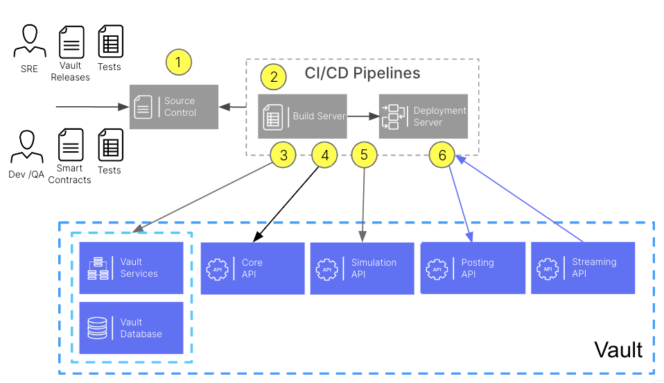

# Deployment Pipeline Design

## Purpose

Automated tools are vital for streamlining infrastructure and application releases by reducing the possibility for human error. They lead to improved consistency across environments and this increases confidence in testing as the possibility of errors being introduced through misconfiguration are reduced. This, in turn, leads to increases in both speed and efficiency for each deployment.

Once the deployment strategy has been decided, the next step is to design one or more pipelines to deploy the infrastructure and related artefacts (scripts, configuration files, binaries). Designing a clear and efficient pipeline structure is crucial. Consider breaking down the deployment process into logical stages such as build, test, deploy, and post-deployment tasks.

It is important to choose technology appropriate for the environment that is being targeted, for example Jenkins may be suitable for an on-prem deployment but a cloud native tool like Azure DevOps or AWS CloudFormation may be more suited to public cloud. Automated pipelines ensure that environments are properly versioned and there is traceability back to source.

The design should take into account the flexibility required to deploy complex infrastructure and applications, along with configurations for different types of environment. Although test and production may share a similar architecture, they may be configured very differently due to differing requirements regarding access, scalability, resilience, and cost.

## Predecessor Activities

-   Review documents published by respective policy owners
    
-   Conduct review sessions with policy owners to ensure mutual understanding
    

## Guidance

Separate pipelines may be more suited to meet the requirements of different work streams and orchestrate across releases that have different cadence; For example, using a dedicated pipeline to manage infrastructure, another to deploy and configure the banking core, and a third to deploy related integration (and other) components. Conversely, it may make more sense to combine the deliverables from each teams into a single tool and manage deployments this way.

There are a number of common areas to be considered, irrespective of your chosen approach.

-   *Version Control Integration -* Ensure seamless integration with version control systems like Git to track changes and trigger pipeline executions automatically upon code commits.
    
-   *Artefact Management -* Implement artefact management to store and manage build artefacts and dependencies efficiently. This ensures consistency and reproducibility across deployments.
    
-   *Environment Configuration -* Define configuration management practices to manage environment-specific settings and ensure consistency between development, testing, staging, and production environments.
    
-   *Automated Testing -* Integrate automated testing into the pipeline to validate code changes thoroughly before deployment including unit tests, integration tests, and end-to-end tests.
    
-   *Security and Compliance -* Incorporate security measures such as code scanning, vulnerability assessments, and compliance checks to ensure the safety and integrity of deployed applications.
    
-   *Monitoring and Logging -* Deploy monitoring and logging mechanisms to track pipeline executions, detect failures, and troubleshoot issues quickly.
    

## Templates

Thought Machine has a range of templates designed to support clients in delivery of Deployment Strategy. Please contact your assigned Thought Machine representative for further information.

* * *

### Disclaimer

See the Disclaimer relating to this and all other Vault Core Delivery Framework pages [here](/delivery-framework/latest/EN/getting_started/disclaimer/).

Thought Machine Confidential Information.

© 2025 Thought Machine Group Limited. All rights reserved.