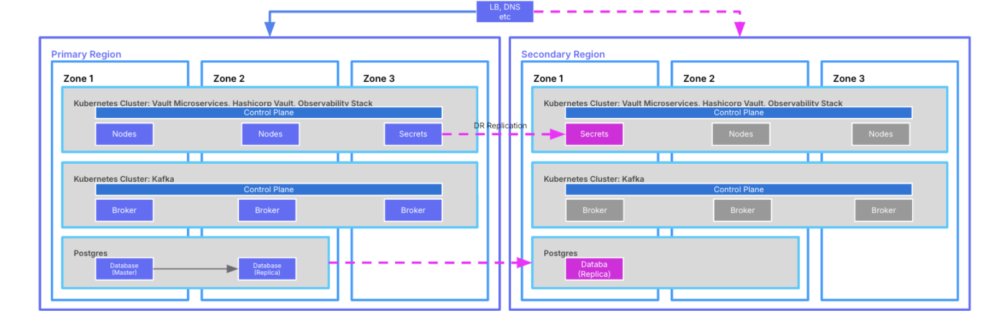

# Resilience Design

## Purpose

Resilient design is all about architecting robust and fault-tolerant infrastructure to ensure continuous availability and recoverability of critical systems and data, mitigating disruptions caused by hardware failures, cyber threats, and natural disasters. It includes consideration for redundancy, failover, and disaster recovery strategies to maintain uninterrupted operations and uphold service levels.

In the financial industry the provision of an uninterrupted service is critical for customers to access their accounts, perform transactions, and conduct financial operations without disruption. Building resilience into the design ensures that the core banking system remains accessible and functional, even in the event of a local failure or more significant outage.

Regulatory authorities mandate stringent uptime requirements for core banking systems to safeguard customer interests and maintain financial stability.

Business continuity planning (BCP) is crucial for banks and other financial institutions as it ensures that they can continue to provide essential services even in the face of a crisis. There are three main categories of events, namely natural disasters, technical failures, and human actions. This could be a flood, power failure, cyber attack, or any other major disruption.

Failing to plan properly for a disaster can have severe consequences for a company. Without a comprehensive disaster recovery plan, they can experience significant downtime, data loss, and customer dissatisfaction. These consequences can result in financial losses, damage to reputation, and even regulatory penalties. In the finance industry, where trust is paramount, a poorly executed plan can result in the loss of customer confidence and significant harm to the institution’s bottom line. It is therefore critical for banks to invest in business continuity planning to ensure their ability to provide uninterrupted services and maintain the trust of their customers.

Disaster Recovery Planning sits within Business Continuity Planning (DRP). BCP is concerned with developing strategies to ensure the continued operation of critical business functions. Disaster recovery planning involves the steps needed to restore IT systems and data.

In other words, if BCP aims to prevent disruptions and minimise their impact, then DRP is focused on recovering from them. Both are essential for maintaining business operations and minimising the effects of disruption on the organisation.

## Predecessor Activities

1.  [Policy Discovery](/delivery-framework/latest/EN/delivery_workstream/infrastructure/policy_discovery)
    
2.  [Security Design](/delivery-framework/latest/EN/delivery_workstream/infrastructure/security_design)
    

## Guidance

Designing an appropriate solution requires an understanding of the trade-off between cost and benefit. There is no one size fits all strategy and it is driven by a combination of business objectives, cost, and regulatory (or scheme) requirements. Vault Core is entirely cloud native and as such is able to support both High Availability and Disaster Recovery patterns and take advantage of the sorts of automation provided by managed services.

Most managed services, including Postgres and Kubernetes, come with financially backed guarantees offering between 99.95% and 99.99% availability. Cloud providers achieve this through the use of redundant hardware distributed across multiple data centres, combined with an abstraction layer that hides this complexity and automates failover between components in the event of a problem. This ensures that workloads can continue to run with zero or minimal interruption.

It should be noted that high availability is only intended to address component or local failures and will not help in the event of a region wide problem. Disaster recovery is concerned with the complete failure of a service, rather than just individual components.

Solutions can be designed to meet different requirements, anything from a simple backup of a database in a secondary region through to a more complete \`Pilot Light' or \`warm standby' The cost of any mitigation must be balanced against the potential cost from loss of service, and from regulatory and reputational risks.

**Highly Available Architecture**

High availability and disaster recovery share the goal of minimising downtime and ensuring access to critical services. However, they differ in their approach.

High availability focuses on preventing downtime through redundancy and failover mechanisms, while disaster recovery focuses on recovering from major outages using backup and recovery procedures.

Whatever cloud vendor is chosen, a Vault deployment is scalable and fault tolerant enabling clients to meet their availability objectives.

Vault Core relies on Kubernetes to host services and the Kubernetes cluster is spread across multiple availability zones. A major advantage of using cloud vendor managed clusters is that they are configured and managed automatically for us.

Vault Core runs redundant instances of the application pods across zones to provide high availability and fault tolerance for Vault and its associated services. As a result, the cluster can survive a single point of failure, enabling the application to continue running without downtime. This also applies to services such as ingress, service mesh, secrets management, and observability.

The use of a Postgres database with a read replica in a second zone ensures that data remains accessible to the application, even in the event of a zonal database failure.

Availability Zones are built with independent power, cooling, and networking infrastructure, ensuring that they can operate autonomously. They are typically located within around 30 kilometres of each other and are connected by high speed, dedicated networks. Groups of data centres are known as 'Regions’.

By distributing resources across availability zones within a single region, Vault Core can continue to process workload with zero to minimal disruption, even if a single zone or data centre experiences an outage. This approach provides redundancy and fault tolerance, and offers protection against localised disasters.

**Disaster Recovery Architecture**

A region comprises multiple availability zones, and they are connected through high-speed, low-latency networks. A geography represents a wider area, often defined by a political or compliance boundary.

Regions are separated by a distance of least one hundred and sixty kilometres, to reduce the risk of a localised disaster impacting both simultaneously.

By deploying resources across multiple regions typically within the same geography, businesses can ensure that their operations continue even in the event of a Regional disruption.

**Deployment Patterns**

A client’s exact solution will vary depending on what risks they are mitigating against, and what RTO and RPO is acceptable to their business. They must take into account other considerations, like balancing recovery time against cost to decide on the appropriate design.

***Single Region***

This is the simplest and cheapest option, it takes advantage of multiple availability zones to provide resilience. The service is protected against the loss of a single data centre and retains the capacity to run a complete workload across the remaining two.

Cloud vendors offer good uptime SLAs, typically 99.95 or 99.99 for Postgres and 99.95 for Kubernetes for their managed services when deployed across multiple AZ. As a result, clients can achieve an RPO of zero and RTO measured in minutes.

However, clients should be mindful of the fact that given data is stored within a single region, it does not mitigate against the impact of larger scale regional outages. There is no possibility of restoring services until the primary region has been recovered, so in the event of a regional outage RTO could be measured in hours or days, or weeks.

***Multi Region***

*Backup/Restore*

This pattern is similar to the single region solution, but with one key difference.

It takes advantage of a cloud vendor’s database and storage services to backup data to a second region. In the event that a primary region was restored, but for some reason the storage could not be recovered then a secondary backup exists and all is not lost. The data could also even be used to recover the service in a second region if necessary.

A significant drawback to this approach is that the recovery time is difficult to estimate and, as with a single region deployment could be measured in weeks if a new instance had to be built from scratch.

*Active/Passive*

This approach more fully embraces a second region to protect services from a significant outage in the primary region by deploying a minimal set of infrastructure and services into the second location. This includes a database read replica, Kubernetes clusters, and associated networking and monitoring infrastructure. Pods are scaled down until they are needed. This keeps running costs in the second region to a minimum.

Transactional data and secrets are replicated asynchronously to a read replica database, enabling a low RPO. In the event of a disaster being declared, the primary region can be stopped and the services in the second region fully started.

This pattern offers a better RTO than backup and restore alone, and gives us a second instance without us bearing the full costs associated with maintaining two active regions. It is, however, significantly more expensive than the backup and restore option.

*Active/Active*

This pattern presents challenges for any performant, consistent, transactional 'System of Record’:

1.  RDBMS is the 'Source of Truth’
    
2.  Consistency of data is paramount
    
3.  RDMS are stateful
    
4.  Performance is another key SLA
    

Significant latency is therefore not acceptable

Single region, performant, highly available, managed database solutions are provided by Cloud Service Providers out of the box. The physical proximity of the data centres within a single region ensures latency remains acceptable enabling databases to be replicated synchronously.

CSPs do not typically offer synchronous, writable active/active RDBMS solutions cross-region. Products like Amazon Aurora are often described as being active/active, but in reality offer a single writable region, with writes to other regions being forwarded to the writable one, and changes subsequently propagated back to the read only instances.

Thought Machine publishes information about how the platform is architected for high availability and supports disaster recovery scenarios in the Vault Portal:

[Vault Core Infrastructure](/vault-core/5-3/EN/reference/vault_architecture/infrastructure_overview/vault_core#introduction)

[Vault Disaster Recovery](/vault-core/5-3/EN/environment_and_installation/infrastructure_docs/infrastructure_and_installation_guides/vault_disaster_recovery)

Consider the following points when undertaking this exercise.

-   *Risk-Based Approach -* Identify potential risks and threats to the solution’s availability, prioritise them based on impact and likelihood, and design resilience measures to mitigate the identified risks.
    
-   *Reference Architecture Adoption -* Take advantage of established reference architectures and best practices for designing resilient cloud solutions, including patterns for fault tolerance, redundancy, and automated failover. Avoid reinventing the wheel by aligning with industry standards.
    
-   *Business Impact Analysis -* Conduct a business impact analysis to identify critical business functions, dependencies, and recovery objectives, and design resilience measures.
    
-   *Avoid -* Focusing solely on technical aspects of resilience while neglecting organisational culture, processes, and human factors can lead to incomplete or ineffective resilience measures. Underestimating the complexity of designing and implementing a resilient solution in a cloud environment. This can lead to oversights, misconfigurations, and inadequate protections. Neglecting to update and evolve resilience measures in response to changes in technology, business requirements, or threat landscape. Inadequate documentation and the failure to communicate roles, responsibilities, and procedures can impede effective response and recovery efforts during incidents.
    

## Templates

Thought Machine has a range of templates designed to support clients in delivery of Resilience Design. Please contact your assigned Thought Machine representative for further information.

* * *

### Disclaimer

See the Disclaimer relating to this and all other Vault Core Delivery Framework pages [here](/delivery-framework/latest/EN/getting_started/disclaimer/)

Thought Machine Confidential Information.

© 2025 Thought Machine Group Limited. All rights reserved.