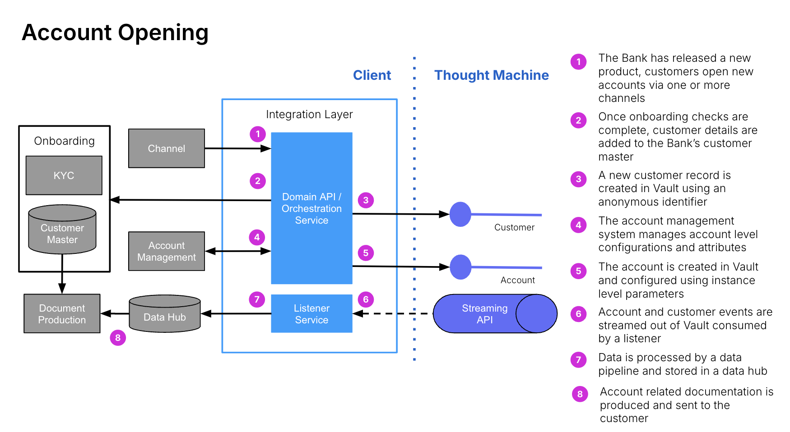

# Core Integration Service Design

## Purpose

This activity is the design phase of the low level integrations requirements gathered in the previous activities based on the Transition State Architecture and Smart Contract design phase.

This activity’s output will serve as a blueprint for clients on how to integrate with Vault Core directly and how to use the Core APIs and Kafka APIs to support the different bank ecosystems.

In the future, it will also include how to design with Edge functions for orchestrations. The first version of Edge functions is expected to be released in Q4 2024.

## Predecessor Activities

1.  Architecture: [Transition State Architecture Design](/delivery-framework/latest/EN/delivery_workstream/architecture/transition_state_architecture)
    
2.  Integrations: [Core Service Low Level Requirements Gathering](/delivery-framework/latest/EN/delivery_workstream/integrations/core_services_low_level)
    
3.  Vault Core Configuration: [Smart Contract and Feature Block Technical Design](/delivery-framework/latest/EN/delivery_workstream/vault_core_config/sc_feature_block_technical_design)
    

## Guidance

The System integration partner will typically decide on how to integrate with Vault Core and other existing or new systems with the different design patterns available such as:

-   Adapter pattern.
    
-   Domain API pattern.
    

This design determines how to encapsulate Vault Core and create an interface for interaction between the new and/or existing systems to integrate with the core. Once the overall design pattern is decided, the design of different components or microservices required to interact with Vault Core is decided.

During the Smart contract design phase, the orchestration required for each user journey is identified. A Technical Design document per user journey includes the smart contract design and integrations/orchestration requirements and design. Once this is agreed upon with the stakeholders, in the next sprint, the build of the smart contract and corresponding integrations is completed. At the end of the sprint, the smart contract is delivered and the integrations are tested with the product. This is an iterative process followed throughout the build cycle.

At the end of the project, one technical specification document is produced and combines all the user journeys. It includes all APIs required to orchestrate each journeys and details on creating products, creating and opening accounts, creating and updating parameters and the schedules involved, creating external postings and their behaviour and closing accounts.

If you are designing an incoming integration to a Smart Contract, i.e. upstream, for handling metadata on a posting instruction batch, you will need to specify a data format for the calling system to use. You should design one or more UML Sequence Diagrams to show what happens during the interaction.

When designing an outgoing integration to a smart contract, i.e. downstream, for a notification that an account emits which carries some metadata, the data format expected by the calling system is specified.

### Account opening with domain API integration

### Common pitfalls

Common pitfalls would be:

-   Not analysing and calling out which actions require synchronous and asynchronous processes.
    
-   Not considering the previous point as part of the design of the whole integration architecture.
    

## Templates

Thought Machine has a range of templates designed to support clients in delivery of Core Service Design. Please contact your assigned Thought Machine representative for further information.

* * *

### Disclaimer

See the Disclaimer relating to this and all other Vault Core Delivery Framework pages [here](/delivery-framework/latest/EN/getting_started/disclaimer/).

Thought Machine Confidential Information.

© 2025 Thought Machine Group Limited. All rights reserved.