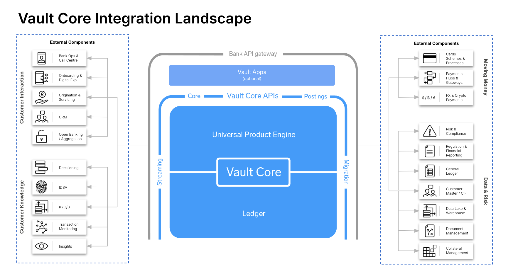
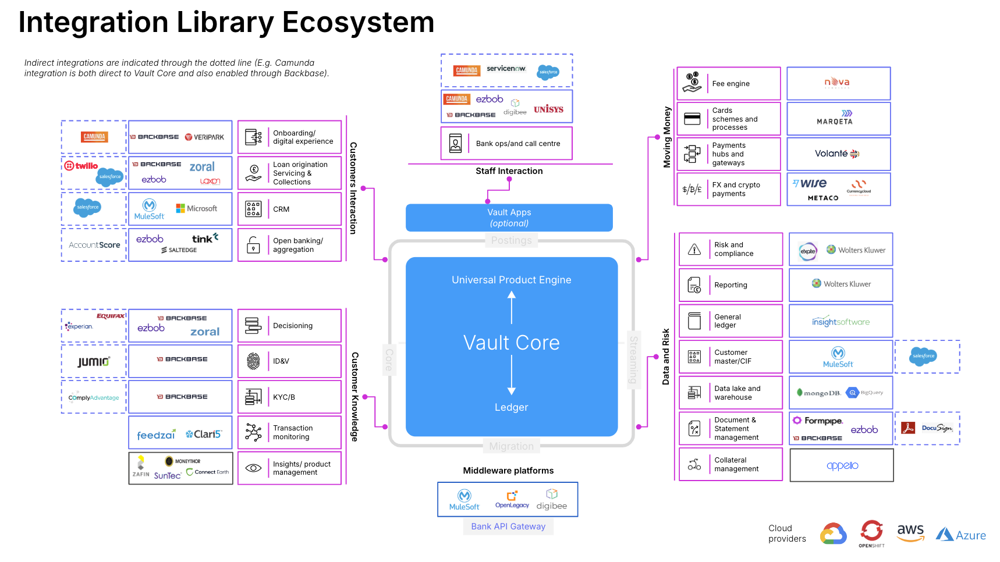

# Core Integration Service Low Level Requirements Gathering

## Purpose

This activity deep dives in the low level requirements gathering for integrating with Vault Core. This activity is undertaken by the business and technology stakeholders. The low level requirements gathering is essential to design the core service integrations.

The core service integrations dictates how the upstream and downstream orchestration works around Vault Core and how the Core APIs and Streaming APIs are used by the integration layer to connect with existing or new components in the architecture. The data streamed out also serve as the source of the data systems solution.

## Predecessor Activities

Refer to the below activities that should have been completed before this step and relevant inputs in the form of documentation should be available for this step

1.  Architecture: [Transition State Architecture Design](/delivery-framework/latest/EN/delivery_workstream/architecture/transition_state_architecture)
    
2.  Vault Core Configuration: [Smart Contract and Feature Block Technical Design](/delivery-framework/latest/EN/delivery_workstream/vault_core_config/sc_feature_block_technical_design)
    

## Guidance

This activity is undertaken by the lead business analyst(BA) and the lead engineer. Together they review this per journey or user story and combine the core service low level requirements gathering with the smart contract design Activity in each sprint. In this iterative process, the low level requirements for each journey are orchestrated. Decisions on the required metadata, on which parameters are changed or updated, on what notifications are sent and on balances required to be stored from the balance streaming API are made.

### Common pitfalls

Common pitfalls are not asking the right questions when reviewing each user journey and not analysing all the orchestration tools available from the integrations partner. The Integrations partner should be aware of Vault Core APIs and streaming APIs and integration patterns available for integrating with Vault Core.

### Templates and examples

This activity cascades to the design phase. Each journey is discussed and once the requirements, design and orchestration are agreed, a technical design document is updated.

The integration library serves as an example and accelerator of how clients and partners can built integrations around Vault Core for multiple use cases and journeys like FX, transactions orchestration and payments. Please contact [cs-integrations@thoughtmachine.net](mailto:cs-integrations@thoughtmachine.net) to learn more or organise a demo. Below is a description of the Thought Machine integration library.

### Integration library

The Integration library is a collection of constantly evolving solutions integrated with the Vault Core platform. The solutions are built either by Thought Machine or technology vendors. The integration help clients de-risk and accelerate the implementation of the Vault Core platform, making it quicker and easier to stand up a full technology stack around the Thought Machine banking solution.

The Integration Library streamlines the process of finding and connecting to the right technology vendor. Developers can more easily implement a new solution by leveraging Thought Machine’s expertly engineered middleware. Clicking the logos in the portal provides access to detailed guides on the vendor and each integration use case. The integration library is available for clients and partners in the Thought Machine portal Vault Marketplace.

## Templates

Thought Machine does not have any templates to support the delivery of this activity.

* * *

### Disclaimer

See the Disclaimer relating to this and all other Vault Core Delivery Framework pages [here](/delivery-framework/latest/EN/getting_started/disclaimer/).

Thought Machine Confidential Information.

© 2025 Thought Machine Group Limited. All rights reserved.