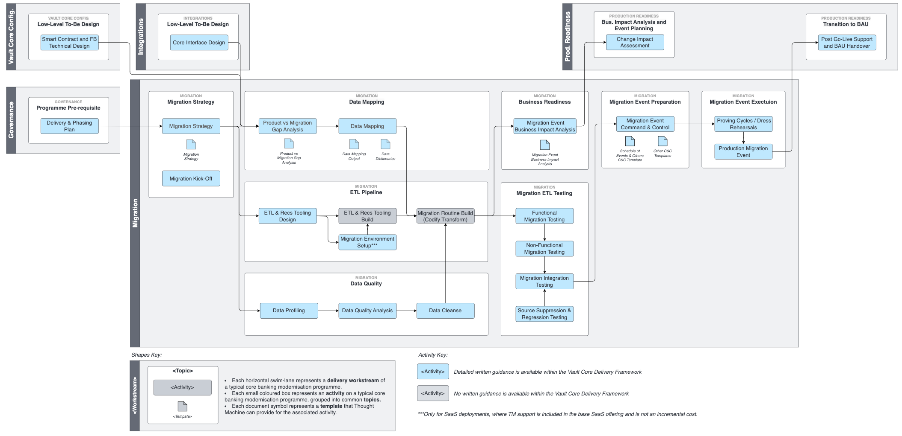

# Migration Workstream

error

The guidance within this section of the Vault Portal contains information on how to deliver a successful migration programme (part of the Vault Core Delivery Framework), including migration strategies.

Other content is available in the wider Vault Portal covering other migration-related topics, which you should read in conjunction with the content here.

API specifications (inc. example messages / requests):

-   [Data Loader API specifications](/vault-core/latest/EN/api/data_loader_api/)
    
-   [Posting Migration API specifications](/vault-core/latest/EN/api/postings_api#posting_migration_api/)
    

Migration API functional behaviour (inc. message lifecycle, error handling, etc.):

-   [Using Vault Core’s migration APIs](/vault-core/latest/EN/environment_and_installation/migrating_to_vault)
    

## Overview

As one of the [Vault Core Delivery Framework Workstreams](/delivery-framework/latest/EN/delivery_workstream), the Migration Workstream represents the end-to-end delivery lifecycle that enables the execution of a migration (or ETL) pipeline to move Accounts and their associated data from a legacy core banking system into Vault Core.

The complete set of activities that form this lifecycle, including links to associated detailed guidance, is below, but broadly speaking this workstream covers the following key topics:

-   Definition of a migration strategy, which provides the framework within which the rest of the migration delivery can take place.
    
-   Gap analysis to understand the Smart Contract being migrated onto, which inputs into the wider Data Mapping exercise to establish the source and target data fields and transformation rules.
    
-   Design and development of the ETL Tool / Pipeline and deployment of migration testing environments.
    
-   A lengthy phase of testing covering testing from ETL testing through to full programme dress rehearsals.
    
-   Preparation for and execution of production migration events.
    

From the outset it is important to keep in mind that:

-   The migration workstream as documented here represents a subset of the total scope of the wider modernisation programme as a whole, which includes other predominantly precursor activities such as [Governance](/delivery-framework/latest/EN/delivery_workstream/governance), [Infrastructure](/delivery-framework/latest/EN/delivery_workstream/infrastructure), [Product (Smart Contract) Development](/delivery-framework/latest/EN/delivery_workstream/vault_core_config), and [Production Readiness](/delivery-framework/latest/EN/delivery_workstream/production_readiness) to name but a few.
    
-   'Migration' in this context refers to legacy core to Vault Core migrations, and not to Smart Contract version upgrades, Vault Core version upgrades, Vault Core SaaS to Vault Core self-hosted (or vice versa) migrations or cloud hosting provider database migrations. Contact Thought Machine for more information about the execution of these other 'migrations'.
    

## Activity Map

The Migration Workstream comprises the following activities:

## Activities

The activities highlighted in grey above denote those without written guidance, as these are not activities that we have deep SME expertise within.

You can find detailed guidance on activities highlighted in blue via the links below:

 
| Activity | Description |
| --- | --- |
| 
[Migration Kick-Off](/delivery-framework/latest/EN/delivery_workstream/migration/introduction_to_the_migration_programme_lifecycle)

 | 

Setting up and commencement of the migration programme, including embedding the repeatability of migration delivery.

 |
| 

[Migration Strategy](/delivery-framework/latest/EN/delivery_workstream/migration/migration_strategy)

 | 

Foundational migration activity that provides clarity on how migration fits into the overall programme transition state plan, a set of principled decisions on the migration approach, and a high-level delivery plan for the migration workstream.

 |
| 

[Migration Environment Setup](/delivery-framework/latest/EN/delivery_workstream/migration/tooling_and_environment_setup)

 | 

Deploying the Vault Core migration component and migration environment requirements.

 |
| 

[Product vs Migration Gap Analysis](/delivery-framework/latest/EN/delivery_workstream/migration/smart_contract_migration_build_and_test)

 | 

Analysing the product (Smart Contract and integrations) to understand migration impacting design decisions and any Smart Contract changes that are necessary to enable a successful migration.

 |
| 

[Data Mapping](/delivery-framework/latest/EN/delivery_workstream/migration/data_mapping)

 | 

Mapping source data fields and values to their equivalents in target, and defining any necessary transformation rules needed to meet the target data schema.

 |
| 

[Extract](/delivery-framework/latest/EN/delivery_workstream/migration/extract_transform_and_load_etl_tooling_build)

 | 

Design activity for the programme’s Extract, Transform, and Load (ETL) tool, including Reconciliation.

 |
| 

ETL & Recs Tooling Build

 | 

The technical build of the ETL and Reconciliation tooling, including the selection of technologies / components.

 |
| 

Migration Routine Build (Codify Transform)

 | 

Codifying the outputs of data mapping within the ETL and Reconciliation tooling.

 |
| 

[Data Profiling](/delivery-framework/latest/EN/delivery_workstream/migration/data_quality_and_cleanse)

 | 

An optional step to identify and remediate data quality issues ahead of the migration to target.

 |
| 

[Migration Event Business Impact Analysis](/delivery-framework/latest/EN/delivery_workstream/migration/business_readiness)

 | 

Analysis of the impact of the production migration event on business processes.

 |
| 

[Migration ETL Testing](/delivery-framework/latest/EN/delivery_workstream/migration/migration_testing)

 | 

Functional, non-functional, integration, and source suppression / regression testing of the migration pipeline.

 |
| 

[Migration Event Command & Control](/delivery-framework/latest/EN/delivery_workstream/migration/event_preparation)

 | 

Preparatory activities undertaken ahead of a migration event, including activities such as logistics, schedule of events, etc.

 |
| 

[Migration Event Execution](/delivery-framework/latest/EN/delivery_workstream/migration/event_execution)

 | 

Executing proving cycles / dress rehearsals (live-like tests) and the production migration event.

 |

chat\_bubble

Though in the context of core banking data migration there are common tasks, well-known industry patterns, and recognised nomenclature, ultimately the nature of each migration is influenced by a variety of factors, such as scope, strategy, past migration experiences, partners involved, resourcing, etc.

The guidance should support early programme planning and thinking, and is not intended to be a prescriptive method that *must* be followed to successfully migrate onto Vault Core.

## Disclaimer

See the Disclaimer relating to this and all other Vault Core Delivery Framework pages [here](/delivery-framework/latest/EN/getting_started/disclaimer/).