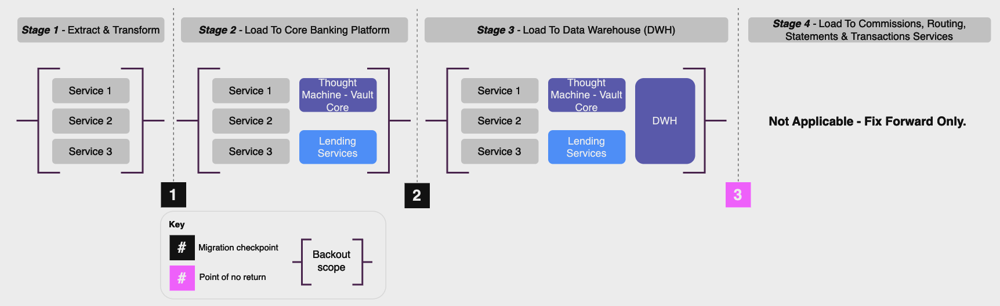

# Migration event command and control

## Purpose

Towards the end of a migration programme with the ETL pipeline fully tested, the programme should begin preparations for upcoming migration event(s).

We refer to the processes that prepare for and support a migration event as \`migration event **Command and Control (C&C)**'.

-   This military language is purposefully used and goes some way to describe the rigorous approach and routine with which C&C and its underlying components should be undertaken for a highly risky core banking system migration.
    
-   Typically we would expect a large bank data migration to have a more rigorous C&C approach compared to a small bank simply due to the scale, complexity, and therefore risk involved with the event.
    

The definition of what is and is not included within C&C will vary, and you may already have your own established and well-defined C&C processes or equivalent.

However, we would expect it to typically include most of the items listed below.

 
| C&C Component | Description |
| --- | --- |
| 
[Change freezes and approvals](/delivery-framework/latest/EN/delivery_workstream/migration/event_preparation#change_freezes_and_approvals)

 | 

Tracking change windows and freezes around the proposed event dates, including planning and management of any approval processes.

 |
| 

[Team planning and rota](/delivery-framework/latest/EN/delivery_workstream/migration/event_preparation#team_planning_and_rota)

 | 

Outlines the core and extended team of people that will be in place to support a data migration event. This will probably include multiple partners or vendors.

 |
| 

[Schedule of events](/delivery-framework/latest/EN/delivery_workstream/migration/event_preparation#schedule_of_events)

 | 

Schedule that dictates the number, type and order of activities that need to be successfully completed during the data migration event. This is a key deliverable that is often started earlier in the lifecycle to help drive key planning decisions, such as how long the event will take to execute end-to-end.

 |
| 

[Event communications and go/no-go](/delivery-framework/latest/EN/delivery_workstream/migration/event_preparation#communications)

 | 

The frequency, channel, and ownership of communications to parties involved with the data migration event. This includes the go / no go decision.

 |
| 

[Incident management](/delivery-framework/latest/EN/delivery_workstream/migration/event_preparation#incident_management)

 | 

The processes for handling incidents that arise during the migration event, distinct and separate from Thought Machine BAU incident management.

 |
| 

[Event deliverables](/delivery-framework/latest/EN/delivery_workstream/migration/event_preparation#other_event_deliverables)

 | 

Key deliverables that should be produced to support management and the overall success of the migration.

 |
| 

[First occurrence validation](/delivery-framework/latest/EN/delivery_workstream/migration/event_preparation#first_occurrence_validation)

 | 

The definition and tracking of activities that occur for the first time on the new (target) system.

 |
| 

[Back out](/delivery-framework/latest/EN/delivery_workstream/migration/event_preparation#back_out)

 | 

The planning and execution of a migration back out in scenarios where the ETL pipeline and/or target fails to an irrecoverable state.

 |

We do not foresee all clients following this structure or terminology to the letter, but do expect clients will, at least to some degree, cover all of the content included on this page.

If executed well this activity provides your programme with the following outcomes:

-   Confidence that you can respond quickly to incidents should they arise.
    
-   A clear and shared understanding of the shape of the migration event, making it easy to identify when tracking off course.
    
-   Minimises chance of \`nasty surprises' around the migration event (missing a key SME, do not have access to necessary stakeholders to make a decision, unfamiliar process confuses and slows the event, etc.).
    

chat\_bubble

Also, please note the migration event itself is explained separately in [Migration Event Execution](/delivery-framework/latest/EN/delivery_workstream/migration/event_execution/) and this page is instead dedicated to the preparatory efforts required in the lead up to this.

## Predecessor Activities

1.  Migration: [Migration ETL Testing](/delivery-framework/latest/EN/delivery_workstream/migration/migration_testing)
    

## Guidance - Event command & control

### Change freezes and approvals

There are two types of bank change freeze that should be considered in the context of migration programmes:

 
| Change freeze type | Consideration |
| --- | --- |
| 
*Change freezes resulting from the migration programme itself*

 | 

The programme needs to ensure that the rest of the bank is aware of the migration activity taking place (which applications is it hitting, when, what are the downstream consequences, etc.) and where necessary implement change freezes to ensure that no detrimental wider bank activities are scheduled during migration event windows. In particular any changes that result in alterations to the source data structure must be avoided for a period prior to migration to avoid the risk of invalidating data mapping.

 |
| 

*Change freezes or BAU maintenance windows occurring in the rest of the bank*

 | 

The programme must avoid other change programmes that are already scheduled, which may have their own change freezes already in place, or regular BAU maintenance windows.

This narrows the scope of potential event dates, so it is important to understand these early and plan accordingly. There may also be other bank changes planned ahead of the migration event that do not cross over for go-live dates but do need to be rescheduled to avoid impacting the migration programme, such as a change occurring a few weeks before migration that will alter the source data structure and impact the migration programme’s extract/transform processes.

It is common for \`smaller' or less impactful change programmes to have to work around migrations, and change their go-live dates accordingly. Thorough analysis and a central decision making forum with visibility of all bank changes is necessary to ensure that such issues are avoided.

 |

In addition to change freezes, the wider change approval processes that the migration programme exists within need to be appropriately factored into event planning.

Each bank will have its own change approval process and associated stage gates that need to be met in order for a production migration event to take place. These should ideally be well known before the programme commences, but a thorough plan should be pulled together as part of the event preparation that includes following the defined process to secure the necessary approvals.

Missing an SLA to get on the agenda of a change review board, not getting the right person’s approval in time, or missing a particular mandatory change approval deliverable can easily lead to a refused approval and be a complete blocker to a migration event taking place as originally planned.

### Team planning and rota

When considering the business and IT support required for your migration dress rehearsals and events, it is important to start planning well in advance of the event.

The extent of the team and rota required to support your migration will vary depending on the programme and event scope.

#### Team planning recommendations

Below are recommended principles for planning your team:

 
| Principle | Description |
| --- | --- |
| 
*Anyone that is expected to be contactable over a migration event should be on the team sheet*

 | 

This means a combination of people that will be practically executing migration steps in the SoE, central programme resources coordinating the event (for example incident management), and domain SMEs that may be required to support particular incidents or topics.

 |
| 

*Consider splitting the team sheet into \`core' and \`extended' resources*

 | 

This may be beneficial, with varying expectations set around the level of engagement required (such as core resources onsite, extended can work remotely, and so on).

 |
| 

*There should be redundancy (spare capacity) in key roles to remove key-person dependencies*

 | 

Avoids scenarios whereby no key stakeholder is available.

 |
| 

*The team sheet should be designed around the SoE*

 | 

Resources should be bolstered in teams when their key activities are planned, and less when there are known gaps or periods when little activity is expected.

However, all teams should maintain some presence throughout the main period of the event, with a \`stand-up' date/time agreed in advance of the event, likely a day or so before key activity for that team begins, and a \`stand-down' time agreed in principle on the same basis, only enacted with permission from the migration event’s central communications team when it is confirmed the team’s support is no longer required.

 |
| 

*The central programme should define the team sheet and rota principles and requirements*

 | 

Ensure these are adhered to by each team supporting the event, and provide cascades to all resources supporting the event with clear guidelines and expectations.

 |
| 

*Confirm the logistics upfront*

 | 

Determine the event location(s) before entering dress rehearsals - especially with teams dispersed across regions and timezones. Decide whether to complete events remotely or onsite. Being onsite is harder to orchestrate, and usually more costly, but has the benefit of making all resources immediately accessible.

Being onsite will add logistical complexity, such as:

\* Key card provision for site visitors

\* Permission to stay beyond normal closing hours of chosen site

\* Space and meeting room practicalities

\* Food, travel and associated expense policies

\* Overnight accommodation (where relevant)

\* Health and Safety

\* Pay: Are colleagues being compensated for weekend working? Will time off in lieu be put in place?

\* Contact Details: Consolidated list of the names and contact details of everyone supporting the event for emergency scenarios

 |

#### Rota planning recommendations

The nature of the rota will depend on the complexity of the migration event.

-   For simple overnight migrations a single team can execute the migration (with some early starts and late finishes)
    
-   For complex multi-day migrations we have experienced the following work well:
    
    -   Two shifts (day and night), each running for 12.5 hours - 8am to 8:30pm and 8pm to 8:30am.
        
    -   The 30 minutes crossover is used to hand over between shifts.
        
    

chat\_bubble

Three 8.5 hour rotas can also work, but you need three teams and it is likely not practical for most migration programmes.

#### Thought Machine Involvement

Thought Machine aims to support dress rehearsals and migration events from a legacy system to Vault Core. If you are already engaged with Thought Machine in a Client Services project then you should first discuss this with the Thought Machine team as they are best placed to provide adequate support.

If you are not engaged in an active project please reach out to your assigned Thought Machine representative so adequate support can be arranged in advance.

### Schedule of events

A Schedule of Events (SoE) is a task-by-task account of all activities associated with a migration event, showing their timings, owners, dependencies, and other useful event information.

It is followed during a migration event to ensure activities take place at the right time and in the right order. As such, any team that has any activity that needs to be performed as part of the event (such as send X file to transform layer, configure Y parameter, make Z API call) should have line items in an SoE.

Every migration event must have some sort of SoE. The level of detail it goes into, and the rigour with which it is created and run over the event, may well vary, but the principle of having an end-to-end articulation of the event in a single document is an important one.

SoEs should be owned and run by dedicated migration SoE leads. Migration SoE leads are not responsible for running the tasks during the migration, but they do play an important role in overseeing all event activity and ensuring that the correct timing and sequencing is maintained. One or more SoE leads should be responsible for:

-   **Creating the SoE**: A request will go out to all teams that have responsibilities over the migration weekend to contribute their SoE activities. The SoE lead(s) will piece these together into the correct sequence with support from programme technical and architecture teams. Both a \`detailed' and \`light' Thought Machine template and populated example is available on request to support this.
    
-   **Reviewing the SoE**: A cut of the SoE is taken ahead of each test or real event, which means all relevant tasks, their associated timings/duration and the owners have been identified and agreed, as well as any dependencies or interlocks and the chronological flow of activity. This cut or baseline usually occurs following a walkthrough call with all individuals contributing to the event.
    
-   **Running the SoE**: During migration events (both test and production) the SoE lead(s) will:
    
    -   Coordinate activity and track progress against the SoE
        
    -   Raise incidents where the completion time of a task falls outside an agreed threshold
        
    -   Update the actual start and finish times of each task
        
    -   Act as a central coordination point for updates from the event teams
        
    -   Run an open-line call throughout the main period of implementation, which delivery teams join to provide and receive "Tell" updates, and through which all communications will be given/received
        
    
-   **Communicating the SoE**: At the Command and Control level, a consolidated SoE will be used to track overall progress and also ensure that where dependencies or interlocks exist, messages are passed between the relevant teams. This level will also provide general updates and announcements that can then be cascaded accordingly.
    
-   **Maintaining the SoE**: Following each migration test event on the route to live, the SoE will be built out and refined as additional activities come into event scope and as timings are better understood.
    

Below is a non-exhaustive list of SoE best practice recommendations:

-   The SoE tasks should follow a logical progression, and reflect how activities and messages will occur and be cascaded in real time.
    
-   The SoE should not simply be a list of tasks - it should allow related tasks to connect together and support the notion of dependencies and predecessors, so that during an event the downstream impact of any early or late running tasks can be understood instantly and times updated accordingly.
    
-   The SoE is a living document that should be constantly updated throughout the event with the actual timings, incident references, notes and other useful information.
    
-   The SoE should be the single source of truth for the latest event progress and drive updates at event meetings and official communications.
    
-   The SoE should determine the point of no return. This drives difficult but necessary conversations early in the process so senior stakeholders can agree and align around it.
    
-   Depending on the complexity of the migration event there may be multiple SoEs at different levels, such as:
    
    -   *A Master (gold) SoE*: Contains a summary tasks across the entire programme (key start and completion milestones, such as commence historic load)
        
    -   *Lower-level (silver or bronze) SoEs*: Relate to specific activities or teams (the exact steps needed to load customer data, load account data, cutover, etc.)
        
    
-   The SoE should follow a hierarchical approach, whereby messages are passed from the teams *doing* the migration activity to the SoE lead(s) *coordinating* it, and messages passed back in the opposite direction providing confirmation to proceed to the next key task. This orchestration is achieved through the presence of \`wait' and \`tell' instructions within the SoE alongside the \`do' activities:
    

 
| Instruction | Description |
| --- | --- |
| 
**Wait (get)**

 | 

For task updates that are received from another level, and should not proceed until received

 |
| 

**Tell (give)**

 | 

For task updates that need to be given to another level of SoE, which may kick off a dependent activity

 |
| 

**Do**

 | 

Representing low level migration activity taking place (which may be preceded and followed by tells/waits)

 |

An example of a simple and detailed Schedule of Events (SoE) is available on request.

### Comms and go/no-go

Clear, concise and quick communications are critical for tracking migration progress, managing problems, and the overall success of the data migration event.

It is vital that a migration event communications plan is created by the programme, overlaying the communications points on the migration event timeline.

When considering an event communications plan you should think about the following:

-   Who will be sending event communications?
    
-   What is the communications hierarchy? For example, a Gold, Silver, Bronze team structure that engages in increasingly granular elements of the SoE, and have varying decision making authorities.
    
-   What will the communications vehicle(s) be? - Email, open-lines, organised calls, secure messenger, etc.
    
-   When will communications be required throughout the event?
    
-   Who needs to receive each communication and are their up-to-date contact details available?
    

During the data migration event, the following are suggestions for agreed communications points in the communications plan.

  
| Communication | Description | Expected Channel |
| --- | --- | --- |
| 
**Progress checkpoints and updates**

 | 

It is common for pre-agreed periodic communication updates to be held with all key parties during a data migration event. Normally these are planned at key intervals in line with the SoE.

 | 

Call or email

 |
| 

**Go/no-go**

 | 

A Go/no-go is a critical governance and communication point in a data migration event.

There may be multiple go/no-go calls over a migration event; both at its commencement, and when all data has been loaded to the target system and the bank makes the decision to cutover to the target system - or \`go-live'.

It normally also represents a \`point of no return' - where the event passes a milestone which cannot be rolled-back from, hence its importance and the need to have strict \`go' criteria based on service health, migration reconciliation outputs, etc.

 | 

Call

 |
| 

**Schedule of Events updates**

 | 

Open lines for SoE leads to join in order to provide confirmation that an SoE task has/has not been completed as expected.

If an SoE task has not been completed as expected, the representative will be expected to provide a new forecast time of when they expect to finish.

 | 

Call or email

 |
| 

**Shift handovers**

 | 

There should be a localised process (owned by each team) for handing over between shifts where a day/night rota is in place. This should ideally be a combination of briefings and written handover comms.

 | 

Call or email

 |
| 

**Incident resolution**

 | 

A specific incident management comms plan to update on open incidents and to enable rapid resolution of migration incidents where they arise.

 | 

Call

 |
| 

**24/7 open line**

 | 

Depending on the bank’s and Thought Machine’s appetite, there may be a need to be connected to an open telephone line 24/7. This can be used to answer queries that arise.

 | 

Call

 |

### Incident management

The management of incidents during a data migration event takes on an additional level of visibility and criticality compared to BAU incidents.

It is expected that multiple \`practice runs' of the event would have taken place prior to the real data migration event; therefore any unexpected events and outcomes should be an additional cause for concern. Any major problems could also cause material financial, customer and/or reputational damage for the bank.

The limited time available during a data migration event means that delays against the SoE may result in detrimental customer impacts, such as extending the customer maintenance window app downtime period.

Therefore, if an incident arises during the data migration event it is critical that the necessary SMEs are quickly accessible to help resolve it. One of the worst problems for a data migration event is not having access to the SME quickly, or not having the appropriate team to solve problems inside the given maintenance window, resulting in rollback or contingency measures. For large migration programmes a dedicated incident management team may well need to be stood up over the event.

To ensure efficient management of incidents during a data migration event make sure to discuss arrangements with your Thought Machine point of contact beforehand. This should be agreed prior to the start of dress rehearsals.

#### Incident management recommendations

A non-exhaustive list of recommendations are:

-   **Ensure that there is a clear and well understood incident management process** - for example controls around break glass policies for restricted (e.g. PRD database) access, clear articulation and a shared understanding of incident severity ratings, processes for incident logging and tracking as well as a shared understanding around role and responsibilities.
    
-   **Plan and ensure adequate access to the most appropriate SMEs to solve incidents** - defining the full list of business and IT SMEs you may potentially need, including escalation paths to senior leadership in case of material issues.
    
-   **Pre-agree acceptable tolerances with incidents and how they impact go/no-go decisions** - for example \`No open severity 1 incidents' is often a requirement for providing a go decision.
    

For bank-hosted Vault customers (non-SaaS), you could opt to provide Thought Machine with read only access to your Observability (Grafana and Kibana logs) to help accelerate incident resolution. Again this should be discussed with your Thought Machine point of contact prior to the event.

### Other event deliverables

Below are additional deliverables that may be useful when undertaking event preparation.

  
| Deliverable | Purpose | Steps To Create |
| --- | --- | --- |
| 
**\`What if?' playbook**

 | 

\* The pre-agreed steps that should be taken if something happens that is not in the SoE.

\* It is not possible to account for all situations but you should actively plan and consider if certain parts of the event do not go to plan.

 | 

\* *Review the SoE for risk* - with migration SMEs determine the most likely and critical points where something could go wrong.

\* *Build out mini SoEs* - for each what-if scenario identified, build out and agree a mini SoE of steps that would need to be executed.

 |
| 

**Success criteria**

 | 

\* The checklist of criteria that you use throughout a migration event to ensure that the event is achieving what is planned and in the order and time expected.

\* Typically this is important criteria for senior bank internal stakeholders and sometimes external stakeholders (such as regulators).

 | 

\* *Build the SoE* - there is little value in starting this exercise without it.

\* *Determine involved parties* - focus on all parties \`doing' something over migration with a bias for those that are either critical SoE tasks and/or those undertaken by senior internal and external stakeholders.

\* *Cross- check and build* - comparing the SoE, parties and key dates, select the key criteria and map when they happen during migration - for a large migration 30 success criteria would be adequate.

\* *Sign-off* - obtain sign-off of the success criteria with relevant senior parties ahead of the first migration event.

 |

A Thought Machine template and populated example is available on request for some of the above to support this.

### FoV testing

In the broadest sense, first occurrence validation (FOV, also known as end-user testing) comprises the end-user checks that take place during and after the migration event to provide assurance of the health of the migration activities to move forward to the next stage of the migration event and to provide assurance of the success of the migration activities completed so far.

These checks will include validation of business processes, accounts, data and outputs that will be impacted by the data migration event. These checks will extend to some or all of the events on the end to end migration plan, such as early proving cycles through to post implementation/go-live.

We distinguish from [ETL Reconciliations](/delivery-framework/latest/EN/delivery_workstream/migration/extract_transform_and_load_etl_tooling_build#data_reconciliations) here, as ETL Recs are (largely) automated checks validating data files completed by the programme migration team, where FOV is normally completed by end business users.

#### FOV scope and reporting

The programme will define the scope and reporting requirements of FOV as the e2e migration plan/route to live starts to materialise. The rigour, detail and general level of organisation given to FOV activities will be similar to that of the Command & Control.

It is likely that each FOV task will have its own script tested and run multiple times prior to the go-live, ensuring that the user can complete the task as expected, has access to the relevant data and can report in appropriate time. The processes in scope at each phase, the reporter, the method and time will likely all be included in the FOV scope and reporting. An example FOV check (out of a likely list of hundreds) that would likely be planned is shown below:

     
| *Process/Script Description* | *Phase* | *Time* | *Method* | *Reporter* | *Status* |
| --- | --- | --- | --- | --- | --- |
| 
Customer App Balance Retrieval In < 2 seconds

 | 

Post Go Live

 | 

20/08, 05:30

 | 

PRD test account logged in

 | 

{Name}

 | 

Planned

 |

Alternatively, operational colleagues may be provided with a predefined set of real accounts to check that their associated data has migrated as expected - e.g. account opening date correct, balance correct, etc. The FOV will not only apply on a successful migration. If there is a No-go decision FOV will also be needed to ensure that all data and processes return to their original state and are working as expected.

#### Stages of FOV

The extent of FOV activities will be defined as the migration plan matures. Generally, FOV can be split into four distinct phases:

 
| Phase | Check |
| --- | --- |
| 
*ETL checks* (before go-live either side of the load)

 | 

Critical fields validated after the EoD on source and before the load on target and go/no-go. The accounts and fields validated before load are the same as those validated after load.

 |
| 

*Post go-Live*

 | 

Likely to be checks that focus on proving priority end-to-end business processes prior to customers using them. For example, whether a balance can be retrieved in appropriate time, showing up correctly in the customer app.

It is expected that these processes will be closely monitored and tracked during the data migration event.

 |
| 

*Pre/Post EoD validation*

 | 

After the resources are loaded on to Vault, what are the checks that need to be done prior to EoD to ensure, as much as possible, that EoD will complete successfully; for example are all schedules planned to run at the time expected?Post EoD checks similarly focus on the first EoD on the target system (Vault) and ensure that the changes that should have taken place have indeed done so; for example has interest been accrued?

 |
| 

*Natural occurrence*

 | 

Activities that cannot be forced forward or proven early without material risk or difficulty, and rely on the event occurring in BAU.

A typical example is quarterly, half year or annual reporting; the effort to try and mimic this during a migration event to prove the product ledger is set up correctly can have too many downstream risks and impacts.

 |

### Back out

The back out strategy is the \`go to' manual if something does not go as planned during a migration event and the bank decides to stop the event and revert to the legacy system. The back out strategy details the steps that need to be taken depending on the stage of the migration that the event is cancelled at, for example removing data from an environment and scaling down pods on services to ensure no more processing.

The steps we recommend to build your back out strategy are:

-   **Learn the SoE**: Your back out strategy cannot be built until the SoE is well established. It is the SoE that informs what steps need to be taken to undo the changes and restore the bank to a pre-migration state. In particular you will want to know the key migration event checkpoints in the SoE as it should only be at these points that a decision to back out would be made. There is little value in considering back out if it does not adhere to the overall event flow / sequence in the runbook.
    
-   **Determine the point of no return**: If it has not already been done it is important to now determine the point of no return. The point of no return will also likely form the main go / no go (see [Communications](/delivery-framework/latest/EN/delivery_workstream/migration/event_preparation#communications) earlier in this C&C section) decision point in the migration event. This point of no return normally arises:
    
    -   *Where you think it is too risky to attempt to back out at this point* - for example data has spread to multiple systems across the bank.
        
    -   *Where you may not be able to back out in time* - for example the execution of the back out may take too long and create customer impacts.
        
    -   *Where technically you may not be able to undo changes*: There may be instances where reversing a change is not possible, for example it may not be possible to re-open an account that was closed due to suppression.
        
    
-   **Study the architecture and determine the blast radius**: It should be obvious that the further along you move with the migration the harder it is to back out. You should create a view of the growing impact or blast radius of backing out at each migration checkpoint. For example, if your SoE starts with transforming data made available via an End of Day extract file from the legacy core then the blast radius is minimal or contained; if you back out at this stage then only the ETL tooling needs to be wiped. In the picture below the key stages of a previous client migration are shown alongside the key migration and back out checkpoints.
    

-   **Build the back out strategy**: With the key checkpoints and point of no return understood you can detail the steps that need to be taken to back out at each stage. The mechanics or steps for backing out at each stage depend on the system or service in question and each should be considered individually. In some cases it may be a direct database query to wipe a number of accounts or related information; in other cases you may not want to remove the data and instead move it to a non-useable state similar to what could be done in Vault Core.
    
-   **Build the back out SoE**: With the strategy and high level stages in place you can start to build what is sometimes called a back out SoE. This will provide the procedures, often in great detail, that are needed to execute the back out at each stage of the migration event. Clients vary in the effort they go to in developing these types of runbooks with larger clients investing considerable time and effort in an runbook that will hopefully never be used.
    

To assist in building your back out SoE, detailed below are the Vault Core back out steps. The steps vary depending on what the migration event stage:

  
| Migration event stage | Scenario | Action required |
| --- | --- | --- |
| 
Vault Core load not started

 | 

In this scenario the environment has been configured (such as Smart Contract loaded) but the no-go decision occurred ahead of the load to Vault in the ETL pipeline (for example, an issue in data transform).

 | 

It is likely that no action needs to be taken, because no data has been loaded to Vault Core. New configuration, such as Smart Contract, can be uploaded if necessary but otherwise the environment is ready for the next load run.

If backing out in this situation, careful consideration needs to be given to the handling of data by downstream consumers (Online Data Hub, General Ledger etc).

 |
| 

Vault Core load partially or fully complete but cutover has not taken place

 | 

In this scenario either the load has started but material problems have been found (such as incorrectly formatted data) and the load has been stopped before it was able to fully complete, or it has fully completed but cutover has not yet taken place (for example, an issue in post-load reconciliations).

 | 

\* When migrating into a clean/empty environment, the environment will need to be fully wiped ahead of the next attempted load. The configuration of Vault Core (for example Posting API client set up) will need to be (re)-completed. If it is a SaaS service Thought Machine will wipe the environment.

\* When migrating into a live environment, there are two options. Most preferable is moving migrated resources, via the Core API, to their closed or inactive state to not disrupt BAU. Additionally, downstream systems would need to appropriately filter out streamed data for only migrated accounts. To move an account to \`closed' a script would be needed to zero out all balance addresses - this would need prior testing and approval to apply to a production environment.

\* Alternatively, a database restore or back-up using native capability of chosen database solution (where available) could be followed. This will have impacts on the live population that need careful consideration and planning. At best this will extend the duration of the migration event and likely the customer maintenance window as you take down the existing database and restore from the back-up. At worst you will need to restore and then replay the transactions that have come in during the event window to ensure the customer accounts are up to date as you resume BAU operations. The latter approach requires more upfront planning as part of the overall back out strategy. If backing out in this situation careful consideration needs to be given to the handling of data by downstream consumers (Online Data Hub, General Ledger etc).

 |
| 

Vault Core load fully complete and cutover has taken place

 | 

In this scenario the \`go' decision was given to cutover following data load and reconciliations, cutover to production has taken place, and subsequent material issues have been discovered once Vault core is the live operational core.

 | 

\* This is strictly a fix forward rather than a back out scenario. This would be a situation dependent on the scale and scope of the required fix.

\* It is likely that a thorough analysis activity would be needed to identify all impacted accounts and a playbook drafted to complete a \`hot fix' in production in the shortest possible time frame.

 |

## Templates

Thought Machine can provide templates to support clients in delivery of event command and control. Please contact your assigned Thought Machine representative for further information.

### Disclaimer

See the Disclaimer relating to this and all other Vault Core Delivery Framework pages [here](/delivery-framework/latest/EN/getting_started/disclaimer/).