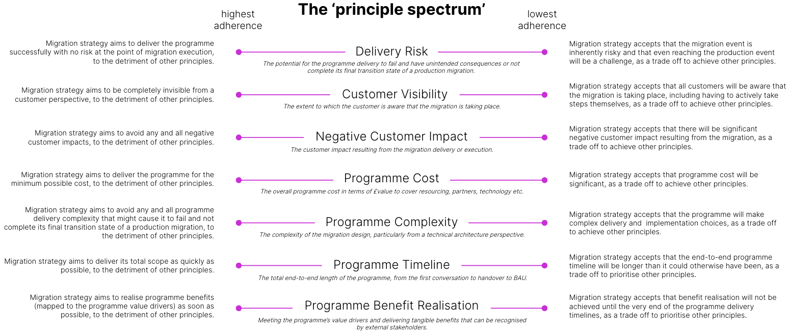

# Migration strategy

## Purpose

Migration strategy is a foundational activity that shapes the rest of the migration workstream.

If executed well this activity provides your programme with the following outcomes:

-   Clarity on how migration fits into the overall programme product and transition plan.
    
-   A set of principled decisions on the migration approach.
    
-   A high-level delivery plan for the migration workstream, culminating in production go-live events.
    

Migration strategy is a fairly broad term that encompasses a wide range of both high and low-level decisions. To break up the activity into more manageable chunks we make a distinction in our guidance between:

1.  **Product & transition plan**
    
    -   Sequencing the programme’s transition states, which are phases of delivery that result in a tangible business or technology benefit.
        
    -   The plan should show where migration sits in relation to other programme activities, such as the launch of greenfield products or front-book switch.
        
    -   Usually culminates in a set of slides including a \`spine of the plan' for the programme as a whole, and high-level defender positions on Product, Migration, Technical Architecture, and Business / Operations strategies.
        
    -   Agreed early on in the programme lifecycle, perhaps as an input to the programme’s business case.
        
    -   Detailed guidance available in the [Business Workstream](/delivery-framework/latest/EN/delivery_workstream/business) of the Vault Core Delivery Framework.
        
    
2.  **Macro migration strategy**
    
    -   The most important and fundamental decisions that give your migration strategy its foundation.
        
    -   Covers topics such as:
        
        1.  Migration principles
            
        2.  Product sequencing
            
        3.  Tranching approach
            
        4.  Migration strategy archetype (big bang, phased, etc.)
            
        
    -   Usually culminates in a set of slides including a high-level delivery plan including migration go-live dates.
        
    -   Agreed early on in the programme lifecycle.
        
    -   Detailed guidance available in the [Macro Migration Strategy](/delivery-framework/latest/EN/delivery_workstream/migration/migration_strategy#macro_migration_strategy) section below.
        
    
3.  **Micro migration strategy**
    
    -   The more specific and secondary decisions that give your migration programme its detail.
        
    -   Covers topics such as:
        
        1.  Pre-loads and deltas
            
        2.  System sequencing for migration
            
        3.  Downtime and in-flights
            
        4.  Data breadth and depth
            
        5.  Event timings
            
        
    -   Usually culminates in a detailed migration strategy document.
        
    -   Agreed once the migration workstream commences in earnest.
        
    -   Detailed guidance available on request by speaking to your assigned Thought Machine representative.
        
    

chat\_bubble

For detailed real-world case studies of Vault Core migrations across a variety of migration strategy archetypes please speak to your assigned Through Machine representative and ask for the Vault Core Migrations - Client Case Studies deck. This is regularly updated with a representative set of migration archetypes that bring to life some of the more academic descriptions below.

## Predecessor Activities

1.  Governance: [Delivery & Phasing Plan](/delivery-framework/latest/EN/delivery_workstream/governance/delivery_and_phasing_plan)
    

## Guidance - Macro migration strategy

### Migration principles

Before you shape the nuts and bolts of the migration strategy, first invest time to agree your programme’s migration principles.

These principles should ideally align to the overall [programme value drivers](/delivery-framework/latest/EN/delivery_workstream/business/product_and_transition) and ultimately shape the decisions taken subsequently when determining the migration strategy itself.

When determining your programme’s principles you may find it useful to think about them as existing on a spectrum, where adhering strictly to one principle normally requires a trade off against another. For example, to achieve a principle of no detrimental customer impact it is reasonable to assume there will be additional delivery complexity and potentially a knock on impact on the programme cost and delivery timeline. This can be helpful in making sure that you do not agree a set of well intentioned but ultimately conflicting principles.

Though certainly not exhaustive, the following diagram shows the most common migration principle \`themes' that we have observed on our client programmes, and extremes of most or least adherence to these when considered on a spectrum:

Use this to prompt thinking in your programme when creating your migration principles.

#### Additional Thought Machine recommended principles

Based on our experience supporting past clients migration programmes, you should bear the following in mind when agreeing your migration principles:

1.  *The programme’s defender position should be \`this programme is going to recreate the legacy products within the target IT estate and migrate data onto these recreated target products'.*
    
    -   Too many programmes instead start by looking at a blank sheet of paper on the target estate and designing a new set of greenfield products.
        
    -   This is not an issue in and of itself (some programmes will launch greenfield products and migrate the back-book as separate transition states, however it becomes a problem if a broad unqualified assumption is made that the programme will be able to (somehow) migrate the back-book legacy accounts onto these greenfield products without any analysis to prove whether what is planning to be built on target actually meets the requirements / T&Cs of the legacy products.
        
    -   If you want to migrate existing accounts (and their associated historic data) from one core banking system to another then the underlying product must be very similar in order for this to be possible, so you should plan to faithfully recreate the legacy products on target from the beginning.
        
    -   This is not to say that every single aspect of legacy has to be carried across to target, and there will of course be some differences between system logic, business processes, rationalisation of the product book, intentional T&C changes at the point of migration through an onboard/offboard migration, etc. that mean the products are not strictly speaking identical. We are NOT advocating for a blind carry across of all the issues with your legacy system / products.
        
    -   You should, however, adopt the statement above as a defender position and then knowingly and intentionally agree to deviate from it by exception through the relevant programme authority.
        
    
2.  *Front or back load non-migration change in separate transition states to minimise the change that takes place over the production migration events.*
    
    -   Where possible you should seek to avoid compounding change around migration events because it adds additional risk to the migration.
        
    -   We recommend instead front-loading (i.e. executing well in advance of the migration) or back-loading (i.e. executing well after the migration) such change, which could include for example the front-book switch, launch of a new digital app, material changes in colleague front-ends, etc.
        
    -   Sweep all non-critical path migration changes out of the way of the migration - they are hard enough as it is, do not make them harder!
        
    
3.  *\`Lean into' customer impacts if they are already \`baked in' due to other programme decisions.*
    
    -   Sometimes programme decisions outside of migration will result in a significant customer impact.
        
    -   For example, a fintech may be an indirect participant in a payment scheme via a sponsor bank, and if this sponsor bank is changing as part of the overall programme then this could well force a reissue of sort code / account numbers / cards, which is highly customer impacting.
        
    -   Where this is the case, trying to minimise customer impact over the migration event may simply result in additional delivery complexity for no real upside - the horse having already bolted.
        
    -   Instead, consider leaning into this impact and choosing a migration strategy with high customer impact but trade-offs in terms of complexity, cost, timeline to deliver, etc.
        
    
4.  *Migrations are exercises in avoiding risk at the point of migration wherever possible, even where this results in some customer impact.*
    
    -   Do not be so afraid of impacting customer experience negatively that it forces you down a very complex and difficult to deliver migration strategy.
        
    -   Customer impacts are not unheard of in day-to-day banking, for example channel downtime around app maintenance, so lean into this and adopt a migration strategy that also uses channel downtime to remove complex in-flight scenarios and the need to handle these (this is just one such example out of many).
        
    -   Be bold and be willing to accept the trade-off of (controlled) customer impacts for the sake of a less complex and thus less risky migration event.
        
    

### Macro migration decisions

Macro migration decisions are the most important and fundamental decisions that give your migration strategy its foundation.

We have divided these macro decisions into the following five themes, which are then expanded upon in turn for the remainder of this section:

 
| Macro strategy theme | Description |
| --- | --- |
| 
Avoiding an ETL

 | 

The first thing to consider on any migration programme is whether a data migration is required at all.

 |
| 

Product Sequencing

 | 

The order in which products will be migrated to the target core.

 |
| 

Tranching

 | 

Splitting the overall migration scope into discrete migration events.

 |
| 

Load

 | 

The act of loading data into the target system.

 |
| 

Cutover

 | 

The act of making the target system the live operational system and data master for migrated accounts.

 |

Answering these questions will effectively determine your migration strategy archetype, which is mostly determined by a particular answer to one of the macro migration questions below.

#### Avoiding an ETL

Within the glossary of programme terms we suggest reserving migration to refer to the movement of data from the legacy tech stack to the target tech stack, which, strictly speaking, would not include strategies that avoid the need for movement of data in the first place, which we cover here in this section \`avoiding an ETL' (or alternatively, \`migration in name only').

Each of the approaches to avoiding an ETL below share the following traits:

-   They come with significant trade-offs.
    
-   They are only appropriate in a set of specific circumstances, potentially outside of your control.
    
-   They massively simplify the overall migration exercise by removing the need for an ETL pipeline.
    

So whilst the overall objective of the programme can be achieved, this occurs in an unorthodox manner that does not require an ETL pipeline to be built and executed.

   
| Avoiding an ETL approach | Description | Primary trade-off | Determining if appropriate |
| --- | --- | --- | --- |
| 
Run-Off

 | 

Only switch the front-book to target, allowing existing accounts to expire naturally on the legacy core.

 | 

Requirement to keep the legacy core running until the final account has expired (cost, co-existence complexity, etc.).

 | 

This method is normally unworkable for open ended or long running products (current accounts, mortgages, etc.) and will depend largely on whether decommissioning legacy is a core value driver for the programme or not.

 |
| 

Offboard / Onboard

 | 

Close the accounts on the legacy core and open them as new accounts on the target core.

 | 

High customer impact through required communications, re-onboarding, loss of historic data, etc.

 | 

Largely depends on the extent to which you are willing to allow overt customer impacts as part of the migration. If there are already customer impacts being felt due to other programme decisions (e.g. banking account details re-issue) then this option can quickly become more attractive, as it can also in situations where the product proposition between legacy and target is changing dramatically and there is no desire to recreate legacy products as they are.

 |
| 

Manual

 | 

Manually key data into the target system, bypassing the need for an automated ETL tool.

 | 

Overhead of undertaking manual keying and the risk of data entry errors.

 | 

Only viable where account volumes are incredibly low (e.g. migration of a high value but low number of commercial accounts), likely no more than low hundreds. Additionally only sensible where the entire scope of the programme is low volume - if you’re building an ETL pipeline at all you might as well use this to migrate everything (including low volume products that are a sub-set of the whole).

 |
| 

Early Exit

 | 

End the customer’s relationship with the bank and close their account, without moving anything to target.

 | 

Loss of customer relationship, potential terms and conditions / regulatory challenges.

 | 

In a sense the antithesis to a true migration, this option only has utility as tool within product rationalisation, where a small subset of the total product scope may be both long running and determined to be something the bank no longer wants to hold on its back-book, in which case early exit may be the only viable option.

 |

#### Product sequencing

A common question posed to us by clients who are beginning to consider their migration strategy for a large bank with a range of different product types is; "which product should I migrate first?".

This question blurs the line between migration strategy and product strategy, as the answer is going to be materially informed by the answer to the separate question "which product should I front-book switch onto target first?". This is because the front-book switch sequence is likely driving the product design / build order, and as migration is dependent on this as an input it usually makes sense to phase migration in the same manner.

Therefore, to determine your product sequencing for migration you should ideally first answer the [Product Strategy](/delivery-framework/latest/EN/delivery_workstream/business/product_strategy) questions that form part of the [Product and Transition Roadmap](/delivery-framework/latest/EN/delivery_workstream/business/product_and_transition) activity.

That said, in our experience, if you are thinking about migration in isolation then the following should inform your product sequencing approach:

-   Do not attempt to migrate the most complex product first to prove that "if we can migrate X we can migrate anything!". This a fine soundbite but a terrible delivery principle.
    
-   Migrations are complex enough as a baseline, do not increase that complexity to the maximum from the outset for no good reason.
    
-   Look for product characteristics that simplify the migration design:
    
    -   Less \`active' products (therefore lower number of in-flights, lower deltas, less day-to-day customer engagement, lower transaction volumes etc.).
        
    -   Low number of schedules (therefore less to work around over migration events).
        
    -   Low number of balance addresses (therefore less complex posting mapping and migration).
        
    
-   Though every product is different, these characteristics are most likely to be observed on products such as Savings, Digital Wallets, and (potentially) Current Accounts, and least likely to be observed on products such as Loans, Mortgages, or Credit Cards.
    

#### Tranching

How, if at all, will the total migration scope be subdivided into separate, discrete migration tranches?

Whether it is a single product or full bank migration that is planned, the option that almost all clients select nowadays is to de-risk the migration by executing multiple migration tranches and not going in bulk / Big Bang. This demands architectural co-existence for the period between the first and last migration event, though this is often already in place to support a decoupled new-to-bank go-live event occurring in an earlier transition state.

Where they are tranching, most clients will take a product lens to the migration sequencing - current accounts, then savings, then more complex products etc. - and starting with simpler brands, geographies, etc. This is because the product development and front-book switches are often executed on a product-by-product basis, so in a purely practical sense it makes sense for migration to mirror this pattern to realise business benefits as soon as possible.

Additionally for larger migrations the products may also be sub-tranched (i.e. 2m into 10k, 300k, Rest) to further spread the risk, and criteria such as age or customer needs used to which accounts fall into which tranche.

Key questions:

-   Which unit of migration will be used? (Customer, Product, Attribute, Line of Business, etc.)
    
-   What will the sequencing of the migration tranches be?
    
-   How many tranches will there be?
    
-   What criteria will be used to determine which Accounts fall into which tranche, if any?
    

##### Load

Different systems support different load methods, and some systems support more than one.

Common load methods include:

-   File-based batch upload (e.g. flat file)
    
-   REST API
    
-   Kafka API
    
-   Load into shadow state (and replicate to production on cutover)
    

To migrate historic data to Vault Core the only solution available is:

-   Kafka API:
    
    -   Vault Core’s Kafka-based migration APIs are the only means of migrating data into Vault Core, and are the sole migration load solution offered within this migration guidance.
        
    -   Detailed functional documentation on these migration APIs is available in the [using Vault Core’s migration APIs](/vault-core/latest/EN/environment_and_installation/migrating_to_vault) guide.
        
    
-   To get data in the appropriate format to send to Vault Core’s migration APIs you will require an [ETL tool](/delivery-framework/latest/EN/delivery_workstream/migration/extract_transform_and_load_etl_tooling_build).
    

##### Cutover

Cutover is the data migration activity whereby the target system is made operationally live, following a prior data load. At cutover the target system becomes the data master for a given account and the source of truth for other systems in the wider bank.

Regarding cutover strategy, there are two high-level options:

1.  Load and Cutover within the same migration event.
    
    -   This is the traditional approach to data migration, whereby as part of one event (i.e. one continuous migration event taking place over a few hours / days) load and cutover occur sequentially.
        
    -   Depending on other migration strategy decisions related to data change suppression there may be a need for small delta loads in between the initial load and cutover (to catch-up any changes that occur during this period).
        
    -   Cutover normally occurs during a period of channel downtime.
        
    
2.  Loan and Cutover as discrete decoupled migration events.
    
    -   Choosing this option means you have selected a Parallel Run migration strategy.
        
    -   Load to the production Vault Core environment occurs days / weeks / months ahead of cutover.
        
    -   In the interim both the legacy core and Vault Core operate in parallel for a limited time period within a production proving exercise, where legacy remains the master and Vault mirrors to prove consistency of product outcomes.
        
    

### Resulting migration strategy archetype

Once you have answered the macro migration strategy questions you have also effectively determined your migration strategy archetype.

These archetypes (or \`patterns' if you prefer) are:

-   Broadly industry recognised methods for executing data migrations.
    
-   Characterised by one particular macro migration strategy decision (e.g. simply choosing a decoupled cutover approach results in parallel run migration archetype).
    
-   Not identical when used across different programmes - for example, two Phased migrations might share the characteristics of tranched migration events, but can look and feel very different depending on the micro migration strategy decisions taken.
    

As above, thinking about migration strategy archetypes in this way is an art not a science, but based on our experience supporting client migrations we have identified the following common migration strategy archetypes:

 
| Migration strategy archetype | Description |
| --- | --- |
| 
Big Bang

 | 

All in-scope data migrated as part of a single event, removing the need for architectural co-existence.

 |
| 

Phased

 | 

In-scope data is phased across multiple migration events (sometimes referred to as Incremental or Mini Big-Bang).

 |
| 

Parallel Run

 | 

Decouple load and cutover, continuing to master data on legacy for a parallel run period whilst target operates in a shadow state.

 |
| 

Avoiding ETL - Run-Off

 | 

Let accounts naturally expire on the legacy estate, switching only the front-book to target.

 |
| 

Avoiding ETL - Offboard / Onboard

 | 

Close an account on the legacy system and open a new one on target.

 |
| 

Avoiding ETL - Manual

 | 

Manual keying of data into the target system.

 |

chat\_bubble

At Thought Machine we prefer not to start migration strategy discussions with these archetypes, instead building a migration strategy from the ground-up by answering the macro and micro migration strategy questions. As above, two migrations of the same archetype can be wildly different in practice.

For detailed real-world case studies of Vault Core migrations across a variety of migration strategy archetypes please speak to your assigned Through Machine representative and ask for the Vault Core Migrations - Client Case Studies deck. This is regularly updated with a representative set of migration archetypes that bring to life some of the more academic descriptions here.

### Planning a parallel run

#### What is a parallel run?

A parallel run is the simultaneous operation of two core systems—the legacy core and the new Vault Core. Specifically, in our definition it:

-   Involves running the same production data (same accounts) in both Vault Core and the legacy core - one core operates as the designated system of record - with the other operating in a shadow state at any given time for any given account.
    
-   Is done at full or at least material volume - this is one of the unique benefits of a parallel run when compared to low volume pilot proving in production.
    
-   Operates only within the production environment - this distinguishes it from an extended testing phase or soak test in a non-production environment.
    
-   Includes and operates on the target architecture and integrations - it does not operate on a partially deployed target stack / Vault Core.
    

#### Why execute a parallel run?

Parallel run is first and foremost a risk mitigation strategy that offers unique benefits not so readily available in a phased migration or non-production testing cycle.

Reasons for doing a parallel run include:

-   De-Risk migration cutover - it prioritises operational resilience at the point of moving from the legacy core to Vault Core by avoiding a hard "Point of No Return."
    
-   Service parity and continuity - it provides continuity and (planned) parity of service for customers. This can take more than one dimension, including:
    
    -   Product terms and conditions - validating that every customer has their agreed product T&Cs honoured by Vault Core; at least as much is necessary and in line with earlier programme decisions.
        
    -   Customer experience - for example confirming that at full volume the end-to-end latency of real customer journeys is as planned (likely either better or equivalent to legacy in most cases).
        
    -   Integrations - provides real world, full volume proving of the new integrations.
        
    -   Regulatory confidence - it provides more and perhaps necessary proof to meet a high regulatory bar, especially for systemic banks.
        
    -   Environment population - it can more simply be used to populate the target environment (Vault Core) with historical data over a period of time, such as building historic transactions on Vault Core if they are not migrated. This may be necessary if needing to complete adjustments on Vault Core after the point of cutover. Put another way, you need the data on the target system to complete an adjustment going back up to 30 days post migration.
        
    

Crucially, and what distinguishes parallel run is that the above are not easily achieved (if at all) through coexistence or standard migration testing.

The answer to the why is not *“all of the above”* - you need to be specific on why you have opted for a parallel run instead of a phased migration to then effectively determine the how.

#### How to implement a parallel run

With the what and the why agreed a bank can consider the details of the how.

Similar to migrations more broadly, no two banks will operate a parallel run in exactly the same manner. Banks should work through the questions below to define what their parallel run will look like - consistently tying it back to the specific why.

We recommend engaging in these decisions early to manage senior stakeholders. These are decisions that require major investment and planning and cannot be simply “switched on” later in the migration programme to suddenly or quickly build more confidence prior to cutover.

These design decisions are not mutually exclusive and may impact one another at points but are broadly laid out in a chronoligical order. Additionally, the why will make some of these more or less relevant. Finally, recommendations are made without knowledge of your specific programme but are provided to support a discussion.

It is recommended that these decisions is worked through by the programme team. Having these decided will help to inform the lower level technical design of the parallel run and ensure the parallel run is achieving its bank objectives (linking back to the why).

    
| Design Decision | Description | Recommendation | Other Options | Comments |
| --- | --- | --- | --- | --- |
| 
Scope of data and run time

 | 

Need to decide if all transactions and account updates are mirrored in Vault Core or if only a subset of journeys. Also, need to define the intended duration and coverage of key business events (example end of month or end of quarter).

 | 

Focus on a subset of critical journeys and minimise time to a single end of month coverage as much as possible.

 | 

Full replication over an extended period (example one quarter or half).

 | 

The longer the duration of the parallel run, for example one quarter, then you are delaying the programme by at least that much.

 |
| 

Seeding Vault Core

 | 

What extent of history will be migrated to Vault Core. The greater the history the more complexity in the migration but the greater the ability to immediately test more journeys (example backdated parameter change).

 | 

Opening balances or the minimum history needed to support product.

 | 

Significant parameter and posting history (example 3+ months).

 | 

The answer here will link back to the objectives of the parallel run and why you are undertaking it.

 |
| 

Extent of replication

 | 

Define precisely what is and is not being replicated. This comes back to programme value drivers which will likely mean some system and product difference is inevitable.

 | 

Accept differences when system behaviours diverge but lead to the same financial outcome, or where product logic is being deliberately changed.

 | 

Match system and product exactly.

 | 

If your answer here is that exact system and product replication is needed then this may not the right answer. Please speak to your Thought Machine point of contact if you would like to discuss more.

 |
| 

Data mastery in core and wider bank

 | 

From the point of load what is the master - legacy or Vault Core. It is often assumed to be legacy but it depends on objectives of the parallel run.

 | 

Legacy remains master - most likely aligns to objectives of parallel run and de-risking the migration.

 | 

Vault Core becomes master

 | 

N/A

 |
| 

Smart Contract design for parallel run

 | 

The Smart Contract (SC) design may need temporary adjustments to account for the parallel run.

 | 

Run BAU code as-is (full transaction logic), minimise drift and risk.

 | 

Make changes to support parallel run. For example, if feeding Vault Core via legacy or to build history then Vault Core has less 'right' to reject a PIB in the pre-posting hook.

 | 

Need to decide on the acceptable level of divergence from the final BAU code; more temporary code increases risk of divergence and tech debt.

 |
| 

Success criteria definition

 | 

Establishing success / exit criteria. This needs to be based on the reason (the why) for doing parallel run.

 | 

Matching product behaviour as much as is needed with a view to improving and simpifying the bank long term.

 | 

Exact financial and *system* level matching.

 | 

Two systems will operate in a different way to reach the same outcome, that is not a bad thing and is potentially a reason for starting the programme. Additionally, do not build in legacy errors simply for the reason of matching.

 |
| 

Data reconciliation scope

 | 

Need to determine when and what will be reconciled to support the parallel run.

 | 

Post End Of Day (EoD) batch; take a once a day cut and compare positions.

 | 

Live streamed reconcilations - depending on legacy this may / may not be theoretically possible but regardless is likely to drive complexity and significant build work into the reconciliation.

 | 

Keep the reconciliation focused and do not allow it to continuously expand. Any differences in processing across systems will need be factored in and not derail the reconciliation.

 |
| 

Discrepancy handling and correction

 | 

There will be discrepancies in the parallel run that need triaging and correcting (legacy or Vault Core). Therefore the method of discrepancy handling needs to be agreed upfront.

 | 

Partially automated - reviewing all discrepancies, at least at the start, is likely not possible so a capability to bring accounts into sync is needed. Build in capability that allows you to focus on different account balance addresses over time. There will also need to be a decision about which system is the master at any a particular point to drive automated corrections; always assume legacy is correct is the common initial position.

 | 

\* Manual - on a major migration this is likely not practical.  
\* Automatic - this does not give the insight into why discrepancies are occuring.

 | 

The answer here may drive significant build work - consider the answer against the volume of accounts and balance addresses in the parallel run, degree of expected / known discrepancies going into the parallel run and the technical capabilities available.

 |
| 

Final cutover approach

 | 

How you will exit a parallel run and cutover to Vault Core being the only system running an account.

 | 

Re-route traffic to only Vault Core

 | 

Re-migrating a fresh data set into the environment

 | 

This is going to be significantly tied to how you set-up the parallel run initially. For example, if all transctions were passed to Vault Core via the legacy core then that makes the cutover a much larger exercise compared to a rerouting of traffic.

 |
| 

Cutover Phasing

 | 

Decide if the cutover is a single, big-bang event (assuming single product) or if it transitions into a phased cutover.

 | 

Two closely dated cutover phases; the parallel run has acheived the required success criteria and has de-risked the migration. Beyond a small pilot cutover a swift cutover is recommended to avoid complexity downstream of managing duplicate account data and determining which is master.

 | 

\* Single cutover  
\* Equally sized tranches

 | 

Phasing the cutover after a parallel run period will likely introduces additional complexity and a need to implement formal master / shadow account flags in the core systems and likely across the bank.

 |
| 

Rollback

 | 

At cutover, will there be a technical capability to rollback (likely to legacy core) or not.

 | 

Rollback - the parallel run implementation itself is likely to make the rollback a simpler implementation; in most cases it may be re-routing and replaying transactions through the legacy core which is a capability you likely already have set-up.

 | 

No rollback - argument could be that the parallel run in itself has served as the rollback.

 | 

If rollback is a significant capability build then the cost benefit of doing this is likely limited, especially given the parallel run itself is designed to minimise the need for a rollback.

 |

From the above, it should be clear that implementing a parallel run comes with many design decisions that can significantly impact the technical design and overall cost / complexity of the programme.

The most important point is to be clear on the objectives, or the why. If you consistently align to the why you can have a focused parallel run and not something that turns into an impossible exercise of replicating anything and everything in an attempt to eliminate risk that could extend a parallel run indefinitely.

A parallel run has to be balanced against cost and time. Reducing risk of migration is key but major modernisation programmes also need to progress and keep momentum. The industry is littered with examples where modernisation programmes have taken on too much scope and complexity, like a parallel run, and have eventually resulted in a full failure.

Put another way, one should not aim for: *"This will be a risk free cutover because the two systems are an exact carbon copy of each other. I’ve seen them running like that for a year across my entire banking book."*

Instead do aim for something like: *"I’ve carefully observed Vault Core and my legacy core operate a selection of accounts over month end. I can see that the new accounts operate exactly as I expect when I send the production data they will receive when I cutover. I have further mitigated my migration and am ready for cutover."*

If you would like to discuss your parallel run implementation in more detail please reach out to your Thought Machine point of contact.

## Templates

Thought Machine can provide templates to support clients in delivery of migration strategy. Please contact your assigned Thought Machine representative for further information.

* * *

### Disclaimer

See the Disclaimer relating to this and all other Vault Core Delivery Framework pages [here](/delivery-framework/latest/EN/getting_started/disclaimer/).

Thought Machine Confidential Information.

© 2024 Thought Machine Group Limited. All rights reserved.