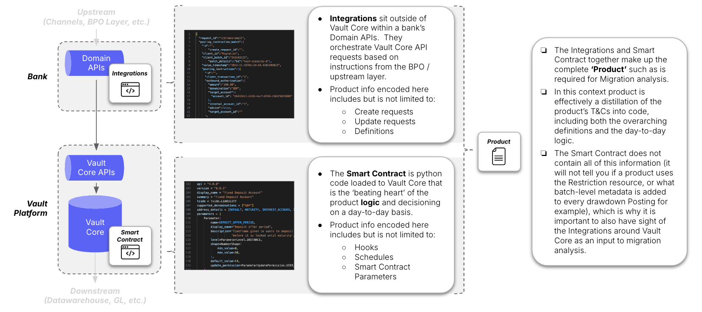
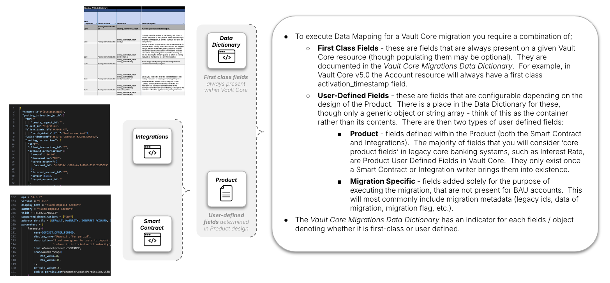
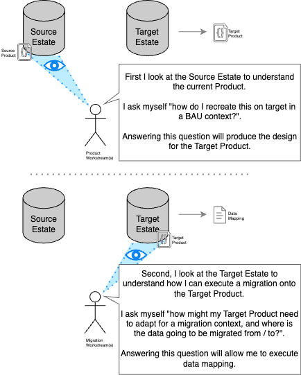
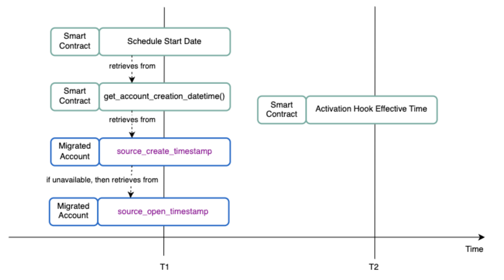

# Product vs migration gap analysis

## Purpose

The \`product vs migration gap analysis' activity is a precursor to [Data Mapping](/delivery-framework/latest/EN/delivery_workstream/migration/data_mapping) that serves two important purposes:

1.  If not already available, the [Gap Analysis](/delivery-framework/latest/EN/delivery_workstream/migration/smart_contract_migration_build_and_test#guidance_gap_analysis) surfaces information about the product that is needed to complete [Data Mapping](/delivery-framework/latest/EN/delivery_workstream/migration/data_mapping).
    
2.  It is an opportunity to assess whether [Migration Smart Contract Builds](/delivery-framework/latest/EN/delivery_workstream/migration/smart_contract_migration_build_and_test#guidance_migration_sc_builds) are required for the product to support the migration use case.
    

If executed well this activity provides your programme with the following outcomes:

-   A clear understanding of the underlying Product being migrated onto within the migration workstream.
    
-   A list of Smart Contract changes and additional migration-specific data mapping inputs that are necessary to meet the migration use case, without which incorrect customer outcomes or business behaviour may occur.
    

#### What do we mean by 'product' in this context?

Here we define 'product' to mean the behaviour of the target product (e.g. fixed term deposit) in its entirety.

This is effectively a distillation of the product T&Cs into code and is not simply analogous with a Vault Core Smart Contract.

-   This is because a **Smart Contract**, though likely representing a majority of the Product behaviour in the target platform, does not define or have sight of everything that makes up the overall product.
    
-   There will also be **Integrations** around Vault Core that make API calls directly to execute certain functions (e.g. sending a Posting), and important migration-relevant information codified in these external Integrations that you would not otherwise know by looking at the Smart Contract alone.
    

Throughout this guidance where we refer to 'Product' we mean both; (i) the underlying *Smart Contract*, and (ii) associated *Integrations* around Vault Core.

## Predecessor Activities

1.  Migration: [Migration Strategy](/delivery-framework/latest/EN/delivery_workstream/migration/migration_strategy)
    
2.  Vault Core Config: [Smart Contract and Feature Block Technical Design](/delivery-framework/latest/EN/delivery_workstream/vault_core_config/sc_feature_block_technical_design)
    
3.  Integrations: [Core Integration Service Design](/delivery-framework/latest/EN/delivery_workstream/integrations/core_service_design)
    

## Guidance - Gap analysis

### Dependencies between migration and product design

As referenced in the [Kick-Off Timing](/delivery-framework/latest/EN/delivery_workstream/migration/introduction_to_the_migration_programme_lifecycle#guidance_kick_off_timing) section, the \`meat' of the Migration Workstream (i.e. any activity from [Data Mapping](/delivery-framework/latest/EN/delivery_workstream/migration/data_mapping) onwards) should ideally not commence until the underlying product has been designed.

##### Why are migration and product design dependent activities?

Migration data mapping demands a good understanding of the target product(s) in question.

You may intimately understand the source estate / products, but as we outline in more detail in the [Data Mapping](/delivery-framework/latest/EN/delivery_workstream/migration/data_mapping) section, in our experience mapping \`to target' rather than \`from source' is generally preferable, particularly for a Vault Core migration. This therefore demands a good understanding of the target product and data landscape before mapping can commence.

Consider the following scenario:

-   You sit down to commence data mapping and review the Vault Core Migrations - Data Dictionary [downloadable here](/vault-core/latest/EN/environment_and_installation/migrating_to_vault#downloadable_information).
    
-   You see that Vault Core has a concept of 'Flags' - a resource that can be used to capture a Boolean value against a pre-defined Flag definition, that is then most commonly associated with an individual Customer or Account record.
    
-   You think, "Excellent! I know my source system has a similar sounding concept for capturing things like whether an account has opted in for a bonus saving rate, whether the customer is deceased, or whether they have limits on spending due to fraud".
    
-   But wait, you see Vault also has a similar concept called \`Parameters', which in theory could also be used to fulfil these sort of use cases, and oh dear, there’s also a Restriction resource that could fulfil some of these use cases too. And come to think of it, the old system masters both customer and account data, but you know Vault Core is not a customer system - is it even right that it stores the deceased indicator going forwards? And furthermore, any Flags, Restrictions, or Parameter needs to be pre-defined - this is fine for migration as a one-off, but how are any integrations around Vault Core going to know to use the same definition that we happen to choose today during migration data mapping? Particularly if the product is going to be launching new-to-bank before migrations begin.
    
-   You realise that, unfortunately, you’re not actually ready to commence data mapping today, as you are missing some key inputs from the product design.
    

The issue presented in this example stems from the fact that the Migration Workstream is being put in a position where it is expected to answer questions that are squarely in the remit of the product design teams:

-   Here the Migration Workstream should not need to be the first team to answer the question "do I need to migrate Flags into Vault Core?".
    
-   The question should instead be directed back into the programme (specifically the team building the target products), as "does the product that the programme’s [Vault Core Config Workstream](/delivery-framework/latest/EN/delivery_workstream/vault_core_config) has built utilise Vault Core’s Flags in its BAU state?".
    
    -   If yes, then we almost certainly have to migrate some Flags and must inherit the knowledge from the Product design about how this has been done, if not, the opposite.
        
    -   If the answer is unclear then we are very likely trying to execute data mapping before the programme is ready to do so, and at the very least need to acknowledge the need for re-work of the migration outputs as the product design matures over time.
        
    

##### Which specific aspects of the product design is migration dependent on?

As outlined in the [introduction above](/delivery-framework/latest/EN/delivery_workstream/migration/smart_contract_migration_build_and_test#what_do_we_mean_by_product_in_this_context), 'Product' as defined here is a combination of a Smart Contract and a set of Integrations around Vault Core.

Within both of these aspects of the product there will be product definition decisions taken that migration [Data Mapping](/delivery-framework/latest/EN/delivery_workstream/migration/data_mapping) is dependent on.

A non-exhaustive list of the key areas is as follows (with whether the definition is in the Smart Contract or Integrations):

1.  **General information regarding the product strategy / hierarchy** - necessary to understand the scope of [Data Mapping](/delivery-framework/latest/EN/delivery_workstream/migration/data_mapping):
    
    -   Number of SCs or Supervisor SCs (*Smart Contract*)
        
    
2.  **Smart Contract hooks** - necessary to analyse the behaviour of migrated accounts when hooks run, and validate that the behaviour is as expected and intervene if not:
    
    -   Activation hook behaviour (*Smart Contract*)
        
    -   Scheduled hook behaviour (*Smart Contract*)
        
    -   Derived Parameter hook behaviour (*Smart Contract*)
        
    
3.  **Resources that have a 1:many relationship with Accounts and are \`defined' as a precursor activity** - necessary to understand which Flags, Restrictions, and Payment Devices are supported by the target product:
    
    -   Flag definitions (*Integrations*)
        
    -   Restriction definitions (*Integrations*)
        
    -   Payment Devices definitions (*Integrations*)
        
    
4.  **Accounting model** - necessary to complete data mapping for Postings:
    
    -   Accounting model (balance addresses & internal account movements) (both *Integrations* and *Smart Contract*)
        
    
5.  **User-defined fields** - necessary to complete data mapping, as a complement to the first-class fields always present in Vault Core (see diagram below for more information on the difference between first-class fields and user defined fields):
    
    -   Parameter names (both *Integrations* and *Smart Contract*)
        
    -   Resource-level metadata (both *Integrations* and *Smart Contract*)
        
    

Each of the above should be captured in a Product vs Migration Gap Analysis deliverable, as a structured means of documenting this information ahead of data mapping, available on request from Thought Machine.

##### How should I approach product design to best enable a future migration?

As a point of principle, migration programmes should be recreating legacy products in the target estate to enable a migration of data between the two.

It is okay for product behaviour to diverge during the product design phase, but only by exception and taken with a full understanding of the impacts and trade-offs of each decision, including on the future migration effort.

In practice this means following two simple steps in product design:

The gap analysis exercise outlined in this section is effectively step 2 of the diagram above.

chat\_bubble

What you should never do is unthinkingly start designing target products on a blank sheet of paper, disregarding or best-guessing the current legacy product behaviour.

Doing this almost guarantees that, when you do turn to migration, the product you have created is not a suitable migration target, which means additional effort in redesigning aspects of the product, building entirely separate migration-specific Smart Contracts, etc.

##### Should you only consider migration related product impacts or builds after the BAU product design has completed?

In an ideal world, no.

Though commencement of migration activities can be [dependent on the product design](/delivery-framework/latest/EN/delivery_workstream/migration/smart_contract_migration_build_and_test#what_do_we_mean_by_product_in_this_context) and in general we advise logically separating the two streams of work, this does not mean that the product design should be entirely void of any migration thinking or quite as waterfall as the above might suggest.

Where possible set up the overall delivery programme so that there is regular discussion between the teams building Smart Contracts / Integrations and running the migration delivery, such that any potential product changes required for the migration use case can be caught early during the initial design phase, ideally using our list of potential [Smart Contract changes](/delivery-framework/latest/EN/delivery_workstream/migration/smart_contract_migration_build_and_test#guidance_migration_sc_builds) needed to support a migration use case to drive this thinking.

This 'product vs migration gap analysis' activity can then be a mop-up to assure that the migration behaviour is known and accounted for, rather than an exercise to surface this to the product design teams for the first time.

chat\_bubble

In our experience smaller programmes, particularly those centred around a single and simple migration activity, do not logically separate product build and migration in quite as \`purist' a way as we have suggested here.

It is often a single team executing both activities, in which case alignment of BAU and migration product requirements is much easier, and the takeaway from the content in this section should instead be a general understanding of the dependencies between product design and migration.

### Executing product vs migration gap analysis

Product vs Migration Gap Analysis is the act of reviewing a Product (Smart Contract and Integrations) to gather information as an input into Data Mapping. It also surfaces potential Smart Contract builds required to support the migration use case.

If using this template to execute gap analysis (can be provided by Thought Machine on request) we recommend the following steps:

1.  Read the remainder of this page as well as the [Data Mapping](/delivery-framework/latest/EN/delivery_workstream/migration/data_mapping) section.
    
2.  Identify and engage the team that designed / built the Smart Contract being migrated onto.
    
3.  Validate with this team that the principles in the "How should I approach product design to best enable a future migration?" diagram above were followed (i.e. they considered legacy when building the target product).
    
    -   If during these discussions it becomes clear that the team that built the product did not have migration in mind when designing the target product(s) and have instead built a brand new product that diverges from source so much that it cannot be migrated onto (without further builds or a migration strategy that can support this such as onboard / offboard) then pause any migration analysis / mapping and raise this issue at a programme level.
        
    -   The root cause can be indicative of a disconnect of programme aims and objectives - e.g. delivering business unit wants to launch innovative new product propositions, group-level programme wants to migrate the backbook and provided the funding to the business unit for the programme, and the two did not clearly agree a strategy that would see both of these happen. A redesign of the product, or at least gap analysis between legacy and source product features, may be necessary.
        
    
4.  Gather any pre-existing deliverables that describe the Smart Contract or Integrations (requirements, product specification, the code itself, etc.).
    
5.  Document the migration relevant elements of the product within an output deliverable. A Thought Machine template and populated example is available on request to support this.
    
    -   The categories of information that you should gather are those within the "Which specific aspects of the product design is migration dependent on?" section above.
        
    -   The target product SMEs will need to provide input here, or even take the lead on executing the gap analysis overall.
        
    -   For Postings specifically you will need to understand the accounting model that underpins the product to complete the relevant tab. First agree the Posting types in scope for migration (are certain Postings not relevant because they only apply in certain states that are not in scope for migration, such as at the point of maturity where we are only migration Active accounts?), and then unpick the unique balance address / internal account mapping for each transaction type (e.g. interest accrual, deposit, withdrawal, etc.) and plot each individual movement for future use within data mapping.
        
    
6.  Use the document as an input to:
    
    -   [Data mapping](/delivery-framework/latest/EN/delivery_workstream/migration/data_mapping) to \`fill in the gaps' of product-specific field information.
        
    -   Smart Contract migration builds using the [guidance below](/delivery-framework/latest/EN/delivery_workstream/migration/smart_contract_migration_build_and_test#guidance_migration_sc_builds) to determine the design changes required (assuming migration was not already taken into consideration on the first pass of product builds).
        
    

Larger programmes with complex multi-product multi-year migrations should consider building a standardised output into their product build process (which may use a Product Factory approach of reusable code blocks), so that the necessary information to support data mapping is available by default as part of product build without further data gathering required.

## Guidance - Migration SC builds

### Overview

Smart Contracts are generally built to satisfy a BAU go-forwards use case first and foremost (e.g. opening new accounts, updating interest rates, executing schedules as time passes, etc.).

This BAU go-forwards thinking is understandable, however can result in certain logical truths being coded into the product that do not work in a migration use case: - For example, in defining logic to derive a \`maturity date' during account activation, the Smart Contract writer may calculate this using vault account activation date + the defined length of the product’s 'term' (uniform for the product so defined by a template level parameter).

-   In BAU this logic is sound as the account activation date on Vault Core will, for all intents and purposes, always be \`now' when this \`setting the maturity date' function executes, which is the desired behaviour.
    
-   However, in a migration use case these logical truths may no longer actually be true! \`Maturity date' is a known and pre-existing value on legacy that we do not want to reset at the point of migration, so executing the BAU account activation behaviour as outlined will result in an incorrect migration outcome.
    

error

A key principle of migrations is that they should be exercises in faithfully recreating a known legacy state onto a new target, not re-running logic as if it were executing for the first time.

It is therefore very important to assess the impact of your Smart Contract on migrated data / accounts, and understand where the Smart Contract might need to change to support the migration use case to ensure the correct customer / business outcome results from the migration activity.

chat\_bubble

Most migrations that we have supported have demanded at least some changes within the underlying Smart Contract to ensure the right product behaviour takes place over the migration event.

##### Which Smart Contract hooks are more likely to need to change to support a migration use case?

Of the Smart Contract hooks supported by [Smart Contract Language version 4](/vault-core/latest/EN/reference/contracts/contracts_api_4xx/smart_contracts_api_reference4xx/), some are more likely to be impacted (and need special migration handling within the Smart Contract) than others during the migration process.

Use the following to focus your analysis:

  
| Smart Contract Hook (clv4) | Description | Impact during the Migration |
| --- | --- | --- |
| 
[activation\_hook](/vault-core/latest/EN/reference/contracts/contracts_api_4xx/smart_contracts_api_reference4xx/hooks#activation_hook)

 | 

Carries out actions required when the account opens (moves to or is created in status OPEN).

 | 

**High** - Account Activation executes on all migrated accounts loaded in or moved to an OPEN status. Very important to analyse and cater for its impacts.

 |
| 

[conversion\_hook](/vault-core/latest/EN/reference/contracts/contracts_api_4xx/smart_contracts_api_reference4xx/hooks#conversion_hook)

 | 

Carries out actions after a new contract has been activated on this account - the contract template is upgraded to a new version.

 | 

**N/A** - Account upgrade code will not run during a migration event.

 |
| 

[deactivation\_hook](/vault-core/latest/EN/reference/contracts/contracts_api_4xx/smart_contracts_api_reference4xx/hooks#deactivation_hook)

 | 

Carries out actions when the account closes.

 | 

**N/A** - Account deactivations code will not run during a migration event (accounts can be migrated directly in CLOSED status where necessary).

 |
| 

[derived\_parameter\_hook](/vault-core/latest/EN/reference/contracts/contracts_api_4xx/smart_contracts_api_reference4xx/hooks#derived_parameter_hook)

 | 

Returns values for all derived parameters, which can be used as an input to other Smart Contract operations.

 | 

**Medium** - BAU derived parameter logic may result in incorrect outcomes in a migration context. Important to analyse and cater for its impacts.

 |
| 

[pre\_parameter\_change\_hook](/vault-core/latest/EN/reference/contracts/contracts_api_4xx/smart_contracts_api_reference4xx/hooks#pre_parameter_change_hook)

 | 

This hook is used to optionally reject an INSTANCE level parameter value update or an account-owned ExpectedParameter value update.

 | 

**N/A** - The Data Loader API always skips the pre-parameter change hook for migrated ParameterValues.

 |
| 

[post\_parameter\_change\_hook](/vault-core/latest/EN/reference/contracts/contracts_api_4xx/smart_contracts_api_reference4xx/hooks#post_parameter_change_hook)

 | 

Carries out actions after deciding on whether to accept a batch of posting instructions in the pre\_posting\_hook hook.

 | 

**N/A** - The Data Loader API always skips the post-parameter change hook for migrated ParameterValues.

 |
| 

[pre\_posting\_hook](/vault-core/latest/EN/reference/contracts/contracts_api_4xx/smart_contracts_api_reference4xx/hooks#pre_posting_hook)

 | 

This hook is called by Vault when a new batch of posting instructions is attempted and the Smart Contract has the ability to accept or deny the batch.

 | 

**N/A** - The Posting Migration API always skips the pre-posting hook for migrated Postings, so controlling for it is only relevant if [using the BAU Posting API to execute a migration](/vault-core/latest/EN/environment_and_installation/migrating_to_vault/migrating_using_the_bau_postings_api/) which is not the recommended Posting Migration pattern.

 |
| 

[post\_posting\_hook](/vault-core/latest/EN/reference/contracts/contracts_api_4xx/smart_contracts_api_reference4xx/hooks#post_posting_hook)

 | 

Carries out actions after deciding on whether to accept a batch of posting instructions in the pre\_posting\_hook hook.

 | 

**N/A** - The Posting Migration API always skips the post-posting hook for migrated Postings, so controlling for it is only relevant if [using the BAU Posting API to execute a migration](/vault-core/latest/EN/environment_and_installation/migrating_to_vault/migrating_using_the_bau_postings_api/) which is not the recommended Posting Migration pattern.

 |
| 

[scheduled\_event\_hook](/vault-core/latest/EN/reference/contracts/contracts_api_4xx/smart_contracts_api_reference4xx/hooks#scheduled_event_hook)

 | 

Carries out actions for the scheduled event type.

 | 

**High** - Account Activation executes on all migrated accounts loaded in or moved to an OPEN status, which normally includes schedule creation. Very important to analyse and cater for its impacts.

 |

chat\_bubble

Though the hooks marked N/A above should not require Smart Contract amendment to execute a migration event, it is recommended to nevertheless analyse them as part of the Product vs Migration Gap Analysis exercise.

You may identify examples of validation rules for pre-posting for example that should be factored into Data Mapping. For example:

-   In BAU every Posting without XYZ metadata field is rejected within the pre-Posting hook.
    
-   What is the purpose of this validation rule?
    
-   What is the consequence of migrating a Posting with or without this metadata?
    

##### Which Smart Contract hook functions are more likely to need to change to support a migration use case?

Smart Contracts are inherently very flexible, and the product logic that they execute can vary enormously.

We cannot therefore provide an exhaustive list of business logic that you need to watch-out for in a migration context. Rather, this can be achieved for your product through the [Gap Analysis](/delivery-framework/latest/EN/delivery_workstream/migration/smart_contract_migration_build_and_test#guidance_gap_analysis) exercise documented above.

However, based on our experience there are certain Smart Contract functions (inputs or outputs) that are more likely to be impacted and need special migration handling than others.

Use the descriptions and code snippets available via the following links to support your analysis:

  
| Smart Contract Hook Input or Output | Function | Migration Consideration |
| --- | --- | --- |
| 
Input

 | 

[1\. Last Schedule Execution Date](/delivery-framework/latest/EN/delivery_workstream/migration/smart_contract_migration_build_and_test#1_input_last_schedule_execution_date)

 | 

Inability to migrate the last schedule execution date, which can be used as a Smart Contract input.

 |
| 

Input

 | 

[2\. Global / Template Parameters](/delivery-framework/latest/EN/delivery_workstream/migration/smart_contract_migration_build_and_test#2_input_global_template_parameters)

 | 

Migration of historic values for template and global parameters.

 |
| 

Input

 | 

[3\. Account Creation Time](/delivery-framework/latest/EN/delivery_workstream/migration/smart_contract_migration_build_and_test#3_input_account_creation_time)

 | 

Impacts of using the `get_account_creation_datetime()` function to set Schedule start date for migrated accounts.

 |
| 

Output

 | 

[4\. Derived Parameters / Variables](/delivery-framework/latest/EN/delivery_workstream/migration/smart_contract_migration_build_and_test#4_output_derived_parameters_variables_smart_contract_attributes)

 | 

Amending Derived Parameter or Variable logic for migrated accounts.

 |
| 

Output

 | 

[5\. Postings](/delivery-framework/latest/EN/delivery_workstream/migration/smart_contract_migration_build_and_test#5_output_postings)

 | 

Controlling Postings generated by the Smart Contract for migrated accounts.

 |
| 

Output

 | 

[6\. Contract Notifications](/delivery-framework/latest/EN/delivery_workstream/migration/smart_contract_migration_build_and_test#6_output_contract_notifications)

 | 

Controlling Contract (Event) Notifications generated by the Smart Contract for migrated accounts.

 |
| 

Output

 | 

[7\. Schedules](/delivery-framework/latest/EN/delivery_workstream/migration/smart_contract_migration_build_and_test#7_output_schedules)

 | 

Controlling Schedule commencement date for migrated accounts.

 |

#### What are other potential reasons for a Smart Contract to require changes to support a migration use case?

1.  *Historic Data Requirements* - Analyse the Smart Contract logic to understand any dependencies on historic data being fetched (such as a scheduled job that requires a look back at the previous seven days of historic postings); the migration programme should ensure that these dependencies are understood and addressed as part of the [Migration Strategy](/delivery-framework/latest/EN/delivery_workstream/migration/migration_strategy) related to the scope and volume of historic data being migrated to Vault Core.
    
2.  *Migrating using the BAU Postings API* - Though this is against best practice as the Posting Migration API is always the preferred solution, where the Business As Usual (BAU) Posting API is being used to migrate Postings, additional Smart Contract code will be required to skip a number of posting validation steps (e.g. pre-posting hooks). The full details of how to manage the impact of using the BAU Posting API to migrate Postings, including suggested Smart Contract code snippets, is covered in the [Migrating using the BAU Postings API](/vault-core/latest/EN/environment_and_installation/migrating_to_vault/migrating_using_the_bau_postings_api) section.
    
3.  *Bespoke Migration Behaviour* - There may be instances where the Smart Contract is intentionally used to drive behaviour for migrated accounts that is unique to the migration use case. For example, to offset a negative customer experience resulting from the migration, you may decide to put all migrating customers on the highest tier of savings bonus rate for a set period of time, regardless of their legacy rate or BAU behaviour. In practice, this could require bespoke logic to be applied to these migrated accounts that needs to be considered in the Smart Contract design.
    
4.  *Account Timezones And Processing Groups* - Where you are migrating accounts that are planned to utilise common configuration, for example Smart Contracts and / or internal accounts, careful consideration to ensure no unintended overlap or impacts occur as a result of the migration. Additionally, when running and/or planning to run multiple Processing Groups in a single instance the timezones of each geography or business line should be considered.
    

### 1\. Input - Last Schedule Execution Date

#### Description

Smart Contracts can fetch the `last_execution_datetime` for a given schedule at an account level, which is the datetime that the schedule in question last executed within Vault Core.

Neither the Data Loader API nor the Posting Migration API currently support the migration of the `last_execution_datetime` field.

Accordingly, where a Smart Contract fetches and uses the `last_execution_datetime`, either as part of migration Account Activation or within any other hook that is executed in BAU post-migration, special handling of the migration use case will need to be considered.

#### Example

chat\_bubble

The below is just one potential example of many, and the \`migration code snippet' logic may be different depending on the context. You must analyse your Smart Contract to determine and implement the desired behaviour on a case-by-case basis.

This code is from the Product Library `library/loan/contracts/template/loan.py` contract.

-   Here the Smart Contract fetches the `last_execution_datetime` for the due amount calculation Schedule.
    
-   This is necessary as an input into the calculation of the next overdue date (function not shown).
    
-   Where the `last_execution_datetime` returns null it instead uses the account activation date.
    

When this Schedule first executes in BAU for a migrated account it will return null, as there will be no `last_execution_datetime` present, and the Schedule start date will default to the Vault account activation datetime instead (i.e. the point of migration).

However, this may lead to incorrect customer outcomes, as the migrated account may have previously executed the due amount calculation schedule (or at least an equivalent legacy concept) and have an existing cycle that needs to be maintained.

To support this function for a migrated account it may be appropriate to amend the Smart Contract:

This code is an augmented version of the Product Library `library/loan/contracts/template/loan.py` contract.

-   Here we define an account-level parameter for capturing the last due amount calculation datetime from legacy, which is migrated using the Data Loader API as part of the Account resource migration.
    
-   Where the `last_execution_datetime` returns null then the Smart contract first checks to see if the migrated parameter is populated, and if so will use this.
    
-   Where this also returns null then it instead returns the account activation date as it does in BAU.
    

### 2\. Input - Global / Template Parameters

#### Description

Smart Contracts that use the old method of defining Parameters within the Smart Contract (see [Key differences between Smart Contract Parameters and the Core API Parameters resource](/vault-core/latest/EN/reference/parameters#key_differences_between_smart_contract_parameters_and_the_core_api_parameters_resource) for a comparison of this method vs the new Parameter resource introduced in Vault 5) can define Parameters that are at the Instance (i.e. Account), Template (i.e. Smart Contract), or Global (i.e. Vault Core instance) level.

For Template and Global Parameters the timeseries of historic values cannot be migrated to Vault Core using either the Data Loader API or the Posting Migration API.

Accordingly, where a Smart Contract fetches and uses this timeseries, either as part of migration Account Activation or within any other hook that is executed in BAU post-migration, special handling of the migration use case will need to be considered.

#### Example

chat\_bubble

The below is just one potential example of many, and the \`migration code snippet' logic may be different depending on the context. You must analyse your Smart Contract to determine and implement the desired behaviour on a case-by-case basis.

This code is from the Product Library `library/line_of_credit/contracts/template/drawdown_loan.py` contract.

-   Here the Smart Contract defines a template-level parameter that stores the values for penalty interest.
    

Any current or historic values for this template parameter that are already present in Vault Core at the point of migration (for example, as a result of migrating onto a live instance of Vault that had changed this parameter in the past) can be fetched for the migrated accounts without any limitation on account creation / opening / activation time.

However, where historic values for this template parameter are not already present in Vault Core, Smart Contract functions that rely upon these in their logic may reach an incorrect outcome for migrated accounts.

To support this function for a migrated account it may be appropriate to amend the Smart Contract:

This code is an augmented version of the Product Library `library/line_of_credit/contracts/template/drawdown_loan.py` contract.

-   Here we change the parameter structure to be an json string, which contains an array of parameter effective dates and associated values.
    
-   There is then an example of how this format of parameter could then be fetched within the post-posting hook (where \`date' is the key, \`rate' is the value).
    
-   This change has knock-on implications throughout the Smart Contract in terms of how it is fetched and also how it will be maintained (added to) over time.
    
-   Implementing parameter logic in this way is ideally transitory, and would be implemented in such a way as to leave possible a future Smart Contract migration back to a BAU state.
    

### 3\. Input - Account Creation Time

#### Description

The relationship between Accounts v2 timestamps and the Smart Contract is as follows:

<table class="tableblock frame-all grid-all fit-content"><colgroup><col> <col> <col></colgroup><tbody><tr><td class="tableblock halign-left valign-top">
<em>Field name</em>
</td><td class="tableblock halign-left valign-top">
<em>How is this field exposed in the contract language API?</em>
</td><td class="tableblock halign-left valign-top">
<em>Can this field be set &amp; backdated via the Data Loader?</em>
</td></tr><tr><td class="tableblock halign-left valign-top">
<code>source_create_timestamp</code>
</td><td class="tableblock halign-left valign-top">
<code>get_account_creation_datetime()</code>
</td><td class="tableblock halign-left valign-top">
Yes
</td></tr><tr><td class="tableblock halign-left valign-top">
<code>vault_create_timestamp</code>
</td><td class="tableblock halign-left valign-top">
N/A
</td><td class="tableblock halign-left valign-top">
No
</td></tr><tr><td class="tableblock halign-left valign-top">
<code>source_open_timestamp</code>
</td><td class="tableblock halign-left valign-top">
N/A
</td><td class="tableblock halign-left valign-top">
Yes
</td></tr><tr><td class="tableblock halign-left valign-top">
<code>source_close_timestamp</code>
</td><td class="tableblock halign-left valign-top">
N/A
</td><td class="tableblock halign-left valign-top">
Yes
</td></tr><tr><td class="tableblock halign-left valign-top">
<code>activation_timestamp</code>
</td><td class="tableblock halign-left valign-top">
<code>get_account_activation_datetime()</code>
</td><td class="tableblock halign-left valign-top">
Yes
</td></tr><tr><td class="tableblock halign-left valign-top">
<code>contract_update_timestamp</code>
</td><td class="tableblock halign-left valign-top">
<code>effective_datetime</code> of conversion_hook
</td><td class="tableblock halign-left valign-top">
No
</td></tr><tr><td class="tableblock halign-left valign-top">
<code>update_timestamp</code>
</td><td class="tableblock halign-left valign-top">
N/A
</td><td class="tableblock halign-left valign-top">
No
</td></tr></tbody></table>

*See the Vault Core Migrations - Data Dictionary [downloadable here](/vault-core/latest/EN/environment_and_installation/migrating_to_vault#downloadable_information) for descriptions of the fields above.*

You should analyse your use of `get_account_creation_datetime()` in particular and ensure that the proposed mapping / migration of the `source_create_timestamp` will result in the correct Smart Contract behaviour.

There is one use of the `get_account_creation_datetime()` that poses a [known conflict](/vault-core/latest/EN/reference/accounts/accounts_version_2#changes_after_switching_to_the_v2_accounts_api) (see ``Account opening: Activation hook is executed first' sub-section) that will need to be worked around, which is using `get_account_creation_datetime()`` within Schedules to set the `schedule_start` datetime.

-   The `schedule_start` datetime is used by Vault Core to derive the Schedule’s `next_schedule_runtime` (usually in addition to a cron expression denoting time of day to run).
    
-   In a migration context where the `source_create_timestamp` is set to a datetime earlier than the activation time within Vault Core, this in turn is set as the `get_account_creation_datetime()`, which is used as the `schedule_start` and attempts to be set as the `next_schedule_runtime`.
    
-   Where the `source_create_timestamp` is left blank in the request it defaults to the `source_open_timestamp` and the same logic above holds true.
    
-   Setting the `get_account_creation_datetime()` to a date in the past and using this to drive Schedule start dates will fail a Vault Core validation that the `next_schedule_runtime` cannot be earlier than effective the time of the Account Activation within Vault Core.
    

#### Example

chat\_bubble

The below is just one potential example of many, and the \`migration code snippet' logic may be different depending on the context. You must analyse your Smart Contract to determine and implement the desired behaviour on a case-by-case basis.

This code is from the Product Library `library/bnpl/contracts/template/bnpl.py` contract. - Here the Smart Contract’s activation hook uses the `get_account_creation_datetime()` function to set the start date of a Schedule. - The Schedule in question determines when a payment is overdue, by adding the `get_account_creation_datetime()` to the repayment period.

In this scenario, the `get_account_creation_datetime()` function will return the backdated `source_create_timestamp` as set within the migrated Account resource.

However, you can’t actually backdate any schedules with it as the request fails validation, as we validate that the start time of the schedule is not before the effective\_datetime of the Activation Hook.

To support this function for a migrated account it may be appropriate to amend the Smart Contract:

This code is an augmented version of the Product Library `library/bnpl/contracts/template/bnpl.py` contract.

-   Here the Smart Contract uses the effective time of the activation hook as the start time of the schedule in both a migration and BAU context.
    
-   Additional consideration will be needed if utilising the PENDING status in Vault Core Account opening journey.
    

### 4\. Output - Derived Parameters / Variables & Smart Contract Attributes

#### Description

Smart Contracts can dynamically derive data for decision making in three manners:

\* [Derived Parameters](/vault-core/latest/EN/reference/contracts/contracts_api_4xx/smart_contracts_api_reference4xx/hooks#derived_parameter_hook) - A Vault Core Parameter can be specified as \`derived', which means that there is no pre-set value (either hard coded in the Smart Contract or passed in a Vault Core API), but rather logic elsewhere in the Smart Contract that details how the value is derived. Derived Parameters logic is detailed within the Derived Parameter hook, and the Parameters can be fetched by using the [v1 Accounts Get call](/vault-core/latest/EN/api/core_api#Accounts-Account).

-   Derived Variables - A catch-all term (not defined within Vault Core as a first class citizen) for Smart Contract values that are derived, but not specifically stored as Derived Parameters. The logic for such variables is held externally to the derived parameter hook and cannot be called by Vault Core REST APIs. Derived variables exist ephemerally within the Smart Contract only.
    

\* [Account Attributes](/vault-core/latest/EN/api/core_api#Account_Attributes-AccountAttributeValue) - Similar to derived parameters, account attributes are a way to expose account-specific information by computing outputs derived from Smart Contracts at particular points in time. Please note the examples below are focused on derived parameters but can be easily adapted for account attributes. Examples of account attributes can be found [here](/vault-core/latest/EN/reference/accounts/account_attributes#what_are_account_attributes).

Across all three, the logic used may have been written with only a BAU go-forwards use case in mind, so where a Smart Contract uses derived parameters of variables or account attributes special handling of the migration use case needs to be considered.

#### Example

chat\_bubble

The below represents one example of many, and the \`migration code snippet' logic may be different depending on the context. You must analyse your Smart Contract to determine and implement the desired behaviour on a case-by-case basis.

This code is from the Product Library `library/line_of_credit/contracts/template/line_of_credit.py` contract.

##### Derived Parameter

Here the Smart Contract’s derived parameter hook derives the next repayment date.

However, in this example an input to the Derived Parameter logic is the get\_last\_execution\_datetime, which will [not be present for the migrated Account](/delivery-framework/latest/EN/delivery_workstream/migration/smart_contract_migration_build_and_test#1_input_last_schedule_execution_date), incorrectly treating this account as a new account that has never run the schedule before.

To support this function for a migrated account it may be appropriate to amend the Smart Contract:

This code is an augmented version of the Product Library `library/line_of_credit/contracts/template/line_of_credit.py` contract.

-   Here we define an account-level parameter for denoting a migrated account, which is migrated using the Data Loader API as part of the Account resource migration.
    
-   The Smart Contract checks if this parameter is present when running the derived parameter hook, and if so uses the provided date time.
    
-   If not, the BAU behaviour of last\_execution\_datetime is used instead.
    

### 5\. Output - Postings

#### Description

Smart Contracts can generate internal (a.k.a. CoreContract) Postings within some Smart Contract hooks, including the Account Activation hook.

In a migration context the Account Activation hook will execute as-is for migrated accounts at the point that the Account is either loaded in or moves to status OPEN (most commonly the former).

Accordingly, where a Smart Contract makes internal Postings within the Account Activation hook, special handling of the migration use case will need to be considered.

#### Example

chat\_bubble

The below is just one potential example of many, and the \`migration code snippet' logic may be different depending on the context. You must analyse your Smart Contract to determine and implement the desired behaviour on a case-by-case basis.

This code is from the Product Library `library/bnpl/contracts/template/bnpl.py` contract. - Here the Smart Contract makes a posting as part of Account Activation, which is the initial disbursement of the loan.

When Account Activation occurs for migrated Accounts this disbursement Posting will also be made.

However, this may lead to incorrect customer outcomes, as the migrated Postings (and the Balance they sum to) will likely include and double-count the effects of the original disbursement that occurred on legacy. Though it is theoretically possible to solve for this in the migration pipeline by excluding the initial disbursement from migration, this will have a knock on effect on the balance time-series and may still lead to incorrect outcomes downstream post-migration.

To support this function for a migrated account it may be appropriate to amend the Smart Contract:

This code is an augmented version of the Product Library `library/bnpl/contracts/template/bnpl.py` contract.

-   Here we define an account-level parameter for denoting a migrated account, which is migrated using the Data Loader API as part of the Account resource migration.
    
-   The Smart Contract checks if this parameter is present when running the disbursement posting function, and only makes a posting as part of Account Activation if the parameter is not present.
    

### 6\. Output - Contract Notifications

#### Description

Smart Contracts can generate Contract Notifications within some Smart Contract hooks, including the Account Activation hook.

In a migration context the Account Activation hook will execute as-is for migrated accounts at the point that the Account is either loaded in or moves to status OPEN (most commonly the former).

Accordingly, where a Smart Contract makes Contract Notifications within the Account Activation hook, special handling of the migration use case will need to be considered.

#### Example

chat\_bubble

The below is just one potential example of many, and the \`migration code snippet' logic may be different depending on the context. You must analyse your Smart Contract to determine and implement the desired behaviour on a case-by-case basis.

This code is from the Product Library `library/loan/contracts/template/loan.py` contract. - Here the Smart Contract streams a Contract Notification as part of the Account Activation hook, detailing the repayment schedule for the loan.

When Account Activation occurs for migrated Accounts this Contract Notification will also be made.

However, this may lead to incorrect customer outcomes, as the repayment schedule generated by the Vault Core Activation hook here was written with a logical truth that it runs at account opening (it derives the repayment schedule using account activation date and term as input variables). For migrated accounts the repayment schedule will be \`reset' on the streamed event if no intervention is made.

It is theoretically possible to still stream the event notification but adjust its logic to account for migrated accounts (passing in only the remaining term at the point of migration for example), though in our experience any recalculation of legacy logic such as this is ideally avoided due to the complexity and possibility of errors. Instead consider skipping the event notification altogether.

To support this function for a migrated account it may be appropriate to amend the Smart Contract:

This code is an augmented version of the Product Library `library/loan/contracts/template/loan.py` contract.

-   Here we define an account-level parameter for denoting a migrated account, which is migrated using the Data Loader API as part of the Account resource migration.
    
-   The Smart Contract checks if this parameter is present when executing Account Activation, and if so will not send a Contract Notification.
    

### 7\. Output - Schedules

#### Description

Vault Core [Schedules](/vault-core/latest/EN/reference/scheduler/) kick off and orchestrate the completion of Smart Contract logic at specific times; for example, interest accrual as part of End of Day processing.

Schedules defined in Smart Contracts are automatically created during the Account Activation step (which occurs synchronously along with Account Creation), which takes place after the associated Account resources have been successfully created in Vault Core in status `OPEN` (or moved to `OPEN` if originally loaded in `PENDING`).

During this step the execution-schedules-hook creates Schedules according to the Schedule definitions in the Smart Contract, and an AccountUpdateUpdatedEvent (accounts v1) or an AccountUpdatedEvent (accounts v2) is streamed to signify the commencement and completion of Account Activation.

error

It is very important that before you load Account resources, you understand the impact of creating Schedules as defined in your Smart Contract, and whether this is aligned to the behaviour you want. Most importantly of all, consider the logic for determining the schedule start date and whether this is aligned with your chosen [Migration Strategy](/delivery-framework/latest/EN/delivery_workstream/migration/migration_strategy).

#### Example

chat\_bubble

The below is just one potential example of many, and the \`migration code snippet' logic may be different depending on the context. You must analyse your Smart Contract to determine and implement the desired behaviour on a case-by-case basis.

This code is from the Product Library `library/mortgage/contracts/template/current_account.py` contract.

-   Here the Smart Contract’s activation hook creates the `tiered_interest_accrual_scheduled_events` schedule, which relies on a `start_datetime` that is midnight the day of activation (i.e. activate 18:34:00 on 14th, schedule runs 00:00:00 on 15th).
    

However, depending on the chosen migration strategy this may not be the desired behaviour.

For example, if there is a gap between Account / Posting loads (on Monday) and final delta migrations and cutover (on Sunday) then it may be that daily interest is continuing to accrue on the legacy system (and will be migrated in a delta migration prior to cutover) so also executing within Vault Core would amount to double counting.

In most instances you will want to suppress Schedules until a defined point in the future after cutover (i.e. when the account is running in a BAU state on Vault Core), or until the Posting load for a given Account has completed. Controlling Schedule start date is thus vitally important.

To support this function for a migrated account it may be appropriate to amend the Smart Contract:

This code is an augmented version of the Product Library `library/mortgage/contracts/template/current_account.py` contract.

-   Here we define an account-level parameter containing the schedule start time for the account in question, which is migrated using the Data Loader API as part of the Account resource migration.
    
-   The Smart Contract checks if this parameter is present when running the activation hook, and if so uses the provided date time.
    
-   If not, the BAU behaviour of account\_opening\_datetime is used instead.
    

There are other options for how to control the Schedule start date, including:

-   *Hard code to a single date/time across all accounts* - Set in the Smart Contract (e.g. as a template parameter) and apply uniformly across all Accounts. This option will not be possible if different accounts need to start running schedules on different dates, for example as a result of a tranched migration or a migration spanning multiple days.
    
-   *Migrate between Scheduled events* - Avoid complexity of managing Schedule start dates by migrating (load and cutover) entirely between Scheduled events, such as between two EOD cycles.
    

## Templates

Thought Machine can provide templates to support clients in delivery of product vs migration gap analysis. Please contact your assigned Thought Machine representative for further information.

* * *

### Disclaimer

See the Disclaimer relating to this and all other Vault Core Delivery Framework pages [here](/delivery-framework/latest/EN/getting_started/disclaimer/).

Thought Machine Confidential Information.

© 2024 Thought Machine Group Limited. All rights reserved.