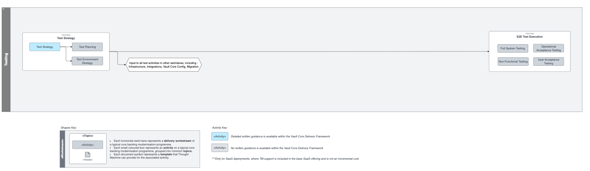

# Testing Workstream

## Overview

The purpose of the Testing workstream is to highlight the importance of considering the test strategy and planning early on in the programme.

The focus of the workstream is to ensure that all the testing requirements of the programme are covered, from the set up of sufficient and timely environments through to understanding the types of tests that need to be performed and how they will be executed.

The stream is divided into the following topics:

-   Test Strategy - understanding the scope of the programme from a testing perspective and defining the strategy, requirements and planning to ensure the activities are clearly documented, managed and complete through defined exit criteria.
    
-   E2E Test Execution - ensuring that the full system is tested from all angles to provide confidence in a go/no go decision for production launch, by aligning the programme objectives, functional and non functional requirements with the accepted test results.
    

## Activity Map

## Activities

You can find detailed guidance on activities highlighted in blue via the links below:

 
| Activity | Description |
| --- | --- |
| 
[Test Strategy](/delivery-framework/latest/EN/delivery_workstream/testing/test_strategy)

 | 

Outlines the approach and goals for the overall testing requirement of the programme. Providing the type of tests, their ordering and the execution strategy.

 |
| 

Test Planning

 | 

Sequences testing tasks onto a timeline, detailing the execution whilst aligning with the modernisation delivery milestones.

 |
| 

Test Environment Strategy

 | 

Understanding the environment sizing, requirements and availability for the smooth execution of the Test Strategy.

 |
| 

Full System Testing

 | 

Understanding and executing the E2E system testing requirements, including any integration regression testing.

 |
| 

Non-Functional Testing

 | 

Understanding and executing the non-functional test requirements eg. tests regarding performance and latency.

 |
| 

Operational Acceptance Testing

 | 

Understanding and executing the tests that need to be performed to ensure the necessary teams have been trained and have what they need to achieve operational competency.

 |
| 

User Acceptance Testing

 | 

Understanding and executing the functional tests to ensure the acceptance criteria of the changes have been met.

 |

## Disclaimer

See the Disclaimer relating to this and all other Vault Core Delivery Framework content [here](/delivery-framework/latest/EN/getting_started/disclaimer/).

Thought Machine Confidential Information.

© 2025 Thought Machine Group Limited. All rights reserved.

* * *