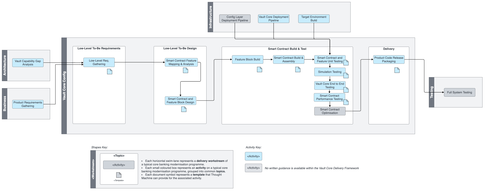

# Vault Core Configuration Workstream

## Overview

The Vault Core configuration workstream encompasses designing, building, and testing the Vault Core platform and smart contracts to align with business requirements. The workstream particularly focuses on financial product functionalities, operational processes, and reporting requirements.

The workstream has 4 phases, which work in an iterative manner:

-   Requirements gathering
    
-   Design
    
-   Development
    
-   Delivery
    

The requirement and design phase requires involvement of Business and Engineering stakeholders to agree and define scope of a financial product including acceptance criteria.

The development phase involves technical design, build of financial product features, assembly of smart contracts, unit testing, simulation testing and end to end testing of the smart contracts to validate their functionality against earlier defined acceptance criteria.

Furthermore, smart contract performance testing can be done in more complex product scenarios to ensure all business journey requirements are met.

The final step is product code release packaging, to ensure all resources and documentation is available for the release of the financial product.

## Activity Map

## Activities

 
| Activity | Description |
| --- | --- |
| 
[Low-Level Requirements Gathering](/delivery-framework/latest/EN/delivery_workstream/vault_core_config/low_level_req)

 | 

Low level requirements gathering for the user journeys/features identified in the product requirements gathering activity, breaking them into user stories and producing high quality product specifications.

 |
| 

[Smart Contract Feature Mapping and Analysis](/delivery-framework/latest/EN/delivery_workstream/vault_core_config/sc_feature_mapping)

 | 

Mapping the features required between the banking product and the underlying Vault smart contract to be built.

 |
| 

[Smart Contract and Feature Block Technical Design](/delivery-framework/latest/EN/delivery_workstream/vault_core_config/sc_feature_block_technical_design)

 | 

Design of the feature blocks and smart contract based on the requirements and the mapped features, taking into consideration the overall user journeys and performance objectives.

 |
| 

[Feature Block Build](/delivery-framework/latest/EN/delivery_workstream/vault_core_config/feature_block_build)

 | 

Build or reuse of the blocks/reusable components/features identified in the feature analysis and mapping.

 |
| 

[Smart Contract Build/Assembly](/delivery-framework/latest/EN/delivery_workstream/vault_core_config/sc_build)

 | 

Building the smart contract as per the design and making use of the reusable components/blocks.

 |
| 

[Smart Contract and Feature Unit Testing](/delivery-framework/latest/EN/delivery_workstream/vault_core_config/sc_feature_unit_testing)

 | 

Unit testing the blocks of code to ensure the unit test coverage before using them for the smart contract build. Unit testing the smart contract as a whole as well for the hooks functionality.

 |
| 

[Simulation Testing](/delivery-framework/latest/EN/delivery_workstream/vault_core_config/simulation_testing)

 | 

Simulation testing in Vault Core for the features and smart contract built and ensuring the journeys and acceptance criteria test cases are covered in simulation testing.

 |
| 

[Vault Core End to End Testing](/delivery-framework/latest/EN/delivery_workstream/vault_core_config/vc_end_to_testing)

 | 

End to end testing in Vault Core for the high level user journeys from the user stories, which also includes time cursor or accelerated end to end tests.

 |
| 

[Smart Contract Performance Testing](/delivery-framework/latest/EN/delivery_workstream/vault_core_config/sc_performance_testing)

 | 

Performance testing the smart contract in Vault Core based on the non-functional requirements received from the client and also based on user journeys and SLAs around it.

 |
| 

Smart Contract Optimisation

 | 

Optimisations on the smart contract from the issues and possible enhancements identified from the simulation and system testing. Would also be done after performance testing.

 |
| 

[Product Code Release Packaging](/delivery-framework/latest/EN/delivery_workstream/vault_core_config/product_code_release_packaging)

 | 

To package and prepare a product and its resources into a release that can be deployed on its own.

 |

## Disclaimer

See the Disclaimer relating to this and all other Vault Core Delivery Framework pages [here](/delivery-framework/latest/EN/getting_started/disclaimer/).

Thought Machine Confidential Information.

© 2025 Thought Machine Group Limited. All rights reserved.