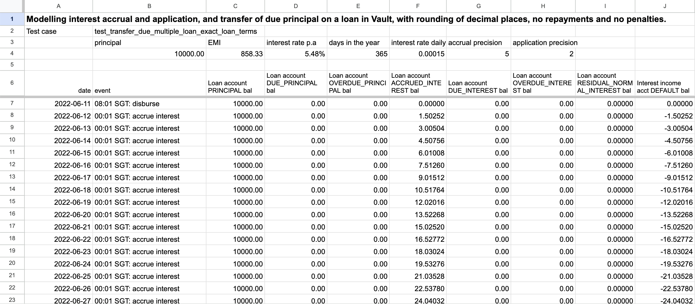

# Smart Contract and Feature Block Technical Design

## Purpose

Smart contract design and planning is the first important activity where all the engineers on a project are involved. The engineers should work towards achieving maximum productivity, especially early in a project. They must coordinate with their engineering leader and each other in order to work on features that are mostly independent, and avoid merge conflicts as much as possible.

Business analysts(BAs) on a project also need to have an appreciation of how the engineers intend to build the smart contract, in order as to improve engineering productivity. This is quickly achieved with experience and coordination with the engineers in the team, since the most natural way to write smart contracts is to implement the functionality in broadly the same order as the account lifecycle. Client Services follows such an approach on each project. You can also refer to the documentation from Product Library for guidelines on Ways of working.

If the technical design process has been skipped in a project, that may lead to poor decisions. If done properly, when building and delivering a smart contract, each business requirement will have a technical design documentation that includes the happy-path journeys and other scenarios that will be catered for.

## Predecessor Activities

1.  [Low-Level Requirements Gathering](/delivery-framework/latest/EN/delivery_workstream/vault_core_config/low_level_req)
    
2.  [Smart Contract Feature Mapping and Analysis](/delivery-framework/latest/EN/delivery_workstream/vault_core_config/sc_feature_mapping)
    

## Guidance

### Product structure

Once the smart contract feature mapping and analysis activity is done, the lead engineer will start designing the overall product construct required to achieve the features identified from the mapping exercise. This would include a design of the product construct from the following options:

1.  Standalone product.
    
2.  Supervisor product structure.
    

### Product implementation approach

Once the product structure is identified and smart contract feature mapping and analysis activity is done, the delivery team decides on the extent to which they will reuse existing code, typically following one of two approaches:

1.  To bulk-adapt a Product Library product or other existing products in Project Library
    
2.  To write the contract from scratch while reusing the features from the Product Library
    

### Existing products adaptation

The preference in Client Services(CS) is to follow approach (1) above, that is, to adapt a product from the Product Library if the feature gap analysis produces only around 20% of additional requirements to be built, as this saves an enormous amount of development and testing effort.

### New smart contract

If no suitable Product Library product or any other product available can be found, and the engineers have agreed on approach (2), it is essential for one engineer to design and set out placeholders for hooks and their high level helper functions. The existing library features have to be setup and designed as part of this activity for reuse.

Once the delivery team has chosen one of the approaches, the engineers can divide new work by feature with a lower risk of merge conflicts. The pattern of using the feature level composition(FLC) approach with the contract renderer can enable teams to use a more standardised software development approach of keeping separate functionality in separate files, use the template contract for adding the main structure and behaviour of the products defined using the hooks for development and testing and only rendering the full contract for deployment, while excluding it from version control. This the Client Services recommendation for project setup and coding best practices in a project.

### Product design

Once the product structure and base template is decided, the lead engineer will start ironing out details such as the parameters required for the smart contract, postings per journey, balances affected and money movements required as part of each user story. This would also include different options considered in the design and the pros and cons for them and the final decision as to why the design was chosen. This would typically be in an iterative style along with the build in a sprint fashion, wherein the first sprint would have done the backlog grooming, refinement and design and prepare for the implementation for the next sprint. This also helps to get agreement on the design with the stakeholders before implementation. The project team can also refer to the documentation from Product Library for guidelines on product composition - inception/documentation/product\_composition.md

### Feature design

During the build sprint, the engineer will come up with a design document per feature that explains what the feature is, which feature from the Product library it is based on(if available), parameters involved, internal accounts involved, hooks invoked and the major test scenarios.

### Scenario simulation spreadsheets

It may also be useful, especially for lending products, for the BAs to prepare spreadsheets that model various scenarios which can be reasonably expected to occur with real customers. Such spreadsheets are immensely valuable in preparing simulation tests, especially those that test the product behaviour over an extended time period. They are also useful in proving the mathematical soundness of the smart contract, and in defending design decisions to business stakeholders who might be skeptical or struggling to understand the intricacies of the design. It is not unprecedented for a business user to produce slightly faulty financial models, which fail to reproduce the smart contract behaviour, because they misunderstood the precise order and rounding of the calculations the smart contract was performing. To be most useful and efficient, the spreadsheets should adhere to the following principles:

-   The spreadsheet should perform the exact calculations the smart contract should perform in a particular scenario.
    
-   The calculations should be rounded to the exact number of decimal places required by the client.
    
-   The rows in the spreadsheet should be arranged chronologically from top to bottom, in the exact order the smart contract should perform them. This shows how the balance of each address changes over time.
    
-   The spreadsheet formulas should leave out the business logic. The logic is represented in the ordering of the rows, according to the scenario being modelled.
    

A useful technique is to limit each row of the spreadsheet to modelling a single type of event, so that rows can be reproduced multiple times in any order, as needed for a scenario. Row calculations are typically things like daily interest accrual, monthly interest application, EMI repayments, late repayments, late interest.

## Templates

Thought Machine has a range of templates designed to support clients in delivery of Smart Contract and Feature Block Technical Design. Please contact your assigned Thought Machine representative for further information.

* * *

### Disclaimer

See the Disclaimer relating to this and all other Vault Core Delivery Framework pages [here](/delivery-framework/latest/EN/getting_started/disclaimer/).

Thought Machine Confidential Information.

© 2025 Thought Machine Group Limited. All rights reserved.