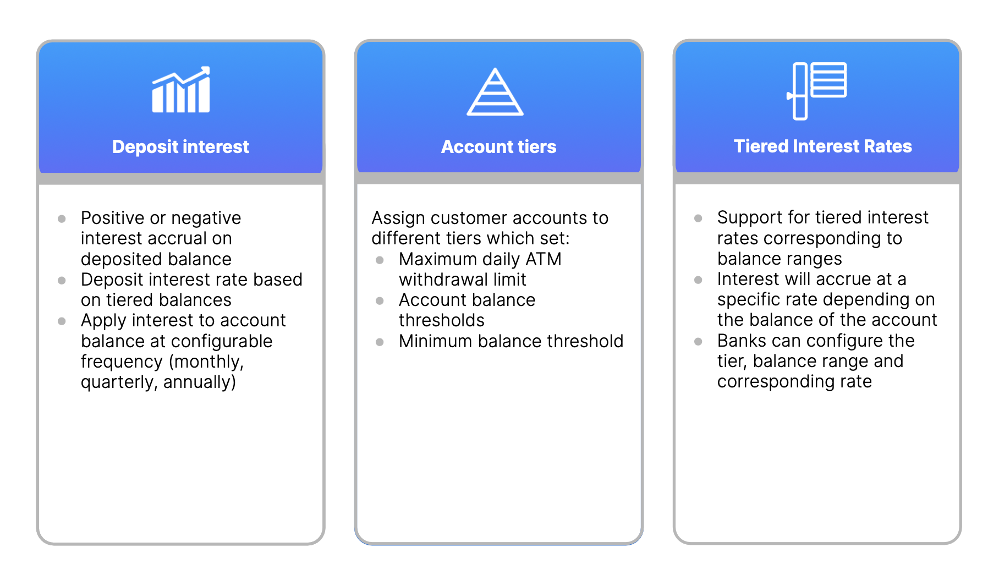

# Smart Contract Feature Mapping and Analysis

## Purpose

Mapping the features required between a banking product and the underlying Vault smart contract to be built, in order to ensure that the product’s to-be design on Vault Core is fit for purpose and covers all captured requirements. The required outputs of this activity are:

-   **Common business feature documents:** Documented common business features that allow for reusability across different banking products.
    
-   **Common business feature(CBF) matrix:** Document and refine the list of CBFs for each product.
    
-   **Product specification or financial product guide(FPG):** Specifications detailing the product features and behaviours to be implemented in the smart contract.
    
-   **Reusable feature level components from Product Library:** Identify and reuse relevant feature level components from Product Library or build new ones if needed.
    

## Predecessor Activities

1.  [Low-Level Requirements Gathering](/delivery-framework/latest/EN/delivery_workstream/vault_core_config/low_level_req)
    

## Guidance

This would be a joint exercise between the business analyst and engineers to identify reusable components and map them to existing CBFs and FLCs.

### High level process

1.  **Mapping user stories to features:** Analyse the user stories to see which features they contribute to or rely on.
    
    1.  Which features are necessary to fulfil the requirements outlined in the user stories?
        
    2.  Are there any user stories that directly correspond to a specific CBF?
        
    3.  Do any user stories span multiple CBFs?
        
    
2.  **Assess the CBF documents and the FLC:** All existing features are made available under the library/features directory and are typically grouped by product or feature group.
    
    1.  What can be reused from the existing CBF and the existing FLC?
        
    2.  Check for configuration or parameter that can be reused.
        
    3.  Look at the functions that can be reused.
        
    
3.  **Document the features and requirements:** Record and document the CBFs and other features in the Product specifications or financial product guide(FPG). CBF documents contain \`Description', \`Configuration Options' and \`Business Feature Behaviour' sections.
    
4.  **Document the reusable feature level components:** Record and document the feature level components that are identified from the Product Library, which can be reused and record the mapping with the corresponding CBFs as well. The feature level components come with their independent modules and unit tests.
    

**Common Pitfalls**

This activity of feature mapping usually overlaps with low-level requirements gathering which is when user stories are being drafted, as the financial product should have already been broken down logically into feature level components (e.g. interest, billing, fees). Typically, low-level requirements would be drafted from the point of view of business users, product owners and business analysts for a technical audience. This activity covers the next step where further analysis and design is done for the feature to be implemented in a smart contract. The level of overlap depends on the scale of the project and in more complex ones, there will be further analysis and design.

## Templates

Thought Machine has a range of templates designed to support clients in delivery of Smart Contract Feature Mapping and Analysis. Please contact your assigned Thought Machine representative for further information.

* * *

### Disclaimer

See the Disclaimer relating to this and all other Vault Core Delivery Framework pages [here](/delivery-framework/latest/EN/getting_started/disclaimer/).

Thought Machine Confidential Information.

© 2025 Thought Machine Group Limited. All rights reserved.