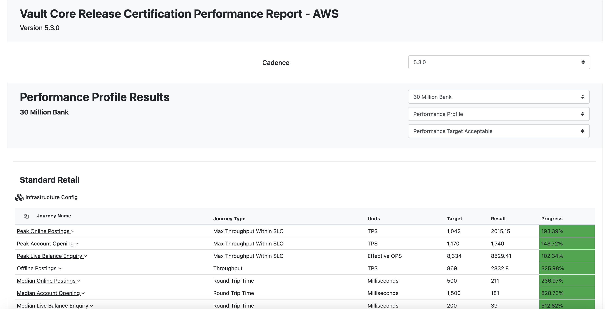

# Smart Contract Performance Testing

## Purpose

Performance testing seeks to confirm whether a particular smart contract performs well at scale, when the database contains many records and when the same operations - which trigger different hooks, are performed concurrently. The goal is to prove that the smart contract can handle realistic scenarios once a client has built a significant customer base for the product represented by the smart contract. Clients are responsible for carrying out appropriate performance testing of Smart Contracts. This is recommended to make sure that the Smart Contract meets your non-functional requirements.

## Predecessor Activities

1.  [Process Requirements Gathering](/delivery-framework/latest/EN/delivery_workstream/business/process_requirements)
    
2.  [Product Requirements Gathering](/delivery-framework/latest/EN/delivery_workstream/business/product_requirements)
    
3.  [Smart Contract Build/Assembly](/delivery-framework/latest/EN/delivery_workstream/vault_core_config/feature_block_build)
    
4.  [Vault Core End to End Testing](/delivery-framework/latest/EN/delivery_workstream/vault_core_config/vc_end_to_testing)
    

## Guidance

### Volumes and Bank Profiles

Thought Machine classifies bank profiles in terms of volumes of accounts expected.

-   **Extra-Small:** 100k accounts.
    
-   **Small:** 100k to 1 million accounts.
    
-   **Medium:** between 1 million and 10 million accounts.
    
-   **Medium-Large:** between 10 million and 30 million accounts.
    
-   **Large:** between 30 million and 100 million accounts.
    

As a first step, the volume expected for performance testing should be determined. Based on that, the relevant bank profile is identified. The bank profile gives the tester access to information for environment provisioning as well. Please refer to the Docshub link for more details on bank profiles and deployment size.

### Products

The performance reports available in Docshub are based on a blend of commonly used Product Library products, such as current account, credit card, savings account, personal loan and mortgage. If the products being tested are similar, it would be good to consider going through the performance report and checking if it aligns with the product usage.

### Scenarios

The next step is to determine the specific performance testing scenarios.

Different scenarios could be:

-   Online postings.
    
-   Account opening
    
-   Live balance enquiry.
    
-   Offline postings.
    
-   End of day.
    

The above scenarios are available in the Thought Machine Docshub together with blended journeys.

### Metrics

Each scenario would have different ways of measuring performance and different metrics. The table below has the list of scenarios and the units Thought Machine uses to measure the performance of the scenarios.

 
| Scenario | Metrics Unit |
| --- | --- |
| 
Online postings

Offline postings

 | 

TPS

 |
| 

Account opening

 | 

TPS

 |
| 

Live balance enquiry

 | 

Effective QPS

 |
| 

End of day

 | 

Time taken in seconds

 |

chat\_bubble

Legend

TPS - Transactions per second

QPS - Queries per second

### Tooling

Performance testing of smart contracts uses very different tools compared to unit testing, simulation testing, and end to end testing. Thought Machine has internal tools which use YAML configuration and scripts to load configurable numbers of customers, accounts, plans, account plan associations, and postings into a Vault Core environment via the Data Loader API, and then run tests to produce metrics based on the user journey. These metrics are available in the Docshub.

Each client can choose a set of tools for performance testing. There are different tools available in the market such as [JMeter](https://jmeter.apache.org/), LoadRunner, or [Artillery](https://www.artillery.io/) which could help in performance testing.

#### Approaches with Apache JMeter

As an example, JMeter is a useful tool to assist with performance testing. It’s a free, open-source tool that easily allows you to run high load tests typically with 200-300 concurrent threads. It also includes detailed reporting and analysis capabilities.

Here are some guidelines for using JMeter for performance testing bank migration scenarios of Vault. This would involve making calls to the Data Loader and the Postings API, both of which can be done via Kafka.

Within the JMeter UI, start by creating a new Test Plan. This will be saved as a .jmx file.

##### Add some User Defined Variables

Right-click the Test Plan > Add > Config Element > User Defined Variables. Consider the following set of variables.

  
| Variable Name | Description | Example Value |
| --- | --- | --- |
| 
KAFKA\_BROKERS

 | 

The URL of the Kafka Broker for Vault Core

 | 

bootstrap.kafka.mybank.io:443

 |
| 

PREFIX

 | 

Test prefix name to help distinguish resources created by each test run

 | 

MYFIRST

 |
| 

SMART\_CONTRACT\_VERSION\_ID

 | 

Smart Contract Product Version to be tested, which must be already loaded in the environment

 | 

250

 |
| 

NUMBER\_OF\_THREADS

 | 

The number of concurrent threads (users) that JMeter will run

 | 

200

 |
| 

LOOP\_COUNT

 | 

The number of times each thread will execute a Thread Group. A Thread Group can be used to execute one resource creation, whether it is Postings, or an individual Data Loader request.

 | 

250

 |
| 

RESOURCES\_IN\_BATCH

 | 

Number of resources in the data loader batch

 | 

200

 |

Note, the combined example values for NUMBER\_OF\_THREADS, LOOP\_COUNT and RESOURCES\_IN\_BATCH would create 10 million accounts (200 \* 250 \* 200 = 10,000,000). Each Jmeter thread will run a script 250 times, and each of those script executions will create a Data Loader resource batch containing 200 accounts.

##### Add a Counter

The counter is a special variable in Jmeter that can be used to track the total number of requests being made into Vault.

Right-click the Test Plan > Add > Config Element > Counter.

-   Starting Value = 1
    
-   Increment = 1
    
-   Exported Variable Name = counter\_value
    
-   Consider ticking "Track counter independently for each user".
    

##### Create a Thread Group

The Thread Group can be used to manage the creation of a single resource type. For example, the first one can be for the purpose of creating Customers in Vault Core.

Right-click the Test Plan > Add > Threads (Users) > Thread Group. Let’s name this "Thread Group - Customers".

Assign the Thread Properties with:

-   Number of Threads (users) = ${NUMBER\_OF\_THREADS}
    
-   Loop Count = ${LOOP\_COUNT\_CUSTOMERS}
    

Tick "Same user on each iteration".

###### Create a Sampler within the Thread Group

The purpose of the Sampler is to house the execution code for a single Data Loader request.

Now, right-click the Thread Group > Add > Sampler > JSR223Sampler. Let’s name this "Data loader - Create Customer".

Choose your preferred language. Here is a basic example written in Groovy.

##### Running a Test

When ready to run a test execution, for performance reasons the command line method should be used, rather than via the UI:

`jmeter -n -t "name_of_your.jmx" -l result.jtl`

###### Monitoring the Test Run

While the test is running, and after, it is recommended to review Grafana Dashboards that come shipped with Vault Core.

For a Data Loader run, observe the dashboards: `Data Loader Dashboard`, `Data Loader Resources Dashboard`. You can also make calls to the Data Loader REST API to query the status of resource batches.

For a migration postings API run: `V5 Ledger Migrator`.

Or for a BAU postings run, observe the dashboard: `[V5+] Ledger Overview`.

##### Further Building Out your Jmeter Tests

One approach is to continue creating a new Thread Group for each resource type that needs to be loaded. If the intention is to have a one-to-one mapping of customers to accounts, very similar logic can be applied to the above.

Jmeter also provides tooling for reporting, assertions and metrics on the outcome of tests.

### Environment and Infrastructure Set Up

Thought Machine has performance reports for 3 major cloud providers - AWS, GCP and Azure with different deployment sizes available with each Vault version. The tester should choose the cloud provider and based on the bank profile being tested, set up and provision infrastructure to support the performance testing. The Thought Machine infrastructure config for AWS is available in the DocsHub.

### Resources Set Up

To set up an initial number of base customers and accounts, the tester should prepare the resources to be set up in the right order as follows.

### Products

Once the product used for the performance testing is decided, the tester sets up the all resources, such as smart contract as a fully rendered file, all the resource.yaml files required such as internal accounts, schedule tags and manifest.yaml. The tester can follow the usual way to deploy the artefacts required to run the tests - i.e. upload via the [CLU (Configuration Layer Utility)](/vault-core/5-3/EN/environment_and_installation/infrastructure_docs/infrastructure_and_installation_guides/configuration_layer_utility_user_guide/about_this_guide/)

### Customers and Accounts

Once the product and other resources are successfully uploaded, the tester can set up the tooling to create customers and accounts via [Data Loader API](/vault-core/5-3/EN/api/data_loader_api#streaming_api-overview). The migrations workstream has detailed guides on set up and the architecture of Data Loader API. Resources for customers and accounts are created while specifying dependency groups. The resources are linked atomically, i.e. if creation of any linked resource fails, the whole dependency group fails. The requests are sent via the Kafka topics and the tester should wait for the processing to complete. The [grafana dashboards](/vault-core/5-3/EN/environment_and_installation/infrastructure_docs/infrastructure_and_installation_guides/observability_stack_installation_and_user_guide#grafana_dashboards_included_in_the_observability_stack-migrations) are used to monitor the load and to see when it is complete.

### Postings

Once customers and accounts are successfully created, depending on the scenario tested, postings are loaded to achieve a baseline number of postings in the database, on top of which the performance tests are run. This is useful for end of day scenarios. The Postings Migration API can be used to load the postings and the Migrations Dashboard in Grafana can be used for monitoring purposes.

### Benchmarking and Optimisation

Once all the above are prepared and the tests are ready to run, the SLAs and targets are determined and the results of the performance tests are compared against them. If the target of a scenario is not met, then the smart contract is analysed for optimisation in this scenario. This process covered in the next activity - Activity: Smart Contract Optimisation. When the smart contract optimisation is complete, the bank profile and infrastructure are reviewed to ensure the provisioning is sufficient for the targets set.

## Templates

Thought Machine has a range of templates designed to support clients in delivery of Vault Core End to End Testing. Please contact your assigned Thought Machine representative for further information.

* * *

### Disclaimer

See the Disclaimer relating to this and all other Vault Core Delivery Framework pages [here](/delivery-framework/latest/EN/getting_started/disclaimer/).

Thought Machine Confidential Information.

© 2025 Thought Machine Group Limited. All rights reserved.