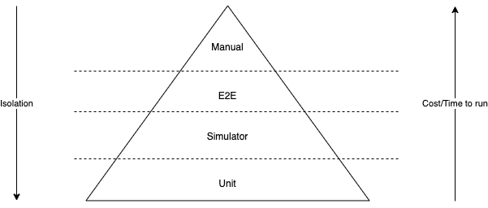

# Simulation Testing

## Purpose

Vault offers an [API interface](/vault-core/5-3/EN/api/core_api#Contracts) for simulation of smart contract behaviour. Simulation tests focus on sequences of events that represent business scenarios, or more complex integration scenarios. They are used to test contracts in their entirety in response to realistic inputs, such as receiving postings or the execution of schedules. This is in contrast to unit tests which only call individual hooks or helper methods. In order to test the contract in isolation from the rest of Vault Core services, the simulation framework simulates their behaviour.

Simulation Tests are easy to write, run fast, leave no trace on the Vault Core database, and give a high degree of assurance that the smart contract will behave in the same way in production in a real Vault Core instance. Simulation testing is perhaps most useful for testing the behaviour of financial products over their entire lifetimes, whereas running equivalent end to end tests against Vault Core endpoints would be prohibitively slow, even using time cursor testing. Simulation tests are perfectly repeatable across any timespan, because they do not rely on the Vault Core database. The Simulation endpoint has a feature to test real accounts in their current state or at any point in their history, however this is perhaps more useful in production for calculating adjustments, or for projecting future account behaviour, than for running simulation tests. The simulation endpoint produces output that is useful for writing test assertions, and for producing charts for visual demonstrations to business users.

Simulation tests have an advantage over unit tests in that they do not rely on mock objects to be injected into hooks and vault object methods, so they offer a higher degree of realism for smart contract behaviour. Writing simulation tests is essential for any delivery project. Simulation tests should aim for full test coverage of the functional logic set out by the business requirements and acceptance criteria agreed with business stakeholders. Failing to have enough simulation test coverage may lead to unexpected behaviour.

## Predecessor Activities

1.  [Low-Level Requirements Gathering](/delivery-framework/latest/EN/delivery_workstream/vault_core_config/low_level_req)
    
2.  [Smart Contract and Feature Block Technical Design](/delivery-framework/latest/EN/delivery_workstream/vault_core_config/sc_feature_block_technical_design)
    
3.  [Smart Contract Build/Assembly](/delivery-framework/latest/EN/delivery_workstream/vault_core_config/sc_build)
    
4.  [Smart Contract and Feature Unit Testing](/delivery-framework/latest/EN/delivery_workstream/vault_core_config/sc_feature_unit_testing)
    

## Guidance

A simulation test should cover the minimum time span necessary to prove a test case, in order to finish as quickly as possible. Event instructions in the test payload can have timestamps that differ by as little as a microsecond in order to achieve the desired sequence of behaviours from the smart contract, while still achieving repeatability. Realistic timestamps are not always necessary. Engineers should include tests that span leap days, weekends, and public holidays.

### Acceptance criteria coverage

For accountability to clients on delivery projects, Thought Machine policy states that tests must be annotated with the JIRA ticket number, and the IDs of the acceptance criteria(AC) of the ticket they are demonstrating. Tests should be narrowly focused and demonstrate features in isolation as much as possible, with irrelevant features and parameters deactivated or set to values that have minimal effect. This makes the behaviour of each feature easier to measure and makes smart contracts easier to debug. It makes tests less fragile, by reducing the chance that a change to any smart contract feature will break unrelated tests. At least one test should test the happy path of the product over its entire lifetime, however, with as many features activated as possible, to prove that the features interact as designed. Several such tests may be necessary to test mutually exclusive features. You can also refer to the Product Library documentation on AC coverage - documentation/testing/acceptance\_criteria\_coverage.md

### Structure of test modules

Simulation tests for a given feature may be grouped into a single Python file and you can design your CI/CD such that the test build tool can run them in parallel and achieve faster execution of the entire test suite.

Engineers should strive to keep test data separate from test procedures, for better readability of test cases and better reusability of procedural code. Engineers may extract repeated or similar code into functions which serve as generic test cases and can be called with arguments for the variables. Done well, this approach maximises test coverage while keeping the number of lines of test code manageable. Engineers should use their judgement to not overdo this approach to ensure that the test suite does not become too difficult to maintain.

To reduce the lines of code, tests may share test data stored in separate files or as global variables. It is vital that no test ever modifies such shared data, because this makes some test cases depend upon other test cases being run in a certain order, which is an anti-pattern. They should be completely independent. Engineers should nevertheless be vigilant during code review, as occasionally an engineer, especially one who is inexperienced or new to Python, might write test cases that modify shared data.

### Assertions

Test assertions should check balances before and after event instructions, to prove that the instructions have the right effects at the right time. Test assertions should also check balances after expected schedule executions to prove that the scheduled event had exactly the desired effect. Test assertions should also check the notifications, postings rejected status, schedule runtime.

### Inception SDK support

Where Thought Machine is leading or performing the smart contract delivery, the Inception SDK is mandated as the standard testing toolkit for running simulation tests. It is extensive, up-to-date and supports Vault 5. The Inception SDK is available to all our partners and clients and can easily be used in any project development.

### CI/CD

Thought Machine engineers usually run automated tests with the Thought Machine build system as part of the internal CI/CD pipelines, to make sure there are no regression issues for every commit. Each client should ensure the tests are runnable using the standard Python (version 3.10 or later) unit test commands and repeatable in the build system of their choice, to ensure quality and no regression failures.

### Testing approach

Of the three main types of testing in the pyramid, simulation testing is the one that perhaps best lends itself to a behaviour driven development(BDD) or test driven developmen(TDD) approach. To follow this approach, before writing any smart contract code, write the simulation tests to cover the acceptance criteria in the user story. When you have sufficient test coverage for the functions, start writing the smart contract code and watch the tests start to pass.

### Implementation approach

Examples of simulation tests can be found in any folder named simulation, in the Product Library test suite. The SDK package also has documentation about how to write simulation tests - documentation/inception\_test\_framework\_approach.md and documentation/inception\_test\_framework\_contract\_simulation\_testing.md. The DocsHub page on testing is here.

Here is an example simulation test for a loan account, taken from the Product Library loan.

In the latest version of the SDK, an alternative way of running simulation tests is offered, by creating an instance of the SimulateRequest type and passing it to the run\_simulation\_test function, along with a list of subtests for assertions. The SimulateRequest type represents the entire request payload for the contract simulation endpoint of the core API, and should include all smart contract and supervisor code, account creation steps, payment instructions, etc, i.e. everything the test should perform. The events in the subtests get ignored, because any instructions should be included in the sim\_request object, but the expected balances and other expected results get checked. For example:

The res object is the same as what gets returned by self.run\_test\_scenario(test\_scenario), there is no need to assign it unless there is an intention to use it for logging or assertions.

The SimulateRequest type is quite large. It may be beneficial to create some helper functions which initialise most parts of the SimulateRequest object for the whole test suite, and leave the finer details to each test case.

## Templates

Thought Machine has a range of templates designed to support clients in delivery of Simulation Testing. Please contact your assigned Thought Machine representative for further information.

* * *

### Disclaimer

See the Disclaimer relating to this and all other Vault Core Delivery Framework pages [here](/delivery-framework/latest/EN/getting_started/disclaimer/).

Thought Machine Confidential Information.

© 2025 Thought Machine Group Limited. All rights reserved.