# Vault Delivery Framework

## Vault Delivery Framework Overview

### What is the Vault Core Delivery Framework?

The Vault Delivery Framework is the Thought Machine methodology for execution of core banking modernisation programmes, including both migration and greenfield delivery.

Launching a product, whether via the creation of a new greenfield bank or migrating from a monolithic core to a more distributed set of best of breed systems and services with Vault Core at the heart, involves a number of activities beyond the implementation of Vault Core.

Accordingly, though the Vault Core Delivery Framework is anchored around Vault Core, in most cases it provides guidance that is equally applicable to the programme more generally and the implementation of other components within the wider transformation (for example, migration of Customer data to a new Customer Core).

It provides access to our best practice guidance and lessons learnt from our past and present client deliveries / broader core banking transformation experience.

At the highest level it comprises the:

-   [Activity Map](/delivery-framework/latest/EN/getting_started/how_to): A summary diagram that shows the end-end activities that comprise a standard core banking modernisation programme delivery, including dependencies.
    
-   [Delivery Workstream Guidance](/delivery-framework/latest/EN/getting_started/how_to) : Detailed guidance for each Delivery Workstream’s constituent activities, covering; what the activity is, guidance for how to complete, and whether any templates or examples are available as a reference.
    

### Why did we create the Vault Core Delivery Framework?

Core banking modernisation programmes are typically a once or twice in a career opportunity. As a result, for many clients this is either not something that has been embarked on before or that was completed many years ago using a different generation of technologies and associated methodologies.

Through our extensive delivery experience we have observed that, because this is not an everyday activity within most of our client’s organisations, they have faced unforeseeable challenges in execution. Some of these challenges could have been avoided if they had an implementation process to follow or insights from those with experience who have done this before.

To address this challenge we have leveraged insights and experience of working on many such projects to create the Vault Core Delivery Framework. This delivery methodology provides proven best practices and lessons learnt to help clients (and partners) achieve their goal of launching products faster and migrating large volumes more efficiently and effectively onto Vault Core.

It is our hope that clients incorporate the Vault Core Delivery Framework into their own transformation delivery methodology.

### Benefits of using the Vault Core Delivery Framework

The Vault Core Delivery Framework supports delivery success:

-   Risk reduction - lessons learnt through delivery of a wide range of completed core banking modernisation programmes to avoid repeating the mistakes of others.
    
-   Cost efficiency - avoid guesswork by providing direction and focus with better resource utilisation and more predictable outcomes.
    
-   Improved quality - tried and tested delivery steps and methodology, with best practice guidance.
    
-   Flexibility and optionality - content is applicable for any size of client, type of programme or specific product delivery phase.  
    
-   Faster time to market - proven methodology short-cutting delivery time and preventing re-work.
    

Additionally, all Thought Machine Delivery Services are underpinned by the Vault Core Delivery Framework.

### Accessing the Vault Core Delivery Framework

The Vault Core Delivery Framework is available to all Thought Machine clients as part of their licence fee and partners that subscribe to the Thought Machine Delivery Partner Programme. It is accessed via the Thought Machine Vault Portal.

### Disclaimer

See the Disclaimer relating to this and all other Vault Core Delivery Framework pages [here](/delivery-framework/latest/EN/getting_started/disclaimer/).

Thought Machine Confidential Information.

© 2025 Thought Machine Group Limited. All rights reserved.

## How to use the Vault Core Delivery Framework

### Activity Map

The Vault Core Delivery Framework comprises an Activity Map underpinned by written guidance on each activity in the map.

The Activity Map sits at the heart of the Thought Machine Delivery Framework. The Activity Map helps our clients and partners visualise the full breadth of activities that need to be undertaken and the key dependencies that exist between them within the change programme. The Activity Map is intended to be adaptable to any specific delivery methodology. Some activities may not be applicable based on the scope of the programme or specific delivery phase.

The Activity Map shows the approximate sequencing of activities and key dependencies between them, further details can be found on the activity pages. The Vault Core Delivery Framework should be used to validate the programme’s delivery plan to ensure that all activities have been considered.

chat\_bubble

To View the image please right click and select one of the following options "Save image as" / "Open in a new tab"

### Activity Map Key

Each horizontal swim-lane represents a delivery workstream of a typical core banking modernisation programme. Within each workstream, there are topics which are groups of related activities.

Each small coloured box represents an activity. Where activities are highlighted in blue on the Activity map, then Thought Machine has prepared more detailed guidance on the activity.

Where a document symbol is shown on an activity box, it denotes that Thought Machine has a template to support clients in delivery of this activity.

### Delivery Workstreams

The Activity Map is structured into swim-lanes that represent a typical programme’s Delivery Workstreams.

Delivery Workstreams are groupings of interrelated activities that are focused on a common delivery objective. They are likely to be recognisable to clients in terms of how they might structure their change programme and typically require specific skill sets to deliver.

The Vault Core Delivery Framework’s detailed guidance is structured into the following 10 workstreams:

1.  [Governance](/delivery-framework/latest/EN/delivery_workstream/governance) defines the objectives of the programme, monitoring and control of the plans, deliverables, milestones and dependencies in order to manage risk in the execution of the programme.
    
2.  [Enablement](/delivery-framework/latest/EN/delivery_workstream/enablement) addresses the training needs of the programme team and the training plan required in order to equip the team with the knowledge and skill to effectively deliver the programme.
    
3.  [Architecture](/delivery-framework/latest/EN/delivery_workstream/architecture) addresses the definition of the target systems landscape that will meet the needs of the business (financial product, process and reporting) requirements and support the programme transition states.
    
4.  [Business](/delivery-framework/latest/EN/delivery_workstream/business) addresses the business considerations required during the programme (e.g. business objectives, business case, business capability evaluation etc.).
    
5.  [Infrastructure](/delivery-framework/latest/EN/delivery_workstream/infrastructure) addresses the design and build of the infrastructure and systems that support the architecture design.
    
6.  [Vault Core Configuration](/delivery-framework/latest/EN/delivery_workstream/vault_core_config) addresses the design, build and test of the Vault Core platform and Smart Contracts to meet the business requirements (financial product, process and reporting) and non-functional requirements.
    
7.  [Integrations](/delivery-framework/latest/EN/delivery_workstream/integrations) addresses the design, build and test of the interfaces between systems to meet the business (financial product, process and reporting) requirements.
    
8.  [Testing](/delivery-framework/latest/EN/delivery_workstream/testing) addresses the full testing requirement of the programme, including the creation of the test strategy, test plan, test execution plan among other deliverables. The scope of the testing Workstream spans all types of testing that the client may consider.
    
9.  [Migration](/delivery-framework/latest/EN/delivery_workstream/migration) addresses the definition, preparation and execution of data migration from an incumbent core(s) to Vault Core.
    
10.  [Production Readiness](/delivery-framework/latest/EN/delivery_workstream/production_readiness) identifies activities and governs the execution of those activities necessary to be undertaken in preparation for the launch of any new product, platform or process into production.
     

### Activities

Activities are distinct pieces of work that need to be performed at a point in time or iterated during the programme. Each phase e.g. an MVP launch, or legacy product migration, will navigate through the activities and may take a different journey, including or excluding certain activities, depending on the phase objectives. Each activity may be interdependent with other activities and contribute to the delivery of the workstream objective. These activities form the basis of a delivery plan which should be tailored to the specific programme scope, organisational processes and governance structures. The activities are of a sufficient size to allow estimation, scheduling, monitoring and control.

Where activities are highlighted in blue on the Activity Map, then a more detailed page of guidance is available covering:

-   **Purpose** - a description of the activity and its value within the programme delivery journey.
    
-   **Predecessor Activities** - detail of other activities that input into this activity.
    
-   **Guidance** - recommended approaches for executing this activity, including the advantages and disadvantages of each. Drawing on extensive experience, there are examples of lessons learned, best practices, and insights into common pitfalls to avoid.
    
-   **Templates** - where a document symbol is shown on an activity box, it denotes that Thought Machine has a template to support clients in delivery of this activity. Please contact your assigned Thought Machine representative for further information about these templates
    

### Disclaimer

See the Disclaimer relating to this and all other Vault Core Delivery Framework pages [here](/delivery-framework/latest/EN/getting_started/disclaimer)

Thought Machine Confidential Information.

© 2025 Thought Machine Group Limited. All rights reserved.

## Thought Machine Delivery Services

### Thought Machine’s Services For Successful Delivery Of Your Core Banking Programme

Thought Machine’s delivery approach is underpinned by the Vault Core Delivery Framework; it balances time to market, team maturity, cost and client/partner independence based on client delivery objectives. Thought Machine’s stated goal is to enable clients and their delivery partners to successfully implement Vault Core with minimal support from Thought Machine.

Thought Machine’s engagement in a programme can be as wide or as narrow as our clients and partners require. These services are designed to deliver impactful results and expertise across all phases of the programme’s journey.

### Delivery Services - Focused Execution for Results

Thought Machine deploys skilled experts who drive the programme forward by executing specific, outcome-oriented tasks and validating client or partner work, followed by structured, actionable feedback. Our primary delivery services include:

-   **Programme Management:** Leveraging the Vault Core Delivery Framework, we align with our clients and partners on a structured approach and establish documented next steps for smooth programme mobilisation. A dedicated Delivery Manager will oversee all Thought Machine engagements, serving as a single point of contact.
    
-   **Programme Enablement:** Empowering the programme team with Vault Core expertise through tailored training plans, certification support, and ongoing learning opportunities. Our training bootcamps provide the essential skills for your team to deliver with confidence.
    
-   **Scoping:** Providing early-stage insights, defining MVP products, assessing high-level architecture, and building out an initial product roadmap. This foundational work feeds into the programme’s business case, ensuring an informed start.
    
-   **Discovery & Design:** Conducting a detailed analysis of current business and technology landscapes to establish the future state across product, process, and data requirements. For clients migrating from legacy systems, we develop a bespoke migration strategy.
    
-   **Product Build:** From gathering requirements to designing, building, and testing Vault Core configurations, our team delivers all or part of product build activities, including data mapping to facilitate smooth legacy migrations.
    
-   **Infrastructure:** Offering a range of reviews covering infrastructure readiness, hosting costs, production capabilities, and observability. Our Site Reliability Engineers (SREs) provide insights from other client engagements, and when needed, can act as embedded resources within the programme team.
    

### Consulting Services - Trusted Expertise For Strategic Success

Our consulting SMEs serve as trusted advisors, delivering hands-on support and strategic insights exactly when needed. Our consulting offerings span:

-   **Governance:** Drawing from our extensive experience, we guide clients through scoping, programme definition, planning, and execution phases, integrating key insights from the Vault Core Delivery Framework for efficient governance.
    
-   **Business:** We help define business needs that form the backbone of a successful programme. This includes financial product scoping, MVP definition, early roadmap support, as-is/to-be requirements, and aligning operational design with programme goals.
    
-   **Architecture:** Providing architectural guidance to shape the future systems' landscape that meets business requirements and accelerates modernisation and migration efforts.
    
-   **Infrastructure:** Working closely with technical teams, we help design a reliable framework that strengthens platform reliability, mitigates risk, and minimises impact on clients.
    
-   **Integrations:** Supporting design, build, and testing of interfaces between systems to ensure they meet financial product, process, and reporting requirements.
    
-   **Vault Core Configuration:** Providing best practices on configuring Vault Core to meet functional and non-functional requirements for products, processes, and reporting.
    
-   **Migration:** Advising on comprehensive data migration strategy and execution, ensuring a smooth transition from legacy cores to Vault Core.
    

By combining delivery focus with consulting expertise, Thought Machine’s services provide a strategically aligned and efficiently executed programme journey, setting a foundation for long-term success.

For further details of Thought Machine services, please contact your Thought Machine representative.

### Vault Delivery Job Descriptions

#### Description of Roles

At Thought Machine we have different client facing resource roles that we use to provide our services, for example under a Statement of Work. We may change these from time to time but the latest roles and related descriptions are outlined below.

**Regional Delivery Director**

-   Central point of contact for the client.
    
-   Assist with escalation where required.
    
-   Alignment of the client’s and Thought Machine’s goals and objectives.
    
-   Ensure best practices are used to govern the programme.
    
-   Oversee and facilitate the engagement of the Supplier’s teams, including Engineering and Client Services teams.
    
-   Programme and Stream Steering Committee Member.
    

**Client Delivery Manager**

-   Provide the Central Point of Contact for the client and provide a point of escalation.
    
-   Take accountability for the overall success of the implementation.
    
-   To take accountability for the overall success of the Supplier’s engagement.
    
-   Key client stakeholder engagement.
    
-   Coordination with the Supplier Engineering teams.
    
-   Scope management, project planning and reporting, risk management, cross functional issues and escalations.
    
-   Commercial Management.
    
-   To monitor adherence to signed commercial agreements and the coordination of new Services and Build Work Orders between Supplier and client.
    

**Client Architect**

-   Act as a point of escalation for technical issues.
    
-   Provide in depth and broad knowledge of Vault Core’s architecture and capabilities.
    
-   Provide consulting services relating to solution designs and integration of Vault Core into the wider client landscape.
    
-   Liaison with the Supplier teams.
    
-   Categorise client challenges that can be de-risked and demonstrated vs those dependent on platform kernel changes.
    
-   Identify partner/vendor ecosystem overlap with inception and partner accelerator roadmap and champion client aligned choices.
    
-   Work closely with client to understand their up and down stream integrations and utilising this information / pain points to assist with upstream Vault design choices where possible.
    
-   Leverage core client use cases as to build behaviour driven development & model bank tests for Vault certification and performance metrics.
    
-   Encourage and facilitate knowledge transfer and engineering transparency, including Test Strategy, DevX environments, Installation Approach.
    
-   Align Vault roadmap with client milestones - owning internal features requests and working with product management team toward dependency management.
    
-   Work with the Lead Client Engineer to identify regional market leading products and incorporate into inception library feedback.
    
-   Liaison with the Supplier’s Engineering teams.
    

**Business Analyst**

-   Understand the client’s business and functional requirements and needs and how Vault Core can support them.
    
-   To support the client to draft Feature Specifications in accordance with Supplier best practice and facilitate the lifecycle of a feature request.
    
-   Draft Feature requests or Configuration Layer epics.
    
-   Consult and educate the client on how Vault Core can support their business requirements.
    
-   Test Business Acceptance Criteria of the configuration layer on behalf of the client.
    
-   Compile and distribute Release Notes relating to the Configuration Layer.
    
-   To provide the client with information related to new features documented in the release notes e.g. what’s new guide.
    
-   To support the client during their testing of the Vault platform and configuration layer.
    
-   To respond to client questions in relation to their business processes and requirements.
    
-   To conduct demonstrations and presentations in relation to functional Vault features to elicit requirements and to provide the client with new information.
    
-   To facilitate design workshops in relation to ‘as is’ process and definition of ‘to be’ state.
    
-   To be the primary point of contact for workstream Product Owners.
    
-   To be the primary liaison between the client and Supplier product teams.
    

**Client Engineer**

-   Provide coaching, support and guidance for the client team that are configuring the Configuration Layer.
    
-   To provide technical issue support relating to non-Production Environments.
    
-   To instruct the client on how to work with the Configuration Layer Delivery Framework tools and process.
    
-   To support client’s non-functional and disaster recovery testing.
    
-   To support client to draft Technical Feature Specifications in accordance with Supplier best practice and facilitate the lifecycle of a feature request.
    
-   To consult and educate client on how Vault Core can support their technical requirements.
    
-   To support the client during their testing of the Vault Core platform and Configuration Layer.
    
-   To respond to client questions in relation to their technical integrations and requirements.
    
-   To conduct demonstrations and presentations in relation to technical Vault Core features to elicit requirements and to provide the client with new information.
    
-   To provide guidance to the client with automation of operational processes relating to the deployment of Vault Core into client Environments.
    

**CSRE (Client SRE)**

-   To assist the client with installing and configuring the product in accordance with Supplier best practice and guidance.
    
-   To Support disaster recovery, backup, redundancy and capacity planning activities.
    
-   To provide guidance to the client with automation of operational processes relating to the deployment of Vault into client environments.
    
-   To provide guidance and advice to the client in relation to infrastructure provisioning and deployment required to run a client hosted environment.
    
-   To support the client to troubleshoot infrastructure related issues in non-Production environments.
    
-   To provide support and guidance to the client in relation to the configuration of logging and monitoring tooling of Vault services.
    
-   To liaise with Supplier engineering teams on behalf of the client in relation to infrastructure, security and tooling topics.
    

**Engineering SME**

-   Provide knowledge and expertise in a specific Vault product Domain.
    

### Disclaimer

See the Disclaimer relating to this and all other Vault Core Delivery Framework pages [here](/delivery-framework/latest/EN/getting_started/disclaimer/).

Thought Machine Confidential Information.

© 2025 Thought Machine Group Limited. All rights reserved.

## Frequently Asked Questions

### Content

**Q: Is it mandatory to follow all the Vault Core Delivery Framework for modernisation programmes that involve Vault Core?**

No, we do not mandate that our clients follow the Vault Core Delivery Framework on Vault Core implementations. That said, as the framework is based on our extensive knowledge and experience of delivering Vault Core as part of core banking modernisation programmes, it is highly recommended to read and follow the Vault Core Delivery Framework.

**Q: Is there a Vault Payments Delivery Framework?**

A: This is coming soon. Watch this space.

**Q: Does the Vault Core Delivery Framework cover both SaaS and Self-Hosted deployments?**

A: Yes, the Vault Core Delivery Framework is, for the most part, deployment option agnostic and is equally relevant for our SaaS and self-hosted clients. Where there are nuances, these have been called out in the guidance accordingly.

### Maintenance

**Q: How frequently is the Vault Core Delivery Framework updated?**

A: Thought Machine periodically releases new versions of the Vault Core Delivery Framework as new Vault Core features are released and guidance becomes available. The guidance will evolve based on new insights and delivery experiences gained through the support of our global client base in the implementation of their core banking modernisation programmes.

**Q: How can I provide feedback on the Vault Core Delivery Framework?**

A: There is a dedicated section for feedback on the Enablement Helpdesk where users may ask questions, or provide feedback on the Vault Core Delivery Framework.

**Q: If I have a question relating to the Vault Core Delivery Framework, where can I find the answer**

A: All questions relating to the Vault Core Delivery Framework or the Vault Core platform may be directed to the Enablement Helpdesk, or the assigned Thought Machine team, should Thought Machine services be engaged by the client.

### Access

**Q: Who has access to the Vault Core Delivery Framework?**

A: The Vault Core Delivery Framework is available to all our clients. Additionally, it is available to partners that are signed-up to the Thought Machine Partner Programme.

## Disclaimer

These documents, resources, and related information (the \`content') are confidential and are provided to Thought Machine clients and partners for their general educational and informational purposes, for use in connection with Thought Machine’s products and services, only.

While the content has been prepared with care, Thought Machine makes no guarantees, warranties or representations as to the accuracy, completeness, effectiveness of the content. The content is not intended to be a substitute for professional or specialist advice specific to the given circumstances.

Thought Machine may update or remove content from time to time.

The success of any related project is dependent on various factors beyond the control of Thought Machine, including but not limited to market conditions, execution, and external circumstances. Thought Machine does not accept any liability or responsibility for any losses, damages or claims arising from the use of, or reliance on, the content.

The content may not be republished, copied, communicated or distributed to third parties without Thought Machine’s prior written consent, and may not be used for any commercial purposes.

Thought Machine Confidential Information.

© 2025 Thought Machine Group Limited. All rights reserved.