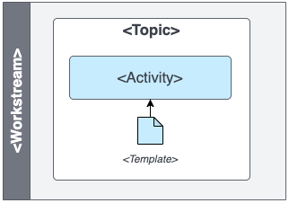
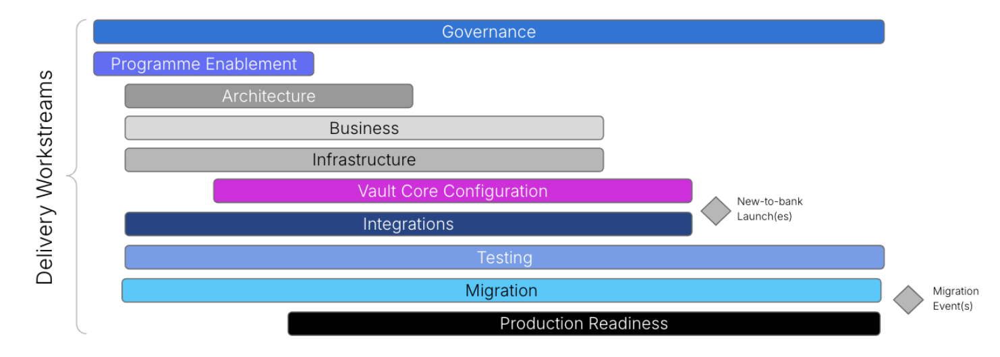

# How to use the Vault Core Delivery Framework

## Activity Map

The Vault Core Delivery Framework comprises an Activity Map underpinned by written guidance on each activity in the map.

The Activity Map sits at the heart of the Thought Machine Delivery Framework. The Activity Map helps our clients and partners visualise the full breadth of activities that need to be undertaken and the key dependencies that exist between them within the change programme. The Activity Map is intended to be adaptable to any specific delivery methodology. Some activities may not be applicable based on the scope of the programme or specific delivery phase.

The Activity Map shows the approximate sequencing of activities and key dependencies between them, further details can be found on the activity pages. The Vault Core Delivery Framework should be used to validate the programme’s delivery plan to ensure that all activities have been considered.

chat\_bubble

To View the image please right click and select one of the following options "Save image as" / "Open in a new tab"

## Activity Map Key

Each horizontal swim-lane represents a delivery workstream of a typical core banking modernisation programme. Within each workstream, there are topics which are groups of related activities.

Each small coloured box represents an activity. Where activities are highlighted in blue on the Activity map, then Thought Machine has prepared more detailed guidance on the activity.

Where a document symbol is shown on an activity box, it denotes that Thought Machine has a template to support clients in delivery of this activity.

## Delivery Workstreams

The Activity Map is structured into swim-lanes that represent a typical programme’s Delivery Workstreams.

Delivery Workstreams are groupings of interrelated activities that are focused on a common delivery objective. They are likely to be recognisable to clients in terms of how they might structure their change programme and typically require specific skill sets to deliver.

The Vault Core Delivery Framework’s detailed guidance is structured into the following 10 workstreams:

1.  [Governance](/delivery-framework/latest/EN/delivery_workstream/governance) defines the objectives of the programme, monitoring and control of the plans, deliverables, milestones and dependencies in order to manage risk in the execution of the programme.
    
2.  [Enablement](/delivery-framework/latest/EN/delivery_workstream/enablement) addresses the training needs of the programme team and the training plan required in order to equip the team with the knowledge and skill to effectively deliver the programme.
    
3.  [Architecture](/delivery-framework/latest/EN/delivery_workstream/architecture) addresses the definition of the target systems landscape that will meet the needs of the business (financial product, process and reporting) requirements and support the programme transition states.
    
4.  [Business](/delivery-framework/latest/EN/delivery_workstream/business) addresses the business considerations required during the programme (e.g. business objectives, business case, business capability evaluation etc.).
    
5.  [Infrastructure](/delivery-framework/latest/EN/delivery_workstream/infrastructure) addresses the design and build of the infrastructure and systems that support the architecture design.
    
6.  [Vault Core Configuration](/delivery-framework/latest/EN/delivery_workstream/vault_core_config) addresses the design, build and test of the Vault Core platform and Smart Contracts to meet the business requirements (financial product, process and reporting) and non-functional requirements.
    
7.  [Integrations](/delivery-framework/latest/EN/delivery_workstream/integrations) addresses the design, build and test of the interfaces between systems to meet the business (financial product, process and reporting) requirements.
    
8.  [Testing](/delivery-framework/latest/EN/delivery_workstream/testing) addresses the full testing requirement of the programme, including the creation of the test strategy, test plan, test execution plan among other deliverables. The scope of the testing Workstream spans all types of testing that the client may consider.
    
9.  [Migration](/delivery-framework/latest/EN/delivery_workstream/migration) addresses the definition, preparation and execution of data migration from an incumbent core(s) to Vault Core.
    
10.  [Production Readiness](/delivery-framework/latest/EN/delivery_workstream/production_readiness) identifies activities and governs the execution of those activities necessary to be undertaken in preparation for the launch of any new product, platform or process into production.
     

## Activities

Activities are distinct pieces of work that need to be performed at a point in time or iterated during the programme. Each phase e.g. an MVP launch, or legacy product migration, will navigate through the activities and may take a different journey, including or excluding certain activities, depending on the phase objectives. Each activity may be interdependent with other activities and contribute to the delivery of the workstream objective. These activities form the basis of a delivery plan which should be tailored to the specific programme scope, organisational processes and governance structures. The activities are of a sufficient size to allow estimation, scheduling, monitoring and control.

Where activities are highlighted in blue on the Activity Map, then a more detailed page of guidance is available covering:

-   **Purpose** - a description of the activity and its value within the programme delivery journey.
    
-   **Predecessor Activities** - detail of other activities that input into this activity.
    
-   **Guidance** - recommended approaches for executing this activity, including the advantages and disadvantages of each. Drawing on extensive experience, there are examples of lessons learned, best practices, and insights into common pitfalls to avoid.
    
-   **Templates** - where a document symbol is shown on an activity box, it denotes that Thought Machine has a template to support clients in delivery of this activity. Please contact your assigned Thought Machine representative for further information about these templates
    

## Disclaimer

See the Disclaimer relating to this and all other Vault Core Delivery Framework pages [here](/delivery-framework/latest/EN/getting_started/disclaimer)

Thought Machine Confidential Information.

© 2025 Thought Machine Group Limited. All rights reserved.