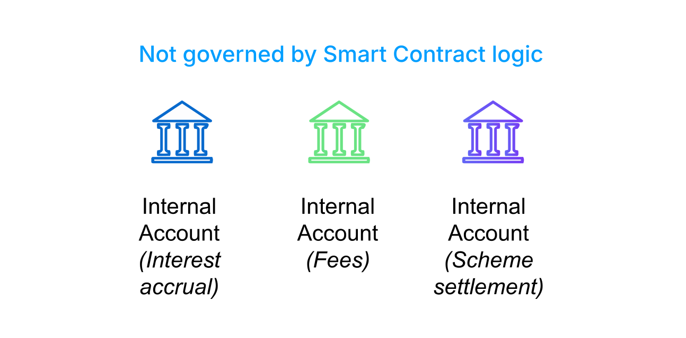

# Module 1: Accounts in Vault Core

assignment\_turned\_in

Learning objective

Summarise the main components that make up Accounts in Vault Core.

## Internal and customer accounts

All Accounts in Vault Core are created and managed via Thought Machine’s Core API.

There are two types of Account in Vault Core, Internal Accounts and Customer Accounts. Together they make up the source of truth of all money in the bank.

### Internal accounts

Internal Accounts are for the bank to aggregate similar fund movements together, used for the bank’s side of double-entry bookkeeping.

So when a customer is charged a transaction fee, the fee amount is debited from their account and simultaneously credited to an internal "fees collected" account.

Or when a bank pays interest on a savings account, the interest amount is debited from an internal "interest payable" account and credited to the customer’s account.

This separation of concerns provides a clear audit trail and makes it easy for the bank to run financial reconciliation and reporting on its own internal movements.

Internal Accounts receive a very high volume of traffic, and so to ensure high performance they are not backed by Smart Contract logic.

### Customer accounts

Each Customer Account can instead be thought of as a single instance of a banking product, and is generally what we refer to when we say "Account".

A Customer Account is a segregated entity with its own balance pots (known as addresses), lifecycle, and controls.

The configuration and state of a Customer Account determines how that Account reacts to certain input; for example whether a payment is accepted, or how and when interest is calculated.

Every Customer Account must be associated with at least one customer and a single product, a Smart Contract, which defines the behaviour of the account, including which Internal Accounts to use for postings.

Many features can be tailored for each Customer Account (such as payment schedules), however, all Customer Accounts fundamentally work the same way, in a sense they are 'headless' and can be associated with any product because they all abide by the same key mechanisms.

## Customer accounts

All Accounts in Vault Core are created and managed via Thought Machine’s Core API.

*Click the video below to learn more. A transcript is available below.*

  Video transcript

Every Customer Account must be associated with at least one customer, and a single Smart Contract.

There is a one-to-many relationship between a Smart Contract and the Customer Accounts that it powers.

It is the logic within the Smart Contract that dictates many key account behaviours.

For example, the Smart Contract defines the permitted denominations that the account can receive, the t-side of the account’s balance sheet, and can specify key account event behaviours, available parameters, or balance addresses.

Every Customer Account is partitioned into one or more addresses, each storing its own balance.

If product changes are required (such as terms and conditions), these can be configured in a new version of the Smart Contract.

Then, one or more Customer Accounts can be converted to this new version, inheriting the behavioural changes of the new product.

This combination of Customer Accounts and Smart Contracts allows for complete configuration of any required banking product.

There is also a special type of Customer Account known as a High-volume Account.

High-volume Accounts are Customer Accounts designed to receive much higher traffic than a typical business-to-consumer account.

They are useful for managing corporate Customer Account activity, such as large-scale payroll disbursements or subscription payment collections. High-volume Accounts work the same way as Customer Accounts, with the same lifecycle - they are also backed by a Smart Contract.

To prioritise transaction throughput, typically the Smart Contract will contain less logic than a B2C Customer Account product.

It is worth noting that high volume accounts is an ‘Extension’ to Vault Core, hence this feature may not be enabled in every installation.

*That completes this module.*

Next module