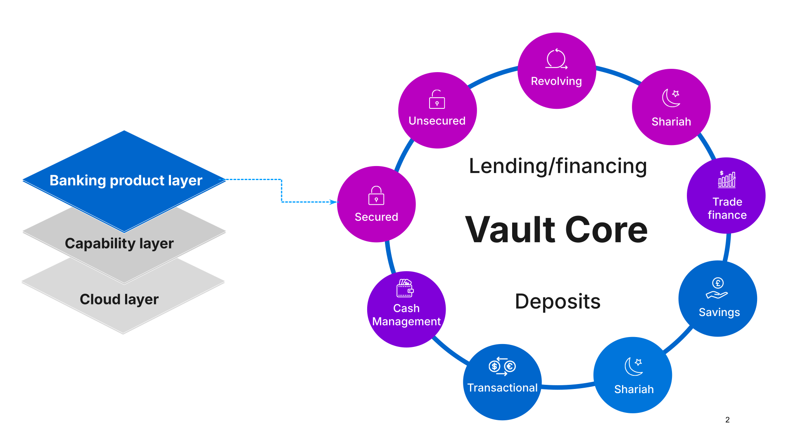
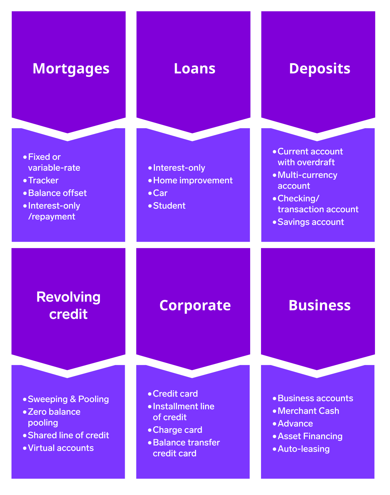
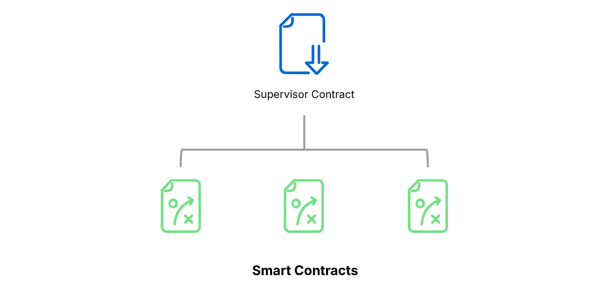

# Module 1: Basics of Smart Contracts

assignment\_turned\_in

Learning objective

Explain the basics of Smart Contracts - Thought Machine’s powerful configuration system for encapsulating the business logic of any financial product.

## Purpose of Smart Contracts

Smart Contracts are at the very heart of how Vault Core brings banking products to life.

They represent the entirety of a banking product’s financial logic, embodying the terms and conditions, and features, behind customer accounts.

Smart Contracts sit within the banking product layer, separating product configuration from all other aspects of Vault Core and its surrounding systems.

This is a key aspect of Vault Core’s design - maintaining a solid separation of tasks between building and adapting products, and all other aspects such as accounts and the ledger.

## Example products made by Smart Contracts

Here are a few examples of products that can be built using Smart Contracts.

However, any product can be built with Smart Contracts - there are no limits!

## Key characteristics of Smart Contracts

*Click on the video to learn more. A transcript is available below.*

  Video transcript

Smart contracts have a number of key characteristics.

Firstly, they are **configuration as code**.

With configuration as code you are able to fine-tune your banking products to your exact requirements, by changing Smart Contract code.

Secondly, they are **transparent**.

By looking at the Smart Contract code, you can fully understand the exact behaviour of your banking product.

Thirdly, they are **autonomous**.

Certain account lifecycle events need to trigger at specific times, such as interest accrual. For other lifecycle events, such as fee accrual, you may want them to only occur when the customer makes a specific type of outbound or inbound payment.

Smart Contracts will autonomously carry out these activities according to your chosen configuration.

Fourth, they are **parameterisable**.

Logic is driven by parameters, which can be defined at multiple levels, such as per-account, varied by territory, or controlled globally.

These additional layers of configuration allow a single Smart Contract to encapsulate multiple product behaviours.

Lastly, Smart Contracts are **flexible**.

Using features such as Parameters, Flags, and Account Attributes, you can instantly update financial calculations and logic using our APIs.

Here are some of the key behavioural aspects of all Smart Contracts: Hooks define the events that trigger execution of business logic, such as an incoming Posting triggering checks that it passes business rules.

Data fetching defines the specific data that a Smart Contract needs in a hook, such as current balances. This is used to inform the behaviour of the hook.

Directives instruct actions as a result of a hook running; for example to send another Posting or issue a notification to downstream systems.

Parameters are a powerful way of adapting product behaviour without changing the Smart Contract code, and they can be used in logic too.

Let’s take a look at some typical hooks.

## Smart Contract lifecycle events (hooks)

*Click on the video to learn more. A transcript is available below.*

  Video transcript

Smart Contracts include a range of different lifecycle events that we call ‘hooks’. Hooks enable business logic to be run at various points within an account lifecycle, and most of them are event-driven.

Firstly, let’s consider Contract events, shown here at 1 on our timeline.

Contract events are lifecycle events that run on Activation of an account, or on a change in the version you’re using for an account’s product (a Conversion). These also occur at the end of an account’s lifecycle, when you want to close an account (Deactivation). The hooks which run during contract events can perform actions such as setting up schedules upon opening an account, or checking a balance is zero before closing an account.

At 2 on our timeline, there are Scheduled events. Schedules are used in Smart Contracts to carry out certain operations on a regular cadence, such as accruing or paying interest, or one-off operations, such as applying a fee. Banks can define what should happen when the schedule occurs. Scheduled events run according to the times and frequency specified in the Smart Contract and associated Parameters. The Scheduled event hook will be called for each required event.

At 3, there are Posting and Parameter events. These events occur before and after a posting has been committed to the Ledger (or a Parameter value is changed):

-   The Pre-posting hook is used to determine whether to accept a posting or not. This hook is on the 'hot path', which means that speed is prioritised.
    
-   The Post-posting hook carries out actions once a posting is accepted (such as triggering a notification).
    
-   The Pre-parameter hook runs when you want to update parameter values, and can check the change is valid.
    
-   The Post-parameter hook carries out actions once a Parameter value has changed (such as creating a posting).
    

Parameters are a significant aspect of banking product management, so we will expand on these shortly. Next, we’ll touch on Smart Contract directives.

## Smart Contract directives

Every Smart Contract hook can communicate the results of their business logic to the rest of Vault Core.

Most hooks can also contain directives, which allow the hooks to alter the state of Vault Core by creating postings, sending notifications, or modifying schedules.

There are no product specific directives – instead, we provide a single unified interface for all products.

The pre-posting hook, as mentioned, is on the hot path, and therefore prioritises speed.

As a result, it cannot contain directives - instead it’s job is to make a simple 'accept or reject' decision on a posting.

* * *

Create postings

accruals and capitalisation, fee applications, loan disbursals.

Send a notification

notify an external system of a statement including relevant account data.

Amend/remove a schedule

automatically adjust a repayment date or grace period.

* * *

Next we will summarise parameters.

## Parameters

*Click on the video to learn more. A transcript is available below.*

  Video transcript

Parameters are a powerful way to customise the behavior of accounts without ever changing the Smart Contract code itself.

For example, instead of hard-coding an interest rate into your products, you can use a parameter to control this rate.

This is because Parameter states are stored in Vault Core, outside Smart Contracts. Parameters can also adapt values on multiple layers, from a global layer, to separate geographies, right down to a singular account layer.

This is achieved with hierarchical management, where the upper levels can set broader values, to be overridden by more granular values at lower levels.

Combined with Smart Contracts, parameters used in this way enable a near limitless level of product (and product family) customisation.

Next we will briefly touch upon Supervisor Contracts, which are designed to oversee and manage grouped accounts.

## Supervisor Contracts

### Supervisor contracts

-   Financial products that comprise more than one account
    
-   Describe the behaviour that controls the relationship between accounts
    

### Smart Contracts

-   Encode the financial behaviour of a banking product
    
-   Independent accounts are created that define their behaviour
    

Supervisor Contracts are a special type of Smart Contract that describes the behaviour of a Plan (a financial product involving more than one account).

An example of this is an offset mortgage, where you have a mortgage account and a savings account that are linked.

The Supervisor Contract will contain the logic that governs how the balance of the savings account is used to "offset" the interest on the mortgage account.

Hence it controls the relationship between these separate, but related, accounts.

Each account operates independently and can be thought of as one instance of its Smart Contract.

For example, a Smart Contract for a savings account would define its interest rate, fees, and rules for deposits and withdrawals.

So a Smart Contract controls a single account, while a Supervisor Contract controls a group of accounts.

*That completes this module.*

Next module